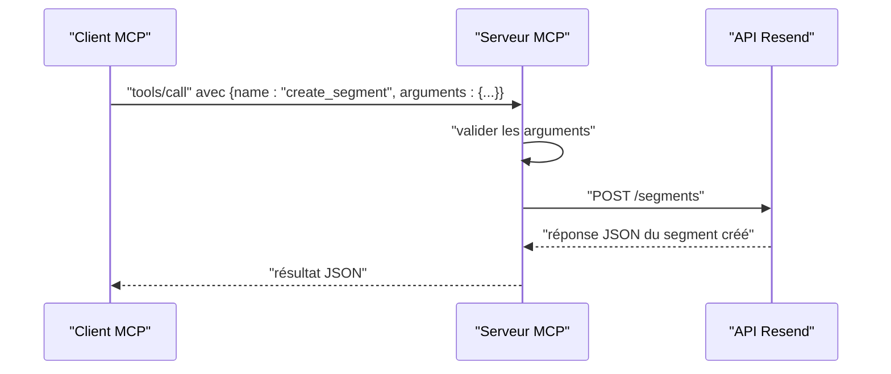

# Outil create_segment

<cite>
**Fichiers référencés dans ce document**
- [README.md](file://README.md)
- [package.json](file://package.json)
- [src/index.ts](file://src/index.ts)
</cite>

## Sommaire
1. [Introduction](#introduction)
2. [Contexte technique](#contexte-technique)
3. [Paramètres d’entrée](#paramètres-dentrée)
4. [Validation des données](#validation-des-données)
5. [Retours attendus](#retours-attendus)
6. [Exemples concrets d’utilisation](#exemples-concrets-dutilisation)
7. [Bonnes pratiques pour structurer les segments](#bonnes-pratiques-pour-structurer-les-segments)
8. [Architecture de l’outil](#architecture-de-loutil)
9. [Conclusion](#conclusion)

## Introduction
L’outil create_segment permet de créer de nouveaux segments de contacts au sein d’une audience Resend. Un segment est un sous-ensemble de contacts définis par des critères spécifiques (par exemple, nom, prénom, e-mail, ou des propriétés personnalisées). Ce document explique comment utiliser cet outil, quels sont ses paramètres, comment valider les données, quels résultats attendre, et comment structurer efficacement vos segments pour optimiser vos campagnes ciblées.

## Contexte technique
L’outil fait partie de l’implémentation MCP (Model Context Protocol) complète de l’API Resend. Le serveur expose plus de 70 outils couvrant tous les modules de l’API Resend, dont les segments. L’outil create_segment est décrit dans la liste des outils disponibles et implémenté côté serveur via un appel HTTP à l’API Resend.

**Section sources**
- [README.md](file://README.md#L99-L104)
- [src/index.ts](file://src/index.ts#L832-L845)

## Paramètres d’entrée
Voici les paramètres requis et optionnels pour l’appel de l’outil create_segment :

- name (chaîne de caractères, requis)
  - Nom du segment. Doit être unique au sein de l’audience.
- audience_id (chaîne de caractères, requis)
  - Identifiant de l’audience à laquelle le segment appartient.
- filter (objet, optionnel)
  - Définit les critères de filtrage pour inclure les contacts dans le segment. La structure de cet objet dépend de l’API Resend. Pour plus de précision, consultez la documentation officielle de l’API Resend.

Remarque : Le schéma indique que le champ filter est présent, mais il n’est pas requis pour appeler l’outil. Vous pouvez créer un segment sans filtre initial, puis ajouter des contacts manuellement ou via d’autres outils.

**Section sources**
- [src/index.ts](file://src/index.ts#L834-L844)

## Validation des données
L’outil impose les contraintes suivantes :
- name est requis.
- audience_id est requis.
- filter est optionnel.

Le serveur effectue une validation basique : si le nom de l’outil est absent, une erreur est renvoyée. En cas d’échec de l’exécution de l’outil (par exemple, identifiants incorrects, données invalides), le serveur renvoie un message d’erreur avec le nom de l’outil et les arguments fournis.

**Section sources**
- [src/index.ts](file://src/index.ts#L1536-L1564)

## Retours attendus
L’appel à create_segment renvoie la représentation JSON d’un segment créé. Le serveur renvoie toujours un contenu textuel contenant le résultat de l’appel. En cas d’erreur, le contenu contient un objet d’erreur avec le message d’erreur, le nom de l’outil et les arguments transmis.

Exemple de structure de réponse (représentative) :
- id : identifiant unique du segment
- name : nom du segment
- audience_id : identifiant de l’audience
- created_at : horodatage de création
- updated_at : horodatage de dernière mise à jour
- filters : éventuellement, les filtres appliqués

**Section sources**
- [src/index.ts](file://src/index.ts#L1544-L1551)

## Exemples concrets d’utilisation
Voici des scénarios courants pour créer des segments ciblés :

- Segment par nom
  - Utilisez le filtre pour inclure uniquement les contacts dont le nom correspond à un critère spécifique.
- Segment par prénom
  - Créez un segment pour cibler les contacts dont le prénom correspond à un motif.
- Segment par e-mail
  - Filtrez par domaine ou par motifs spécifiques (par exemple, @entreprise.com).
- Segment par propriété personnalisée
  - Si vous avez ajouté des propriétés personnalisées (comme ville, abonné depuis, etc.), vous pouvez créer un segment basé sur ces valeurs.

Pour chaque cas, le filtre est passé dans le champ filter. Consultez la documentation officielle de l’API Resend pour connaître la structure exacte des filtres pris en charge.

**Section sources**
- [README.md](file://README.md#L377-L406)
- [src/index.ts](file://src/index.ts#L834-L844)

## Bonnes pratiques pour structurer les segments
- Nommez les segments de manière descriptive
  - Utilisez des noms explicites qui reflètent le public ciblé (ex. : “Clients Premium”, “Utilisateurs de Paris”).
- Limitez la taille des segments
  - Des segments trop volumineux peuvent ralentir l’envoi et réduire la pertinence des messages.
- Évitez les chevauchements inutiles
  - Si plusieurs segments recouvrent le même public, cela peut entraîner des envois redondants.
- Mettez à jour régulièrement
  - Les segments dynamiques (basés sur des événements ou des données récentes) doivent être recalculés périodiquement.
- Testez avant d’envoyer
  - Vérifiez toujours la taille et la pertinence du segment avant d’envoyer une campagne.
- Utilisez des filtres précis
  - Pour les segments basés sur des propriétés personnalisées, assurez-vous que les données sont complètes et cohérentes.

[Ce paragraphe fournit des conseils généraux basés sur les bonnes pratiques de segmentation courantes. Aucune source spécifique n’est ajoutée car il ne s’agit pas d’une analyse de fichiers spécifiques.]

## Architecture de l’outil
L’outil create_segment est exposé comme un outil MCP. Voici le flux de traitement :

- L’appel de l’outil est reçu via stdin au format JSON.
- Le serveur vérifie la méthode (tools/call) et le nom de l’outil.
- Le gestionnaire d’outils effectue un appel HTTP à l’API Resend pour créer le segment.
- Le résultat est renvoyé au format JSON via stdout.

**Diagram sources**
- [src/index.ts](file://src/index.ts#L1536-L1564)
- [src/index.ts](file://src/index.ts#L1400-L1408)

## Conclusion
L’outil create_segment vous permet de structurer votre audience Resend en segments ciblés. En définissant des critères pertinents (nom, prénom, e-mail, propriétés personnalisées), vous pouvez améliorer la ciblage de vos campagnes et optimiser leur efficacité. Respectez les règles de validation, nommez vos segments de façon claire, et mettez en place des bonnes pratiques de maintenance pour obtenir des résultats optimaux.