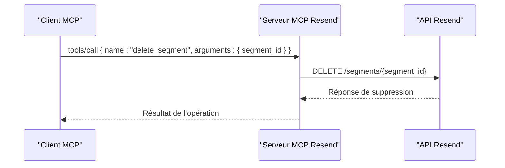

# Outil delete_segment

<cite>
**Fichiers référencés dans ce document**
- [README.md](file://README.md)
- [package.json](file://package.json)
- [src/index.ts](file://src/index.ts)
- [.env.example](file://.env.example)
</cite>

## Sommaire
1. [Introduction](#introduction)
2. [Objectif de l’outil](#objectif-de-loutil)
3. [Paramètres d’entrée](#paramètres-dentrée)
4. [Implications de la suppression](#implications-de-la-suppression)
5. [Exemples d’utilisation](#exemples-dutilisation)
6. [Bonnes pratiques en production](#bonnes-pratiques-en-production)
7. [Architecture technique](#architecture-technique)
8. [Considérations de performance](#considérations-de-performance)
9. [Guide de dépannage](#guide-de-dépannage)
10. [Conclusion](#conclusion)

## Introduction
Cet outil permet de supprimer un segment existant à partir de son identifiant. Il fait partie de l’ensemble des 70+ outils offerts par le serveur MCP Resend, qui expose l’intégralité de l’API Resend sous forme d’outils invocables. Le serveur est compatible avec les clients MCP (comme Claude Desktop, Continue, Cline, etc.) et fournit un ensemble complet de fonctionnalités de gestion des audiences, des contacts, des segments, des campagnes et plus encore.

## Objectif de l’outil
Supprimer un segment existant identifié par son identifiant unique. Cette opération ne supprime pas les contacts ni les campagnes associées au segment, mais retire le segment de la base de données Resend.

## Paramètres d’entrée
- segment_id (chaîne de caractères, requis)
  - Identifiant unique du segment à supprimer.

**Section sources**
- [src/index.ts](file://src/index.ts#L869-L879)

## Implications de la suppression
- Contacts : La suppression d’un segment n’affecte pas les contacts eux-mêmes. Les contacts restent dans l’audience, mais ils ne font plus partie du segment supprimé.
- Campagnes : La suppression d’un segment n’affecte pas les campagnes existantes. Si une campagne utilisait ce segment, elle continuera de s’exécuter ou de rester en attente selon son statut actuel. Pour éviter qu’elle ne cible plus les anciens membres du segment, il faut soit modifier la campagne pour utiliser un autre segment, soit annuler la campagne si elle est programmée.
- Audiences : La suppression d’un segment n’affecte pas l’audience à laquelle il appartenait.
- Historique : Une fois supprimé, le segment n’est plus récupérable via l’API Resend.

**Section sources**
- [README.md](file://README.md#L99-L104)

## Exemples d’utilisation
Voici comment appeler l’outil delete_segment via un client MCP compatible. Ces exemples montrent la structure attendue de la requête et de la réponse.

- Appel de l’outil
  - Méthode : tools/call
  - Nom de l’outil : delete_segment
  - Arguments :
    - segment_id : identifiant du segment à supprimer

- Réponse
  - En cas de succès : la réponse contient un objet indiquant que la suppression a été effectuée.
  - En cas d’échec : la réponse contient un message d’erreur avec le nom de l’outil et les arguments transmis.

**Section sources**
- [src/index.ts](file://src/index.ts#L1424-L1430)

## Bonnes pratiques en production
- Vérification préalable
  - Avant de supprimer un segment, vérifiez qu’il n’est plus utilisé par des campagnes actives ou programmées.
  - Utilisez l’outil get_segment pour obtenir les détails du segment et confirmer son contenu.
- Sauvegarde des données
  - Si le segment est utilisé dans des campagnes, envisagez de sauvegarder les informations importantes (nom, filtre, contacts) avant suppression.
- Tests en environnement de développement
  - Effectuez des tests dans un environnement sandbox ou avec des données de test pour valider l’impact de la suppression.
- Audit et traçabilité
  - Enregistrez les suppressions effectuées, y compris l’identifiant du segment, la date et l’utilisateur ayant effectué l’action.
- Gestion des erreurs
  - Implémentez un mécanisme de gestion des erreurs pour gérer les cas où le segment n’existe pas ou où l’API refuse la suppression (par exemple, en raison de contraintes métier).
- Permissions
  - Assurez-vous que l’API key utilisée dispose des permissions nécessaires pour effectuer cette action.

**Section sources**
- [README.md](file://README.md#L551-L573)

## Architecture technique
Le serveur MCP Resend expose tous les outils via un ensemble de définitions de schémas d’entrée. L’outil delete_segment est implémenté comme suit :

- Définition de l’outil
  - Nom : delete_segment
  - Description : Supprime un segment
  - Schéma d’entrée : un seul champ requis : segment_id
- Implémentation
  - L’appel de l’outil déclenche un appel HTTP vers l’API Resend pour supprimer le segment spécifié.
  - Le serveur renvoie la réponse brute de l’API Resend.

**Diagram sources**
- [src/index.ts](file://src/index.ts#L869-L879)
- [src/index.ts](file://src/index.ts#L1424-L1430)

**Section sources**
- [src/index.ts](file://src/index.ts#L869-L879)
- [src/index.ts](file://src/index.ts#L1424-L1430)

## Considérations de performance
- Taux de requêtes
  - Le serveur respecte les limites de taux de requêtes de Resend. Pour éviter les erreurs 429, planifiez les suppressions par lots si nécessaire.
- Latence réseau
  - La suppression d’un segment est une opération rapide, mais la latence peut varier selon la connectivité réseau et la charge de l’API Resend.
- Gestion des erreurs
  - Le serveur inclut une gestion des erreurs robuste pour les cas de réseau, d’authentification ou de ressource manquante.

**Section sources**
- [README.md](file://README.md#L518-L527)

## Guide de dépannage
- Erreur : clé API manquante
  - Message : “RESEND_API_KEY environment variable is not set”
  - Solution : ajoutez votre clé API dans le fichier .env
- Erreur : outil inconnu
  - Message : “Unknown tool: delete_segment”
  - Solution : vérifiez que vous utilisez le bon nom d’outil et que le serveur est démarré
- Erreur : ressource introuvable
  - Message : “Not Found” (404)
  - Solution : le segment n’existe pas ou l’identifiant est incorrect
- Erreur : trop de requêtes
  - Message : “Too Many Requests” (429)
  - Solution : réduisez la fréquence des appels ou attendez avant de retenter

**Section sources**
- [README.md](file://README.md#L551-L573)

## Conclusion
L’outil delete_segment permet de supprimer un segment de manière simple et sécurisée. Pour garantir une suppression sans impact indésirable, il est essentiel de vérifier l’utilisation du segment, de sauvegarder les données pertinentes, et de suivre les bonnes pratiques de production. Le serveur MCP Resend fournit un cadre complet pour intégrer ces opérations dans des flux automatisés avec des clients MCP compatibles.