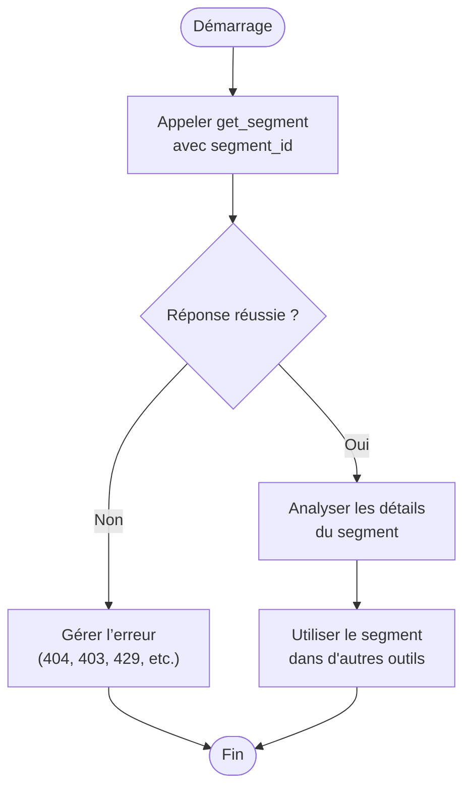
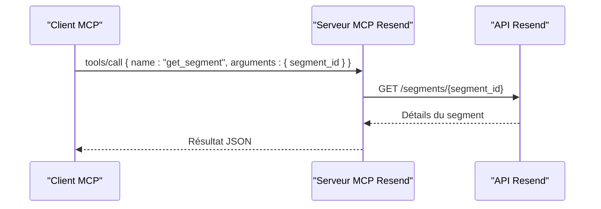

# Outil get_segment

<cite>
**Fichiers référencés dans ce document**
- [README.md](file://README.md)
- [package.json](file://package.json)
- [src/index.ts](file://src/index.ts)
</cite>

## Table des matières
1. [Introduction](#introduction)
2. [Objectif de l’outil](#objectif-de-loutil)
3. [Paramètres d’entrée](#paramètres-dentrée)
4. [Retours attendus](#retours-attendus)
5. [Cas d’erreur](#cas-derreur)
6. [Exemples d’utilisation](#exemples-dutilisation)
7. [Intégration dans les workflows de gestion des audiences](#intégration-dans-les-workflows-de-gestion-des-audiences)
8. [Architecture technique](#architecture-technique)
9. [Conclusion](#conclusion)

## Introduction
Cet outil permet de récupérer les détails d’un segment spécifique à partir de son identifiant. Il fait partie de l’ensemble des 70+ outils offerts par le serveur MCP Resend, qui expose l’intégralité de l’API Resend sous forme d’outils invocables depuis des assistants IA ou des applications compatibles avec le Model Context Protocol (MCP).

## Objectif de l’outil
Récupérer les informations détaillées d’un segment (audience segmentée) identifié par son identifiant unique. Cela inclut notamment le nom, l’audience parente, les filtres définis, et d’éventuelles métadonnées liées au segment.

## Paramètres d’entrée
- segment_id (chaîne de caractères, requis)
  - Description : Identifiant unique du segment à récupérer.
  - Exemple : "seg_xxxxxxxxxxxxx"

**Section sources**
- [src/index.ts](file://src/index.ts#L858-L868)

## Retours attendus
Le retour est un objet contenant les détails du segment. Voici les éléments généralement présents :
- id : Identifiant unique du segment
- name : Nom du segment
- audience_id : Identifiant de l’audience parente
- filters : Définition des filtres utilisés pour constituer le segment
- created_at : Date de création
- updated_at : Date de dernière mise à jour

Remarque : Le schéma exact peut varier selon l’API Resend. Pour des détails complets, consultez la documentation officielle de l’API Resend.

**Section sources**
- [src/index.ts](file://src/index.ts#L1419-L1422)

## Cas d’erreur
Voici les erreurs courantes pouvant être rencontrées lors de l’appel à l’outil get_segment :

- Erreur 401 Non autorisé
  - Cause : Clé API invalide ou manquante.
  - Résolution : Vérifiez que la variable d’environnement RESEND_API_KEY est correctement configurée.

- Erreur 403 Interdit
  - Cause : Permissions insuffisantes pour accéder au segment.
  - Résolution : Utilisez une clé API avec les droits nécessaires.

- Erreur 404 Non trouvé
  - Cause : Le segment demandé n’existe pas.
  - Résolution : Vérifiez l’identifiant fourni.

- Erreur 429 Trop de requêtes
  - Cause : Limite de débit atteinte.
  - Résolution : Attendez quelques secondes avant de réessayer.

- Erreur 5xx Serveur
  - Cause : Problème temporaire du service Resend.
  - Résolution : Réessayez plus tard.

**Section sources**
- [README.md](file://README.md#L528-L549)

## Exemples d’utilisation
Voici comment appeler l’outil get_segment via un client MCP compatible. Les exemples ci-dessous montrent la structure de la requête et de la réponse attendue.

- Appel de l’outil
  - Méthode : tools/call
  - Nom de l’outil : get_segment
  - Arguments : { "segment_id": "seg_xxxxxxxxxxxxx" }

- Réponse réussie
  - Contenu : Objet contenant les détails du segment (id, name, audience_id, filters, dates de création/mise à jour)

- Réponse d’erreur
  - Contenu : Objet contenant un champ error avec le message d’erreur, ainsi que le nom de l’outil et ses arguments.

**Section sources**
- [src/index.ts](file://src/index.ts#L1536-L1564)
- [src/index.ts](file://src/index.ts#L1419-L1422)

## Intégration dans les workflows de gestion des audiences
Voici comment l’outil get_segment s’intègre naturellement dans des workflows de gestion des audiences :

- Étape 1 : Identifier un segment par son identifiant
  - Utiliser l’outil get_segment pour récupérer les détails du segment.
- Étape 2 : Vérifier les filtres
  - Analyser les filtres pour comprendre quels contacts sont inclus.
- Étape 3 : Utiliser dans des opérations ultérieures
  - Par exemple, l’utiliser comme cible pour créer des diffusions (broadcasts) ou pour exporter des données.

- Workflow conceptuel

[Ce diagramme illustre un workflow conceptuel basé sur l’utilisation de l’outil get_segment. Il ne correspond pas à des fichiers spécifiques du code source.]

## Architecture technique
L’outil get_segment est implémenté comme suit dans le serveur MCP Resend :

- Définition de l’outil
  - Nom : get_segment
  - Schéma d’entrée : objet avec segment_id (requis)
  - Description : Récupérer les détails d’un segment

- Implémentation de l’appel
  - Méthode HTTP : GET
  - Endpoint : /segments/{segment_id}
  - En-têtes : Authorization (Bearer token), Content-Type (application/json)

- Gestion des erreurs
  - Le serveur encapsule les appels réseau et renvoie des messages d’erreur lisibles.

**Diagram sources**
- [src/index.ts](file://src/index.ts#L1419-L1422)
- [src/index.ts](file://src/index.ts#L1536-L1564)

**Section sources**
- [src/index.ts](file://src/index.ts#L858-L868)
- [src/index.ts](file://src/index.ts#L1419-L1422)
- [src/index.ts](file://src/index.ts#L1536-L1564)

## Conclusion
L’outil get_segment permet de récupérer facilement les détails d’un segment identifié par son identifiant. Il s’intègre parfaitement dans les flux de travail de gestion des audiences, en complément des outils de création, de liste et de suppression de segments. En cas d’erreur, le serveur MCP fournit des messages d’erreur clairs pour faciliter le diagnostic.