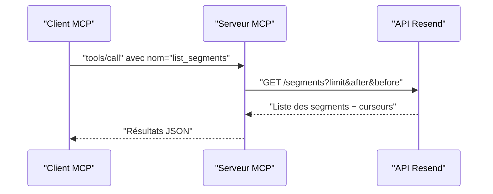

# Outil list_segments

<cite>
**Fichiers référencés dans ce document**
- [README.md](file://README.md)
- [package.json](file://package.json)
- [src/index.ts](file://src/index.ts)
</cite>

## Sommaire
1. [Introduction](#introduction)
2. [Objectif de l’outil](#objectif-de-loutil)
3. [Paramètres d’entrée](#paramètres-dentrée)
4. [Pagination et filtrage](#pagination-et-filtrage)
5. [Exemples d’utilisation](#exemples-dutilisation)
6. [Intégration avec les segments](#intégration-avec-les-segments)
7. [Optimisation des campagnes d’envoi](#optimisation-des-campagnes-den-voi)
8. [Architecture technique](#architecture-technique)
9. [Conclusion](#conclusion)

## Introduction
Cet outil fait partie de l’API Resend exposée via un serveur Model Context Protocol (MCP). Son objectif est de permettre de récupérer la liste complète des segments d’une audience donnée, en supportant la pagination et le filtrage basiques. Il s’inscrit dans le module “Segments” de l’API Resend, qui permet de gérer des sous-groupes de contacts au sein d’une audience.

## Objectif de l’outil
L’outil list_segments permet de :
- Récupérer tous les segments d’une audience
- Utiliser des paramètres de pagination pour naviguer dans les résultats
- Filtrer les résultats de manière basique (par exemple, en limitant le nombre d’éléments retournés)

Il est conçu pour être utilisé dans des flux automatisés ou interactifs avec des assistants IA, afin de gérer les segments et d’optimiser les campagnes d’envoi.

**Section sources**
- [README.md](file://README.md#L99-L104)
- [src/index.ts](file://src/index.ts#L846-L857)

## Paramètres d’entrée
L’outil list_segments accepte les paramètres suivants (tous optionnels) :
- limit : Nombre maximal d’éléments à retourner (type : nombre)
- after : Curseur pour récupérer les éléments suivants (type : chaîne de caractères)
- before : Curseur pour récupérer les éléments précédents (type : chaîne de caractères)

Ces paramètres sont utilisés pour la pagination et permettent de naviguer de manière incrémentale dans les résultats.

**Section sources**
- [src/index.ts](file://src/index.ts#L846-L857)

## Pagination et filtrage
La pagination se fait via des curseurs fournis par l’API Resend. Voici comment cela fonctionne :
- limit : Définit le nombre d’éléments retournés par appel
- after : Permet de récupérer les éléments situés après un curseur spécifique
- before : Permet de récupérer les éléments situés avant un curseur spécifique

Le comportement attendu est de renvoyer une liste de segments avec des curseurs pour avancer ou reculer dans la liste. Le filtrage peut être effectué en combinant limit avec after ou before.

**Section sources**
- [src/index.ts](file://src/index.ts#L1410-L1417)

## Exemples d’utilisation
Voici quelques cas d’utilisation typiques de l’outil list_segments :

- Obtenir les 50 premiers segments d’une audience
  - Utiliser limit=50
- Naviguer entre les pages de segments
  - Utiliser after pour aller à la page suivante
  - Utiliser before pour revenir à la page précédente
- Compter le nombre total de segments
  - Appeler plusieurs fois avec limit=100 et after jusqu’à ce qu’il n’y ait plus de curseur

Remarque : Pour des filtres avancés (par exemple par nom, date de création, etc.), il est recommandé de récupérer les segments avec limit élevé, puis de filtrer côté client selon vos critères.

**Section sources**
- [src/index.ts](file://src/index.ts#L1410-L1417)

## Intégration avec les segments
L’outil list_segments est utilisé dans le module “Segments” de l’API Resend. Une fois que vous avez récupéré la liste des segments, vous pouvez :
- Identifier les segments pertinents pour une audience donnée
- Créer des campagnes ciblées en utilisant ces segments
- Mettre à jour ou supprimer des segments selon les besoins

L’outil est intégré dans le serveur MCP comme suit :
- Définition de l’outil : [src/index.ts](file://src/index.ts#L846-L857)
- Implémentation de l’appel API : [src/index.ts](file://src/index.ts#L1410-L1417)

**Section sources**
- [README.md](file://README.md#L99-L104)
- [src/index.ts](file://src/index.ts#L846-L857)
- [src/index.ts](file://src/index.ts#L1410-L1417)

## Optimisation des campagnes d’envoi
Voici comment utiliser les résultats de list_segments pour optimiser les campagnes d’envoi :
- Segmenter les audiences par intérêts, comportements ou caractéristiques démographiques
- Créer des campagnes ciblées vers des segments spécifiques
- Ajuster les contenus en fonction des segments pour améliorer le taux d’ouverture et de clics
- Éviter les envois redondants en vérifiant les segments existants avant de créer de nouveaux segments

Ces bonnes pratiques permettent d’améliorer la pertinence des envois et de réduire le risque de désabonnement.

[Ce paragraphe ne nécessite pas de référence à un fichier spécifique car il s’agit de conseils généraux.]

## Architecture technique
L’outil list_segments est implémenté dans le serveur MCP comme suit :
- Définition de l’outil : [src/index.ts](file://src/index.ts#L846-L857)
- Gestion de l’appel API : [src/index.ts](file://src/index.ts#L1410-L1417)
- Serveur MCP : [src/index.ts](file://src/index.ts#L1528-L1623)

Le serveur MCP expose l’outil via des appels standards (tools/list, tools/call) et renvoie les résultats au format JSON.

**Diagram sources**
- [src/index.ts](file://src/index.ts#L1410-L1417)
- [src/index.ts](file://src/index.ts#L1536-L1565)

**Section sources**
- [src/index.ts](file://src/index.ts#L846-L857)
- [src/index.ts](file://src/index.ts#L1410-L1417)
- [src/index.ts](file://src/index.ts#L1528-L1623)

## Conclusion
L’outil list_segments permet de récupérer de manière paginée la liste des segments d’une audience Resend. En combinant limit, after et before, vous pouvez naviguer facilement dans les résultats et les filtrer selon vos besoins. Une fois les segments identifiés, vous pouvez les utiliser pour structurer vos campagnes d’envoi, améliorer leur ciblage et optimiser leurs performances.

[Ce paragraphe ne nécessite pas de référence à un fichier spécifique car il s’agit d’un résumé.]