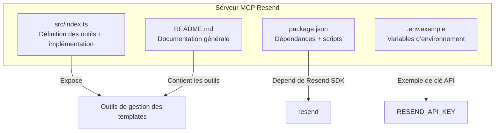
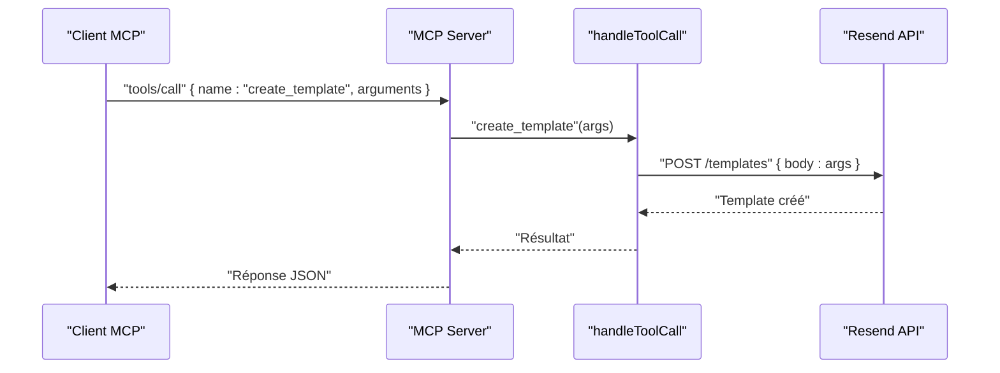
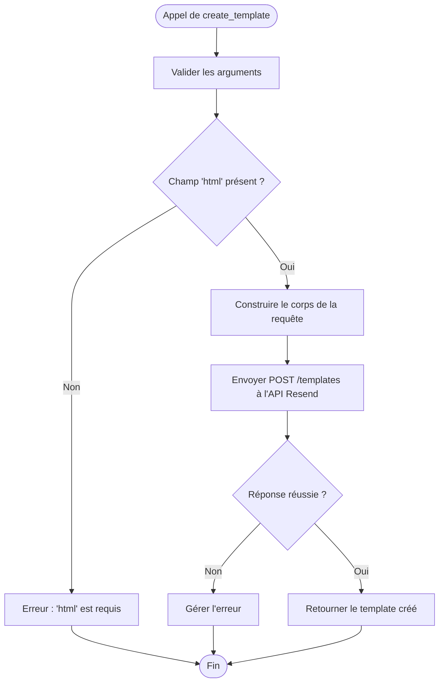

# Création de Template

<cite>
**Fichiers référencés dans ce document**
- [README.md](file://README.md)
- [package.json](file://package.json)
- [src/index.ts](file://src/index.ts)
- [.env.example](file://.env.example)
</cite>

## Sommaire
1. [Introduction](#introduction)
2. [Structure du projet](#structure-du-projet)
3. [Composants principaux](#composants-principaux)
4. [Aperçu de l’architecture](#aperçu-de-larchitecture)
5. [Analyse détaillée des composants](#analyse-détaillée-des-composants)
6. [Analyse des dépendances](#analyse-des-dépendances)
7. [Considérations sur les performances](#considérations-sur-les-performances)
8. [Guide de dépannage](#guide-de-dépannage)
9. [Conclusion](#conclusion)
10. [Annexes](#annexes)

## Introduction
Ce document fournit une documentation complète de l’outil de création de template d’email (create_template) au sein du serveur MCP Resend. Il explique comment créer un nouveau template avec tous ses paramètres : nom, alias, expéditeur par défaut, sujet, reply_to, contenu HTML/Texte, et variables de personnalisation. Vous y trouverez également le schéma JSON complet, les contraintes d’entrée, les bonnes pratiques, ainsi que des exemples concrets pour des cas d’usage courants tels que les newsletters, les emails transactionnels et les formulaires de contact.

## Structure du projet
Le projet est un serveur Model Context Protocol (MCP) qui expose l’ensemble de l’API Resend sous forme d’outils invocables. Le module des templates fait partie des 12 modules couverts, chacun exposé via des outils dont le schéma d’entrée est décrit dans le code source.

**Diagramme sources**
- [src/index.ts](file://src/index.ts#L579-L681)
- [README.md](file://README.md#L65-L72)
- [package.json](file://package.json#L32-L34)
- [.env.example](file://.env.example#L1-L6)

**Section sources**
- [README.md](file://README.md#L472-L491)
- [package.json](file://package.json#L1-L49)
- [src/index.ts](file://src/index.ts#L579-L681)
- [.env.example](file://.env.example#L1-L6)

## Composants principaux
- Outils de gestion des templates : create_template, list_templates, get_template, update_template, delete_template, publish_template, duplicate_template.
- Schéma d’entrée de create_template : il définit les champs obligatoires et optionnels, leurs types, et leurs contraintes.
- Implémentation de l’outil : appel à l’API Resend via fetch pour la création de template.

**Section sources**
- [src/index.ts](file://src/index.ts#L579-L681)
- [src/index.ts](file://src/index.ts#L1254-L1261)

## Aperçu de l’architecture
Le serveur MCP charge la liste des outils, reçoit les appels d’outils, puis exécute la logique associée. Pour create_template, l’exécution consiste à envoyer une requête POST à l’API Resend avec les arguments fournis.

**Diagramme sources**
- [src/index.ts](file://src/index.ts#L1536-L1564)
- [src/index.ts](file://src/index.ts#L1254-L1261)

## Analyse détaillée des composants

### Schéma JSON complet de create_template
Voici le schéma d’entrée de l’outil create_template tel qu’il est défini dans le code. Ce schéma inclut tous les champs disponibles pour la création d’un template.

- name : chaîne de caractères (optionnel)
- alias : chaîne de caractères (optionnel)
- from : chaîne de caractères (optionnel, expéditeur par défaut)
- subject : chaîne de caractères (optionnel)
- reply_to : tableau de chaînes (optionnel)
- html : chaîne de caractères (obligatoire pour la création)
- text : chaîne de caractères (optionnel)
- variables : tableau d’objets (optionnel)
  - key : chaîne de caractères
  - type : chaîne de caractères
  - fallback_value : valeur de secours (de tout type)

Contraintes d’entrée :
- Le champ html est requis lors de la création d’un template.
- Le champ template_id n’est pas requis ici car il s’agit de la création, mais il est requis pour les autres opérations (mise à jour, publication, duplication, suppression).

**Section sources**
- [src/index.ts](file://src/index.ts#L583-L606)

### Contraintes d’entrée et validations
- Obligatoire : html
- Facultatif : name, alias, from, subject, reply_to, text, variables
- Le tableau reply_to peut contenir plusieurs adresses.
- Le tableau variables contient des objets avec key, type et fallback_value.

**Section sources**
- [src/index.ts](file://src/index.ts#L583-L606)

### Bonnes pratiques de création de templates
- Utilisez toujours le champ html pour définir le contenu principal d’un template.
- Si vous souhaitez un contenu texte alternatif, renseignez le champ text.
- Définissez un alias pour faciliter la gestion et la mise à jour ultérieure.
- Utilisez le champ from pour spécifier l’expéditeur par défaut si vous voulez éviter de le préciser à chaque envoi.
- Utilisez le tableau reply_to si vous souhaitez rediriger les réponses vers des adresses différentes.
- Utilisez le tableau variables pour structurer vos personnalisations (clé, type, valeur de secours).
- Nommez votre template de manière descriptive (name) pour une meilleure traçabilité.

**Section sources**
- [src/index.ts](file://src/index.ts#L583-L606)

### Exemples concrets de templates

#### Newsletter hebdomadaire
- name : "Newsletter Hebdo"
- alias : "newsletter-hebdo"
- from : "Newsletter <news@votre-domaine.com>"
- subject : "Votre actualité de la semaine"
- reply_to : ["contact@votre-domaine.com"]
- html : "
Bonjour {{prenom}},

Découvrez nos dernières actualités...
"
- text : "Bonjour {{prenom}}, Découvrez nos dernières actualités..."
- variables : [{ key: "prenom", type: "string", fallback_value: "Abonné" }]

#### Email transactionnel de confirmation
- name : "Confirmation de commande"
- alias : "confirmation-commande"
- from : "Service Client <contact@votre-domaine.com>"
- subject : "Confirmation de votre commande {{reference}}"
- reply_to : ["service-client@votre-domaine.com"]
- html : "
Merci pour votre commande {{reference}}.

Total : {{montant}}€
"
- text : "Merci pour votre commande {{reference}}. Total : {{montant}}€"
- variables : [
  { key: "reference", type: "string", fallback_value: "N/A" },
  { key: "montant", type: "number", fallback_value: 0 }
]

#### Formulaire de contact
- name : "Formulaire de contact"
- alias : "formulaire-contact"
- from : "noreply@votre-domaine.com"
- subject : "Nouveau message depuis le site"
- reply_to : ["contact@votre-domaine.com"]
- html : "
Nom : {{nom}}

Email : {{email}}

Message : {{message}}
"
- text : "Nom : {{nom}}\nEmail : {{email}}\nMessage : {{message}}"
- variables : [
  { key: "nom", type: "string", fallback_value: "Visiteur" },
  { key: "email", type: "string", fallback_value: "" },
  { key: "message", type: "string", fallback_value: "" }
]

### Flux de traitement de create_template

**Diagramme sources**
- [src/index.ts](file://src/index.ts#L583-L606)
- [src/index.ts](file://src/index.ts#L1254-L1261)

**Section sources**
- [src/index.ts](file://src/index.ts#L1254-L1261)

## Analyse des dépendances
- Dépendance principale : le SDK Resend (via le paquet npm) permet d’interagir avec l’API Resend.
- Le serveur MCP lit la clé API depuis les variables d’environnement (.env).
- L’outil create_template effectue un appel HTTP POST à l’API Resend pour créer le template.

**Section sources**
- [package.json](file://package.json#L32-L34)
- [src/index.ts](file://src/index.ts#L1-L7)
- [.env.example](file://.env.example#L1-L6)

## Considérations sur les performances
- Le serveur MCP gère automatiquement la limitation de taux (rate limiting) de l’API Resend.
- Pour des besoins de mise à jour ou de publication de templates, utilisez les outils correspondants (update_template, publish_template) pour éviter les appels inutiles.
- Lorsque vous créez des templates avec beaucoup de variables, veillez à ne pas surcharger le contenu HTML pour maintenir des temps de rendu optimaux.

[Pas de sources supplémentaires car cette section fournit des conseils généraux]

## Guide de dépannage
- Erreur : "RESEND_API_KEY environment variable is not set"
  - Solution : ajoutez votre clé API dans un fichier .env basé sur .env.example.
- Erreur : "Tool execution failed"
  - Causes possibles : clé API invalide, paramètres manquants, dépassement de la limite de taux, problèmes réseau.
  - Solution : vérifiez le message d’erreur détaillé, validez vos paramètres, et assurez-vous que la clé API est correcte.
- Erreur : "Unknown tool"
  - Solution : utilisez la méthode tools/list pour afficher tous les outils disponibles.

**Section sources**
- [src/index.ts](file://src/index.ts#L1571-L1577)
- [README.md](file://README.md#L551-L573)

## Conclusion
L’outil create_template permet de créer rapidement des templates d’email avec tous les éléments nécessaires : nom, alias, expéditeur, sujet, reply_to, contenu HTML/Texte, et variables de personnalisation. En respectant les contraintes d’entrée et en suivant les bonnes pratiques, vous pouvez construire des templates robustes et maintenables pour des cas d’usage variés comme les newsletters, les emails transactionnels et les formulaires de contact.

[Pas de sources supplémentaires car cette section résume sans analyser des fichiers spécifiques]

## Annexes

### Références aux outils liés
- list_templates, get_template, update_template, delete_template, publish_template, duplicate_template : tous définis dans le même fichier source.

**Section sources**
- [src/index.ts](file://src/index.ts#L608-L681)