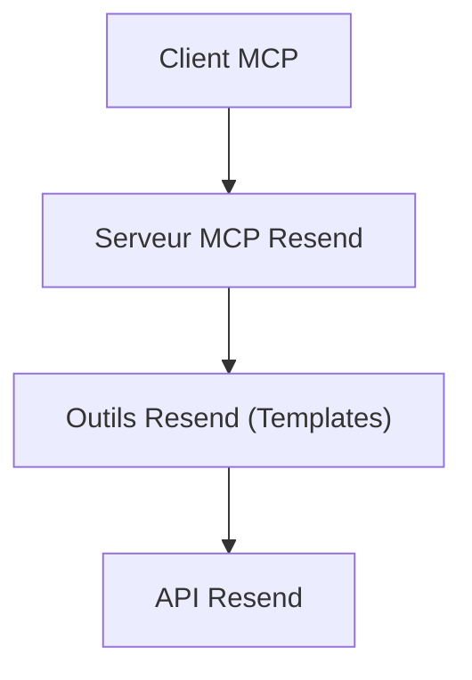
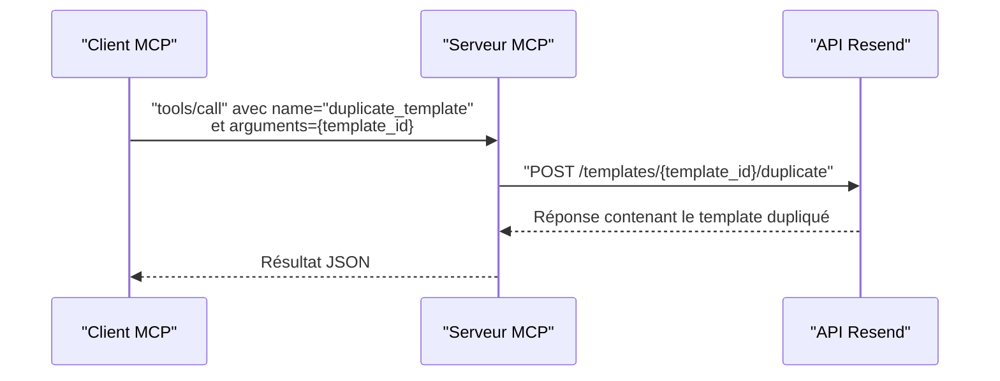

# Duplication de Template

<cite>
**Fichiers référencés dans ce document**
- [README.md](file://README.md)
- [package.json](file://package.json)
- [src/index.ts](file://src/index.ts)
</cite>

## Sommaire
1. [Introduction](#introduction)
2. [Objectif de la documentation](#objectif-de-la-documentation)
3. [Prérequis et configuration](#prérequis-et-configuration)
4. [Architecture générale](#architecture-générale)
5. [Composants clés liés à la duplication de template](#composants-clés-liés-à-la-duplication-de-template)
6. [Procédure de duplication de template](#procédure-de-duplication-de-template)
7. [Bonnes pratiques pour créer des variantes de templates](#bonnes-pratiques-pour-créer-des-variantes-de-templates)
8. [Différences de nom et alias](#différences-de-nom-et-alias)
9. [Exemples de scénarios de duplication](#exemples-de-scénarios-de-duplication)
10. [Flux de traitement de la duplication](#flux-de-traitement-de-la-duplication)
11. [Considérations de performance](#considérations-de-performance)
12. [Guide de résolution des problèmes](#guide-de-résolution-des-problèmes)
13. [Conclusion](#conclusion)

## Introduction
Cette documentation explique comment utiliser l’outil de duplication de template fourni par le serveur MCP Resend. Elle détaille ce qu’il faut dupliquer, ce qui doit être modifié, les bonnes pratiques pour créer des variantes, les différences entre nom et alias, ainsi que des scénarios concrets tels que les campagnes saisonnières ou les variations de design.

## Objectif de la documentation
- Comprendre comment fonctionne l’outil duplicate_template
- Identifier les éléments à dupliquer et ceux à modifier lors de la création d’une variante
- Appliquer des bonnes pratiques pour éviter les conflits de nommage et de contenu
- Utiliser des scénarios concrets pour structurer vos workflows de duplication

## Prérequis et configuration
- Une clé API Resend valide
- Un client compatible MCP configuré
- Accès à un template existant (par son identifiant ou alias)

**Section sources**
- [README.md](file://README.md#L127-L210)
- [package.json](file://package.json#L1-L49)

## Architecture générale
Le serveur MCP expose 70+ outils Resend via un protocole standardisé. Le module Templates comprend plusieurs outils dont duplicate_template. L’implémentation effectue des appels directs à l’API Resend pour gérer les templates.

**Diagram sources**
- [src/index.ts](file://src/index.ts#L1008-L1522)

## Composants clés liés à la duplication de template
- Définition de l’outil duplicate_template : il prend en entrée l’identifiant ou l’alias du template à dupliquer.
- Implémentation de l’appel API : le serveur effectue une requête POST vers l’endpoint de duplication de template.
- Gestion des erreurs : tous les appels sont encapsulés dans un try/catch avec des messages d’erreur détaillés.

**Section sources**
- [src/index.ts](file://src/index.ts#L671-L681)
- [src/index.ts](file://src/index.ts#L1303-L1309)

## Procédure de duplication de template
Voici les étapes à suivre pour dupliquer un template existant :

1. Identifier le template à dupliquer (via son identifiant ou alias).
2. Appeler l’outil duplicate_template avec le paramètre template_id.
3. Recevoir la réponse contenant le nouveau template dupliqué.
4. Modifier les éléments nécessaires (nom, alias, contenu HTML/Texte, variables, etc.) selon votre variante.
5. Publier le template si nécessaire.

**Section sources**
- [src/index.ts](file://src/index.ts#L671-L681)
- [src/index.ts](file://src/index.ts#L1303-L1309)

## Bonnes pratiques pour créer des variantes de templates
- Ne jamais dupliquer un template publié sans le publier en tant que nouvelle version.
- Modifier le nom pour refléter la variante (ex : “Newsletter Hiver”).
- Mettre à jour l’alias pour éviter les conflits de nommage.
- Adapter le contenu HTML/Texte pour les variations de design ou de saison.
- Vérifier les variables personnalisées et leurs valeurs par défaut.
- Tester la duplication avant de l’utiliser dans des envois massifs.

**Section sources**
- [README.md](file://README.md#L65-L72)

## Différences de nom et alias
- Nom : utilisé pour identifier le template de manière lisible. Il est recommandé de le modifier pour refléter la variante.
- Alias : identifiant unique utilisé dans les appels API. Il est préférable de le mettre à jour pour éviter les conflits.

**Section sources**
- [src/index.ts](file://src/index.ts#L581-L606)
- [src/index.ts](file://src/index.ts#L631-L647)

## Exemples de scénarios de duplication
- Campagne saisonnière : Dupliquer un template de base “Newsletter” en “Newsletter Hiver”, adapter le design et les contenus spécifiques à la période.
- Variations de design : Dupliquer un template de base pour créer “Newsletter Dark Theme” ou “Newsletter Light Theme”.
- Tests A/B : Dupliquer un template pour tester deux versions de contenu ou de design.

**Section sources**
- [README.md](file://README.md#L65-L72)

## Flux de traitement de la duplication
Le flux de duplication suit cette séquence :

**Diagram sources**
- [src/index.ts](file://src/index.ts#L1303-L1309)

## Considérations de performance
- La duplication est une opération légère côté API Resend.
- Évitez de dupliquer en boucle sans modification car cela peut saturer les ressources.
- Utilisez des alias uniques pour éviter les recherches redondantes.

## Guide de résolution des problèmes
- Erreur d’authentification : vérifiez que la clé API est définie.
- Paramètres manquants : le champ template_id est requis.
- Erreur inattendue : consultez le message d’erreur renvoyé par le serveur.

**Section sources**
- [README.md](file://README.md#L551-L568)
- [src/index.ts](file://src/index.ts#L1516-L1522)

## Conclusion
L’outil duplicate_template permet de créer rapidement des variantes de templates Resend. En suivant les bonnes pratiques de nommage et de modification, vous pouvez structurer efficacement vos campagnes et vos tests de design.