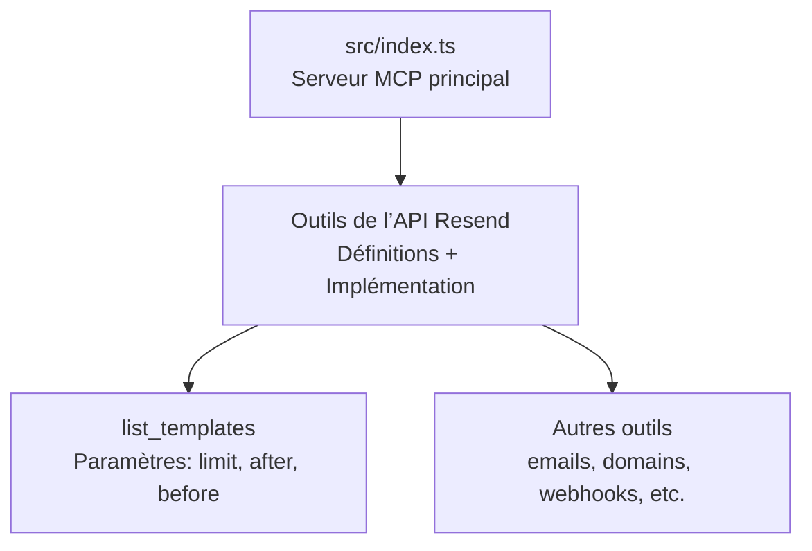
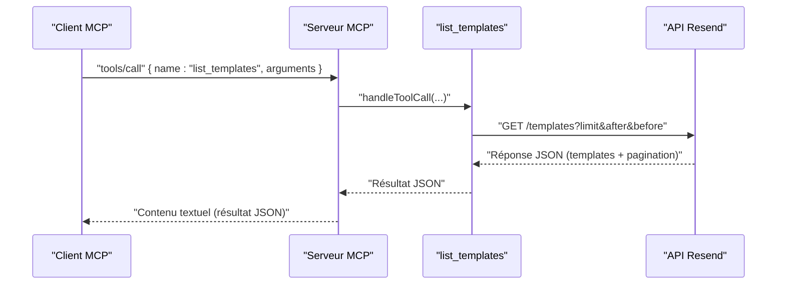
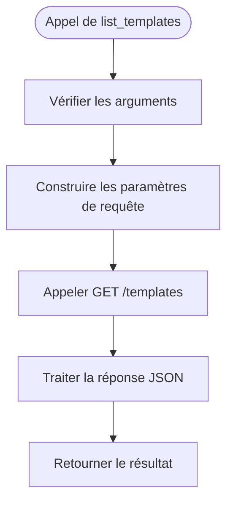
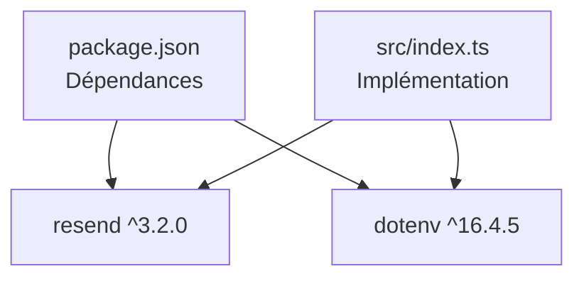

# Liste des Templates

<cite>
**Fichiers référencés dans ce document**
- [README.md](file://README.md)
- [package.json](file://package.json)
- [src/index.ts](file://src/index.ts)
</cite>

## Sommaire
1. [Introduction](#introduction)
2. [Structure du projet](#structure-du-projet)
3. [Composants principaux](#composants-principaux)
4. [Aperçu de l’architecture](#aperçu-de-l’architecture)
5. [Analyse détaillée des composants](#analyse-détaillée-des-composants)
6. [Analyse des dépendances](#analyse-des-dépendances)
7. [Considérations sur les performances](#considérations-sur-les-performances)
8. [Guide de dépannage](#guide-de-dépannage)
9. [Conclusion](#conclusion)

## Introduction
Ce document fournit une documentation complète de l’outil list_templates, qui permet de récupérer la liste complète des modèles d’e-mails disponibles via le serveur MCP Resend. Il explique comment utiliser les paramètres de pagination (limit, after, before), le format de la réponse, ainsi que les cas d’utilisation courants. Il inclut également des recommandations sur les performances attendues pour les grandes listes de templates et les meilleures pratiques pour gérer les résultats paginés.

## Structure du projet
Le projet est un serveur MCP qui expose l’ensemble de l’API Resend sous forme d’outils invocables. Le cœur de l’implémentation se trouve dans le fichier principal, où sont définis les outils, leurs schémas d’entrée, et leur implémentation.

**Diagramme sources**
- [src/index.ts](file://src/index.ts#L579-L681)

**Section sources**
- [src/index.ts](file://src/index.ts#L1-L1002)
- [README.md](file://README.md#L65-L72)

## Composants principaux
- Définition de l’outil list_templates : nom, description, schéma d’entrée (paramètres de pagination).
- Implémentation de l’appel à l’API Resend pour récupérer les templates.
- Gestion de la réponse au format JSON.
- Intégration dans le protocole MCP (tools/list, tools/call).

**Section sources**
- [src/index.ts](file://src/index.ts#L608-L619)
- [src/index.ts](file://src/index.ts#L1263-L1270)

## Aperçu de l’architecture
L’outil list_templates fait partie d’un ensemble plus vaste d’outils MCP. Lorsqu’un client MCP appelle list_templates, le serveur MCP exécute l’implémentation associée, qui effectue une requête HTTP vers l’API Resend avec les paramètres de pagination fournis.

**Diagramme sources**
- [src/index.ts](file://src/index.ts#L1263-L1270)
- [src/index.ts](file://src/index.ts#L1536-L1564)

## Analyse détaillée des composants

### Paramètres de l’outil list_templates
- Nom de l’outil : list_templates
- Description : Récupère tous les modèles d’e-mails.
- Schéma d’entrée (paramètres de pagination) :
  - limit : nombre maximal d’éléments à retourner.
  - after : curseur pour récupérer les éléments après un point donné.
  - before : curseur pour récupérer les éléments avant un point donné.

Ces trois paramètres sont optionnels. Si aucun n’est fourni, l’API peut retourner un ensemble par défaut selon ses règles de pagination.

**Section sources**
- [src/index.ts](file://src/index.ts#L608-L619)

### Implémentation technique
- Construction des paramètres de requête : limit, after, before sont ajoutés dynamiquement à l’URL de l’API Resend.
- Appel HTTP : GET /templates avec les paramètres de pagination.
- Réponse : le corps de la réponse est renvoyé tel quel (format JSON).

**Diagramme sources**
- [src/index.ts](file://src/index.ts#L1263-L1270)

**Section sources**
- [src/index.ts](file://src/index.ts#L1263-L1270)

### Format de la réponse
- Le serveur MCP renvoie toujours un contenu textuel contenant le JSON brut de la réponse de l’API Resend.
- La structure de la réponse est celle de l’API Resend pour la liste des templates, incluant généralement :
  - Une collection de templates.
  - Des métadonnées de pagination (par exemple, des curseurs after/before).
- Pour des détails précis sur la structure exacte de la réponse, reportez-vous à la documentation officielle de l’API Resend.

**Section sources**
- [src/index.ts](file://src/index.ts#L1544-L1551)

### Cas d’utilisation courants
- Obtenir tous les templates disponibles sans limite de taille.
- Parcourir les templates par lots en utilisant limit + after.
- Obtenir les templates récents en utilisant limit + before.
- Utiliser after/before pour itérer complètement sur la liste si elle est volumineuse.

**Section sources**
- [src/index.ts](file://src/index.ts#L608-L619)

## Analyse des dépendances
- Dépendance externe : le client Resend est utilisé pour interagir avec l’API Resend.
- Dépendance de développement : TypeScript pour le typage et la compilation.
- Package principal : le binaire est exposé via le champ bin de package.json.

**Diagramme sources**
- [package.json](file://package.json#L32-L40)
- [src/index.ts](file://src/index.ts#L1-L7)

**Section sources**
- [package.json](file://package.json#L1-L49)
- [src/index.ts](file://src/index.ts#L1-L7)

## Considérations sur les performances
- Pagination optimale : pour de grandes collections de templates, utilisez limit + after pour itérer progressivement. Cela évite de charger toute la liste en mémoire en une seule fois.
- Curseurs after/before : ces paramètres permettent de naviguer efficacement entre les pages, surtout si l’ordre est basé sur l’horodatage de création ou de mise à jour.
- Limite de requêtes : respectez les limites de taux de l’API Resend pour éviter les erreurs 429. Si nécessaire, ajoutez des pauses entre les appels.
- Taille des réponses : limitez le nombre d’éléments retournés par page (limit) pour réduire la taille des réponses JSON.

[Pas de sources supplémentaires car cette section fournit des conseils généraux]

## Guide de dépannage
- Erreur d’authentification : si l’environnement n’est pas configuré correctement, le serveur indiquera qu’une clé API est manquante. Vérifiez votre .env.
- Erreur d’exécution de l’outil : le serveur renvoie un message d’erreur contenant le nom de l’outil et ses arguments. Cela permet de diagnostiquer les problèmes de paramètres.
- Réponse inattendue : puisque le serveur renvoie le JSON brut de l’API Resend, assurez-vous de vérifier la documentation officielle de l’API Resend pour comprendre la structure de la réponse.

**Section sources**
- [src/index.ts](file://src/index.ts#L1571-L1577)
- [src/index.ts](file://src/index.ts#L1552-L1563)

## Conclusion
L’outil list_templates permet de récupérer facilement la liste complète des templates d’e-mails avec un support complet de la pagination via limit, after et before. En adoptant des pratiques de pagination itérative et en respectant les limites de l’API, vous pouvez gérer efficacement des collections importantes de templates tout en maintenant des performances optimales.