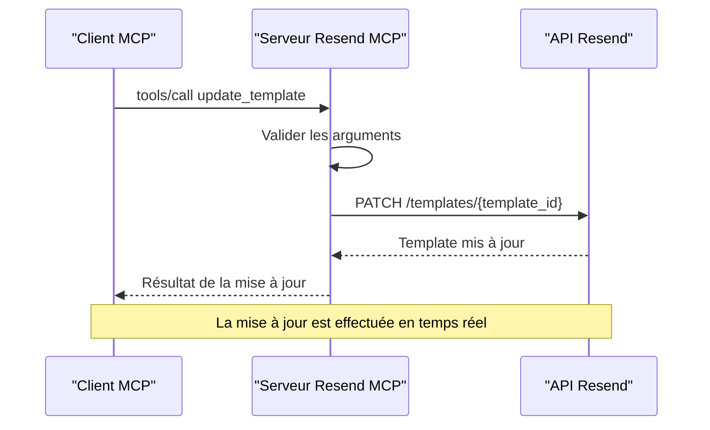

# Mise à Jour de Template

<cite>
**Fichiers référencés dans ce document**
- [README.md](file://README.md)
- [package.json](file://package.json)
- [src/index.ts](file://src/index.ts)
</cite>

## Sommaire
1. [Introduction](#introduction)
2. [Objectif de la documentation](#objectif-de-la-documentation)
3. [Prérequis et configuration](#prérequis-et-configuration)
4. [Architecture de l'outil update_template](#architecture-de-l-outil-update_template)
5. [Champs et validations](#champs-et-validations)
6. [Exemples d'utilisation courante](#exemples-dutilisation-courante)
7. [Séquence de mise à jour](#séquence-de-mise-à-jour)
8. [Gestion des erreurs](#gestion-des-erreurs)
9. [Meilleures pratiques](#meilleures-pratiques)
10. [Conclusion](#conclusion)

## Introduction
Cette documentation explique comment utiliser l'outil update_template pour modifier un template email existant dans la plateforme Resend. L'outil permet de mettre à jour toutes les propriétés d'un template, notamment le nom, l'alias, l'expéditeur, le sujet, le contenu HTML et texte, ainsi que le champ reply_to.

## Objectif de la documentation
- Comprendre comment modifier un template existant
- Identifier tous les champs modifiables et leurs contraintes
- Apprendre à effectuer des mises à jour fréquentes (contenu, design, expéditeur)
- Savoir gérer les erreurs et validations applicables

## Prérequis et configuration
- Une clé API Resend valide
- Un environnement Node.js compatible
- L'outil update_template est disponible via le serveur MCP Resend

**Section sources**
- [README.md](file://README.md#L127-L210)
- [package.json](file://package.json#L32-L35)

## Architecture de l'outil update_template
L'outil update_template fait partie de l'ensemble des outils de gestion des templates de la plateforme Resend. Il s'intègre dans le serveur MCP qui expose toutes les fonctionnalités Resend sous forme d'outils invocables.

```mermaid
graph TB
subgraph "Serveur MCP Resend"
A[Interface MCP] --> B[Outils Resend]
B --> C[update_template]
B --> D[create_template]
B --> E[list_templates]
B --> F[get_template]
B --> G[delete_template]
B --> H[publish_template]
B --> I[duplicate_template]
end
subgraph "API Resend"
J[HTTP PATCH /templates/{id}]
K[HTTP GET /templates/{id}]
L[HTTP DELETE /templates/{id}]
end
C --> J
F --> K
G --> L
```

**Diagram sources**
- [src/index.ts](file://src/index.ts#L579-L681)
- [src/index.ts](file://src/index.ts#L1277-L1285)

## Champs et validations

### Champs disponibles pour la mise à jour
L'outil update_template accepte les champs suivants :

| Champ | Type | Description | Obligatoire |
|-------|------|-------------|-------------|
| template_id | string | Identifiant ou alias du template à mettre à jour | ✅ Oui |
| name | string | Nom du template | ❌ Non |
| alias | string | Alias du template | ❌ Non |
| from | string | Adresse email de l'expéditeur par défaut | ❌ Non |
| subject | string | Sujet de l'email | ❌ Non |
| reply_to | array[string] | Adresses de réponse | ❌ Non |
| html | string | Contenu HTML | ❌ Non |
| text | string | Contenu texte | ❌ Non |

### Contraintes et validations
- Le champ `template_id` est obligatoire et peut être soit l'identifiant technique, soit l'alias du template
- Tous les autres champs sont optionnels, vous pouvez mettre à jour uniquement les champs nécessaires
- Les adresses email doivent respecter le format standard
- Le contenu HTML et texte peuvent être mis à jour indépendamment

**Section sources**
- [src/index.ts](file://src/index.ts#L631-L648)

## Exemples d'utilisation courante

### Exemple 1 : Modification du contenu HTML
Pour mettre à jour uniquement le contenu HTML d'un template :
```json
{
  "method": "tools/call",
  "params": {
    "name": "update_template",
    "arguments": {
      "template_id": "template-id-ou-alias",
      "html": "<div>Nouveau contenu HTML</div>"
    }
  }
}
```

### Exemple 2 : Changement de design complet
Pour mettre à jour le design avec un nouveau sujet et contenu :
```json
{
  "method": "tools/call",
  "params": {
    "name": "update_template",
    "arguments": {
      "template_id": "newsletter-template",
      "subject": "Nouveau sujet de newsletter",
      "html": "<h1>Contenu mis à jour</h1>",
      "text": "Texte alternatif mis à jour"
    }
  }
}
```

### Exemple 3 : Ajustement de l'expéditeur et reply_to
Pour modifier l'expéditeur et ajouter des adresses de réponse :
```json
{
  "method": "tools/call",
  "params": {
    "name": "update_template",
    "arguments": {
      "template_id": "template-id",
      "from": "noreply@entreprise.com",
      "reply_to": ["support@entreprise.com", "contact@entreprise.com"]
    }
  }
}
```

### Exemple 4 : Mise à jour complète
Pour effectuer une mise à jour complète du template :
```json
{
  "method": "tools/call",
  "params": {
    "name": "update_template",
    "arguments": {
      "template_id": "newsletter-2024",
      "name": "Newsletter 2024",
      "alias": "newsletter-2024",
      "from": "news@entreprise.com",
      "subject": "Votre newsletter mensuelle",
      "reply_to": ["contact@entreprise.com"],
      "html": "<div>Contenu HTML mis à jour</div>",
      "text": "Contenu texte mis à jour"
    }
  }
}
```

## Séquence de mise à jour
Voici le flux de traitement lors d'une mise à jour de template :



**Diagram sources**
- [src/index.ts](file://src/index.ts#L1277-L1285)

## Gestion des erreurs
Le serveur MCP gère plusieurs types d'erreurs lors de la mise à jour des templates :

### Erreurs courantes
- **Template introuvable** : Le template_id fourni n'existe pas
- **Format d'adresse email invalide** : Les adresses email ne respectent pas le format attendu
- **Erreur de validation** : Certains champs ne respectent pas les contraintes
- **Problèmes de droits** : Accès refusé à la modification du template

### Messages d'erreur spécifiques
- `Unknown tool: update_template` : Outil non reconnu
- `Tool execution failed: ...` : Erreur lors de l'exécution de l'opération
- `Template not found` : Le template n'existe pas

**Section sources**
- [src/index.ts](file://src/index.ts#L1516-L1522)

## Meilleures pratiques

### Pour les mises à jour de contenu
- Utilisez toujours le même template_id pour maintenir la cohérence
- Testez les modifications dans un environnement de développement avant la mise en production
- Sauvegardez le contenu original avant de faire des modifications importantes

### Pour les ajustements de design
- Mettez à jour le HTML et le texte de manière cohérente
- Vérifiez la compatibilité avec les différents clients email
- Utilisez des balises sémantiques pour améliorer l'accessibilité

### Pour les modifications d'expéditeur
- Assurez-vous que l'adresse email est valide et vérifiée
- Vérifiez que l'expéditeur correspond à votre domaine configuré
- Testez le reply_to avec des adresses de test

### Pour les mises à jour fréquentes
- Utilisez des alias plutôt que des identifiants techniques pour plus de lisibilité
- Effectuez des mises à jour par lots si vous devez modifier plusieurs templates
- Documentez chaque modification pour faciliter le suivi

## Conclusion
L'outil update_template offre une flexibilité maximale pour gérer vos templates email Resend. Grâce à ses champs optionnels et à sa simplicité d'utilisation, vous pouvez facilement adapter vos templates aux besoins changeants de votre communication. N'oubliez pas de tester vos modifications et de suivre les bonnes pratiques de gestion de contenu pour garantir une expérience optimale à vos destinataires.