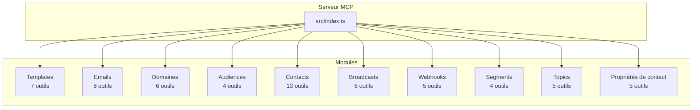
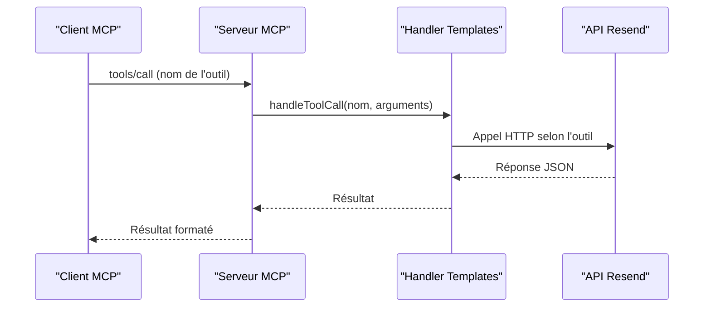
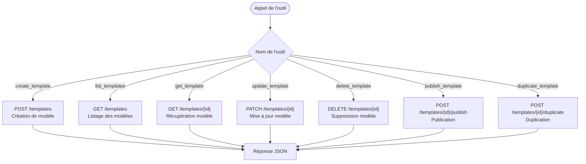
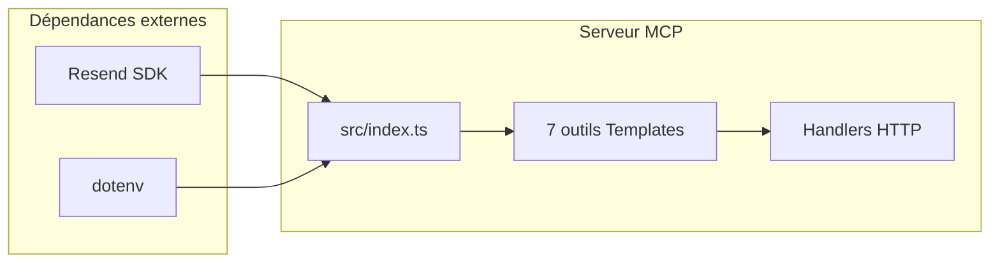

# Module Templates

<cite>
**Fichiers référencés dans ce document**
- [README.md](file://README.md)
- [package.json](file://package.json)
- [src/index.ts](file://src/index.ts)
- [skills/resend-expert/SKILL.md](file://skills/resend-expert/SKILL.md)
</cite>

## Sommaire
1. [Introduction](#introduction)
2. [Structure du projet](#structure-du-projet)
3. [Composants principaux](#composants-principaux)
4. [Aperçu de l'architecture](#aperçu-de-larchitecture)
5. [Analyse détaillée des composants](#analyse-détaillée-des-composants)
6. [Analyse des dépendances](#analyse-des-dépendances)
7. [Considérations de performance](#considérations-de-performance)
8. [Guide de dépannage](#guide-de-dépannage)
9. [Conclusion](#conclusion)

## Introduction
Le module Templates de l'API Resend permet de gérer des modèles d'e-mails réutilisables, de publier des modèles en brouillon, et de dupliquer des modèles existants. Ce module comprend 7 outils qui couvrent la création, la consultation, la mise à jour, la suppression, la publication et la duplication de modèles. Ces outils sont intégrés dans un serveur Model Context Protocol (MCP) qui expose l'ensemble de l'API Resend sous forme d'outils invocables.

## Structure du projet
Le projet est organisé autour d'un serveur MCP qui expose tous les outils de l'API Resend. Le module Templates fait partie de l'ensemble des outils disponibles, chacun ayant une définition de schéma d'entrée spécifique.

**Diagramme sources**
- [src/index.ts](file://src/index.ts#L42-L681)

**Section sources**
- [README.md](file://README.md#L65-L72)
- [src/index.ts](file://src/index.ts#L42-L681)

## Composants principaux
Le module Templates comprend les 7 outils suivants :
- create_template : Créer un nouveau modèle d'e-mail
- list_templates : Lister tous les modèles
- get_template : Récupérer un modèle spécifique
- update_template : Mettre à jour un modèle existant
- delete_template : Supprimer un modèle
- publish_template : Publier un modèle en brouillon
- duplicate_template : Dupliquer un modèle existant

Chaque outil dispose d'un schéma d'entrée défini avec des propriétés spécifiques et des champs requis.

**Section sources**
- [README.md](file://README.md#L65-L72)
- [src/index.ts](file://src/index.ts#L579-L681)

## Aperçu de l'architecture
Le serveur MCP implémente un système de gestion des outils avec des définitions de schéma JSON et des handlers pour chaque outil. Le module Templates utilise des appels HTTP directs à l'API Resend pour les opérations de gestion des modèles.

**Diagramme sources**
- [src/index.ts](file://src/index.ts#L1008-L1522)

## Analyse détaillée des composants

### Schéma d'entrée des outils Templates
Chaque outil Templates dispose d'un schéma d'entrée JSON qui définit les paramètres attendus. Voici les caractéristiques principales :

#### create_template
- Propriétés principales : name, alias, from, subject, reply_to, html, text, variables
- Champs requis : name, html
- Support des variables personnalisées avec clé, type et valeur de repli

#### list_templates
- Paramètres de pagination : limit, after, before
- Utile pour naviguer dans les modèles existants

#### get_template
- Identifiant unique : template_id (ID ou alias)
- Champs requis : template_id

#### update_template
- Identifiant unique : template_id
- Mise à jour de tous les champs sauf l'identifiant
- Champs disponibles : name, alias, from, subject, reply_to, html, text

#### delete_template
- Suppression d'un modèle par son identifiant
- Champs requis : template_id

#### publish_template
- Publication d'un modèle en brouillon
- Champs requis : template_id

#### duplicate_template
- Duplication d'un modèle existant
- Champs requis : template_id

**Section sources**
- [src/index.ts](file://src/index.ts#L581-L681)

### Implémentation des handlers
Les handlers pour les outils Templates utilisent des appels HTTP directs à l'API Resend avec des méthodes appropriées :

**Diagramme sources**
- [src/index.ts](file://src/index.ts#L1254-L1309)

### Gestion des variables de personnalisation
Le module Templates supporte les variables de personnalisation dans les modèles. Les variables peuvent être définies lors de la création d'un modèle et incluent :
- Clé de variable (key)
- Type de variable (type)
- Valeur de repli (fallback_value)

Ces variables permettent de personnaliser les contenus des e-mails envoyés à partir de ces modèles.

**Section sources**
- [src/index.ts](file://src/index.ts#L593-L603)

### Bonnes pratiques de conception de templates
Basées sur les recommandations du module Resend Expert :

#### Structure de template
- Utiliser des balises HTML sémantiques
- Maintenir une hiérarchie de titres cohérente
- Utiliser des styles inline pour la compatibilité email
- Inclure un texte alternatif pour les clients sans HTML

#### Personnalisation
- Utiliser des variables pour les éléments dynamiques
- Mettre à disposition des valeurs de repli
- Tester avec différents clients email

#### Sécurité et conformité
- Inclure un lien de désabonnement
- Respecter les réglementations de protection des données
- Valider les contenus avant publication

**Section sources**
- [skills/resend-expert/SKILL.md](file://skills/resend-expert/SKILL.md#L234-L422)

### Utilisation dans les campagnes automatisées
Les templates peuvent être intégrés dans des campagnes automatisées de plusieurs façons :

#### Broadcasts
- Création de broadcasts basés sur des modèles
- Utilisation de variables personnalisées pour chaque destinataire
- Programmation d'envois massifs

#### Emails transactionnels
- Templates pour les notifications système
- Personnalisation des contenus avec données utilisateur
- Intégration dans les flux de travail automatisés

#### Gestion des versions
- Duplication de modèles pour créer des variantes
- Publication contrôlée des versions mises à jour
- Suivi des performances des différentes versions

**Section sources**
- [src/index.ts](file://src/index.ts#L671-L681)
- [skills/resend-expert/SKILL.md](file://skills/resend-expert/SKILL.md#L1079-L1169)

## Analyse des dépendances
Le module Templates dépend de plusieurs composants du système :

**Diagramme sources**
- [package.json](file://package.json#L32-L34)
- [src/index.ts](file://src/index.ts#L1-L7)

### Dépendances techniques
- **Resend SDK** : Permet l'intégration directe avec l'API Resend
- **dotenv** : Gestion des variables d'environnement
- **TypeScript** : Typage fort pour les schémas d'entrée
- **Node.js** : Runtime pour le serveur MCP

**Section sources**
- [package.json](file://package.json#L32-L40)

## Considérations de performance
Le serveur MCP implémente plusieurs mécanismes de performance :

### Gestion des limites de taux
- Limite par défaut : 2 requêtes par seconde
- Gestion automatique des tentatives en cas de dépassement
- Respect des limites de l'API Resend

### Optimisations de traitement
- Appels HTTP directs pour les opérations non couvertes par le SDK
- Gestion asynchrone des appels
- Logging minimal pour éviter les goulots d'étranglement

**Section sources**
- [README.md](file://README.md#L518-L526)
- [src/index.ts](file://src/index.ts#L1008-L1522)

## Guide de dépannage
Voici les erreurs courantes liées au module Templates et leurs solutions :

### Erreurs d'authentification
- **Erreur 401 Unauthorized** : API key invalide ou manquante
- **Erreur 403 Forbidden** : Permissions insuffisantes pour accéder aux templates

### Erreurs de validation
- **Erreur 400 Bad Request** : Paramètres manquants ou incorrects
- **Erreur 422 Unprocessable Entity** : Données valides mais invalides

### Erreurs de ressource
- **Erreur 404 Not Found** : Template introuvable
- **Erreur 409 Conflict** : Conflit lors de la création/mise à jour

### Solutions de dépannage
1. Vérifier la configuration de l'API key
2. Valider le schéma d'entrée des outils
3. Vérifier les permissions d'accès
4. Respecter les limites de taux
5. Tester les templates dans différents clients email

**Section sources**
- [README.md](file://README.md#L528-L549)
- [src/index.ts](file://src/index.ts#L1516-L1522)

## Conclusion
Le module Templates de l'API Resend offre un ensemble complet d'outils pour gérer des modèles d'e-mails réutilisables. Grâce à la gestion des variables de personnalisation, la publication de modèles et la duplication, il permet de créer des campagnes automatisées efficaces et maintenables. L'intégration dans le serveur MCP permet une utilisation transparente à travers différents clients et frameworks, tout en maintenant des standards élevés de sécurité et de performance.