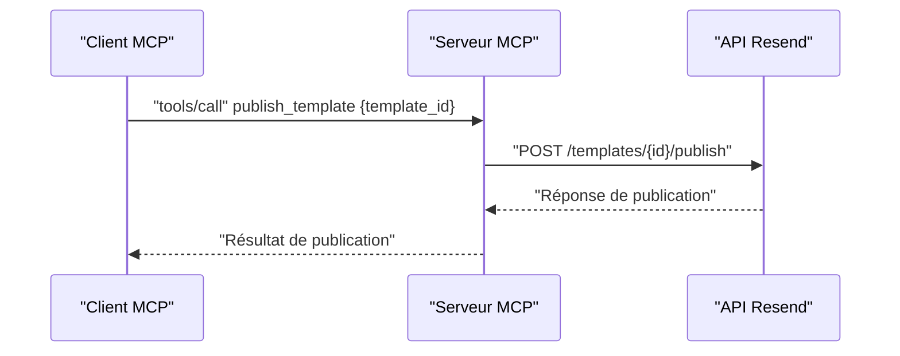
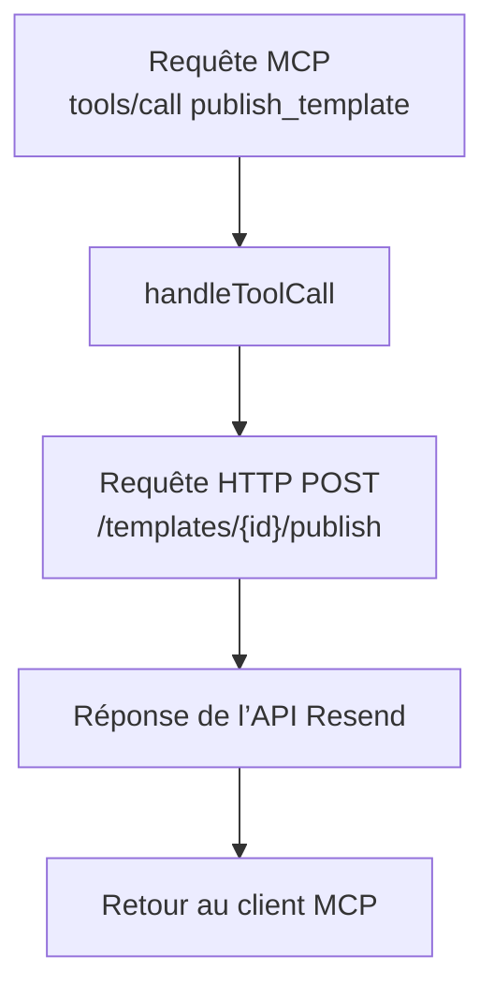

# Publication de Template

<cite>
**Fichiers référencés dans ce document**
- [README.md](file://README.md)
- [package.json](file://package.json)
- [src/index.ts](file://src/index.ts)
</cite>

## Sommaire
1. [Introduction](#introduction)
2. [Processus de publication d’un template draft](#processus-de-publication-dun-template-draft)
3. [Différences entre draft et template publié](#différences-entre-draft-et-template-publié)
4. [Implications de publication](#implications-de-publication)
5. [Contraintes applicables](#contraintes-applicables)
6. [Workflows de validation avant publication](#workflows-de-validation-avant-publication)
7. [Exemples de templates prêts à publier](#exemples-de-templates-prêts-à-publier)
8. [Architecture technique](#architecture-technique)
9. [Conclusion](#conclusion)

## Introduction
Ce document explique comment publier un template draft avec l’outil publish_template dans le serveur MCP Resend. Il détaille le processus de publication, les différences entre un template draft et un template publié, les implications de publication, les contraintes applicables, ainsi que les workflows de validation à respecter. Des exemples concrets montrent comment préparer un template pour une publication réussie.

## Processus de publication d’un template draft
La publication d’un template draft se fait via l’outil MCP publish_template. Ce processus transforme un template en mode brouillon (draft) en un template utilisable pour envoyer des emails. Le workflow est le suivant :

- Identifier le template à publier (par son identifiant ou alias).
- Appeler l’outil publish_template avec l’identifiant ou alias du template.
- Le serveur MCP effectue une requête HTTP vers l’API Resend pour publier le template.
- Une fois publié, le template peut être utilisé dans les opérations d’envoi d’emails.

**Diagram sources**
- [src/index.ts](file://src/index.ts#L1295-L1301)

**Section sources**
- [src/index.ts](file://src/index.ts#L660-L670)
- [src/index.ts](file://src/index.ts#L1295-L1301)

## Différences entre draft et template publié
Un template draft est un template en cours de création ou de modification, tandis qu’un template publié est actif et utilisable pour envoyer des emails. Voici les principales différences observables dans le système Resend :

- Statut de publication : Un template draft n’est pas encore disponible pour l’envoi d’emails, alors qu’un template publié peut être invoqué lors de l’envoi d’un email.
- Utilisation : Un template publié peut être référencé par son identifiant ou alias lors de l’envoi d’un email, tandis qu’un draft ne peut généralement pas être utilisé directement pour envoyer des emails.
- Gestion des versions : La publication d’un template crée une version utilisable qui peut être mise à jour ultérieurement via l’outil update_template.

Ces différences sont illustrées dans la documentation officielle de Resend, qui décrit clairement l’état draft et l’état publié des templates.

**Section sources**
- [README.md](file://README.md#L65-L72)

## Implications de publication
Publier un template a plusieurs implications importantes :

- Activation immédiate : Une fois publié, le template est disponible pour l’envoi d’emails.
- Accès restreint : Le template publié est accessible uniquement depuis l’espace de travail Resend associé à la clé API utilisée.
- Capacité de mise à jour : Après publication, le template peut être mis à jour via l’outil update_template, ce qui permet de corriger ou améliorer le contenu sans republier.
- Impact sur les envois : Si des envois utilisent ce template, ils peuvent être affectés par les modifications apportées après publication.

Ces implications sont cohérentes avec le fonctionnement standard des templates d’email dans les plateformes de messagerie transactionnelle.

**Section sources**
- [README.md](file://README.md#L65-L72)
- [src/index.ts](file://src/index.ts#L631-L647)

## Contraintes applicables
Lors de la publication d’un template draft, plusieurs contraintes s’appliquent :

- Identifiant ou alias requis : L’outil publish_template nécessite soit l’identifiant unique du template, soit son alias.
- Exigence de contenu valide : Le template doit avoir été créé avec un contenu HTML valide (et éventuellement du texte brut), car la publication ne remplace pas la validation initiale du contenu.
- Permissions : L’utilisateur doit disposer des droits suffisants sur le compte Resend pour publier des templates.
- État du template : Le template doit exister et être au format attendu par l’API Resend.

Ces contraintes proviennent de la définition de l’outil publish_template et de l’implémentation de l’API Resend.

**Section sources**
- [src/index.ts](file://src/index.ts#L660-L670)
- [src/index.ts](file://src/index.ts#L1295-L1301)

## Workflows de validation avant publication
Avant de publier un template draft, il est recommandé de suivre ces workflows de validation :

- Vérification de la structure : S’assurer que le template contient un nom, un alias (optionnel), et du contenu HTML (et texte si nécessaire).
- Test de rendu : Vérifier que le contenu HTML s’affiche correctement dans différents navigateurs et clients email.
- Validation des balises de variables : Si le template utilise des variables, s’assurer qu’elles sont bien définies dans le champ variables lors de la création.
- Tests d’envoi : Effectuer des envois de test avec le template draft pour valider le contenu avant publication.
- Mise à jour si nécessaire : Utiliser l’outil update_template pour corriger tout problème identifié.

Ces étapes garantissent que le template publié est prêt à être utilisé dans des envois réels.

**Section sources**
- [src/index.ts](file://src/index.ts#L581-L606)
- [src/index.ts](file://src/index.ts#L631-L647)

## Exemples de templates prêts à publier
Voici des exemples de templates qui peuvent être publiés une fois leur contenu validé :

- Template de bienvenue : Contient un message de bienvenue personnalisé, un lien vers la documentation, et des informations de contact.
- Template de rappel : Contient un rappel de rendez-vous avec les détails du créneau horaire et un lien de modification.
- Template de confirmation de commande : Contient un récapitulatif de commande, les articles achetés, et les coordonnées de livraison.

Pour chacun de ces templates, il est essentiel de :
- Créer le template avec l’outil create_template.
- Valider le contenu en mode draft.
- Publier le template avec l’outil publish_template.
- Utiliser le template publié lors des envois d’emails.

Ces exemples illustrent l’utilisation typique des templates dans des scénarios courants de communication.

**Section sources**
- [src/index.ts](file://src/index.ts#L581-L606)
- [src/index.ts](file://src/index.ts#L660-L670)

## Architecture technique
Le serveur MCP Resend implémente l’outil publish_template comme suit :

- Définition de l’outil : L’outil publish_template est défini dans la liste des outils MCP avec ses paramètres d’entrée (nom, description, schéma d’entrée).
- Implémentation de l’appel : Lors de l’appel de l’outil, le serveur MCP appelle la fonction handleToolCall qui effectue une requête HTTP POST vers l’API Resend sur le chemin /templates/{id}/publish.
- Réponse : Le serveur renvoie la réponse de l’API Resend sous forme de texte JSON.

**Diagram sources**
- [src/index.ts](file://src/index.ts#L1295-L1301)
- [src/index.ts](file://src/index.ts#L1536-L1564)

**Section sources**
- [src/index.ts](file://src/index.ts#L660-L670)
- [src/index.ts](file://src/index.ts#L1295-L1301)
- [src/index.ts](file://src/index.ts#L1536-L1564)

## Conclusion
La publication d’un template draft via l’outil publish_template permet de rendre un template utilisable pour l’envoi d’emails. Elle implique des contraintes strictes (identifiant requis, contenu valide) et des implications importantes (activation immédiate, capacité de mise à jour). En respectant les workflows de validation avant publication, vous pouvez publier des templates fiables et prêts à l’emploi. Pour plus de détails sur l’ensemble des outils de gestion des templates, consultez la documentation officielle de Resend.