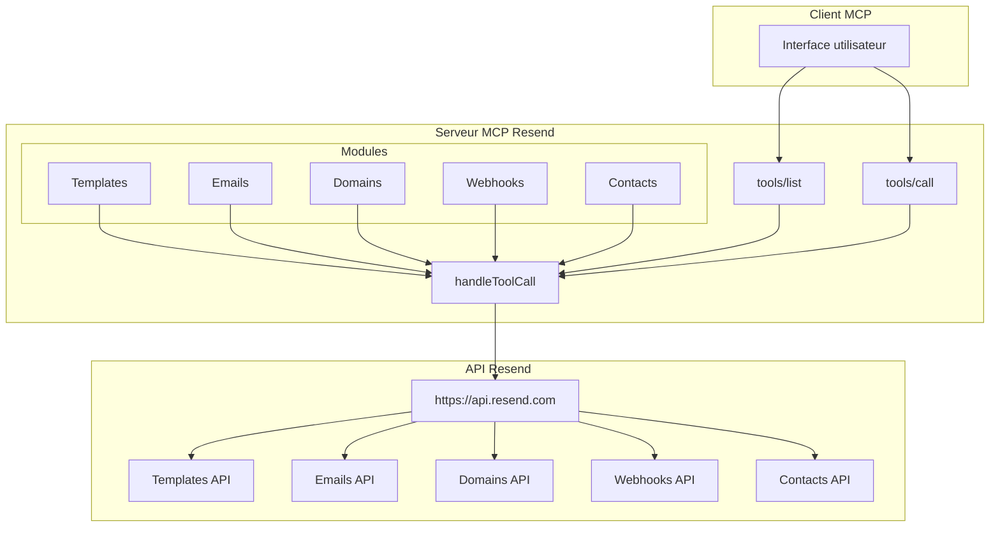

# Récupération de Template

<cite>
**Fichiers référencés dans ce document**
- [README.md](file://README.md)
- [package.json](file://package.json)
- [src/index.ts](file://src/index.ts)
</cite>

## Sommaire
1. [Introduction](#introduction)
2. [Objectif de la documentation](#objectif-de-la-documentation)
3. [Prérequis et configuration](#prérequis-et-configuration)
4. [Architecture générale](#architecture-générale)
5. [Outil get_template](#outil-get_template)
6. [Différences entre accès par ID et par alias](#différences-entre-accès-par-id-et-par-alias)
7. [Exemples d'utilisation](#exemples-dutilisation)
8. [Gestion des erreurs](#gestion-des-erreurs)
9. [Bonnes pratiques](#bonnes-pratiques)
10. [Conclusion](#conclusion)

## Introduction
Cette documentation explique comment utiliser l'outil de récupération de template (get_template) au sein du serveur MCP Resend. Elle couvre les différents modes d'accès (par identifiant ou par alias), les paramètres d'entrée, le format de réponse, ainsi que les erreurs possibles. Elle est conçue pour être accessible aussi bien aux développeurs débutants qu'à ceux ayant déjà une certaine expérience avec l'API Resend.

## Objectif de la documentation
- Expliquer comment récupérer un template spécifique par son ID ou alias
- Détail des paramètres d'entrée attendus
- Format de la réponse renvoyée
- Gestion des erreurs et cas d'exception
- Comparaison entre l'accès par ID et par alias
- Exemples concrets d'utilisation dans des scénarios de développement et d'intégration

## Prérequis et configuration
Avant d'utiliser l'outil get_template, il est nécessaire de disposer d'une clé API Resend valide. Le serveur MCP s'attend à trouver cette clé dans une variable d'environnement nommée RESEND_API_KEY. Pour plus de détails sur la configuration, consultez la section correspondante du README.

**Section sources**
- [README.md](file://README.md#L180-L210)

## Architecture générale
Le serveur MCP Resend implémente un ensemble de 70 outils couvrant l'ensemble de l'API Resend. L'outil get_template fait partie de la famille des outils liés aux templates. Le serveur expose deux méthodes principales :
- tools/list : permet de lister tous les outils disponibles
- tools/call : permet d'appeler un outil spécifique avec ses arguments

Voici un aperçu de l'architecture :



**Diagram sources**
- [src/index.ts](file://src/index.ts#L1528-L1565)
- [src/index.ts](file://src/index.ts#L1008-L1522)

**Section sources**
- [src/index.ts](file://src/index.ts#L1528-L1565)
- [src/index.ts](file://src/index.ts#L1008-L1522)

## Outil get_template
L'outil get_template permet de récupérer les détails d'un template spécifique à partir de son identifiant ou de son alias.

### Description et localisation
- Nom de l'outil : get_template
- Emplacement : module Templates (7 outils)
- Description : Récupère un template spécifique par ID ou alias

### Paramètres d'entrée
L'outil attend un seul paramètre obligatoire :

- template_id (chaîne de caractères)
  - Description : Identifiant unique du template ou alias du template
  - Obligatoire : Oui
  - Contraintes : Doit correspondre à un template existant

### Format de la réponse
La réponse est fournie au format JSON. Elle contient les propriétés du template récupéré, incluant au minimum :
- id : identifiant unique du template
- name : nom du template
- html : contenu HTML du template
- alias : alias optionnel du template
- subject : sujet par défaut
- from : adresse expéditrice par défaut
- reply_to : adresses de réponse
- text : contenu texte alternatif
- created_at : date de création
- updated_at : date de dernière mise à jour

### Exemple de requête
Voici un exemple de requête pour appeler l'outil get_template :

```json
{
  "method": "tools/call",
  "params": {
    "name": "get_template",
    "arguments": {
      "template_id": "votre-template-id-ou-alias"
    }
  }
}
```

### Exemple de réponse réussie
```json
{
  "id": "tmpl_abc123",
  "name": "Template de bienvenue",
  "alias": "welcome-template",
  "html": "<html>...</html>",
  "subject": "Bienvenue chez nous !",
  "from": "noreply@votredomaine.com",
  "reply_to": [],
  "text": "Bienvenue chez nous !",
  "created_at": "2024-01-15T10:30:00Z",
  "updated_at": "2024-01-15T10:30:00Z"
}
```

**Section sources**
- [src/index.ts](file://src/index.ts#L620-L630)
- [src/index.ts](file://src/index.ts#L1272-L1275)

## Différences entre accès par ID et par alias
L'outil get_template accepte à la fois un identifiant unique (ID) et un alias comme paramètre d'entrée. Voici les différences principales :

### Accès par ID
- Utilise l'identifiant unique généré automatiquement par l'API Resend
- Exemple : "tmpl_abc123def456"
- Avantages : toujours unique, pas d'ambiguïté
- Inconvénients : moins lisible, nécessite stockage de l'ID

### Accès par alias
- Utilise un alias personnalisé attribué au template
- Exemple : "welcome-template", "newsletter-monthly"
- Avantages : plus lisible, plus facile à mémoriser
- Inconvénients : peut ne pas être unique si plusieurs templates utilisent le même alias

### Comportement de l'API
Lorsque vous fournissez un alias, l'API Resend recherche le template correspondant. Si plusieurs templates portent le même alias, le comportement exact dépend de l'implémentation de l'API Resend. Il est recommandé d'utiliser les ID pour éviter toute ambiguïté.

**Section sources**
- [src/index.ts](file://src/index.ts#L624-L629)

## Exemples d'utilisation
Voici plusieurs scénarios d'utilisation courants de l'outil get_template :

### Scénario 1 : Récupération d'un template par son ID
Utilisation typique lorsqu'on connaît l'identifiant unique d'un template stocké dans une base de données.

### Scénario 2 : Récupération d'un template par alias
Utilisation lorsque l'application utilise des alias significatifs pour identifier les templates.

### Scénario 3 : Intégration dans un pipeline de génération d'e-mails
Combinaison avec d'autres outils Resend pour préparer le contenu d'un e-mail avant envoi.

### Scénario 4 : Validation de la disponibilité d'un template
Vérification qu'un template existe avant de l'utiliser dans un processus automatisé.

### Scénario 5 : Mise à jour conditionnelle
Récupération d'un template pour vérifier sa date de dernière modification avant de le mettre à jour.

**Section sources**
- [README.md](file://README.md#L65-L72)
- [src/index.ts](file://src/index.ts#L620-L630)

## Gestion des erreurs
L'outil get_template peut générer plusieurs types d'erreurs :

### Erreurs d'authentification
- Code : 401 Unauthorized
- Cause : Clé API invalide ou manquante
- Solution : Vérifiez votre variable d'environnement RESEND_API_KEY

### Erreurs de validation
- Code : 400 Bad Request
- Cause : Paramètre template_id manquant ou invalide
- Solution : Vérifiez que le paramètre est bien fourni et au bon format

### Erreur de ressource introuvable
- Code : 404 Not Found
- Cause : Le template spécifié n'existe pas
- Solution : Vérifiez l'identifiant ou alias fourni

### Erreurs de limite de fréquence
- Code : 429 Too Many Requests
- Cause : Dépassement de la limite de requêtes par seconde
- Solution : Respectez la limite de 2 requêtes/seconde

### Erreurs serveur
- Codes : 500 Internal Server Error, 503 Service Unavailable
- Cause : Problèmes temporaires du service Resend
- Solution : Réessayez après un délai

### Gestion des erreurs côté serveur MCP
Le serveur MCP encapsule les erreurs de l'API Resend dans un format JSON standardisé avec les champs suivants :
- error : message d'erreur détaillé
- tool : nom de l'outil qui a échoué
- arguments : arguments fournis à l'outil

**Section sources**
- [README.md](file://README.md#L528-L549)
- [src/index.ts](file://src/index.ts#L1519-L1522)

## Bonnes pratiques
Voici les meilleures pratiques à suivre lors de l'utilisation de l'outil get_template :

### Sécurité
- Stockez toujours votre clé API Resend dans des variables d'environnement
- N'incluez jamais la clé API dans le code source
- Utilisez des clés API avec les permissions minimales nécessaires

### Gestion des identifiants
- Préférez les ID uniques plutôt que les alias pour éviter les ambiguités
- Mettez en place un système de gestion des identifiants de template
- Documentez clairement l'utilisation des alias

### Gestion des erreurs
- Implémentez toujours une gestion des erreurs robuste
- Effectuez des vérifications préalables des paramètres
- Loggez les erreurs pour le diagnostic

### Performances
- Respectez la limite de fréquence de 2 requêtes/seconde
- Mettez en cache les réponses si vous accédez fréquemment aux mêmes templates
- Évitez les appels redondants

### Tests
- Testez toujours avec des identifiants de template valides
- Vérifiez le comportement en cas d'erreur
- Validez le format de la réponse

**Section sources**
- [README.md](file://README.md#L180-L210)
- [README.md](file://README.md#L518-L526)

## Conclusion
L'outil get_template constitue un composant essentiel pour gérer les templates dans un environnement MCP Resend. Grâce à sa flexibilité (accès par ID ou alias), il permet d'intégrer facilement des templates dans des flux de travail automatisés. En respectant les bonnes pratiques de sécurité et de gestion des erreurs, vous pouvez intégrer cet outil de manière fiable dans vos applications.

L'outil est parfaitement intégré dans l'écosystème MCP Resend, offrant une interface cohérente avec les autres outils de la plateforme. Sa simplicité d'utilisation et sa puissance de récupération de données en font un pilier fondamental de l'automatisation des communications par e-mail.