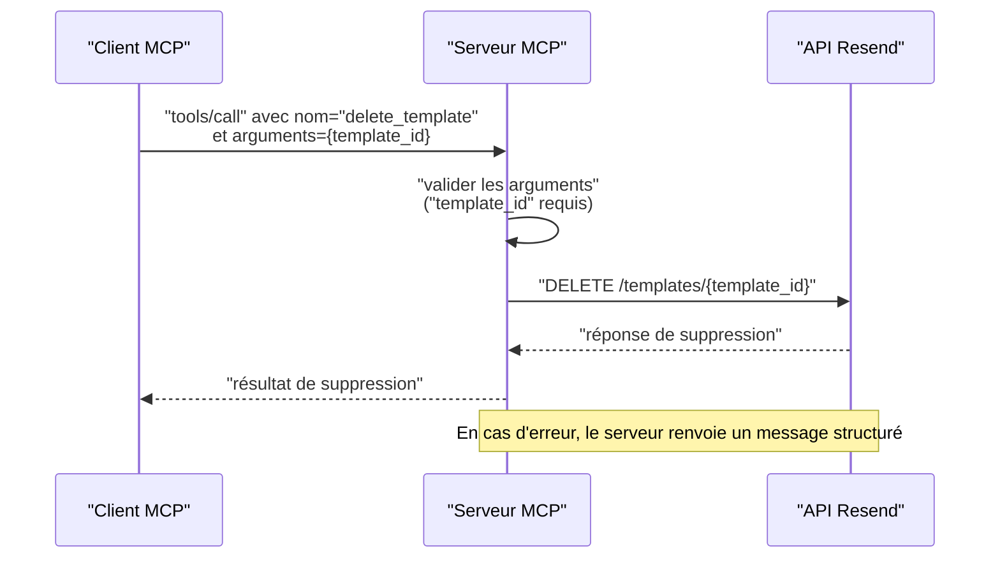
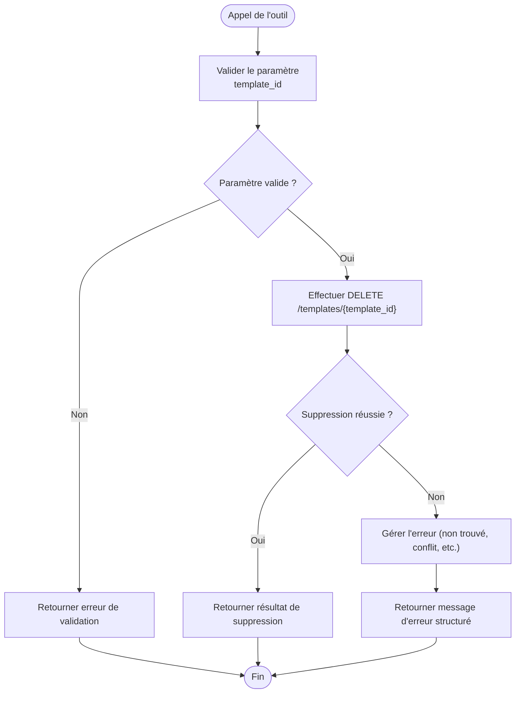

# Suppression de Template

<cite>
**Fichiers référencés dans ce document**
- [README.md](file://README.md)
- [package.json](file://package.json)
- [src/index.ts](file://src/index.ts)
</cite>

## Sommaire
1. [Introduction](#introduction)
2. [Objectif de la documentation](#objectif-de-la-documentation)
3. [Prérequis et configuration](#prérequis-et-configuration)
4. [Composants clés liés à la suppression de template](#composants-clés-liés-à-la-suppression-de-template)
5. [Architecture de suppression de template](#architecture-de-suppression-de-template)
6. [Flux de suppression de template](#flux-de-suppression-de-template)
7. [Restrictions et implications](#restrictions-et-implications)
8. [Alternatives à la suppression](#alternatives-à-la-suppression)
9. [Gestion des erreurs](#gestion-des-erreurs)
10. [Bonnes pratiques en production](#bonnes-pratiques-en-production)
11. [Conclusion](#conclusion)

## Introduction
Cette documentation explique comment supprimer un template existant via l’outil delete_template dans le serveur MCP Resend. Elle couvre les implications de suppression, les restrictions applicables, les alternatives comme la mise en pause plutôt que la suppression, ainsi que les erreurs possibles et les bonnes pratiques pour gérer les templates dans un environnement de production.

## Objectif de la documentation
- Décrire le fonctionnement de l’outil delete_template
- Expliquer les impacts d’une suppression de template
- Préciser les contraintes et restrictions
- Proposer des alternatives à la suppression
- Fournir des conseils pour éviter les erreurs en production
- Offrir des bonnes pratiques de gestion des templates

## Prérequis et configuration
- Une clé API Resend valide est requise
- Le serveur MCP Resend doit être démarré et accessible
- L’outil delete_template est disponible via le module Templates

**Section sources**
- [README.md](file://README.md#L127-L210)
- [package.json](file://package.json#L1-L49)

## Composants clés liés à la suppression de template
- Outil delete_template : permet de supprimer un template par son identifiant ou alias
- Gestion des erreurs : réponse structurée avec message d’erreur
- Implémentation côté serveur : appel HTTP DELETE vers l’API Resend

**Section sources**
- [README.md](file://README.md#L65-L72)
- [src/index.ts](file://src/index.ts#L649-L659)
- [src/index.ts](file://src/index.ts#L1287-L1293)

## Architecture de suppression de template
Le serveur MCP expose l’outil delete_template qui effectue un appel HTTP DELETE vers l’API Resend pour supprimer un template. Le flux complet inclut la validation des paramètres, l’appel au backend Resend, et la gestion des réponses (succès ou erreur).

**Diagram sources**
- [src/index.ts](file://src/index.ts#L1287-L1293)
- [src/index.ts](file://src/index.ts#L1536-L1564)

## Flux de suppression de template
Voici le déroulement typique lorsqu’un utilisateur appelle l’outil delete_template :

**Diagram sources**
- [src/index.ts](file://src/index.ts#L1287-L1293)
- [src/index.ts](file://src/index.ts#L1519-L1522)

## Restrictions et implications
- Identifiant requis : l’outil nécessite un template_id (ou alias) valide
- Impact immédiat : la suppression retire le template de l’environnement Resend
- Utilisation active : si le template est utilisé dans des envois ou campagnes actives, cela peut entraîner des échecs
- Récupération difficile : il n’existe pas de corbeille pour les templates ; la suppression est définitive
- Alternatives : publier le template, le dupliquer avant suppression, ou simplement le désactiver si disponible

**Section sources**
- [src/index.ts](file://src/index.ts#L649-L659)
- [README.md](file://README.md#L65-L72)

## Alternatives à la suppression
Avant de supprimer un template, envisager ces alternatives :
- Publier le template : passer d’un brouillon à publié pour éviter les suppressions prématurées
- Dupliquer le template : conserver une version de référence avant suppression
- Modifier le template : mettre à jour le contenu plutôt que de le supprimer
- Désactiver temporairement : si disponible, suspendre l’utilisation sans supprimer

**Section sources**
- [README.md](file://README.md#L65-L72)
- [src/index.ts](file://src/index.ts#L660-L681)

## Gestion des erreurs
Le serveur MCP retourne des messages structurés en cas d’échec. Les erreurs courantes incluent :
- Paramètre manquant : absence de template_id
- Ressource introuvable : template_id inexistant
- Erreurs d’autorisation : clé API invalide ou droits insuffisants
- Erreurs de serveur : problèmes temporaires de l’API Resend

Le serveur encapsule les erreurs et renvoie un objet contenant le message d’erreur, le nom de l’outil et les arguments fournis.

**Section sources**
- [src/index.ts](file://src/index.ts#L1519-L1522)
- [src/index.ts](file://src/index.ts#L1552-L1563)
- [README.md](file://README.md#L528-L549)

## Bonnes pratiques en production
- Ne jamais supprimer un template en cours d’utilisation
- Effectuer des sauvegardes ou duplicata avant toute suppression
- Utiliser des environnements distincts (développement/test/production) pour tester les suppressions
- Mettre en place des vérifications de présence de template avant suppression
- Documenter les suppressions effectuées (journalisation)
- Utiliser des alias ou des balises pour faciliter le suivi des templates
- Éviter de supprimer des templates utilisés par des webhooks ou des campagnes actives

**Section sources**
- [README.md](file://README.md#L493-L517)
- [README.md](file://README.md#L528-L549)

## Conclusion
La suppression d’un template via l’outil delete_template est irréversible et impacte immédiatement l’environnement Resend. Pour éviter les risques, il est recommandé de dupliquer, publier ou modifier un template avant suppression, et de suivre les bonnes pratiques de gestion des ressources en production. En cas d’erreur, le serveur MCP fournit des messages structurés pour diagnostiquer rapidement le problème.