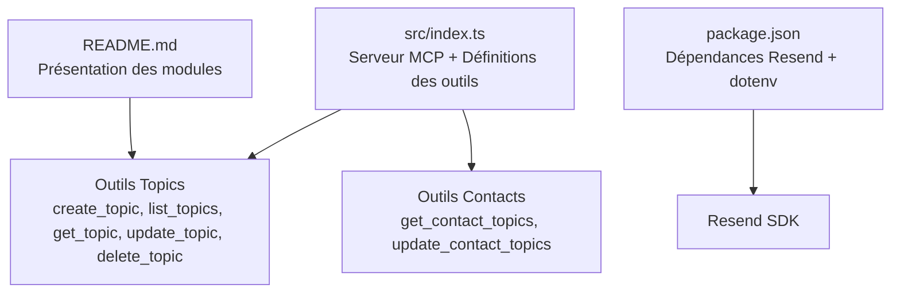
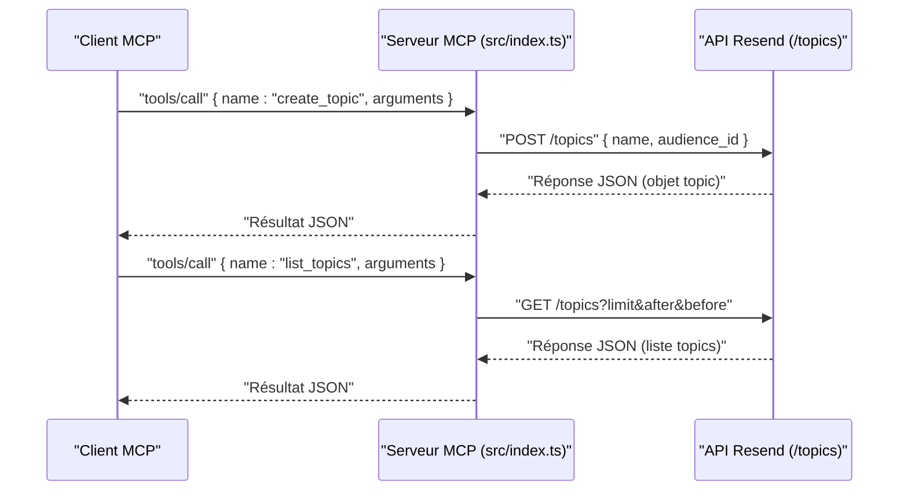
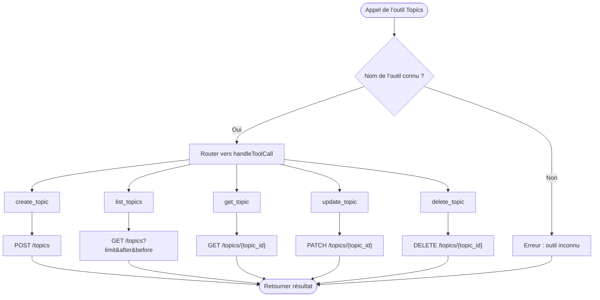
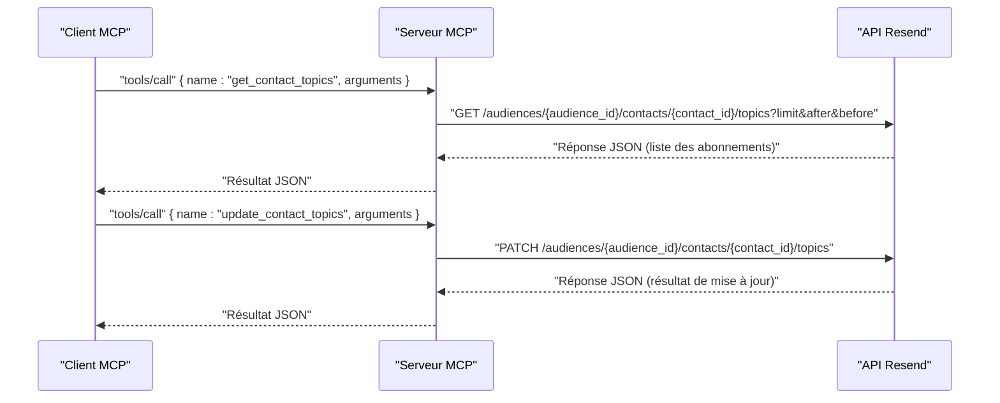
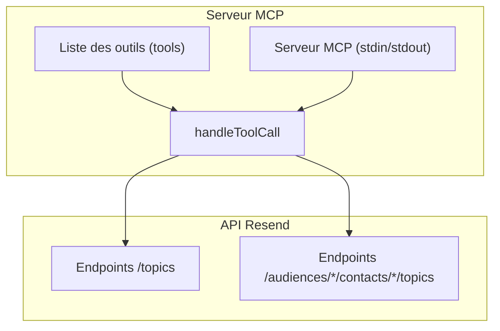

# Module Topics

<cite>
**Fichiers référencés dans ce document**
- [README.md](file://README.md)
- [package.json](file://package.json)
- [src/index.ts](file://src/index.ts)
</cite>

## Sommaire
1. [Introduction](#introduction)
2. [Structure du projet](#structure-du-projet)
3. [Composants principaux](#composants-principaux)
4. [Aperçu de l’architecture](#aperçu-de-larchitecture)
5. [Analyse détaillée des composants](#analyse-détaillée-des-composants)
6. [Analyse des dépendances](#analyse-des-dépendances)
7. [Considérations sur les performances](#considérations-sur-les-performances)
8. [Guide de dépannage](#guide-de-dépannage)
9. [Conclusion](#conclusion)
10. [Annexes](#annexes)

## Introduction
Ce document présente le module Topics de l’API Resend exposé via le serveur Model Context Protocol (MCP). Le module Topics permet de gérer les sujets d’abonnement, qui sont des catégories ou thématiques auxquelles un contact peut souscrire ou se désinscrire. Il inclut cinq outils fondamentaux : create_topic, list_topics, get_topic, update_topic, delete_topic. Ces outils s’intègrent dans des stratégies de communication personnalisées en association avec les audiences, les contacts, les segments et les diffusions.

Le module Topics est documenté ici comme faisant partie de l’ensemble des 12 modules de l’API Resend couverts par le serveur MCP, avec un total de plus de 70 outils.

**Section sources**
- [README.md](file://README.md#L105-L111)
- [README.md](file://README.md#L472-L491)

## Structure du projet
Le projet est un serveur MCP qui expose l’ensemble de l’API Resend. La structure clé est la suivante :
- src/index.ts : Implémentation principale du serveur MCP, contient la définition des outils (y compris Topics) ainsi que leurs implémentations.
- package.json : Dépendances et scripts de build/execution.
- README.md : Documentation générale, présentation des modules et outils.



**Diagram sources**
- [src/index.ts](file://src/index.ts#L881-L939)
- [src/index.ts](file://src/index.ts#L541-L577)
- [package.json](file://package.json#L32-L34)
- [README.md](file://README.md#L105-L111)

**Section sources**
- [README.md](file://README.md#L472-L491)
- [package.json](file://package.json#L1-L49)

## Composants principaux
Le module Topics comprend cinq outils de gestion des sujets d’abonnement. Chacun possède une description, un schéma d’entrée (inputSchema) et, pour certains, des paramètres requis.

- create_topic : Crée un nouveau sujet d’abonnement associé à une audience.
- list_topics : Liste tous les sujets disponibles, avec pagination.
- get_topic : Récupère les détails d’un sujet spécifique.
- update_topic : Met à jour le nom d’un sujet.
- delete_topic : Supprime un sujet.

Chacun de ces outils est défini dans la liste des outils du serveur MCP, avec un inputSchema précisant les champs attendus.

**Section sources**
- [src/index.ts](file://src/index.ts#L881-L939)

## Aperçu de l’architecture
Le serveur MCP reçoit des appels d’outils, les route à la fonction handleToolCall, qui effectue les requêtes HTTP vers l’API Resend. Pour le module Topics, les appels sont envoyés à des endpoints spécifiques (/topics) avec des méthodes HTTP appropriées (POST, GET, PATCH, DELETE).



**Diagram sources**
- [src/index.ts](file://src/index.ts#L1433-L1472)
- [src/index.ts](file://src/index.ts#L1008-L1522)

## Analyse détaillée des composants

### Outils du module Topics
Voici les cinq outils du module Topics, décrits par leur nom, description et schéma d’entrée.

- create_topic
  - Description : Créer un nouveau sujet d’abonnement.
  - Paramètres requis : name, audience_id.
  - Implémentation : Envoie une requête POST à /topics avec le corps contenant name et audience_id.

- list_topics
  - Description : Récupérer tous les sujets.
  - Paramètres optionnels : limit, after, before (pagination).
  - Implémentation : Envoie une requête GET à /topics avec les paramètres de pagination.

- get_topic
  - Description : Récupérer les détails d’un sujet spécifique.
  - Paramètres requis : topic_id.
  - Implémentation : Envoie une requête GET à /topics/{topic_id}.

- update_topic
  - Description : Mettre à jour le nom d’un sujet.
  - Paramètres requis : topic_id, name.
  - Implémentation : Envoie une requête PATCH à /topics/{topic_id} avec le champ name.

- delete_topic
  - Description : Supprimer un sujet.
  - Paramètres requis : topic_id.
  - Implémentation : Envoie une requête DELETE à /topics/{topic_id}.



**Diagram sources**
- [src/index.ts](file://src/index.ts#L1433-L1472)
- [src/index.ts](file://src/index.ts#L1008-L1522)

**Section sources**
- [src/index.ts](file://src/index.ts#L881-L939)
- [src/index.ts](file://src/index.ts#L1433-L1472)

### Relations avec les contacts
Le module Topics interagit étroitement avec le module Contacts via deux outils complémentaires :
- get_contact_topics : Permet de récupérer les abonnements d’un contact à des sujets.
- update_contact_topics : Permet de mettre à jour les abonnements d’un contact à des sujets.

Ces outils permettent de gérer les inscriptions/désinscriptions d’un contact à des sujets spécifiques, ce qui constitue la base de la personnalisation des communications.



**Diagram sources**
- [src/index.ts](file://src/index.ts#L1235-L1251)
- [src/index.ts](file://src/index.ts#L541-L577)

**Section sources**
- [src/index.ts](file://src/index.ts#L541-L577)
- [src/index.ts](file://src/index.ts#L1235-L1251)

### Bonnes pratiques pour structurer les sujets
- Nommez les sujets de manière claire et descriptive pour faciliter la compréhension des contacts.
- Utilisez des sujets pour organiser les communications par thématiques (ex : produits, actualités, support).
- Associez les sujets à des audiences pertinentes pour limiter les abonnements inutiles.
- Intégrez la gestion des sujets dans vos stratégies de segmentation et de diffusion pour envoyer du contenu ciblé.
- Utilisez update_contact_topics pour synchroniser les préférences des contacts avec les sujets actifs.

[Ce paragraphe fournit des conseils généraux sans analyser de fichiers spécifiques]

## Aperçu de l’architecture
Le serveur MCP est composé de :
- Une liste d’outils (tools) définie dans src/index.ts.
- Une fonction handleToolCall qui exécute les appels en appelant l’API Resend via des requêtes HTTP.
- Un serveur MCP qui écoute les requêtes stdin/stdout et répond via stdout.



**Diagram sources**
- [src/index.ts](file://src/index.ts#L1008-L1522)
- [src/index.ts](file://src/index.ts#L1433-L1472)
- [src/index.ts](file://src/index.ts#L1235-L1251)

**Section sources**
- [src/index.ts](file://src/index.ts#L1008-L1522)

## Analyse détaillée des composants

### Implémentation des outils Topics
Chaque outil Topics est implémenté dans handleToolCall avec un switch portant sur le nom de l’outil. Les appels utilisent l’en-tête Authorization avec le token API Resend, et les méthodes HTTP correspondantes.

- create_topic : POST /topics
- list_topics : GET /topics
- get_topic : GET /topics/{topic_id}
- update_topic : PATCH /topics/{topic_id}
- delete_topic : DELETE /topics/{topic_id}

```mermaid
classDiagram
class ServeurMCP {
+listTools() tools
+callTool(request) response
}
class OutilsTopics {
+create_topic(args) result
+list_topics(args) result
+get_topic(args) result
+update_topic(args) result
+delete_topic(args) result
}
class APIResend {
+POST "/topics"
+GET "/topics"
+GET "/topics/{topic_id}"
+PATCH "/topics/{topic_id}"
+DELETE "/topics/{topic_id}"
}
ServeurMCP --> OutilsTopics : "route"
OutilsTopics --> APIResend : "requêtes HTTP"
```

**Diagram sources**
- [src/index.ts](file://src/index.ts#L1008-L1522)
- [src/index.ts](file://src/index.ts#L1433-L1472)

**Section sources**
- [src/index.ts](file://src/index.ts#L1433-L1472)
- [src/index.ts](file://src/index.ts#L1008-L1522)

### Gestion des sujets d’abonnement
La gestion des sujets d’abonnement repose sur l’association entre audience et topic, et sur la possibilité pour un contact de s’abonner/désabonner à un topic. Les outils get_contact_topics et update_contact_topics permettent de gérer ces abonnements.

- get_contact_topics : Renvoie la liste des abonnements d’un contact à des sujets, avec pagination.
- update_contact_topics : Permet de modifier les abonnements d’un contact (ajouter/supprimer des sujets).

Ces outils s’appuient sur des endpoints /audiences/{audience_id}/contacts/{contact_id}/topics.

**Section sources**
- [src/index.ts](file://src/index.ts#L541-L577)
- [src/index.ts](file://src/index.ts#L1235-L1251)

## Analyse des dépendances
- Dépendance principale : Le serveur utilise le SDK Resend pour exécuter certaines opérations (par exemple, emails, domains, audiences, contacts). Pour les autres endpoints (topics, webhooks, segments, templates, broadcasts, contact-properties), le serveur effectue des appels HTTP directs à l’API Resend.
- Environnement : Le serveur lit la clé API depuis les variables d’environnement (.env) et l’utilise dans les en-têtes Authorization.

**Section sources**
- [package.json](file://package.json#L32-L34)
- [src/index.ts](file://src/index.ts#L1012-L1015)

## Considérations sur les performances
- Le serveur MCP respecte les limites de taux imposées par Resend. Le README indique une limite par défaut de 2 requêtes/seconde, avec des tentatives de nouvelle tentative automatique lorsque nécessaire.
- Pour les opérations de listing (list_topics, list_contacts, list_webhooks, etc.), il est recommandé d’utiliser les paramètres de pagination (limit, after, before) afin de limiter la charge réseau et le temps de réponse.

**Section sources**
- [README.md](file://README.md#L518-L527)

## Guide de dépannage
- Erreur : Clé API manquante
  - Symptôme : Message d’erreur indiquant que la variable d’environnement RESEND_API_KEY n’est pas définie.
  - Solution : Ajouter un fichier .env avec la clé API Resend.
- Erreur : Outil inconnu
  - Symptôme : Réponse indiquant “Unknown tool”.
  - Solution : Vérifier le nom de l’outil avec tools/list.
- Erreur : Paramètres manquants
  - Symptôme : Erreurs de validation (ex : 400/422).
  - Solution : Vérifier que tous les champs requis sont présents selon les inputSchema des outils.

**Section sources**
- [README.md](file://README.md#L551-L573)
- [src/index.ts](file://src/index.ts#L1516-L1522)

## Conclusion
Le module Topics du serveur MCP Resend offre une gestion complète des sujets d’abonnement, intégrée aux outils de gestion des audiences et des contacts. Grâce aux cinq outils de base (create, list, get, update, delete) et aux outils de gestion des abonnements des contacts (get_contact_topics, update_contact_topics), il permet de structurer des stratégies de communication personnalisées, ciblées et faciles à maintenir.

[Ce paragraphe résume sans analyser de fichiers spécifiques]

## Annexes
- Modules couverts : Le module Topics fait partie de l’ensemble des 12 modules de l’API Resend, avec plus de 70 outils au total.
- Outils associés : get_contact_topics, update_contact_topics.

**Section sources**
- [README.md](file://README.md#L105-L111)
- [README.md](file://README.md#L472-L491)