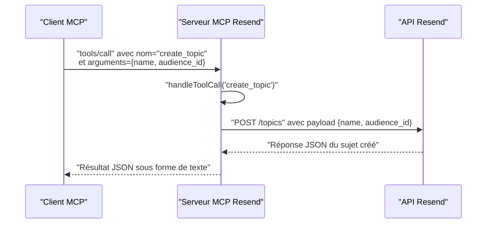

# Outil create_topic

<cite>
**Fichiers référencés dans ce document**
- [README.md](file://README.md)
- [package.json](file://package.json)
- [src/index.ts](file://src/index.ts)
</cite>

## Sommaire
1. [Introduction](#introduction)
2. [Objectif de l’outil](#objectif-de-loutil)
3. [Paramètres d’entrée](#paramètres-dentrée)
4. [Schémas JSON associés](#schémas-json-associés)
5. [Retours attendus](#retours-attendus)
6. [Exemples concrets d’utilisation](#exemples-concrets-dutilisation)
7. [Bonnes pratiques de nommage et d’organisation](#bonnes-pratiques-de-nommage-et-dorganisation)
8. [Architecture et flux de traitement](#architecture-et-flux-de-traitement)
9. [Conclusion](#conclusion)

## Introduction
L’outil create_topic permet de créer un nouveau sujet d’abonnement au sein d’une audience Resend. Ces sujets servent à structurer les communications personnalisées et à gérer les préférences d’abonnement des contacts. En associant des contacts à des sujets, vous pouvez envoyer des contenus ciblés sans avoir recours à des segments complexes, tout en maintenant un contrôle granulaire sur les préférences des destinataires.

## Objectif de l’outil
- Créer un sujet d’abonnement au sein d’une audience.
- Permettre une organisation fine des communications personnalisées.
- Faciliter la gestion des abonnements des contacts via des sujets spécifiques.

## Paramètres d’entrée
L’outil create_topic nécessite les paramètres suivants :
- name : Nom du sujet (chaîne de caractères). Requis.
- audience_id : Identifiant de l’audience à laquelle le sujet est rattaché (chaîne de caractères). Requis.

**Section sources**
- [src/index.ts](file://src/index.ts#L881-L893)

## Schémas JSON associés
Voici le schéma JSON attendu pour appeler l’outil create_topic :

- Méthode : tools/call
- Nom de l’outil : create_topic
- Arguments (inputSchema) :
  - name : chaîne de caractères
  - audience_id : chaîne de caractères

Exemple de payload JSON pour un appel direct à l’outil (sans inclure de contenu de code) :
- [Exemple d’appel JSON](file://src/index.ts#L1433-L1439)

**Section sources**
- [src/index.ts](file://src/index.ts#L881-L893)
- [src/index.ts](file://src/index.ts#L1433-L1439)

## Retours attendus
Le retour de l’outil create_topic est une réponse de type objet contenant les informations du sujet nouvellement créé. Le schéma de retour est conforme à l’API Resend pour la création de sujets. Pour plus de détails sur la structure complète de la réponse, reportez-vous à la documentation officielle de l’API Resend.

**Section sources**
- [src/index.ts](file://src/index.ts#L1433-L1439)

## Exemples concrets d’utilisation
Voici des scénarios courants d’utilisation de l’outil create_topic dans des stratégies de marketing email efficaces :

- Création d’un sujet “Actualités” pour diffuser régulièrement des contenus d’intérêt général.
- Création d’un sujet “Offres spéciales” pour les clients actifs.
- Création d’un sujet “Formation” pour les inscrits à des webinaires ou formations.
- Création d’un sujet “Produits” pour promouvoir des nouveautés produits.

Ces sujets peuvent ensuite être utilisés pour envoyer des contenus ciblés aux contacts qui s’y sont abonnés, tout en respectant leurs préférences.

[Ce paragraphe ne contient pas d’analyse de fichiers spécifiques, donc aucune source n’est ajoutée.]

## Bonnes pratiques de nommage et d’organisation
- Choisissez des noms de sujets clairs, courts et évocateurs (par exemple : “Actualités”, “Offres”, “Formation”, “Produits”).
- Utilisez un vocabulaire cohérent au sein de votre organisation pour éviter la confusion.
- Limitez le nombre de sujets pour maintenir une expérience utilisateur fluide.
- Associez chaque sujet à un type de contenu bien défini afin de faciliter la segmentation logique.
- Évitez les noms trop génériques qui pourraient mener à des abonnements désactivés par manque de pertinence.

[Ce paragraphe ne contient pas d’analyse de fichiers spécifiques, donc aucune source n’est ajoutée.]

## Architecture et flux de traitement
L’outil create_topic fait partie de l’ensemble des outils MCP exposés par le serveur Resend. Voici le flux de traitement global lors de l’appel de l’outil :

**Diagram sources**
- [src/index.ts](file://src/index.ts#L1008-L1522)
- [src/index.ts](file://src/index.ts#L1433-L1439)

**Section sources**
- [src/index.ts](file://src/index.ts#L1008-L1522)
- [src/index.ts](file://src/index.ts#L1433-L1439)

## Conclusion
L’outil create_topic permet de structurer efficacement vos communications email en créant des sujets d’abonnement au sein d’une audience. Grâce à un schéma d’appel simple et à des retours conformes à l’API Resend, il facilite la mise en place de campagnes ciblées et personnalisées, tout en respectant les préférences des contacts.

[Ce paragraphe ne contient pas d’analyse de fichiers spécifiques, donc aucune source n’est ajoutée.]