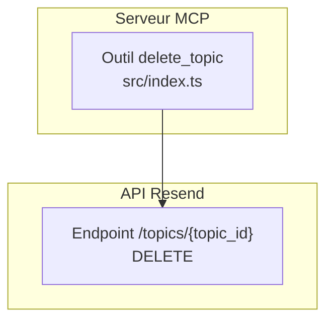
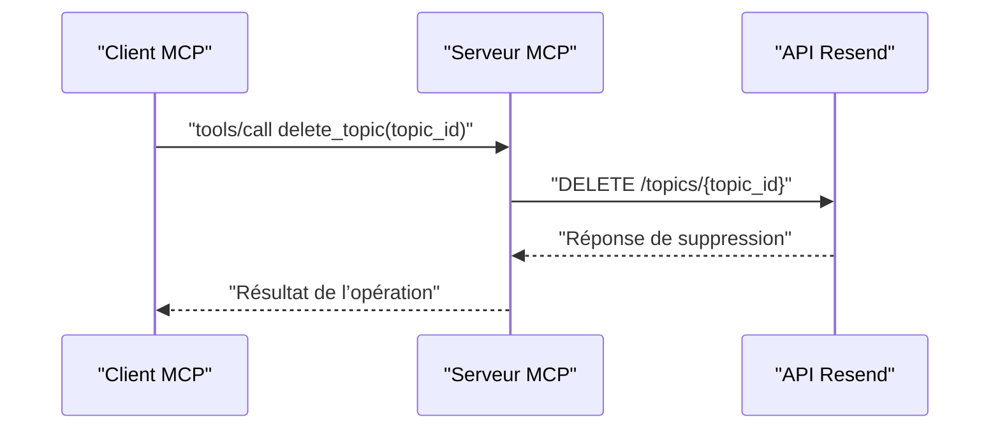

# Outil delete_topic

<cite>
**Fichiers référencés dans ce document**
- [README.md](file://README.md)
- [package.json](file://package.json)
- [src/index.ts](file://src/index.ts)
- [skills/resend-expert/SKILL.md](file://skills/resend-expert/SKILL.md)
</cite>

## Sommaire
1. [Introduction](#introduction)
2. [Projet](#projet)
3. [Composants](#composants)
4. [Architecture](#architecture)
5. [Analyse détaillée](#analyse-détaillée)
6. [Analyse des dépendances](#analyse-des-dépendances)
7. [Considérations de performance](#considérations-de-performance)
8. [Guide de dépannage](#guide-de-dépannage)
9. [Conclusion](#conclusion)

## Introduction
Cet outil permet de supprimer un sujet d’abonnement existant au sein d’une audience Resend. La suppression d’un sujet entraîne la perte de toutes les souscriptions associées, ce qui peut impacter les contacts et les campagnes actives. Ce document explique comment utiliser l’outil delete_topic de manière sécurisée, ses implications, les mesures de sécurité, les précautions à prendre, ainsi que des alternatives comme la désactivation plutôt que la suppression.

## Projet
Le projet expose un serveur Model Context Protocol (MCP) qui implémente l’intégralité de l’API Resend, y compris les outils liés aux sujets (topics). Le module Topics comprend cinq outils : créer, lister, obtenir, mettre à jour et supprimer un sujet.

- Couverture complète de l’API Resend : 70+ outils répartis sur 12 modules.
- Module Topics : 5 outils (create_topic, list_topics, get_topic, update_topic, delete_topic).
- Langage : TypeScript.
- Dépendances principales : SDK Resend, dotenv.

**Section sources**
- [README.md](file://README.md#L105-L111)
- [README.md](file://README.md#L472-L491)
- [package.json](file://package.json#L32-L34)

## Composants
- Outil delete_topic : Supprime un sujet par son identifiant.
- Schéma d’entrée : objet contenant topic_id (identifiant du sujet).
- Implémentation : appelle l’API Resend via un appel HTTP DELETE sur /topics/{topic_id}.

**Section sources**
- [src/index.ts](file://src/index.ts#L929-L939)
- [src/index.ts](file://src/index.ts#L1466-L1472)

## Architecture
Le serveur MCP expose tous les outils Resend. L’appel de l’outil delete_topic se traduit par une requête HTTP vers l’API Resend.

**Diagramme sources**
- [src/index.ts](file://src/index.ts#L1466-L1472)

**Section sources**
- [src/index.ts](file://src/index.ts#L1008-L1522)

## Analyse détaillée

### Paramètres requis
- topic_id : Identifiant unique du sujet à supprimer.

**Section sources**
- [src/index.ts](file://src/index.ts#L929-L939)

### Implications de la suppression
- Perte définitive des abonnements au sujet : tous les contacts ayant souscrit seront automatiquement désinscrits.
- Impact sur les campagnes actives : si des campagnes sont configurées pour envoyer des emails à des audiences liées à ce sujet, elles peuvent être affectées si celles-ci dépendent de ce sujet.
- Effets de bord potentiels : perte de données d’analyse liées aux abonnements, impact sur les rapports de performance.

**Section sources**
- [README.md](file://README.md#L105-L111)

### Mesures de sécurité
- Authentification : l’outil utilise l’en-tête Authorization Bearer avec la clé API Resend.
- Gestion des erreurs : les erreurs de validation, d’autorisation, de ressource ou de taux de requêtes sont gérées et renvoyées au client.
- Précaution : ne jamais stocker la clé API dans le code source. Utiliser des variables d’environnement.

**Section sources**
- [src/index.ts](file://src/index.ts#L1012-L1015)
- [README.md](file://README.md#L493-L517)

### Précautions avant la suppression
- Identifier tous les contacts ayant souscrit au sujet : utiliser l’outil get_contact_topics pour lister les abonnements.
- Vérifier les campagnes actives : s’assurer qu’aucune campagne ne dépend exclusivement de ce sujet.
- Planifier la suppression pendant une période de faible trafic.
- Sauvegarder les données critiques (historique des abonnements, rapports) si nécessaire.

**Section sources**
- [src/index.ts](file://src/index.ts#L1235-L1251)
- [README.md](file://README.md#L105-L111)

### Alternatives à la suppression
- Désactiver le sujet : au lieu de supprimer, il est souvent préférable de le désactiver (si disponible) pour conserver les données d’abonnement tout en empêchant de nouvelles souscriptions.
- Archiver le sujet : créer un nouveau sujet et migrer progressivement les contacts, puis supprimer l’ancien sujet.

**Section sources**
- [README.md](file://README.md#L105-L111)

### Exemples de suppression sécurisée
- Étape 1 : Identifier les abonnés
  - Utiliser l’outil get_contact_topics pour récupérer la liste des contacts inscrits.
- Étape 2 : Vérifier les campagnes actives
  - Vérifier si des campagnes sont configurées pour envoyer à des audiences liées à ce sujet.
- Étape 3 : Planifier la suppression
  - Effectuer la suppression pendant une fenêtre de maintenance.
- Étape 4 : Suivre les effets de bord
  - Surveiller les rapports d’abonnement et les retours des utilisateurs.

**Section sources**
- [src/index.ts](file://src/index.ts#L1235-L1251)
- [src/index.ts](file://src/index.ts#L1466-L1472)

### Gestion des effets de bord
- Migrer les contacts : si possible, créer un nouveau sujet et transférer les abonnements.
- Mettre à jour les flux de communication : modifier les templates et les campagnes pour qu’elles utilisent le nouveau sujet.
- Informer les utilisateurs : si possible, leur proposer de nouveaux sujets similaires.

**Section sources**
- [README.md](file://README.md#L105-L111)

## Architecture
Flux de suppression d’un sujet via l’outil delete_topic.

**Diagramme sources**
- [src/index.ts](file://src/index.ts#L1466-L1472)

**Section sources**
- [src/index.ts](file://src/index.ts#L1008-L1522)

## Analyse des dépendances
- Dépendance principale : SDK Resend pour les opérations non couvertes par le SDK (appels HTTP directs).
- Gestion des variables d’environnement : dotenv pour charger la clé API.
- Types et interfaces : MCPTool, MCPRequest, MCPResponse définis dans le serveur.

**Section sources**
- [package.json](file://package.json#L32-L34)
- [src/index.ts](file://src/index.ts#L1-L36)

## Considérations de performance
- Taux de requêtes : le serveur MCP respecte les limites de taux de requêtes de Resend (par défaut 2 requêtes/seconde).
- Gestion des erreurs : les erreurs de taux de requêtes sont gérées et renvoyées au client.

**Section sources**
- [README.md](file://README.md#L518-L527)

## Guide de dépannage
- Erreur 401 Unauthorized : clé API manquante ou invalide.
- Erreur 403 Forbidden : permissions insuffisantes.
- Erreur 404 Not Found : le sujet n’existe pas.
- Erreur 429 Too Many Requests : dépassement de la limite de taux de requêtes.
- Erreur 500/503 : problème temporaire du service Resend.

Mesures de diagnostic :
- Vérifier la clé API dans les variables d’environnement.
- Vérifier l’identifiant du sujet.
- Réessayer plus tard si le service est indisponible.

**Section sources**
- [README.md](file://README.md#L528-L549)

## Conclusion
La suppression d’un sujet via l’outil delete_topic est irréversible et impacte les abonnements et les campagnes actives. Il est essentiel de planifier la suppression, de vérifier les abonnés et les campagnes, et de prévoir des alternatives telles que la désactivation ou l’archivage. En appliquant les bonnes pratiques de sécurité et en surveillant les effets de bord, vous pouvez effectuer cette opération de manière sécurisée.