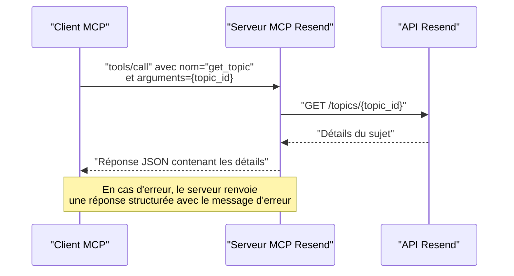

# Outil get_topic

<cite>
**Fichiers référencés dans ce document**
- [README.md](file://README.md)
- [package.json](file://package.json)
- [src/index.ts](file://src/index.ts)
</cite>

## Sommaire
1. [Introduction](#introduction)
2. [Objectif de l’outil](#objectif-de-loutil)
3. [Paramètres d’entrée](#paramètres-dentrée)
4. [Réponse attendue](#réponse-attendue)
5. [Cas d’erreur](#cas-derreur)
6. [Exemples d’utilisation](#exemples-dutilisation)
7. [Intégration dans une interface](#intégration-dans-une-interface)
8. [Validation de l’existence d’un sujet](#validation-de-lexistence-dun-sujet)
9. [Architecture technique](#architecture-technique)
10. [Conclusion](#conclusion)

## Introduction
Cet outil permet de récupérer les détails d’un sujet spécifique par son identifiant. Il fait partie de l’ensemble des outils fournis par le serveur MCP Resend, qui expose l’intégralité de l’API Resend sous forme d’outils invocables. Le module concerné est le module des sujets (Topics), qui gère les abonnements aux contenus de diffusion.

## Objectif de l’outil
Récupérer les informations détaillées d’un sujet identifié par son identifiant unique. Ces informations incluent le nom, la description, le statut, et le créateur du sujet.

## Paramètres d’entrée
- topic_id (chaîne de caractères, requis)
  - Identifiant unique du sujet à récupérer.

**Section sources**
- [src/index.ts](file://src/index.ts#L906-L916)

## Réponse attendue
La réponse est un objet contenant les informations du sujet. Voici les champs principaux attendus :
- id (chaîne de caractères)
  - Identifiant unique du sujet.
- name (chaîne de caractères)
  - Nom du sujet.
- description (chaîne de caractères, optionnel)
  - Description du sujet.
- audience_id (chaîne de caractères)
  - Identifiant de l’audience associée au sujet.
- created_at (date/heure, optionnel)
  - Date de création du sujet.
- updated_at (date/heure, optionnel)
  - Date de dernière mise à jour du sujet.
- status (chaîne de caractères, optionnel)
  - Statut du sujet (par exemple actif/inactif selon l’API Resend).
- created_by (objet, optionnel)
  - Informations sur l’utilisateur ayant créé le sujet.

**Section sources**
- [src/index.ts](file://src/index.ts#L906-L916)

## Cas d’erreur
Voici les cas d’erreur courants pouvant survenir lors de l’appel de l’outil get_topic :

- Erreur d’authentification
  - Message : clé API invalide ou manquante.
  - Code : 401 Non autorisé.

- Erreur de validation
  - Message : paramètre manquant ou incorrect (ex. topic_id non fourni ou invalide).
  - Code : 400 Mauvaise requête.

- Ressource introuvable
  - Message : le sujet avec l’identifiant spécifié n’existe pas.
  - Code : 404 Non trouvé.

- Limite de taux
  - Message : dépassement de la limite de requêtes autorisée.
  - Code : 429 Trop de requêtes.

- Erreur serveur
  - Message : problème temporaire du service Resend.
  - Code : 500 Erreur interne du serveur.

**Section sources**
- [README.md](file://README.md#L528-L549)
- [src/index.ts](file://src/index.ts#L1516-L1522)

## Exemples d’utilisation
Voici un exemple de requête directe pour appeler l’outil get_topic via le protocole MCP :

- Méthode : tools/call
- Nom de l’outil : get_topic
- Arguments :
  - topic_id : identifiant du sujet à récupérer

Exemple de réponse réussie (format JSON) :
{
  "id": "topic_id",
  "name": "Nom du sujet",
  "description": "Description du sujet",
  "audience_id": "audience_id",
  "status": "active",
  "created_by": {
    "id": "user_id",
    "email": "user@example.com"
  },
  "created_at": "2025-01-01T00:00:00Z",
  "updated_at": "2025-01-01T00:00:00Z"
}

Exemple de réponse d’erreur (format JSON) :
{
  "error": "Tool execution failed: Erreur de validation",
  "tool": "get_topic",
  "arguments": {
    "topic_id": "invalid-id"
  }
}

**Section sources**
- [src/index.ts](file://src/index.ts#L1536-L1564)

## Intégration dans une interface
L’outil get_topic peut être utilisé pour afficher les détails d’un sujet dans une interface utilisateur de plusieurs façons :
- Affichage d’un panneau de détails : lorsque l’utilisateur sélectionne un sujet, l’outil est invoqué pour récupérer ses informations, qui sont ensuite affichées dans un tableau de bord ou un modal.
- Mise à jour dynamique : si le sujet est modifié ailleurs, l’outil peut être rappelé pour rafraîchir les données affichées.
- Validation de l’existence : avant d’afficher des liens ou des actions liées à un sujet, on peut vérifier qu’il existe encore.

## Validation de l’existence d’un sujet
Avant d’effectuer des opérations sur un sujet (comme l’envoi de messages ou la modification), il est recommandé de valider son existence via l’outil get_topic. Cela permet de :
- Vérifier que le topic_id est valide.
- S’assurer que le sujet est toujours actif.
- Obtenir le nom et la description pour afficher des messages d’erreur pertinents en cas d’échec.

## Architecture technique
L’outil get_topic est implémenté comme suit dans le serveur MCP Resend :
- Définition de l’outil : le schéma d’entrée précise que topic_id est requis.
- Gestion de l’appel : le handler effectue une requête HTTP GET vers l’API Resend pour récupérer les détails du sujet.
- Gestion des erreurs : toute erreur est capturée et renvoyée sous forme de réponse structurée avec le nom de l’outil et les arguments fournis.

**Diagram sources**
- [src/index.ts](file://src/index.ts#L1451-L1454)
- [src/index.ts](file://src/index.ts#L1536-L1564)

**Section sources**
- [src/index.ts](file://src/index.ts#L906-L916)
- [src/index.ts](file://src/index.ts#L1451-L1454)
- [src/index.ts](file://src/index.ts#L1536-L1564)

## Conclusion
L’outil get_topic permet de récupérer facilement les détails d’un sujet Resend à partir de son identifiant. Il est essentiel pour l’affichage d’informations dans une interface et pour valider l’existence d’un sujet avant d’effectuer des opérations. Son implémentation est robuste, avec une gestion d’erreurs claire et des réponses structurées.