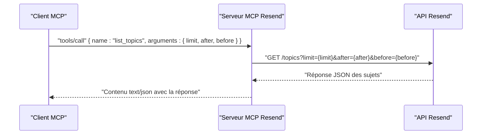

# Outil list_topics

<cite>
**Fichiers référencés dans ce document**
- [README.md](file://README.md)
- [package.json](file://package.json)
- [src/index.ts](file://src/index.ts)
</cite>

## Sommaire
1. [Introduction](#introduction)
2. [Objectif de l’outil](#objectif-de-loutil)
3. [Paramètres de l’outil](#paramètres-de-loutil)
4. [Format de réponse](#format-de-réponse)
5. [Exemples d’utilisation](#exemples-dutilisation)
6. [Intégration dans les interfaces utilisateur](#intégration-dans-les-interfaces-utilisateur)
7. [Cas d’usage courants](#cas-dusage-courants)
8. [Architecture technique](#architecture-technique)
9. [Conclusion](#conclusion)

## Introduction
L’outil list_topics fait partie de l’ensemble des outils fournis par le serveur MCP Resend, qui expose l’intégralité de l’API Resend sous forme d’outils invocables. Son objectif est de permettre aux assistants IA et aux applications de récupérer la liste complète des sujets d’abonnement disponibles au sein d’un compte Resend, avec un support de pagination avancé.

## Objectif de l’outil
Récupérer la liste des sujets d’abonnement (topics) configurés dans Resend, en supportant la pagination par curseurs (limit, after, before) afin de gérer efficacement les grandes collections de données.

## Paramètres de l’outil
L’outil list_topics prend en charge les paramètres suivants pour la pagination et le filtrage :

- limit (optionnel, nombre)
  - Nombre maximal d’enregistrements à retourner.
  - Valeur typique : entre 1 et 100 selon les contraintes de l’API.
- after (optionnel, chaîne de caractères)
  - Curseur indiquant le point après lequel récupérer les éléments suivants.
- before (optionnel, chaîne de caractères)
  - Curseur indiquant le point avant lequel récupérer les éléments précédents.

Ces paramètres sont transmis sous forme de requête HTTP GET à l’URL de l’API Resend correspondante.

**Section sources**
- [src/index.ts](file://src/index.ts#L894-L905)

## Format de réponse
La réponse de l’outil list_topics est un objet JSON contenant la collection de sujets. Elle inclut généralement :
- Une propriété représentant la liste des sujets (par exemple, un tableau d’objets).
- Des métadonnées de pagination si elles sont fournies par l’API Resend (comme des curseurs de pagination).

Le serveur MCP renvoie cette réponse sous forme de texte JSON dans un contenu de réponse standardisé.

**Section sources**
- [src/index.ts](file://src/index.ts#L1442-L1449)

## Exemples d’utilisation
Voici quelques scénarios courants d’appel de l’outil list_topics :

- Récupération de la première page de sujets avec un nombre limité d’éléments
  - Utiliser limit pour limiter le nombre de résultats.
- Navigation paginée vers l’avant
  - Utiliser after pour obtenir les éléments suivants à partir d’un curseur connu.
- Navigation paginée vers l’arrière
  - Utiliser before pour obtenir les éléments précédents à partir d’un curseur connu.
- Itération complète de la liste
  - Appeler successivement l’outil avec after jusqu’à ce qu’il n’y ait plus de curseur suivant.

Ces appels sont effectués via le protocole MCP, en envoyant un message de type tools/call avec le nom de l’outil et ses arguments.

**Section sources**
- [src/index.ts](file://src/index.ts#L1442-L1449)

## Intégration dans les interfaces utilisateur
L’outil list_topics peut être utilisé pour alimenter des interfaces utilisateur de sélection de sujets d’abonnement. Voici quelques cas d’usage typiques :

- Formulaire de création de diffusion (broadcast)
  - Afficher une liste déroulante ou un champ de recherche pour sélectionner un sujet.
  - Utiliser la pagination pour charger progressivement les sujets si la liste est importante.
- Gestion des abonnements des contacts
  - Permettre aux administrateurs de choisir des sujets pour inscrire des contacts.
- Interface de configuration de segments
  - Sélectionner des sujets associés à des segments pour cibler des campagnes.

Ces interfaces peuvent utiliser la pagination pour améliorer la performance et l’expérience utilisateur.

## Cas d’usage courants
Voici quelques cas d’usage fréquents dans les applications de gestion de contenu :

- Alimentation de listes de sélection dynamiques
  - Utiliser limit pour limiter le nombre d’options affichées.
- Navigation paginée dans des interfaces d’administration
  - Utiliser after et before pour permettre aux utilisateurs de naviguer facilement entre les pages.
- Synchronisation de données locales
  - Itérer sur tous les sujets en utilisant after jusqu’à la fin de la collection.
- Filtrage et recherche
  - Bien que l’outil ne prenne pas de filtre spécifique, il peut être utilisé en combinaison avec d’autres outils pour enrichir les données affichées.

## Architecture technique
L’outil list_topics est implémenté comme suit dans le serveur MCP Resend :

- Définition de l’outil
  - L’outil est décrit dans la liste des outils avec son nom, sa description et son schéma d’entrée.
  - Le schéma d’entrée inclut limit, after et before comme propriétés optionnelles.
- Gestion de l’appel
  - Lors de l’appel de l’outil, le serveur construit une requête HTTP GET vers l’API Resend avec les paramètres de pagination.
  - La réponse de l’API est renvoyée telle quelle au client MCP.
- Pagination
  - Les curseurs after et before sont transmis en tant que paramètres de requête.
  - Le serveur ne modifie pas la réponse, il la transmet directement.

**Diagram sources**
- [src/index.ts](file://src/index.ts#L894-L905)
- [src/index.ts](file://src/index.ts#L1442-L1449)

**Section sources**
- [src/index.ts](file://src/index.ts#L894-L905)
- [src/index.ts](file://src/index.ts#L1442-L1449)

## Conclusion
L’outil list_topics permet de récupérer de manière paginée la liste des sujets d’abonnement disponibles dans Resend. Grâce aux paramètres limit, after et before, il est possible de gérer efficacement les grandes collections de données, d’alimenter des interfaces utilisateur et de construire des flux de travail automatisés dans des applications de gestion de contenu.