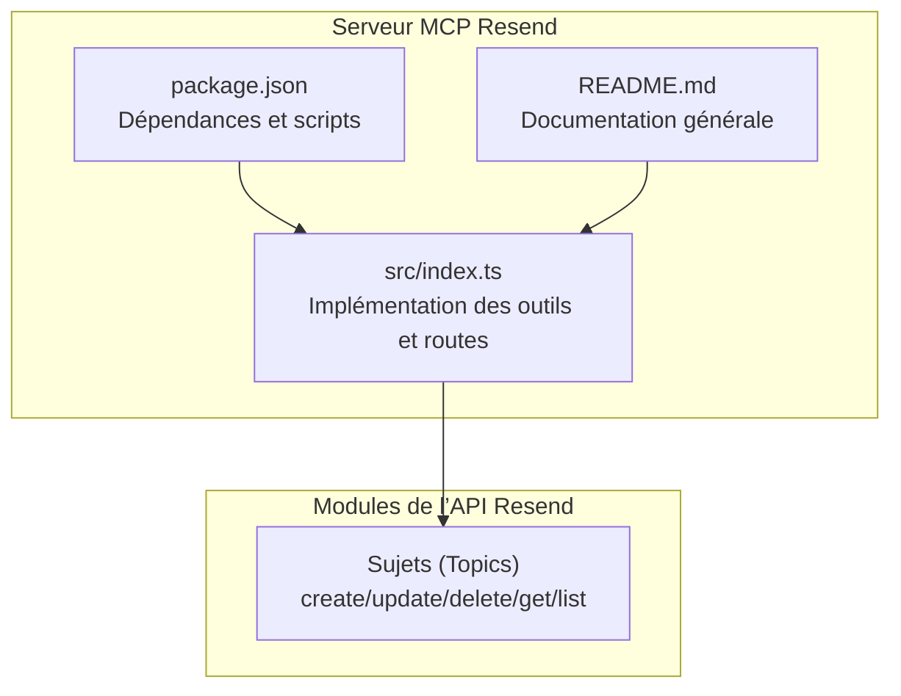
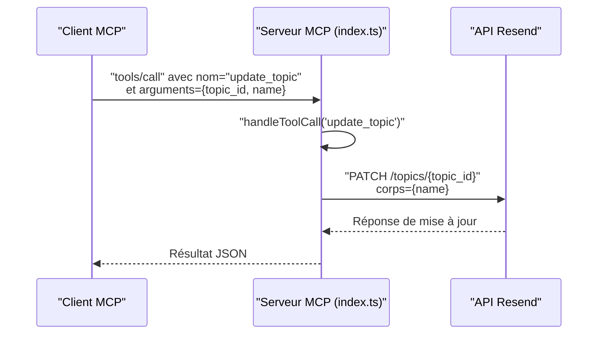
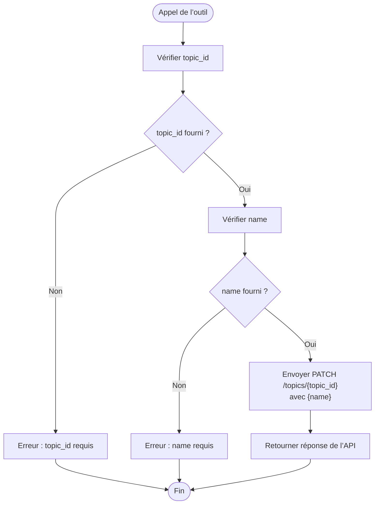
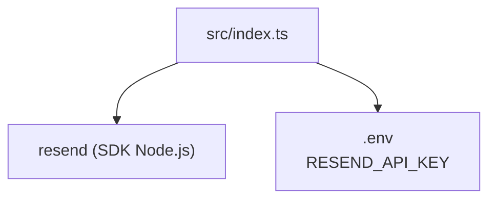

# Outil update_topic

<cite>
**Fichiers référencés dans ce document**
- [README.md](file://README.md)
- [package.json](file://package.json)
- [src/index.ts](file://src/index.ts)
</cite>

## Sommaire
1. [Introduction](#introduction)
2. [Structure du projet](#structure-du-projet)
3. [Composants principaux](#composants-principaux)
4. [Aperçu de l’architecture](#aperçu-de-larchitecture)
5. [Analyse détaillée des composants](#analyse-détaillée-des-composants)
6. [Analyse des dépendances](#analyse-des-dépendances)
7. [Considérations sur les performances](#considérations-sur-les-performances)
8. [Guide de dépannage](#guide-de-dépannage)
9. [Conclusion](#conclusion)
10. [Annexes](#annexes)

## Introduction
Cet outil permet de mettre à jour le nom d’un sujet d’abonnement existant dans l’API Resend. Il s’agit d’une opération simple qui modifie un seul attribut : le nom du sujet. Le présent document explique comment utiliser cet outil, les contraintes de validation, les retours attendus, ainsi que les impacts potentiels sur les abonnements et les campagnes associées. Des exemples de mises à jour fréquentes, de gestion des conflits et de bonnes pratiques sont également fournis.

## Structure du projet
Le projet est un serveur MCP complet couvrant l’ensemble de l’API Resend. L’outil update_topic fait partie de la collection d’outils liée aux sujets (topics), qui inclut également la création, la liste, la lecture et la suppression de sujets.

**Diagramme sources**
- [src/index.ts](file://src/index.ts#L881-L939)
- [package.json](file://package.json#L1-L49)
- [README.md](file://README.md#L105-L111)

**Section sources**
- [README.md](file://README.md#L105-L111)
- [package.json](file://package.json#L1-L49)
- [src/index.ts](file://src/index.ts#L881-L939)

## Composants principaux
- Outil update_topic : Met à jour le nom d’un sujet d’abonnement.
- Schéma d’entrée : identifiant du sujet et nouveau nom.
- Implémentation : requête PATCH vers l’API Resend pour modifier le sujet.

**Section sources**
- [src/index.ts](file://src/index.ts#L918-L927)

## Aperçu de l’architecture
L’outil update_topic est exposé comme un outil MCP. Lorsqu’un client MCP appelle update_topic, le serveur le route vers la fonction de gestion des outils, qui effectue une requête PATCH vers l’API Resend pour modifier le sujet.

**Diagramme sources**
- [src/index.ts](file://src/index.ts#L1456-L1464)
- [src/index.ts](file://src/index.ts#L1536-L1564)

## Analyse détaillée des composants

### Mise à jour d’un sujet (update_topic)
- Nom de l’outil : update_topic
- Description : Met à jour le nom d’un sujet d’abonnement.
- Entrées attendues :
  - topic_id : identifiant unique du sujet (chaîne de caractères)
  - name : nouveau nom du sujet (chaîne de caractères)
- Contraintes de validation :
  - Le champ topic_id est requis.
  - Le champ name est requis.
  - La longueur maximale du nom n’est pas explicitement définie dans le schéma de l’outil, mais elle est soumise aux contraintes de l’API Resend.
- Retours de succès :
  - Réponse de l’API Resend contenant les détails mis à jour du sujet.
- Retours d’erreur :
  - Erreur si l’identifiant du sujet est invalide ou inexistant.
  - Erreur si le nom est vide ou ne respecte pas les règles de l’API Resend.

Impact sur les abonnements et campagnes :
- Modifier le nom d’un sujet n’affecte pas les abonnements existants ni les campagnes associées. Les abonnés restent inscrits au sujet sous son ancien nom, et les campagnes utilisant ce sujet continuent de cibler ce sujet.
- Pour que les abonnés soient réaffectés à un nouveau nom de sujet, il faudrait supprimer le sujet actuel et recréer un nouveau sujet, puis réaffecter les abonnés. Cependant, cela impliquerait des changements manuels ou automatisés et pourrait impacter les statistiques de campagne.

Exemples fréquents de mises à jour :
- Renommer un sujet pour refléter un changement de catégorie de contenu (par exemple, de “Newsletter” à “Actualités”).
- Harmoniser le nommage des sujets selon une nomenclature interne (par exemple, uniformisation des majuscules/minuscules).
- Corriger une erreur de frappe dans le nom d’un sujet.

Gestion des conflits potentiels :
- Si plusieurs outils tentent de renommer le même sujet en même temps, l’API Resend traitera les requêtes séquentiellement. Pour éviter les conflits, il est recommandé de synchroniser les opérations de mise à jour via un système de verrouillage ou un processus orchestré.
- Si un autre outil supprime le sujet pendant qu’une mise à jour est en cours, la requête de mise à jour échouera avec une erreur indiquant que la ressource est introuvable.

Bonnes pratiques pour maintenir l’organisation des sujets :
- Utiliser un nommage clair et cohérent pour tous les sujets.
- Éviter de modifier fréquemment les noms des sujets pour minimiser les risques de confusion.
- Documenter les changements de nommage dans un registre centralisé.
- Effectuer les mises à jour en dehors des heures de pointe pour réduire les risques de conflits.

**Section sources**
- [src/index.ts](file://src/index.ts#L918-L927)
- [src/index.ts](file://src/index.ts#L1456-L1464)

### Schéma d’entrée de l’outil update_topic

**Diagramme sources**
- [src/index.ts](file://src/index.ts#L918-L927)
- [src/index.ts](file://src/index.ts#L1456-L1464)

## Analyse des dépendances
- Dépendance principale : bibliothèque Resend (SDK Node.js) pour gérer les appels API.
- Configuration de l’environnement : clé API Resend nécessaire pour authentifier les requêtes.
- Outils associés : create_topic, list_topics, get_topic, delete_topic.

**Diagramme sources**
- [src/index.ts](file://src/index.ts#L1-L7)
- [package.json](file://package.json#L32-L34)

**Section sources**
- [package.json](file://package.json#L32-L34)
- [src/index.ts](file://src/index.ts#L1-L7)

## Considérations sur les performances
- Le serveur MCP exécute des appels directs à l’API Resend. Le nombre de requêtes par seconde est limité par la limite de taux de l’API Resend.
- Pour éviter les erreurs de taux, il est conseillé de limiter les appels massifs à update_topic et de les regrouper si possible.

[Pas de sources supplémentaires car cette section fournit des conseils généraux sans analyse de fichiers spécifiques]

## Guide de dépannage
- Erreur d’authentification : vérifier que la variable d’environnement RESEND_API_KEY est définie.
- Erreur de validation : s’assurer que topic_id et name sont fournis.
- Erreur de ressource introuvable : le sujet peut avoir été supprimé ou mal référencé.
- Erreurs de taux : attendre avant de relancer les requêtes.

**Section sources**
- [README.md](file://README.md#L551-L569)
- [src/index.ts](file://src/index.ts#L1571-L1577)

## Conclusion
L’outil update_topic permet de modifier simplement le nom d’un sujet d’abonnement. Sa simplicité réduit les risques d’effets de bord, mais il est important de planifier les mises à jour pour éviter les conflits et de documenter les changements. En suivant les bonnes pratiques décrites, vous pouvez maintenir une organisation claire des sujets tout en minimisant les impacts sur les abonnés et les campagnes.

[Pas de sources supplémentaires car cette section résume sans analyser des fichiers spécifiques]

## Annexes
- Références de l’outil update_topic : [src/index.ts](file://src/index.ts#L918-L927)
- Implémentation de la route PATCH : [src/index.ts](file://src/index.ts#L1456-L1464)
- Modules de l’API Resend couverts : [README.md](file://README.md#L105-L111)

[No sources needed since this section doesn't analyze specific files]