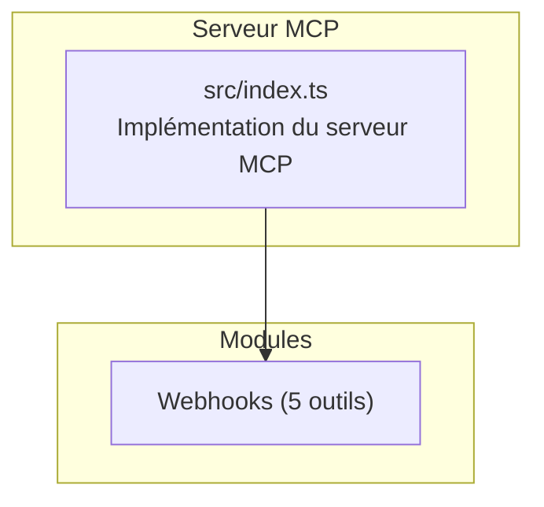
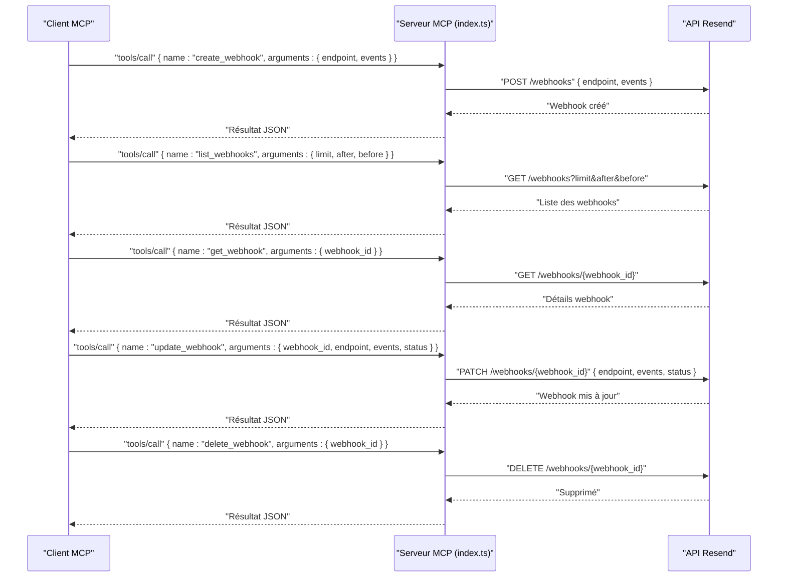
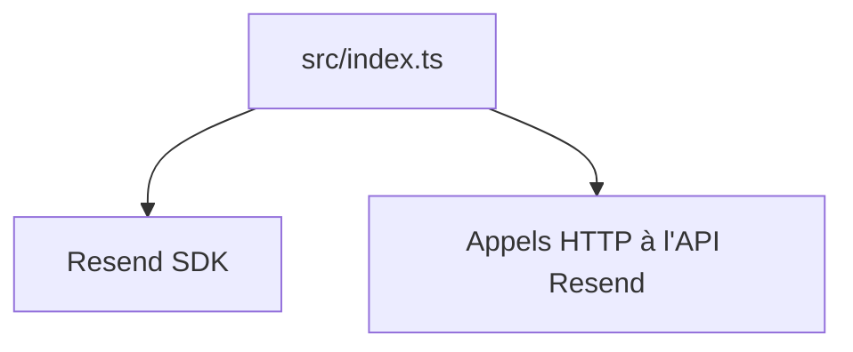

# Module Webhooks

<cite>
**Fichiers référencés dans ce document**
- [README.md](file://README.md)
- [package.json](file://package.json)
- [src/index.ts](file://src/index.ts)
</cite>

## Sommaire
1. [Introduction](#introduction)
2. [Structure du projet](#structure-du-projet)
3. [Composants principaux](#composants-principaux)
4. [Aperçu de l’architecture](#aperçu-de-l’architecture)
5. [Analyse détaillée des composants](#analyse-détaillée-des-composants)
6. [Analyse des dépendances](#analyse-des-dépendances)
7. [Considérations sur les performances](#considérations-sur-les-performances)
8. [Guide de dépannage](#guide-de-dépannage)
9. [Conclusion](#conclusion)

## Introduction
Ce document présente le module Webhooks de l’API Resend tel qu’exposé via le serveur Model Context Protocol (MCP) fourni par le projet. Le module permet de gérer les webhooks liés aux événements de messagerie (envoi, livraison, ouverture, clics, etc.). Il inclut cinq outils : create_webhook, list_webhooks, get_webhook, update_webhook, delete_webhook. Nous expliquons comment configurer des points de terminaison, spécifier les événements à surveiller, et supprimer un webhook. Nous présentons également les événements pris en charge, les bonnes pratiques de sécurité, et des scénarios d’utilisation pour le suivi en temps réel des emails.

## Structure du projet
Le projet est un serveur MCP qui expose l’ensemble de l’API Resend sous forme d’outils invocables. Le module Webhooks fait partie des 12 modules inclus, chacun avec ses outils associés.

**Diagramme sources**
- [src/index.ts](file://src/index.ts#L766-L830)

**Section sources**
- [README.md](file://README.md#L82-L87)
- [src/index.ts](file://src/index.ts#L766-L830)

## Composants principaux
Le module Webhooks comprend les outils suivants :
- create_webhook : créer un webhook pour recevoir des notifications d’événements de messagerie.
- list_webhooks : lister tous les webhooks configurés.
- get_webhook : récupérer les détails d’un webhook spécifique.
- update_webhook : modifier un webhook (URL, événements, statut).
- delete_webhook : supprimer un webhook.

Chaque outil est décrit dans le schéma d’entrée (inputSchema) qui précise les paramètres requis et optionnels.

**Section sources**
- [src/index.ts](file://src/index.ts#L766-L830)

## Aperçu de l’architecture
Le serveur MCP reçoit des requêtes via stdin, traite les appels d’outils, puis renvoie des réponses via stdout. Pour le module Webhooks, les appels sont traduits en requêtes HTTP vers l’API Resend.

**Diagramme sources**
- [src/index.ts](file://src/index.ts#L1358-L1398)
- [src/index.ts](file://src/index.ts#L1528-L1565)

## Analyse détaillée des composants

### Outils de gestion des webhooks
- create_webhook
  - Description : créer un webhook pour recevoir des notifications d’événements de messagerie.
  - Paramètres requis : endpoint, events.
  - Utilisation typique : configurer un endpoint HTTPS pour recevoir des événements comme email.delivered, email.bounced, email.opened, email.clicked, email.received, email.sent, email.delivery_delayed, email.complained.
  - Exemple d’appel : [Exemple d’appel](file://README.md#L363-L375)

- list_webhooks
  - Description : lister tous les webhooks configurés.
  - Paramètres optionnels : limit, after, before (pagination).
  - Utilité : audit de configuration, recherche d’un webhook spécifique.

- get_webhook
  - Description : récupérer les détails d’un webhook spécifique.
  - Paramètre requis : webhook_id.
  - Utilité : vérification de la configuration, diagnostic.

- update_webhook
  - Description : modifier un webhook (URL, événements, statut).
  - Paramètres requis : webhook_id.
  - Paramètres optionnels : endpoint, events, status (enabled/disabled).
  - Utilité : mise à jour dynamique de la configuration sans recréation.

- delete_webhook
  - Description : supprimer un webhook.
  - Paramètre requis : webhook_id.
  - Utilité : nettoyage de configuration obsolète, désactivation de notifications.

**Section sources**
- [src/index.ts](file://src/index.ts#L766-L830)
- [README.md](file://README.md#L82-L87)
- [README.md](file://README.md#L354-L375)

### Événements pris en charge
Les événements de messagerie suivants sont disponibles pour la souscription via les webhooks :
- email.sent
- email.delivered
- email.delivery_delayed
- email.complained
- email.bounced
- email.opened
- email.clicked
- email.received

Ces événements permettent de suivre en temps réel l’état d’une campagne email, d’activer des actions automatisées (ex. : relance, suppression de destinataire, analyse de comportement), et de maintenir des rapports précis.

**Section sources**
- [README.md](file://README.md#L89-L97)

### Bonnes pratiques de sécurité
- Toujours utiliser des URLs HTTPS pour les endpoints de webhooks.
- Valider les signatures des webhooks si elles sont fournies par l’API Resend.
- Mettre en place des mécanismes de rate limiting côté serveur pour éviter les abus.
- Stocker les secrets de validation (si utilisés) de manière sécurisée (variables d’environnement).
- Effectuer des audits réguliers des webhooks actifs.
- Limiter les événements à ceux nécessaires pour réduire le volume de trafic.

**Section sources**
- [README.md](file://README.md#L503-L509)

### Scénarios d’utilisation
- Suivi en temps réel des livraisons : créer un webhook avec email.delivered et email.bounced pour alerter l’équipe de support.
- Analyse du comportement des utilisateurs : souscrire à email.opened et email.clicked pour enrichir les données analytics.
- Gestion des retours indésirables : utiliser email.complained pour mettre à jour les listes de non-prospection.
- Gestion des erreurs de livraison : email.bounced et email.delivery_delayed pour rediriger ou relancer.
- Traitement des emails entrants : email.received pour intégrer des flux de réponse clients.

**Section sources**
- [README.md](file://README.md#L354-L375)

## Analyse des dépendances
Le serveur MCP repose sur :
- La bibliothèque Resend pour l’accès à certaines ressources (par exemple, domaines, audiences, contacts, etc.) via l’SDK.
- Des appels HTTP directs à l’API Resend pour les opérations non couvertes par l’SDK, notamment les webhooks.

**Diagramme sources**
- [src/index.ts](file://src/index.ts#L1-L7)
- [src/index.ts](file://src/index.ts#L1008-L1522)

**Section sources**
- [src/index.ts](file://src/index.ts#L1-L7)
- [src/index.ts](file://src/index.ts#L1008-L1522)

## Considérations sur les performances
- Le serveur MCP respecte les limites de taux définies par l’API Resend (par défaut 2 requêtes/seconde). Cela implique que les appels d’outils doivent être gérés avec attention pour éviter les erreurs de type 429 Too Many Requests.
- Pour les webhooks, il est recommandé de traiter les notifications de manière asynchrone (file d’attente, traitement différé) afin de ne pas bloquer le traitement des autres événements.

**Section sources**
- [README.md](file://README.md#L518-L526)

## Guide de dépannage
- Erreur d’authentification : si l’environnement RESEND_API_KEY n’est pas défini, le serveur affiche un message d’erreur. Vérifiez votre fichier .env.
- Erreur d’exécution d’un outil : le serveur renvoie un message d’erreur contenant le nom de l’outil et ses arguments. Utilisez cette information pour diagnostiquer les problèmes de paramètres.
- Erreurs standards de l’API Resend : le serveur retourne des messages d’erreur détaillés pour les cas courants (non-autorisé, mauvaise requête, ressource introuvable, dépassement de limite de taux, erreur serveur).

**Section sources**
- [README.md](file://README.md#L528-L549)
- [src/index.ts](file://src/index.ts#L1571-L1577)
- [src/index.ts](file://src/index.ts#L1552-L1563)

## Conclusion
Le module Webhooks du serveur MCP Resend offre une interface simple et fiable pour gérer les notifications d’événements liés à la messagerie. Grâce aux cinq outils proposés, vous pouvez créer, lister, interroger, mettre à jour et supprimer des webhooks, en souscrivant aux événements pertinents pour votre application. En appliquant les bonnes pratiques de sécurité et en adoptant des scénarios d’utilisation adaptés, vous pouvez bénéficier d’un suivi en temps réel des emails avec fiabilité et efficacité.