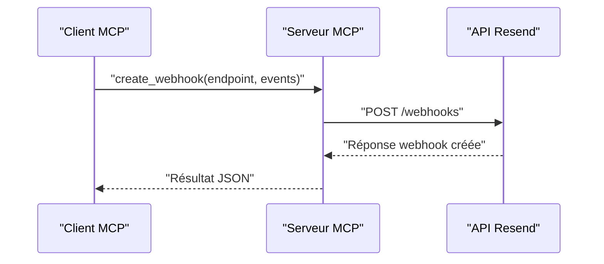

# Outil create_webhook

<cite>
**Fichiers référencés dans ce document**
- [README.md](file://README.md)
- [package.json](file://package.json)
- [src/index.ts](file://src/index.ts)
- [.env.example](file://.env.example)
</cite>

## Sommaire
1. [Introduction](#introduction)
2. [Objectif de l’outil](#objectif-de-loutil)
3. [Paramètres d’entrée requis](#paramètres-dentrée-requis)
4. [Événements disponibles](#événements-disponibles)
5. [Exemples concrets de configuration](#exemples-concrets-de-configuration)
6. [Réponses attendues](#réponses-attendues)
7. [Codes d’erreur possibles](#codes-derreur-possibles)
8. [Scénarios d’utilisation courants](#scénarios-dutilisation-courants)
9. [Bonnes pratiques de sécurité pour les URLs webhook](#bonnes-pratiques-de-sécurité-pour-les-urls-webhook)
10. [Architecture de l’outil](#architecture-de-loutil)
11. [Conclusion](#conclusion)

## Introduction
L’outil create_webhook permet de créer un nouveau webhook endpoint via l’API Resend. Il s’agit d’un composant clé de la plateforme Resend pour recevoir en temps réel des notifications sur l’état des emails envoyés (livraison, ouverture, clics, etc.). Ce document explique comment utiliser cet outil, quels sont ses paramètres, les événements disponibles, les réponses attendues, les codes d’erreur possibles, ainsi que les bonnes pratiques de sécurité.

## Objectif de l’outil
Créer un webhook endpoint qui reçoit des événements liés aux emails envoyés (par exemple, email.delivered, email.opened, email.clicked, etc.) afin de permettre à votre application de réagir automatiquement à ces événements.

## Paramètres d’entrée requis
L’outil create_webhook nécessite deux paramètres obligatoires :
- endpoint : URL HTTPS vers laquelle Resend enverra les événements.
- events : tableau contenant les événements auxquels vous souhaitez souscrire.

**Section sources**
- [src/index.ts](file://src/index.ts#L766-L782)

## Événements disponibles
Voici la liste complète des événements pris en charge par Resend pour les webhooks :

- email.sent : L’email a été accepté par Resend
- email.delivered : L’email a été livré avec succès
- email.delivery_delayed : La livraison est retardée
- email.complained : Le destinataire a signalé un pourriel
- email.bounced : L’email a rebondi
- email.opened : Le destinataire a ouvert l’email
- email.clicked : Le destinataire a cliqué sur un lien
- email.received : Un email entrant a été reçu

Ces événements sont documentés dans le dépôt et servent de base à la configuration de vos webhooks.

**Section sources**
- [README.md](file://README.md#L89-L98)

## Exemples concrets de configuration
Voici quelques cas d’usage typiques pour configurer des webhooks avec l’outil create_webhook :

- Suivi des livraisons : créer un webhook pour les événements email.delivered et email.bounced
- Suivi des ouvertures : créer un webhook pour l’événement email.opened
- Suivi des clics : créer un webhook pour l’événement email.clicked
- Suivi complet : créer un webhook pour tous les événements ci-dessus

Pour chaque configuration, vous devez fournir l’URL de votre endpoint HTTPS et le tableau des événements souhaités.

**Section sources**
- [README.md](file://README.md#L354-L376)
- [src/index.ts](file://src/index.ts#L766-L782)

## Réponses attendues
Lorsque l’appel à create_webhook réussit, la réponse renvoyée contient les informations de configuration du webhook nouvellement créé. Elle inclut généralement l’identifiant du webhook, l’URL de l’endpoint, la liste des événements souscrits, et le statut (activé/désactivé).

La réponse est retournée au format JSON par l’API Resend. Votre serveur MCP transmet cette réponse telle quelle au client MCP.

**Section sources**
- [src/index.ts](file://src/index.ts#L1359-L1366)

## Codes d’erreur possibles
Voici les codes d’erreur les plus fréquents lors de l’utilisation de l’outil create_webhook, basés sur la documentation de l’API Resend :

- 400 Bad Request : Paramètres invalides ou manquants (par exemple, endpoint ou events absents)
- 401 Unauthorized : Clé API invalide ou manquante
- 403 Forbidden : Permissions insuffisantes
- 404 Not Found : Ressource non trouvée
- 409 Conflict : Conflit (par exemple, webhook déjà existant)
- 422 Unprocessable Entity : Données valides mais incorrectes (par exemple, URL non conforme)
- 429 Too Many Requests : Limite de taux atteinte
- 500 Internal Server Error : Erreur interne du service Resend
- 503 Service Unavailable : Service temporairement indisponible

**Section sources**
- [README.md](file://README.md#L528-L549)

## Scénarios d’utilisation courants
Voici des scénarios courants où l’utilisation de create_webhook est pertinente :

- Suivi des livraisons : Mettre à jour l’état d’un email dans votre base de données dès qu’il est livré ou qu’il rebondit.
- Analyse de l’engagement : Enregistrer les ouvertures et clics pour alimenter des rapports d’analyse.
- Gestion des signalements : Désinscrire les utilisateurs qui signalent un pourriel.
- Automatisation marketing : Déclencher des actions supplémentaires (par exemple, envoyer un email de rappel si l’ouverture est faible).

Ces scénarios reposent sur la réception des événements email.delivered, email.bounced, email.opened, email.clicked, etc.

**Section sources**
- [README.md](file://README.md#L89-L98)

## Bonnes pratiques de sécurité pour les URLs webhook
Pour sécuriser vos endpoints webhook, suivez ces recommandations :

- Utilisez toujours des URLs HTTPS
- Implémentez une validation de signature des requêtes webhook (signature HMAC)
- Stockez un secret partagé entre Resend et votre serveur
- Mettez en place un rate limiting sur votre endpoint
- Loguez toutes les requêtes webhook pour audit
- N’autorisez pas les requêtes sans authentification
- Vérifiez que l’URL de l’endpoint est accessible depuis internet
- Testez votre endpoint avant de le configurer dans Resend

Ces bonnes pratiques sont explicitement mentionnées dans la documentation du projet.

**Section sources**
- [README.md](file://README.md#L503-L509)

## Architecture de l’outil
L’outil create_webhook fait partie de l’implémentation MCP complète de l’API Resend. Voici comment il s’intègre dans l’architecture globale :

- L’outil est défini dans la liste des outils MCP avec son schéma d’entrée
- L’exécution de l’outil effectue un appel HTTP à l’API Resend pour créer le webhook
- Le serveur MCP retourne la réponse de l’API Resend au client MCP

**Diagram sources**
- [src/index.ts](file://src/index.ts#L766-L782)
- [src/index.ts](file://src/index.ts#L1359-L1366)

## Conclusion
L’outil create_webhook vous permet de configurer facilement des notifications en temps réel sur l’état de vos emails envoyés. En spécifiant l’URL de votre endpoint HTTPS et la liste des événements souhaités, vous pouvez automatiser des workflows liés à la livraison, à l’engagement et à la gestion des destinataires. Respectez les bonnes pratiques de sécurité pour protéger vos endpoints webhook et gérez les erreurs possibles selon les codes documentés.