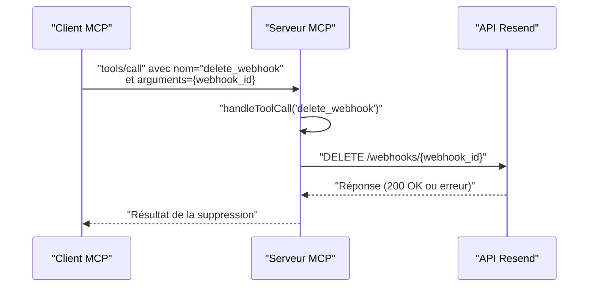

# Outil delete_webhook

<cite>
**Fichiers référencés dans ce document**
- [README.md](file://README.md)
- [package.json](file://package.json)
- [src/index.ts](file://src/index.ts)
- [.env.example](file://.env.example)
- [skills/resend-expert/SKILL.md](file://skills/resend-expert/SKILL.md)
</cite>

## Sommaire
1. [Introduction](#introduction)
2. [Objectif de l’outil](#objectif-de-loutil)
3. [Paramètres d’entrée](#paramètres-dentrée)
4. [Implications de la suppression](#implications-de-la-suppression)
5. [Exemples d’utilisation](#exemples-dutilisation)
6. [Gestion des erreurs](#gestion-des-erreurs)
7. [Bonnes pratiques de suppression sécurisée](#bonnes-pratiques-de-suppression-sécurisée)
8. [Impact sur les événements non traités](#impact-sur-les-événements-non-traités)
9. [Stratégies de nettoyage des configurations](#stratégies-de-nettoyage-des-configurations)
10. [Architecture de l’outil](#architecture-de-loutil)
11. [Conclusion](#conclusion)

## Introduction
Cet outil permet de supprimer définitivement un webhook de votre compte Resend à travers le Model Context Protocol (MCP). Il s’agit d’une opération irréversible qui retire immédiatement la configuration de webhook de votre compte, empêchant ainsi Resend de transmettre les événements d’email aux endpoints configurés.

## Objectif de l’outil
Supprimer un webhook identifié par son identifiant unique, afin de :
- Arrêter la réception d’événements pour ce webhook
- Libérer les ressources liées à la configuration
- Nettoyer les configurations obsolètes ou mal configurées

## Paramètres d’entrée
- webhook_id (chaîne de caractères, requis)
  - Identifiant unique du webhook à supprimer
  - Doit correspondre à un webhook existant dans votre compte Resend

**Section sources**
- [src/index.ts](file://src/index.ts#L821-L830)

## Implications de la suppression
- Suppression immédiate : Le webhook est retiré de la configuration Resend
- Fin de transmission : Aucun événement ne sera envoyé à l’endpoint configuré
- Impact sur les événements : Les événements non encore traités restent dans la file d’attente de Resend, mais ne seront plus transmis au webhook supprimé
- Répercussions : Si d’autres webhooks sont configurés pour les mêmes événements, ils continueront à recevoir les notifications

## Exemples d’utilisation
Voici des scénarios courants de suppression de webhooks :

- Suppression d’un webhook obsolète
  - Utilisez l’identifiant du webhook obsolète pour effectuer la suppression
  - Vérifiez que l’endpoint associé n’est plus utilisé

- Suppression d’un webhook mal configuré
  - Si l’endpoint est inaccessible ou mal implémenté, supprimez-le pour éviter les erreurs de transmission
  - Recréez un webhook avec un endpoint valide et sécurisé

- Nettoyage de configuration après migration
  - Après avoir migré vers un nouveau système de traitement des webhooks, supprimez les anciens webhooks

**Section sources**
- [README.md](file://README.md#L82-L87)
- [README.md](file://README.md#L354-L375)

## Gestion des erreurs
Lorsque le webhook n’existe plus ou qu’il est introuvable, l’outil renvoie une erreur indiquant la cause de l’échec. Voici les cas fréquents :

- Erreur 404 Not Found
  - Cause : Le webhook_id fourni n’existe pas
  - Action : Vérifiez l’identifiant ou recréez le webhook

- Erreur 401 Unauthorized
  - Cause : Clé API invalide ou manquante
  - Action : Vérifiez la configuration de la clé API

- Erreur 403 Forbidden
  - Cause : Permissions insuffisantes
  - Action : Utilisez une clé API avec les droits nécessaires

- Erreur 429 Too Many Requests
  - Cause : Trop de requêtes en cours
  - Action : Attendez avant de réessayer

- Erreur 500/503
  - Cause : Problème temporaire du service Resend
  - Action : Réessayez plus tard

**Section sources**
- [README.md](file://README.md#L528-L549)
- [README.md](file://README.md#L551-L568)

## Bonnes pratiques de suppression sécurisée
- Vérification préalable
  - Liste des webhooks actifs avant suppression
  - Validation de l’identifiant fourni

- Planification de maintenance
  - Effectuez la suppression pendant une période de faible trafic
  - Prévenez les équipes de développement concernées

- Tests de validation
  - Confirmez qu’aucun événement n’est plus transmis
  - Vérifiez que les endpoints alternatifs fonctionnent

- Audit et traçabilité
  - Enregistrez l’opération de suppression
  - Documentez les raisons de la suppression

- Sécurité
  - Utilisez des endpoints HTTPS
  - Implémentez la vérification des signatures des webhooks
  - Limitez les accès à l’endpoint

**Section sources**
- [README.md](file://README.md#L503-L509)
- [skills/resend-expert/SKILL.md](file://skills/resend-expert/SKILL.md#L677-L889)

## Impact sur les événements non traités
- Événements en attente : Les événements non encore livrés restent dans la file d’attente de Resend
- Livraison arrêtée : Une fois supprimé, le webhook ne recevra plus d’événements
- Stratégie de traitement : Si vous devez conserver les événements, envisagez de désactiver plutôt que de supprimer, ou de migrer vers un nouveau webhook

## Stratégies de nettoyage des configurations
- Nettoyage régulier
  - Supprimez les webhooks inutilisés
  - Archivez les configurations obsolètes

- Migration contrôlée
  - Créez un nouveau webhook avant de supprimer l’ancien
  - Testez la nouvelle configuration

- Surveillance continue
  - Surveillez les erreurs de livraison
  - Mettez à jour les endpoints en cas de changement

**Section sources**
- [README.md](file://README.md#L82-L87)

## Architecture de l’outil
L’outil delete_webhook fait partie de l’ensemble des outils de gestion des webhooks. Il est exposé via le protocole MCP et exécute une requête HTTP DELETE vers l’API Resend.

**Diagram sources**
- [src/index.ts](file://src/index.ts#L1392-L1398)

**Section sources**
- [src/index.ts](file://src/index.ts#L821-L830)
- [src/index.ts](file://src/index.ts#L1392-L1398)

## Conclusion
L’outil delete_webhook permet de supprimer définitivement un webhook de votre compte Resend. Pour garantir une suppression sécurisée, il est essentiel de valider l’identifiant, de planifier la suppression, de surveiller les erreurs et de mettre en œuvre des bonnes pratiques de nettoyage. En cas d’incertitude, préférez la désactivation temporaire ou la mise à jour de la configuration plutôt que la suppression immédiate.