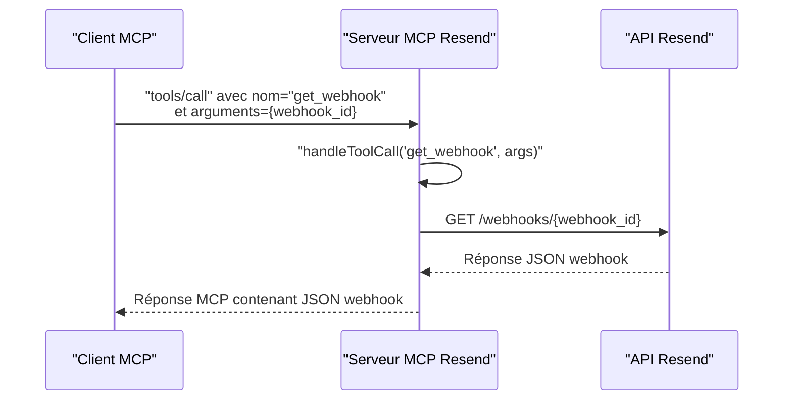

# Outil get_webhook

<cite>
**Fichiers référencés dans ce document**
- [README.md](file://README.md)
- [package.json](file://package.json)
- [src/index.ts](file://src/index.ts)
</cite>

## Sommaire
1. [Introduction](#introduction)
2. [Objectif de l’outil](#objectif-de-loutil)
3. [Paramètres d’entrée](#paramètres-dentrée)
4. [Réponse détaillée](#réponse-détaillée)
5. [Exemples de réponse](#exemples-de-réponse)
6. [Cas d’utilisation](#cas-dutilisation)
7. [Diagnostic et validation](#diagnostic-et-validation)
8. [Erreurs possibles](#erreurs-possibles)
9. [Architecture et flux de traitement](#architecture-et-flux-de-traitement)
10. [Conclusion](#conclusion)

## Introduction
Cet outil permet de récupérer les détails d’un webhook spécifique à partir de son identifiant. Il fait partie de l’ensemble des outils de gestion des webhooks fournis par le serveur MCP Resend, qui expose l’intégralité de l’API Resend sous forme d’outils invocables. Grâce à cet outil, vous pouvez valider la configuration d’un webhook existant, vérifier ses événements configurés, son état (activé/désactivé), ainsi que ses métadonnées.

## Objectif de l’outil
Récupérer la configuration complète d’un webhook Resend identifié par son identifiant unique. Cela inclut :
- L’URL de l’endpoint
- La liste des événements configurés
- L’état du webhook (activé/désactivé)
- Les métadonnées liées au webhook

## Paramètres d’entrée
- webhook_id (chaîne de caractères, requis)
  - Description : Identifiant unique du webhook à récupérer
  - Exemple : "wh_1234567890abcdef"

**Section sources**
- [src/index.ts](file://src/index.ts#L795-L805)

## Réponse détaillée
L’appel à l’outil retourne une réponse structurée contenant les éléments suivants :
- endpoint (chaîne de caractères)
  - URL de l’endpoint webhook
- events (tableau de chaînes de caractères)
  - Liste des événements configurés pour ce webhook
- status (chaîne de caractères)
  - État du webhook ("enabled" ou "disabled")
- id (chaîne de caractères)
  - Identifiant unique du webhook
- created_at (date/heure)
  - Date de création du webhook
- updated_at (date/heure)
  - Date de dernière mise à jour

**Section sources**
- [src/index.ts](file://src/index.ts#L1377-L1380)

## Exemples de réponse
Voici un exemple de réponse complète retournée par l’outil (format texte brut pour l’affichage MCP) :

{
  "id": "wh_1234567890abcdef",
  "endpoint": "https://votre-domaine.com/webhooks/resend",
  "events": ["email.delivered", "email.bounced", "email.opened"],
  "status": "enabled",
  "created_at": "2026-01-15T10:30:00Z",
  "updated_at": "2026-01-15T10:30:00Z"
}

Autre exemple avec un webhook désactivé :

{
  "id": "wh_fedcba0987654321",
  "endpoint": "https://autre-domaine.com/webhooks/resend",
  "events": ["email.sent", "email.complained"],
  "status": "disabled",
  "created_at": "2026-01-10T09:15:00Z",
  "updated_at": "2026-01-12T14:22:00Z"
}

**Section sources**
- [src/index.ts](file://src/index.ts#L1377-L1380)

## Cas d’utilisation
- Validation de la configuration d’un webhook existant avant de commencer à recevoir des événements
- Vérification de l’état d’un webhook (activé/désactivé) pour diagnostiquer les problèmes de livraison
- Contrôle de la liste des événements configurés pour s’assurer qu’elle correspond aux besoins
- Audit des webhooks créés (dates de création et de mise à jour)

## Diagnostic et validation
- Vérifiez l’état du webhook : si status est "disabled", activez-le via l’outil update_webhook
- Confirmez l’endpoint : assurez-vous qu’il est accessible et sécurisé (HTTPS)
- Validez les événements : comparez la liste des événements configurés avec celle attendue
- Testez la réception : envoyez un test d’événement depuis l’interface Resend pour valider la connexion

## Erreurs possibles
- Erreur d’authentification
  - Message : "Tool execution failed: 401 Unauthorized"
  - Cause : clé API manquante ou invalide
- Erreur de ressource introuvable
  - Message : "Tool execution failed: 404 Not Found"
  - Cause : webhook_id inexistant
- Erreur de validation
  - Message : "Tool execution failed: 400 Bad Request"
  - Cause : webhook_id mal formé ou absent
- Erreur de serveur
  - Message : "Tool execution failed: 500 Internal Server Error"
  - Cause : problème temporaire du service Resend

**Section sources**
- [README.md](file://README.md#L528-L549)
- [src/index.ts](file://src/index.ts#L1519-L1522)

## Architecture et flux de traitement
Le serveur MCP Resend implémente un protocole basé sur stdin/stdout. Voici le flux pour l’outil get_webhook :

**Diagram sources**
- [src/index.ts](file://src/index.ts#L1377-L1380)
- [src/index.ts](file://src/index.ts#L1536-L1564)

## Conclusion
L’outil get_webhook permet de récupérer rapidement et de manière fiable la configuration complète d’un webhook Resend. En combinant cette information avec des outils de mise à jour et de suppression, vous pouvez gérer efficacement vos webhooks, diagnostiquer les problèmes de configuration et valider leur bon fonctionnement.