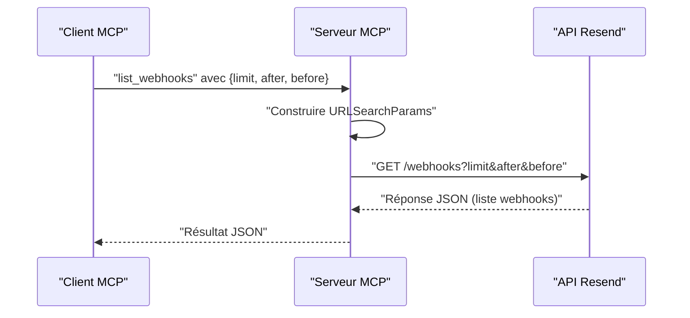

# Outil list_webhooks

<cite>
**Fichiers référencés dans ce document**
- [README.md](file://README.md)
- [package.json](file://package.json)
- [src/index.ts](file://src/index.ts)
- [.env.example](file://.env.example)
</cite>

## Sommaire
1. [Introduction](#introduction)
2. [Contexte et objectif](#contexte-et-objectif)
3. [Prérequis et configuration](#prérequis-et-configuration)
4. [Paramètres de l’outil list_webhooks](#paramètres-de-l-outil-list_webhooks)
5. [Format de réponse](#format-de-réponse)
6. [Gestion de la pagination](#gestion-de-la-pagination)
7. [Exemples de requêtes](#exemples-de-requêtes)
8. [Cas d’utilisation](#cas-d-utilisation)
9. [Architecture technique](#architecture-technique)
10. [Conclusion](#conclusion)

## Introduction
Cet outil permet de récupérer la liste complète des webhooks configurés dans votre compte Resend. Il est intégré au serveur MCP complet couvrant toutes les fonctionnalités de l’API Resend. Grâce à lui, vous pouvez :
- Obtenir tous vos webhooks avec pagination
- Filtrer par date de création (en utilisant les curseurs after/before)
- Gérer les réponses paginées
- Identifier l’état d’un webhook (activé/désactivé)

## Contexte et objectif
Le serveur MCP expose 70+ outils couvrant tous les modules de l’API Resend. L’outil list_webhooks fait partie de la famille des webhooks et permet de lister les endpoints configurés pour recevoir des événements liés aux emails (livraison, ouverture, clics, etc.).

**Section sources**
- [README.md](file://README.md#L82-L87)

## Prérequis et configuration
- Une clé API Resend valide est requise.
- Le serveur s’exécute via MCP (par exemple Claude Desktop, Continue, Cline, etc.).
- L’environnement doit contenir la variable d’environnement RESEND_API_KEY.

**Section sources**
- [.env.example](file://.env.example#L1-L6)
- [README.md](file://README.md#L17-L21)

## Paramètres de l’outil list_webhooks
L’outil list_webhooks prend en charge les paramètres suivants :

- limit : nombre maximal d’éléments à retourner (entier). Utilisé pour limiter la taille de la réponse.
- after : curseur pour obtenir les éléments suivants (chaîne de caractères). Utile pour la pagination avant.
- before : curseur pour obtenir les éléments précédents (chaîne de caractères). Utile pour la pagination après.

Ces trois paramètres sont optionnels. Si aucun n’est fourni, le comportement par défaut de l’API Resend s’applique.

**Section sources**
- [src/index.ts](file://src/index.ts#L783-L794)

## Format de réponse
La réponse retournée par l’outil list_webhooks est au format JSON. Elle contient la liste des webhooks configurés dans votre compte Resend. Chaque webhook inclut généralement :
- Son identifiant unique
- L’URL de destination (endpoint)
- La liste des événements souscrits
- Son statut (activé/désactivé)
- Les métadonnées de création

Remarque : le schéma exact peut varier selon l’API Resend. Pour des détails précis, consultez la documentation officielle de l’API Resend.

**Section sources**
- [src/index.ts](file://src/index.ts#L1368-L1375)

## Gestion de la pagination
L’outil supporte la pagination basée sur des curseurs (after/before) et un nombre limité d’éléments (limit). Voici comment cela fonctionne dans le code :

- Construction d’une chaîne de requête (URLSearchParams) à partir des paramètres fournis
- Envoi d’une requête GET vers l’API Resend
- Récupération et retour de la réponse JSON

Implémentation dans le code :
- Construction des paramètres de pagination
- Ajout des paramètres limit, after, before si présents
- Appel de l’API webhooks
- Retour de la réponse

**Section sources**
- [src/index.ts](file://src/index.ts#L1368-L1375)

## Exemples de requêtes
Voici des exemples de requêtes que vous pouvez envoyer via l’outil list_webhooks. Ces exemples illustrent l’utilisation des paramètres limit, after, before.

- Récupérer les 20 premiers webhooks créés plus récemment
  - Paramètres : limit=20
  - Utilisez le curseur pour aller plus loin si nécessaire

- Récupérer les webhooks créés avant un certain moment
  - Paramètres : before=<curseur>

- Récupérer les webhooks créés après un certain moment
  - Paramètres : after=<curseur>

- Récupérer les webhooks en paginant par tranches de 50
  - Paramètres : limit=50

Astuce : Pour trier par date de création, combinez limit avec after/before pour naviguer dans l’ordre chronologique inverse (les plus récents d’abord). Pour accéder aux éléments plus anciens, utilisez le curseur fourni dans la réponse.

**Section sources**
- [src/index.ts](file://src/index.ts#L1368-L1375)

## Cas d’utilisation
Voici quelques cas d’utilisation courants de l’outil list_webhooks :

- Surveillance des webhooks : vérifier régulièrement l’état des endpoints (enabled/disabled) et leur conformité aux événements attendus.
- Audit et traçabilité : conserver un historique des webhooks configurés, identifier les anciens ou inactifs.
- Maintenance : détecter les webhooks redondants ou obsolètes, planifier leur suppression.
- Intégration continue : automatiser la synchronisation de la configuration des webhooks entre environnements (développement, staging, production).
- Sécurité : valider que seuls les endpoints légitimes sont configurés, et qu’aucun webhook non autorisé n’est présent.

**Section sources**
- [README.md](file://README.md#L89-L98)

## Architecture technique
L’outil list_webhooks est implémenté comme suit dans le serveur MCP Resend :

- Définition de l’outil : schéma d’entrée avec limit, after, before
- Gestion de l’appel : construction de la requête HTTP vers l’API Resend
- Pagination : utilisation de URLSearchParams pour ajouter les paramètres de pagination
- Réponse : retour de la réponse JSON brute de l’API

**Diagram sources**
- [src/index.ts](file://src/index.ts#L783-L794)
- [src/index.ts](file://src/index.ts#L1368-L1375)

**Section sources**
- [src/index.ts](file://src/index.ts#L783-L794)
- [src/index.ts](file://src/index.ts#L1368-L1375)

## Conclusion
L’outil list_webhooks vous permet de gérer efficacement la liste de vos webhooks Resend. Grâce à la pagination par curseurs et à la possibilité de limiter le nombre d’éléments retournés, vous pouvez facilement surveiller, auditer et maintenir vos configurations webhook. Combinez ces capacités avec les autres outils de la suite Resend pour automatiser et sécuriser votre flux de notifications d’événements email.