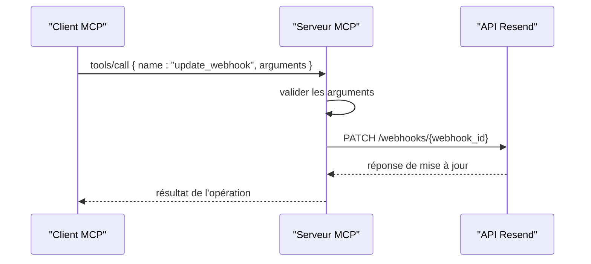
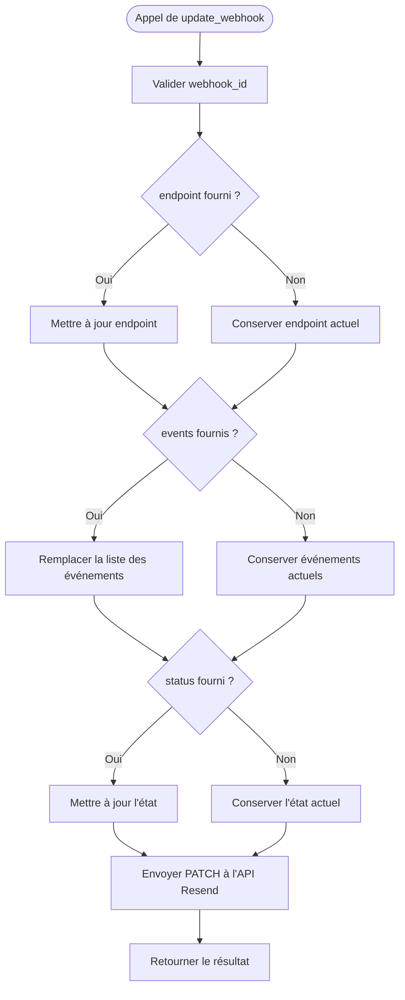

# Outil update_webhook

<cite>
**Fichiers référencés dans ce document**
- [README.md](file://README.md)
- [package.json](file://package.json)
- [src/index.ts](file://src/index.ts)
</cite>

## Sommaire
1. [Introduction](#introduction)
2. [Objectif de l’outil](#objectif-de-loutil)
3. [Paramètres modifiables](#paramètres-modifiables)
4. [Exemples d’utilisation](#exemples-dutilisation)
5. [Mise à jour incrémentale](#mise-à-jour-incrémentale)
6. [Gestion des erreurs](#gestion-des-erreurs)
7. [Bonnes pratiques](#bonnes-pratiques)
8. [Architecture de l’outil](#architecture-de-loutil)
9. [Conclusion](#conclusion)

## Introduction
Cet outil permet de modifier la configuration d’un webhook Resend existant. Il fait partie de l’ensemble des outils fournis par le serveur MCP complet de Resend, couvrant 12 modules et plus de 70 outils. L’outil update_webhook vous permet de :
- Mettre à jour l’URL de l’endpoint
- Modifier la liste des événements souscrits
- Activer ou désactiver un webhook

Il est conçu pour être utilisé via un client MCP compatible, comme Claude Desktop, Continue, Cline, etc.

## Objectif de l’outil
Modifier la configuration d’un webhook Resend existant à partir de son identifiant, tout en maintenant la disponibilité du service et en minimisant les interruptions.

## Paramètres modifiables
Voici les paramètres que vous pouvez mettre à jour avec l’outil update_webhook :

- webhook_id
  - Type : chaîne de caractères
  - Obligatoire : oui
  - Description : Identifiant unique du webhook à modifier

- endpoint
  - Type : chaîne de caractères
  - Obligatoire : non
  - Description : Nouvelle URL de l’endpoint webhook. Si omis, l’endpoint actuel est conservé.

- events
  - Type : tableau de chaînes de caractères
  - Obligatoire : non
  - Description : Liste des événements auxquels le webhook est abonné. Si omis, la liste actuelle est conservée.

- status
  - Type : chaîne de caractères
  - Valeurs autorisées : enabled, disabled
  - Obligatoire : non
  - Description : État du webhook. Si omis, l’état actuel est conservé.

**Section sources**
- [src/index.ts](file://src/index.ts#L807-L819)

## Exemples d’utilisation

### Exemple 1 : Mettre à jour l’URL de l’endpoint
- Objectif : Changer l’endpoint vers une nouvelle URL
- Paramètres : webhook_id, endpoint
- Effet : Seul l’endpoint est mis à jour, les événements et l’état restent inchangés

**Section sources**
- [src/index.ts](file://src/index.ts#L807-L819)

### Exemple 2 : Modifier les événements souscrits
- Objectif : Remplacer la liste des événements par une nouvelle liste
- Paramètres : webhook_id, events
- Effet : La liste des événements est remplacée par celle fournie

**Section sources**
- [src/index.ts](file://src/index.ts#L807-L819)

### Exemple 3 : Basculer entre activé/désactivé
- Objectif : Désactiver temporairement un webhook
- Paramètres : webhook_id, status
- Effet : Le webhook est désactivé (aucun événement ne sera envoyé)

**Section sources**
- [src/index.ts](file://src/index.ts#L807-L819)

### Exemple 4 : Mise à jour combinée
- Objectif : Mettre à jour l’endpoint ET modifier les événements
- Paramètres : webhook_id, endpoint, events
- Effet : L’endpoint est mis à jour, puis la liste des événements est remplacée

**Section sources**
- [src/index.ts](file://src/index.ts#L807-L819)

## Mise à jour incrémentale
L’outil update_webhook effectue une mise à jour partielle (PATCH) de la configuration du webhook. Vous pouvez donc :
- Mettre à jour uniquement l’endpoint
- Mettre à jour uniquement la liste des événements
- Mettre à jour uniquement l’état
- Combiner plusieurs modifications en une seule requête

Cela permet de faire des mises à jour ciblées sans affecter les autres paramètres.

**Section sources**
- [src/index.ts](file://src/index.ts#L1382-L1390)

## Gestion des erreurs
Lors de l’exécution de l’outil update_webhook, plusieurs types d’erreurs peuvent survenir :

- Erreur d’authentification
  - Cause : Clé API manquante ou invalide
  - Symptôme : Message d’erreur indiquant une erreur d’autorisation
  - Résolution : Vérifiez votre clé API Resend

- Erreur de validation
  - Cause : Paramètres incorrects (format d’URL, événements invalides, valeur de statut incorrecte)
  - Symptôme : Message d’erreur de validation
  - Résolution : Corrigez les paramètres selon le schéma attendu

- Ressource introuvable
  - Cause : webhook_id inexistant
  - Symptôme : Erreur 404
  - Résolution : Vérifiez l’identifiant du webhook

- Erreur de serveur
  - Cause : Problème temporaire du service Resend
  - Symptôme : Erreur 5xx
  - Résolution : Réessayez plus tard

**Section sources**
- [README.md](file://README.md#L528-L549)
- [src/index.ts](file://src/index.ts#L1519-L1522)

## Bonnes pratiques
Pour effectuer des mises à jour de configuration de manière sécurisée et continue :

- Planifier les mises à jour pendant les périodes creuses
- Tester les nouveaux endpoints avant de les activer
- Utiliser des endpoints HTTPS et sécurisés
- Mettre à jour progressivement plutôt que de modifier plusieurs webhooks en même temps
- Conserver des sauvegardes des configurations actuelles
- Surveiller les logs pour détecter rapidement les erreurs
- Utiliser des événements ciblés pour réduire le volume de trafic
- Vérifier la disponibilité de l’endpoint après chaque mise à jour

## Architecture de l’outil
L’outil update_webhook est implémenté comme suit dans le serveur MCP Resend :

**Diagram sources**
- [src/index.ts](file://src/index.ts#L1382-L1390)
- [src/index.ts](file://src/index.ts#L1536-L1564)

### Schéma technique de l’outil

**Diagram sources**
- [src/index.ts](file://src/index.ts#L1382-L1390)

## Conclusion
L’outil update_webhook offre une méthode flexible et sécurisée pour modifier la configuration des webhooks Resend. Grâce à ses capacités de mise à jour partielle, il permet de modifier ciblé l’endpoint, les événements ou l’état d’un webhook sans interrompre le service. En suivant les bonnes pratiques décrites ci-dessus, vous pouvez effectuer des mises à jour de manière continue et fiable, tout en maintenant la disponibilité de vos notifications webhook.