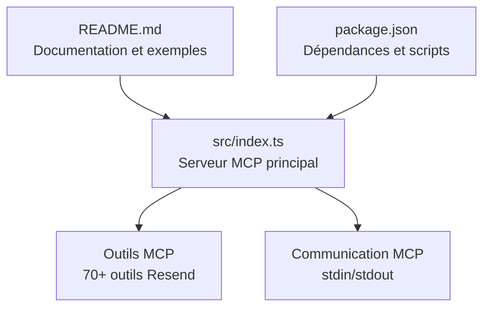

# Introduction et Aperçu

<cite>
**Fichiers référencés dans ce document**
- [README.md](file://README.md)
- [package.json](file://package.json)
- [src/index.ts](file://src/index.ts)
</cite>

## Sommaire
1. [Introduction](#introduction)
2. [Objectif et valeur ajoutée](#objectif-et-valeur-ajoutée)
3. [Couverture complète de l’API Resend](#couverture-complète-de-lapi-resend)
4. [Rôle de Resend Full MCP comme serveur Model Context Protocol](#rôle-de-resend-full-mcp-comme-serveur-model-context-protocol)
5. [Modules et outils principaux](#modules-et-outils-principaux)
6. [Cas d’utilisation concrets](#cas-dutilisation-concrets)
7. [Comparaison avec les solutions alternatives](#comparaison-avec-les-solutions-alternatives)
8. [Structure du projet](#structure-du-projet)
9. [Prérequis et configuration](#prérequis-et-configuration)
10. [Conclusion](#conclusion)

## Introduction
Resend Full MCP est un serveur Model Context Protocol (MCP) qui offre une couverture 100 % de l’API Resend. Il permet aux assistants IA et aux applications LLM de gérer toute la puissante infrastructure de messagerie de Resend, y compris l’envoi d’e-mails transactionnels, la gestion des campagnes de diffusion, la configuration des domaines, la gestion des contacts et audiences, ainsi que la mise en place de webhooks. Ce projet transforme l’API Resend en outils invocables accessibles via le protocole MCP, rendant l’intégration fluide dans des environnements IA.

## Objectif et valeur ajoutée
- Objectif principal : Fournir un pont entre les assistants IA et l’ensemble des capacités de l’API Resend, en exposant toutes les opérations sous forme d’outils MCP.
- Valeur ajoutée :
  - Couverture complète de l’API Resend (12 modules, 70+ outils).
  - Intégration native avec des clients MCP (Claude Desktop, Continue, Cline, etc.).
  - Sécurité renforcée : stockage des clés API dans des variables d’environnement, validation des paramètres, et respect des limites de taux.
  - Facilité d’utilisation : installation via npm ou Python, configuration simplifiée, et documentation complète.

**Section sources**
- [README.md](file://README.md#L1-L10)
- [README.md](file://README.md#L119-L126)

## Couverture complète de l’API Resend
Le serveur expose tous les endpoints de l’API Resend à travers le protocole MCP, organisés en 12 modules distincts. Voici un aperçu des fonctionnalités principales :

- **Emails** : Envoi de courriels uniques ou en lot, suivi, annulation, gestion des pièces jointes, et récupération de détails.
- **Réception des courriels** : Consultation des courriels reçus et de leurs pièces jointes.
- **Gestion des domaines** : Création, mise à jour, suppression, vérification DNS.
- **Clés API** : Génération, listing, suppression de clés.
- **Audiences** : Création, listing, consultation, suppression de listes de diffusion.
- **Contacts** : Gestion complète des contacts (création, mise à jour, suppression, segments, abonnements aux sujets).
- **Modèles** : Création, listing, mise à jour, suppression, publication, duplication de modèles.
- **Diffusions** : Création, listing, consultation, mise à jour, suppression, envoi de campagnes.
- **Webhooks** : Création, listing, consultation, mise à jour, suppression de webhooks.
- **Segments** : Création, listing, consultation, suppression de segments.
- **Sujets** : Création, listing, consultation, mise à jour, suppression de sujets d’abonnement.
- **Propriétés de contact** : Création, listing, consultation, mise à jour, suppression de propriétés personnalisées.

Ces fonctionnalités sont mises à disposition via plus de 70 outils MCP, chacun avec un schéma d’entrée précis pour garantir la validation et la sécurité.

**Section sources**
- [README.md](file://README.md#L13-L118)
- [README.md](file://README.md#L446-L460)

## Rôle de Resend Full MCP comme serveur Model Context Protocol
Resend Full MCP agit comme un serveur MCP qui expose les outils Resend au sein d’un pipeline IA. Le protocole MCP permet à un assistant IA de demander des outils, de les invoquer, et de recevoir des résultats structurés. Le serveur implémente les méthodes standards MCP (tools/list, tools/call) et communique via stdin/stdout, ce qui le rend compatible avec les clients MCP.

- Méthodes MCP supportées : tools/list, tools/call.
- Communication : stdin/stdout basée sur JSON.
- Gestion des erreurs : réponse structurée avec détails de l’erreur, nom de l’outil et arguments fournis.

Cela permet aux assistants IA de traiter des tâches complexes de messagerie sans avoir à gérer directement les appels API, tout en bénéficiant de la puissance de l’API Resend.

**Section sources**
- [src/index.ts](file://src/index.ts#L1528-L1565)
- [src/index.ts](file://src/index.ts#L1600-L1623)

## Modules et outils principaux
Voici un résumé des modules et de leur nombre d’outils associés, tel qu’indiqué dans le dépôt :

- Emails : 8 outils
- Réception des courriels : 4 outils
- Domaines : 6 outils
- Clés API : 3 outils
- Audiences : 4 outils
- Contacts : 13 outils
- Modèles : 7 outils
- Diffusions : 6 outils
- Webhooks : 5 outils
- Segments : 4 outils
- Sujets : 5 outils
- Propriétés de contact : 5 outils

Total : 70+ outils.

Chaque outil possède un schéma d’entrée défini, incluant les champs requis, les types attendus, et des descriptions précises pour faciliter l’usage par les assistants IA.

**Section sources**
- [README.md](file://README.md#L15-L118)

## Cas d’utilisation concrets
Voici quelques scénarios concrets illustrant l’utilisation de Resend Full MCP avec des assistants IA :

- **Envoi de courriel unique** : Un assistant IA peut appeler l’outil send_email pour envoyer un courriel transactionnel personnalisé à un utilisateur.
- **Envoi en lot** : Pour des campagnes de bienvenue, l’outil send_batch_emails permet d’envoyer jusqu’à 100 courriels en une seule requête.
- **Gestion de domaine** : Ajouter un domaine, afficher les enregistrements DNS nécessaires, et valider la configuration via create_domain et verify_domain.
- **Configuration de webhooks** : Mettre en place des notifications en temps réel pour les événements de livraison, ouverture, clics, ou rebond.
- **Création d’une audience et d’un contact** : Créer une audience, ajouter des contacts, les segmenter, et gérer leurs abonnements aux sujets.
- **Campagne de diffusion** : Créer une diffusion, la configurer, puis l’envoyer ou la planifier via send_broadcast.

Ces cas d’utilisation montrent comment Resend Full MCP permet de transformer des tâches de messagerie en appels d’outils simples, accessibles depuis des assistants IA.

**Section sources**
- [README.md](file://README.md#L268-L444)

## Comparaison avec les solutions alternatives
- **SDK officiel Resend** : Utile pour les applications backend, mais nécessite une implémentation manuelle des appels API. Resend Full MCP simplifie l’accès pour les assistants IA via le protocole MCP.
- **Autres serveurs MCP** : D’autres projets peuvent exposer des outils spécifiques, mais Resend Full MCP se distingue par sa couverture complète de l’API Resend (70+ outils).
- **Intégration IA** : Contrairement aux solutions traditionnelles, Resend Full MCP est pensé pour être utilisé directement par des assistants IA, avec des outils prêts à l’emploi et des schémas de données validés.

La valeur ajoutée de Resend Full MCP réside donc dans l’exposition complète de l’API Resend via le protocole MCP, facilitant l’intégration IA-native.

**Section sources**
- [README.md](file://README.md#L1-L10)

## Structure du projet
Le projet est minimaliste et centré sur l’exécution du serveur MCP. Voici la structure clé :

- src/index.ts : Implémentation principale du serveur MCP, définition des outils, gestion des appels, et communication stdin/stdout.
- package.json : Dépendances (resend, dotenv), scripts de build et d’exécution, et configuration des binaires.
- README.md : Documentation complète, exemples d’utilisation, configuration, sécurité, et détails techniques.

**Diagram sources**
- [README.md](file://README.md#L446-L460)
- [package.json](file://package.json#L1-L43)
- [src/index.ts](file://src/index.ts#L1-L50)

**Section sources**
- [README.md](file://README.md#L446-L460)
- [package.json](file://package.json#L1-L43)

## Prérequis et configuration
- Prérequis système : Node.js 18+ (recommandé : v20+), TypeScript 5+, une clé API Resend, et un client MCP compatible (Claude Desktop, Continue, Cline, etc.).
- Installation : via npm (globalement ou avec npx), via pip (Python), ou en compilant depuis la source.
- Configuration : création d’un fichier .env contenant la clé API Resend, et éventuellement des variables pour l’URL de base de l’API, le mode debug, et la limite de taux.
- Clients MCP : exemples de configuration pour Claude Desktop, Continue, et Cline sont fournis dans la documentation.

**Section sources**
- [README.md](file://README.md#L127-L265)
- [package.json](file://package.json#L35-L37)

## Conclusion
Resend Full MCP est un projet puissant et complet qui permet aux assistants IA de tirer parti de l’ensemble de l’API Resend via le protocole MCP. Avec plus de 70 outils couvrant 12 modules complets, il simplifie l’intégration de la messagerie dans des flux IA, tout en maintenant des standards de sécurité et de performance. Que vous souhaitiez envoyer des e-mails, gérer des audiences, configurer des domaines, ou mettre en place des webhooks, Resend Full MCP vous fournit une interface standardisée et fiable.