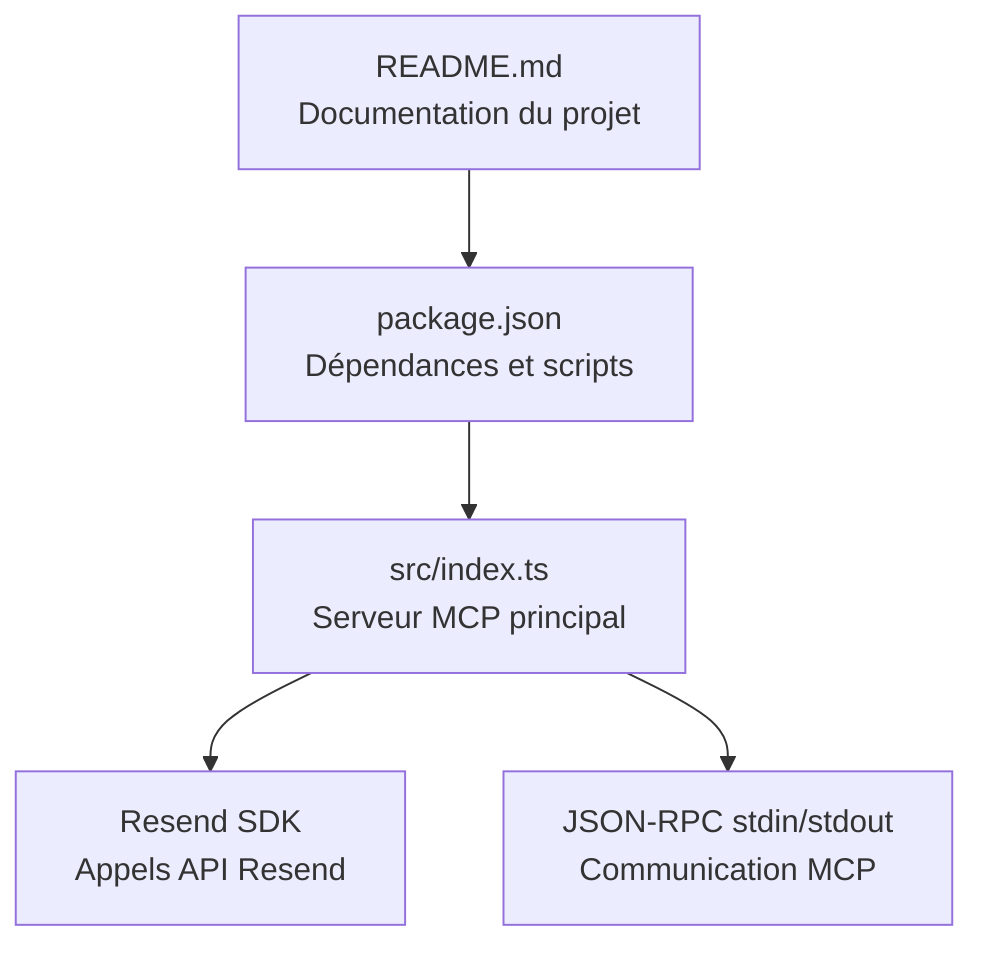
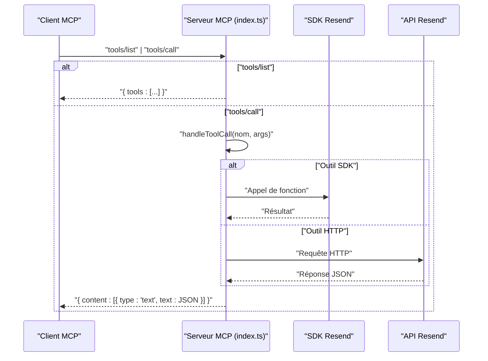

# Protocole MCP et Interface

<cite>
**Fichiers référencés dans ce document**
- [README.md](file://README.md)
- [package.json](file://package.json)
- [src/index.ts](file://src/index.ts)
</cite>

## Sommaire
1. [Introduction](#introduction)
2. [Structure du projet](#structure-du-projet)
3. [Composants principaux](#composants-principaux)
4. [Aperçu de l’architecture](#aperçu-de-l’architecture)
5. [Analyse détaillée des composants](#analyse-détaillée-des-composants)
6. [Analyse des dépendances](#analyse-des-dépendances)
7. [Considérations sur les performances](#considérations-sur-les-performances)
8. [Guide de dépannage](#guide-de-dépannage)
9. [Conclusion](#conclusion)
10. [Annexes](#annexes)

## Introduction
Ce document décrit le protocole Model Context Protocol (MCP) utilisé par le serveur Resend Full MCP. Le serveur expose l’intégralité de l’API Resend sous forme d’outils invocables, permettant aux assistants IA et aux applications LLM de gérer des opérations d’email (envoi, listage, annulation, pièces jointes), la gestion des domaines, des audiences, des contacts, des modèles, des diffusions, des webhooks, des segments, des sujets et des propriétés de contact. Le serveur communique via JSON-RPC sur stdin/stdout, répondant aux méthodes MCP standards : tools/list et tools/call.

## Structure du projet
Le projet est un serveur MCP écrit en TypeScript, exécuté via Node.js. Il se compose d’un seul fichier principal qui définit les outils MCP, leurs schémas d’entrée, les gestionnaires d’appel d’outils, et l’implémentation de base du serveur MCP.

**Diagramme sources**
- [README.md](file://README.md#L1-L690)
- [package.json](file://package.json#L1-L43)
- [src/index.ts](file://src/index.ts#L1-L1623)

**Section sources**
- [README.md](file://README.md#L446-L460)
- [package.json](file://package.json#L1-L43)

## Composants principaux
- Types et interfaces MCP
  - MCPTool : description d’un outil MCP avec nom, description et inputSchema.
  - MCPRequest : requête JSON-RPC contenant la méthode et ses paramètres.
  - MCPResponse : réponse JSON-RPC contenant un tableau de contenu textuel.
- Définitions des outils
  - 70+ outils MCP couvrant tous les modules de l’API Resend : Emails, Receiving Emails, Domains, API Keys, Audiences, Contacts, Templates, Broadcasts, Webhooks, Segments, Topics, Contact Properties.
- Gestionnaires d’outils
  - handleToolCall : exécution d’un outil MCP en appelant soit le SDK Resend, soit des appels HTTP directs vers l’API Resend.
- Serveur MCP
  - listTools : retourne la liste complète des outils MCP.
  - callTool : exécute un outil MCP et renvoie une réponse JSON-RPC.
  - Implémentation de base du serveur MCP : nom et version, gestion des méthodes tools/list et tools/call, lecture/écriture JSON-RPC sur stdin/stdout.

**Section sources**
- [src/index.ts](file://src/index.ts#L13-L36)
- [src/index.ts](file://src/index.ts#L42-L1002)
- [src/index.ts](file://src/index.ts#L1008-L1522)
- [src/index.ts](file://src/index.ts#L1528-L1565)
- [src/index.ts](file://src/index.ts#L1600-L1623)

## Aperçu de l’architecture
Le serveur MCP reçoit des requêtes JSON-RPC sur stdin, identifie la méthode (tools/list ou tools/call), exécute l’opération correspondante, puis écrit la réponse JSON-RPC sur stdout. Pour les outils non couverts par le SDK Resend, il effectue des appels HTTP directs à l’API Resend.

**Diagramme sources**
- [src/index.ts](file://src/index.ts#L1604-L1618)
- [src/index.ts](file://src/index.ts#L1008-L1522)

## Analyse détaillée des composants

### Types et interfaces MCP
- MCPTool
  - Propriétés : name, description, inputSchema.
  - inputSchema : objet JSON Schema décrivant les paramètres attendus, y compris les propriétés et les champs requis.
- MCPRequest
  - Propriétés : method (ex. "tools/call"), params.name (nom de l’outil), params.arguments (paramètres de l’outil).
- MCPResponse
  - Propriétés : content (tableau de messages textuels).

Complexité
- La structure des schémas d’entrée suit le JSON Schema standard, ce qui permet une validation statique et une documentation automatisée des outils.

**Section sources**
- [src/index.ts](file://src/index.ts#L13-L36)

### Définitions des outils MCP
Les outils sont définis dans un tableau centralisé, chacun avec :
- name : nom unique de l’outil.
- description : brève explication de la fonctionnalité.
- inputSchema : JSON Schema des paramètres attendus.

Exemples de modules
- Emails : send_email, send_batch_emails, list_emails, get_email, update_email, cancel_email, list_email_attachments, get_email_attachment.
- Receiving Emails : list_received_emails, get_received_email, list_received_email_attachments, get_received_email_attachment.
- Domains : create_domain, list_domains, get_domain, update_domain, delete_domain, verify_domain.
- API Keys : create_api_key, list_api_keys, delete_api_key.
- Audiences : create_audience, list_audiences, get_audience, delete_audience.
- Contacts : create_contact, list_contacts, get_contact_by_email, get_contact_by_id, update_contact_by_email, update_contact_by_id, delete_contact_by_email, delete_contact_by_id, add_contact_to_segment, remove_contact_from_segment, list_contact_segments, get_contact_topics, update_contact_topics.
- Templates : create_template, list_templates, get_template, update_template, delete_template, publish_template, duplicate_template.
- Broadcasts : create_broadcast, list_broadcasts, get_broadcast, update_broadcast, delete_broadcast, send_broadcast.
- Webhooks : create_webhook, list_webhooks, get_webhook, update_webhook, delete_webhook.
- Segments : create_segment, list_segments, get_segment, delete_segment.
- Topics : create_topic, list_topics, get_topic, update_topic, delete_topic.
- Contact Properties : create_contact_property, list_contact_properties, get_contact_property, update_contact_property, delete_contact_property.

Validation des paramètres
- Chaque outil spécifie les champs requis dans inputSchema.required, garantissant que les appels tools/call incluent les données nécessaires.

**Section sources**
- [src/index.ts](file://src/index.ts#L42-L1002)

### Gestionnaires d’outils
- handleToolCall
  - Extrait le nom de l’outil et les arguments.
  - Effectue des appels au SDK Resend pour les outils pris en charge.
  - Effectue des appels HTTP directs à l’API Resend pour les outils non couverts par le SDK.
  - Gère les erreurs et renvoie un message d’erreur structuré.

Implémentation
- Utilise l’en-tête Authorization Bearer avec la clé API Resend.
- Pour les outils non SDK, construit les URL de l’API Resend, ajoute les paramètres de requête si nécessaire, et traite les réponses JSON.

**Section sources**
- [src/index.ts](file://src/index.ts#L1008-L1522)

### Serveur MCP
- listTools
  - Retourne le tableau complet des outils MCP.
- callTool
  - Valide la présence du nom de l’outil.
  - Appelle handleToolCall, encapsule le résultat dans un MCPResponse.
  - En cas d’erreur, renvoie un message d’erreur structuré.
- Implémentation de base
  - Nom et version du serveur MCP.
  - Gestion des méthodes tools/list et tools/call.
  - Lecture des requêtes JSON-RPC depuis stdin, écriture des réponses sur stdout.

**Section sources**
- [src/index.ts](file://src/index.ts#L1528-L1565)
- [src/index.ts](file://src/index.ts#L1600-L1623)

### Flux d’interaction client-serveur
- Outils disponibles
  - Requête : tools/list
  - Réponse : tableau d’objets MCPTool
- Appel d’un outil
  - Requête : tools/call avec params.name et params.arguments
  - Réponse : MCPResponse.content avec le résultat encodé en JSON

Exemples de requêtes
- tools/list
  - Méthode : "tools/list"
  - Paramètres : {}
- tools/call (envoi d’un email)
  - Méthode : "tools/call"
  - Paramètres : { name: "send_email", arguments: { ... } }

**Section sources**
- [README.md](file://README.md#L435-L444)
- [README.md](file://README.md#L279-L294)

## Analyse des dépendances
- Dépendances principales
  - resend : SDK officiel Resend pour appeler l’API.
  - dotenv : chargement des variables d’environnement depuis un fichier .env.
- Scripts
  - build : compilation TypeScript.
  - start : exécution du serveur compilé.
  - dev : exécution en mode développement avec ts-node.
- Moteur
  - Node.js >= 18.

**Section sources**
- [package.json](file://package.json#L26-L37)

## Considérations sur les performances
- Gestion des limites de débit
  - Le serveur MCP ne gère pas explicitement le rate limiting ; cela repose sur l’API Resend. Le dépôt indique des limites par défaut de 2 requêtes/seconde et des tentatives de retry automatiques.
- Optimisations possibles
  - Mettre en cache les ressources fréquemment consultées (par exemple, les listes de domaines, audiences, templates).
  - Limiter la taille des réponses JSON pour éviter des payloads trop volumineux.
  - Implémenter un système de backoff progressif pour les appels HTTP directs.

**Section sources**
- [README.md](file://README.md#L487-L496)

## Guide de dépannage
- Erreur : clé API manquante
  - Message d’erreur : "RESEND_API_KEY environment variable is not set"
  - Solution : créer un fichier .env avec la clé API Resend.
- Erreur : outil inconnu
  - Vérifier la liste des outils disponibles via tools/list.
- Erreur : échec de l’exécution d’un outil
  - Causes possibles : clé API invalide, paramètres manquants, dépassement de limite de débit, problèmes réseau.
  - Solution : vérifier le message d’erreur détaillé et valider les paramètres.

**Section sources**
- [README.md](file://README.md#L520-L542)
- [src/index.ts](file://src/index.ts#L1571-L1577)

## Conclusion
Le serveur Resend Full MCP fournit une couverture complète de l’API Resend via le protocole MCP. Grâce à des outils bien définis, des schémas d’entrée structurés, et une implémentation robuste de la communication JSON-RPC, il permet aux assistants IA d’effectuer des opérations avancées de messagerie électronique, de gestion de contacts, de diffusion, et de configuration de domaine. Pour les clients MCP, il suffit de configurer le serveur comme un serveur MCP compatible et d’utiliser tools/list pour découvrir les outils disponibles, puis tools/call pour invoquer les outils avec leurs paramètres.

## Annexes

### Méthodes MCP disponibles
- tools/list
  - Description : Retourne la liste complète des outils MCP.
  - Paramètres : aucun.
- tools/call
  - Description : Exécute un outil MCP avec ses arguments.
  - Paramètres : name (nom de l’outil), arguments (paramètres de l’outil).

**Section sources**
- [README.md](file://README.md#L435-L444)
- [src/index.ts](file://src/index.ts#L1604-L1618)

### Formats de requêtes et réponses
- Requête JSON-RPC
  - Propriétés : method (ex. "tools/call"), params (objet contenant name et arguments).
- Réponse JSON-RPC
  - tools/list : { tools: [MCPTool] }
  - tools/call : { content: [{ type: "text", text: JSON }] }

**Section sources**
- [src/index.ts](file://src/index.ts#L23-L36)
- [src/index.ts](file://src/index.ts#L1532-L1565)

### Capacités supplémentaires mentionnées
- Resources : accès aux modèles et configurations.
- Prompts : prômes préconfigurés pour des opérations courantes (selon la documentation).
- Gestion des erreurs : messages détaillés pour les erreurs d’authentification, validation, ressource, débit, et serveur.
- Limites de débit : 2 requêtes/seconde par défaut, avec des tentatives de retry.

**Section sources**
- [README.md](file://README.md#L119-L126)
- [README.md](file://README.md#L497-L519)
- [README.md](file://README.md#L487-L496)