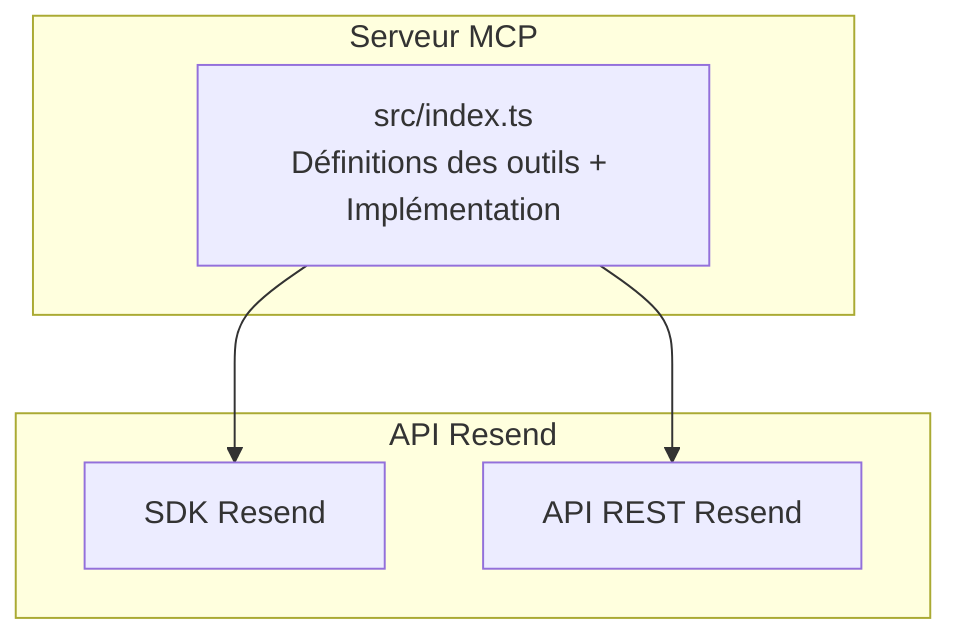
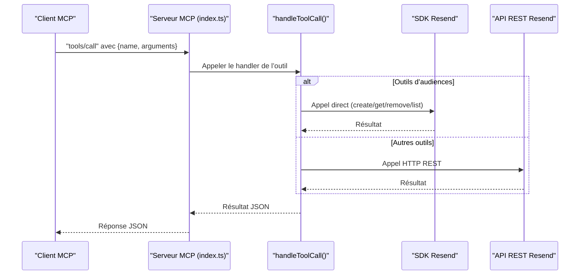
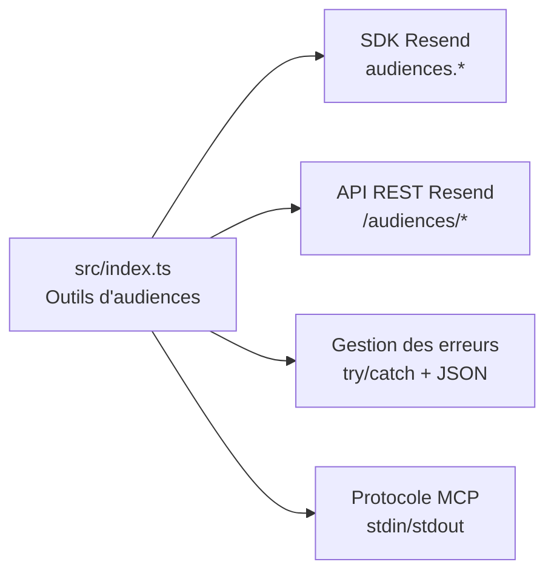

# API Audiences

<cite>
**Fichiers référencés dans ce document**
- [README.md](file://README.md)
- [package.json](file://package.json)
- [src/index.ts](file://src/index.ts)
</cite>

## Sommaire
1. [Introduction](#introduction)
2. [Structure du projet](#structure-du-projet)
3. [Composants principaux](#composants-principaux)
4. [Aperçu de l’architecture](#aperçu-de-larchitecture)
5. [Analyse détaillée des outils](#analyse-détaillée-des-outils)
6. [Analyse des dépendances](#analyse-des-dépendances)
7. [Considérations sur les performances](#considérations-sur-les-performances)
8. [Guide de dépannage](#guide-de-dépannage)
9. [Conclusion](#conclusion)

## Introduction
Ce document fournit une documentation complète des outils liés aux audiences (4 outils) exposés par le serveur MCP Resend. Il couvre leur nom, description, paramètres d’entrée, schémas JSON, valeurs de retour, codes d’erreur possibles, ainsi que des exemples de requêtes et réponses. Des guides d’utilisation sont également inclus pour des scénarios courants tels que la création d’une audience, la récupération de ses détails, et la suppression d’une audience inutilisée.

## Structure du projet
Le projet est un serveur MCP qui expose l’ensemble de l’API Resend sous forme d’outils invocables. Le cœur de l’implémentation se trouve dans le fichier principal, où sont définis :
- La liste des outils (y compris les 4 outils d’audiences)
- Les schémas d’entrée pour chacun
- Les implémentations des appels à l’API Resend
- Le protocole MCP pour l’écoute des requêtes

**Diagramme sources**
- [src/index.ts](file://src/index.ts#L1008-L1522)

**Section sources**
- [README.md](file://README.md#L1-L721)
- [package.json](file://package.json#L1-L49)
- [src/index.ts](file://src/index.ts#L1-L1623)

## Composants principaux
Les outils d’audiences sont définis dans la liste des outils du serveur MCP. Ils permettent de gérer des audiences (listes de contacts) : créer, lister, récupérer les détails d’une audience, et supprimer une audience.

- create_audience : Créer une nouvelle audience
- list_audiences : Lister toutes les audiences
- get_audience : Récupérer les détails d’une audience spécifique
- delete_audience : Supprimer une audience

**Section sources**
- [src/index.ts](file://src/index.ts#L352-L393)

## Aperçu de l’architecture
Le serveur MCP reçoit des appels via stdin, identifie la méthode (tools/list ou tools/call), puis exécute l’outil correspondant. Pour les outils d’audiences, l’implémentation appelle soit le SDK Resend, soit l’API REST directement selon la méthode.

**Diagramme sources**
- [src/index.ts](file://src/index.ts#L1008-L1522)

## Analyse détaillée des outils

### create_audience
- Nom : create_audience
- Description : Créer une nouvelle audience (liste de contacts)
- Paramètres d’entrée
  - name : chaîne de caractères (obligatoire)
- Schéma JSON
  - type : object
  - properties : { name: { type: "string" } }
  - required : ["name"]
- Valeurs de retour
  - Objet représentant l’audience créée (structure fournie par l’API Resend)
- Codes d’erreur possibles
  - 400 : Données invalides (ex. champ manquant)
  - 401 : Non autorisé (clé API invalide)
  - 403 : Interdit (permissions insuffisantes)
  - 422 : Données non validables
  - 429 : Trop de requêtes
  - 500 : Erreur interne du serveur
- Exemple de requête
  - {
      "method": "tools/call",
      "params": {
        "name": "create_audience",
        "arguments": {
          "name": "Newsletter Subscribers"
        }
      }
    }
- Exemple de réponse
  - {
      "id": "string",
      "name": "Newsletter Subscribers",
      "createdAt": "2026-01-01T00:00:00Z"
    }

**Section sources**
- [src/index.ts](file://src/index.ts#L352-L363)
- [README.md](file://README.md#L44-L48)

### list_audiences
- Nom : list_audiences
- Description : Lister toutes les audiences
- Paramètres d’entrée
  - Aucun paramètre requis
- Schéma JSON
  - type : object
  - properties : {}
- Valeurs de retour
  - Tableau d’audiences (structure fournie par l’API Resend)
- Codes d’erreur possibles
  - 401 : Non autorisé
  - 403 : Interdit
  - 429 : Trop de requêtes
  - 500 : Erreur interne du serveur
- Exemple de requête
  - {
      "method": "tools/call",
      "params": {
        "name": "list_audiences",
        "arguments": {}
      }
    }
- Exemple de réponse
  - [
      { "id": "string", "name": "string", "createdAt": "2026-01-01T00:00:00Z" },
      ...
    ]

**Section sources**
- [src/index.ts](file://src/index.ts#L364-L371)
- [README.md](file://README.md#L44-L48)

### get_audience
- Nom : get_audience
- Description : Récupérer les détails d’une audience spécifique
- Paramètres d’entrée
  - audience_id : identifiant de l’audience (obligatoire)
- Schéma JSON
  - type : object
  - properties : { audience_id: { type: "string" } }
  - required : ["audience_id"]
- Valeurs de retour
  - Objet contenant les détails de l’audience (structure fournie par l’API Resend)
- Codes d’erreur possibles
  - 401 : Non autorisé
  - 403 : Interdit
  - 404 : Audience introuvable
  - 429 : Trop de requêtes
  - 500 : Erreur interne du serveur
- Exemple de requête
  - {
      "method": "tools/call",
      "params": {
        "name": "get_audience",
        "arguments": {
          "audience_id": "auid_XXXXXXXXXXXX"
        }
      }
    }
- Exemple de réponse
  - {
      "id": "auid_XXXXXXXXXXXX",
      "name": "string",
      "contactCount": 0,
      "createdAt": "2026-01-01T00:00:00Z"
    }

**Section sources**
- [src/index.ts](file://src/index.ts#L372-L382)
- [README.md](file://README.md#L44-L48)

### delete_audience
- Nom : delete_audience
- Description : Supprimer une audience
- Paramètres d’entrée
  - audience_id : identifiant de l’audience (obligatoire)
- Schéma JSON
  - type : object
  - properties : { audience_id: { type: "string" } }
  - required : ["audience_id"]
- Valeurs de retour
  - Objet de suppression (structure fournie par l’API Resend)
- Codes d’erreur possibles
  - 401 : Non autorisé
  - 403 : Interdit
  - 404 : Audience introuvable
  - 409 : Conflit (ex. audience utilisée)
  - 429 : Trop de requêtes
  - 500 : Erreur interne du serveur
- Exemple de requête
  - {
      "method": "tools/call",
      "params": {
        "name": "delete_audience",
        "arguments": {
          "audience_id": "auid_XXXXXXXXXXXX"
        }
      }
    }
- Exemple de réponse
  - {
      "id": "auid_XXXXXXXXXXXX",
      "deleted": true
    }

**Section sources**
- [src/index.ts](file://src/index.ts#L383-L393)
- [README.md](file://README.md#L44-L48)

## Analyse des dépendances
- Dépendance principale : Le SDK Resend est utilisé pour appeler directement les méthodes d’audiences (create, list, get, remove).
- Gestion des erreurs : Le serveur encapsule les appels dans un try/catch et renvoie un objet JSON contenant l’erreur si nécessaire.
- Protocole MCP : Le serveur écoute les requêtes sur stdin et répond via stdout, supportant tools/list et tools/call.

**Diagramme sources**
- [src/index.ts](file://src/index.ts#L1008-L1522)

**Section sources**
- [src/index.ts](file://src/index.ts#L1008-L1522)

## Considérations sur les performances
- Taux de requêtes : Le serveur respecte les limites de l’API Resend (par défaut 2 requêtes/seconde). En cas de dépassement, des codes 429 peuvent être retournés.
- Gestion des appels : Les appels directs au SDK Resend sont rapides, tandis que les appels REST utilisent des requêtes HTTP. Le serveur ne met pas en cache les données.

[Pas de sources supplémentaires car cette section fournit des conseils généraux]

## Guide de dépannage
- Clé API manquante
  - Message d’erreur : "RESEND_API_KEY environment variable is not set"
  - Solution : Ajouter la clé API dans le fichier .env
- Outil inconnu
  - Vérifier le nom de l’outil via tools/list
- Codes d’erreur fréquents
  - 401 : Clé API invalide ou manquante
  - 403 : Permissions insuffisantes
  - 404 : Audience/ressource introuvable
  - 409 : Conflit (suppression d’une audience utilisée)
  - 422 : Données invalides (ex. nom d’audience manquant)
  - 429 : Limite de taux atteinte
  - 500 / 503 : Problèmes temporaires du service

**Section sources**
- [README.md](file://README.md#L528-L549)
- [src/index.ts](file://src/index.ts#L1516-L1522)

## Conclusion
Les outils d’audiences offrent une interface simple et fiable pour gérer des listes de contacts via le serveur MCP Resend. Grâce à leurs schémas d’entrée clairs, à leur implémentation directe sur le SDK Resend, et à la gestion robuste des erreurs, ils permettent de créer, lister, récupérer et supprimer des audiences de manière fluide. Pour des opérations courantes, il suffit de faire des appels tools/call avec les bons paramètres, et de gérer les réponses JSON retournées.