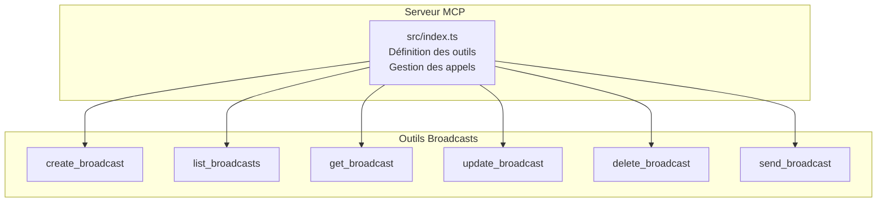
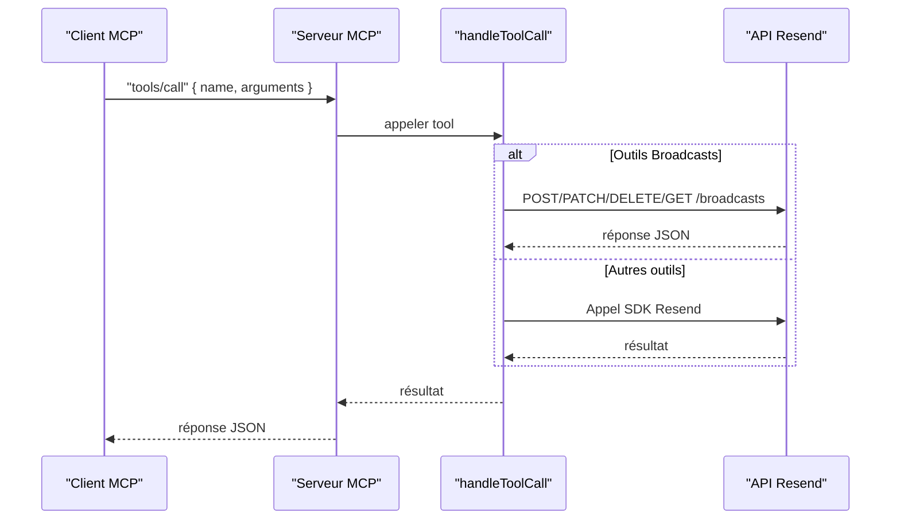
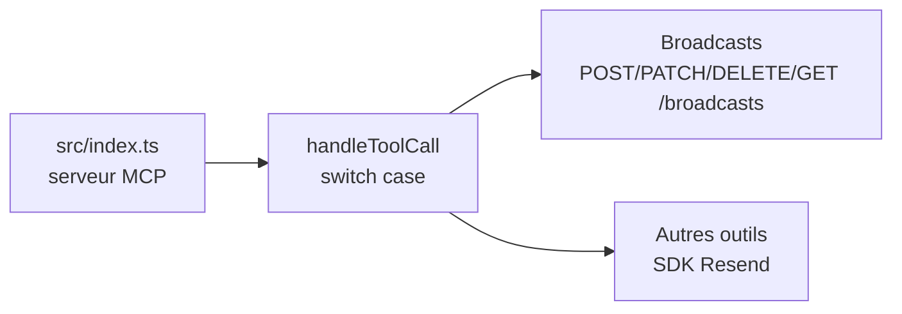

# API Broadcasts

<cite>
**Fichiers référencés dans ce document**
- [README.md](file://README.md)
- [package.json](file://package.json)
- [src/index.ts](file://src/index.ts)
</cite>

## Sommaire
1. [Introduction](#introduction)
2. [Structure du projet](#structure-du-projet)
3. [Composants principaux](#composants-principaux)
4. [Aperçu de l’architecture](#aperçu-de-larchitecture)
5. [Analyse détaillée des outils](#analyse-détaillée-des-outils)
6. [Analyse des dépendances](#analyse-des-dépendances)
7. [Considérations sur les performances](#considérations-sur-les-performances)
8. [Guide de dépannage](#guide-de-dépannage)
9. [Conclusion](#conclusion)

## Introduction
Ce document fournit une documentation complète des six outils liés aux diffusions (broadcasts) de l’API Resend exposés via le serveur Model Context Protocol (MCP). Il couvre le nom, la description, les paramètres d’entrée, les schémas JSON, les valeurs de retour attendues, les codes d’erreur possibles, ainsi que des exemples de requêtes et de réponses. Des guides d’utilisation sont également inclus pour des scénarios courants tels que la création de campagnes de diffusion, la gestion des brouillons et l’envoi planifié.

## Structure du projet
Le projet est un serveur MCP qui expose l’intégralité de l’API Resend sous forme d’outils invocables. Les outils liés aux diffusions se trouvent dans la section “Broadcasts” de la liste des outils.

**Diagramme sources**
- [src/index.ts](file://src/index.ts#L683-L764)

**Section sources**
- [README.md](file://README.md#L74-L80)
- [src/index.ts](file://src/index.ts#L683-L764)

## Composants principaux
Les six outils de diffusion sont définis dans la liste des outils du serveur MCP. Chacun possède un nom, une description, un schéma d’entrée JSON et, pour certains, des champs spécifiques comme les horodatages planifiés, les segments, les contenus HTML/Text, et les prévisualisations.

**Section sources**
- [src/index.ts](file://src/index.ts#L683-L764)

## Aperçu de l’architecture
Le serveur MCP reçoit des requêtes de type “tools/call” avec un nom d’outil et ses arguments. Le gestionnaire d’appel effectue soit un appel direct à l’SDK Resend (lorsque disponible), soit une requête HTTP vers l’API Resend (lorsque l’opération n’est pas couverte par le SDK). Pour les outils de diffusion, les appels sont effectués via des requêtes HTTP à l’API Resend.

**Diagramme sources**
- [src/index.ts](file://src/index.ts#L1008-L1522)
- [src/index.ts](file://src/index.ts#L1311-L1356)

## Analyse détaillée des outils

### create_broadcast
- Nom : create_broadcast
- Description : Créer une nouvelle campagne de diffusion.
- Paramètres d’entrée (JSON) :
  - name : chaîne de caractères (optionnel)
  - segment_id : identifiant de segment (requis)
  - from : adresse expéditrice (requis)
  - subject : sujet de l’e-mail (requis)
  - reply_to : tableau d’adresses de réponse (optionnel)
  - preview_text : texte de prévisualisation (optionnel)
  - html : contenu HTML (optionnel)
  - text : contenu texte brut (optionnel)
  - send : booléen indiquant si l’envoi doit être immédiat (optionnel)
  - scheduled_at : horodatage planifié au format ISO 8601 (optionnel)
- Schéma JSON attendu (extrait) :
  - Propriétés : name, segment_id, from, subject, reply_to, preview_text, html, text, send, scheduled_at
  - Requis : from, subject, segment_id
- Valeurs de retour : objet JSON représentant la diffusion créée (structure conforme à l’API Resend).
- Codes d’erreur possibles : 400 (paramètres invalides), 401 (non autorisé), 403 (interdit), 404 (ressource introuvable), 422 (données invalides), 429 (trop de requêtes), 500/503 (erreurs serveur).
- Exemple de requête (sans le contenu complet) : voir [Exemple de requête](file://README.md#L417-L433).
- Exemple de réponse : objet JSON contenant l’identifiant de la diffusion, son statut initial, les métadonnées fournies, etc.

Contraintes spécifiques
- Le champ send permet de créer un brouillon (send=false) ou d’envoyer immédiatement (send=true).
- Si send=true, le champ scheduled_at ne peut pas être utilisé.
- Le champ segment_id identifie la cible de la diffusion.
- preview_text est utile pour les clients e-mails affichant un aperçu.

**Section sources**
- [src/index.ts](file://src/index.ts#L683-L703)
- [README.md](file://README.md#L408-L433)

### list_broadcasts
- Nom : list_broadcasts
- Description : Récupérer toutes les diffusions.
- Paramètres d’entrée : aucun.
- Schéma JSON attendu : objet vide.
- Valeurs de retour : tableau JSON de diffusions (structure conforme à l’API Resend).
- Codes d’erreur possibles : 401, 403, 429, 500/503.
- Exemple de réponse : tableau d’objets de diffusion avec leurs attributs (identifiants, statuts, dates, etc.).

**Section sources**
- [src/index.ts](file://src/index.ts#L704-L711)

### get_broadcast
- Nom : get_broadcast
- Description : Récupérer les détails d’une diffusion spécifique.
- Paramètres d’entrée (JSON) :
  - broadcast_id : identifiant de la diffusion (requis)
- Schéma JSON attendu : objet avec broadcast_id.
- Valeurs de retour : objet JSON représentant la diffusion demandée.
- Codes d’erreur possibles : 401, 403, 404, 429, 500/503.
- Exemple de réponse : objet de diffusion avec tous ses attributs (statut, contenu, cible, etc.).

**Section sources**
- [src/index.ts](file://src/index.ts#L712-L722)

### update_broadcast
- Nom : update_broadcast
- Description : Mettre à jour un brouillon de diffusion.
- Paramètres d’entrée (JSON) :
  - broadcast_id : identifiant de la diffusion (requis)
  - name, segment_id, from, subject, reply_to, preview_text, html, text
- Schéma JSON attendu : objet avec broadcast_id et les champs à mettre à jour.
- Valeurs de retour : objet JSON de la diffusion mise à jour.
- Codes d’erreur possibles : 400, 401, 403, 404, 422, 429, 500/503.
- Exemple de réponse : objet mis à jour.

Contraintes spécifiques
- Ne peut être utilisé que sur des brouillons (état non envoyé).
- Ne peut pas modifier un champ de manière contradictoire (par exemple, envoyer immédiatement si l’opération est déjà planifiée).

**Section sources**
- [src/index.ts](file://src/index.ts#L723-L741)

### delete_broadcast
- Nom : delete_broadcast
- Description : Supprimer un brouillon de diffusion.
- Paramètres d’entrée (JSON) :
  - broadcast_id : identifiant de la diffusion (requis)
- Schéma JSON attendu : objet avec broadcast_id.
- Valeurs de retour : objet de suppression (structure conforme à l’API Resend).
- Codes d’erreur possibles : 401, 403, 404, 429, 500/503.
- Exemple de réponse : objet confirmant la suppression.

**Section sources**
- [src/index.ts](file://src/index.ts#L742-L752)

### send_broadcast
- Nom : send_broadcast
- Description : Envoyer ou planifier une diffusion.
- Paramètres d’entrée (JSON) :
  - broadcast_id : identifiant de la diffusion (requis)
  - scheduled_at : horodatage planifié au format ISO 8601 (optionnel)
- Schéma JSON attendu : objet avec broadcast_id et scheduled_at (optionnel).
- Valeurs de retour : objet JSON de la diffusion envoyée ou planifiée.
- Codes d’erreur possibles : 400, 401, 403, 404, 422, 429, 500/503.
- Exemple de réponse : objet avec statut mis à jour (envoyé/planifié).

Contraintes spécifiques
- Si scheduled_at est fourni, l’envoi est planifié.
- Si send=true a été utilisé lors de la création, l’envoi est immédiat et scheduled_at ne peut pas être utilisé.
- Une fois envoyée, la diffusion ne peut plus être modifiée.

**Section sources**
- [src/index.ts](file://src/index.ts#L753-L764)

## Analyse des dépendances
- Dépendance principale : le SDK Resend est utilisé pour les opérations non couvertes par l’API HTTP directe (par exemple, certaines opérations de base). Pour les outils de diffusion, les appels sont effectués via des requêtes HTTP à l’API Resend.
- Gestion des erreurs : le serveur encapsule les erreurs de manière cohérente et renvoie un objet JSON contenant le message d’erreur, le nom de l’outil et les arguments transmis.

**Diagramme sources**
- [src/index.ts](file://src/index.ts#L1008-L1522)
- [src/index.ts](file://src/index.ts#L1311-L1356)

**Section sources**
- [src/index.ts](file://src/index.ts#L1008-L1522)

## Considérations sur les performances
- Le serveur MCP respecte les limites de taux de l’API Resend. La documentation indique un taux par défaut de 2 requêtes/seconde, avec des tentatives de reprise appropriées.
- Pour les opérations de diffusion, il est recommandé de planifier les envois massifs via scheduled_at pour éviter les pics de trafic.

[Pas de sources supplémentaires car cette section fournit des conseils généraux]

## Guide de dépannage
- Erreur d’authentification : 401/403 si la clé API est invalide ou insuffisante.
- Erreur de validation : 400/422 si les paramètres sont incorrects ou incomplets.
- Ressource introuvable : 404 si l’identifiant de diffusion est erroné.
- Limite de taux : 429 si les appels dépassent les limites.
- Erreurs serveur : 500/503 en cas de problème temporaire du service.

**Section sources**
- [README.md](file://README.md#L528-L549)

## Scénarios d’utilisation courants

### Création d’une campagne de diffusion
- Étapes :
  - Utiliser create_broadcast avec send=false pour créer un brouillon.
  - Ajouter le contenu HTML/Text, le sujet, l’expéditeur, le segment cible, et éventuellement preview_text.
  - Utiliser send_broadcast pour envoyer immédiatement (send=true) ou planifier l’envoi (scheduled_at).
- Exemple de requête : [Exemple de requête](file://README.md#L417-L433).

**Section sources**
- [README.md](file://README.md#L408-L433)
- [src/index.ts](file://src/index.ts#L683-L703)
- [src/index.ts](file://src/index.ts#L753-L764)

### Gestion des brouillons
- Créer un brouillon avec create_broadcast (send=false).
- Mettre à jour le brouillon avec update_broadcast.
- Supprimer le brouillon avec delete_broadcast si nécessaire.

**Section sources**
- [src/index.ts](file://src/index.ts#L723-L752)

### Envoi planifié
- Utiliser send_broadcast avec scheduled_at pour programmer l’envoi.
- Vérifier le statut de la diffusion avec get_broadcast.

**Section sources**
- [src/index.ts](file://src/index.ts#L753-L764)
- [src/index.ts](file://src/index.ts#L712-L722)

## Conclusion
Les six outils de diffusion offrent un ensemble complet pour gérer des campagnes d’envoi massif : création, listing, consultation, mise à jour, suppression, et envoi (immédiat ou planifié). Leur implémentation dans le serveur MCP suit les standards de l’API Resend, avec des schémas JSON clairs, des contraintes bien définies (segments, horodatages, contenus HTML/Text, prévisualisations) et une gestion robuste des erreurs.