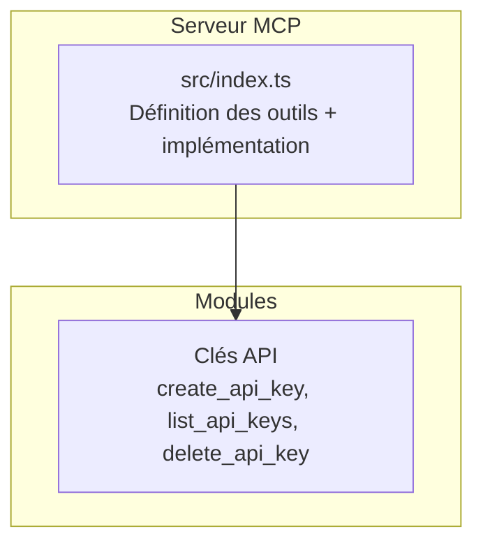
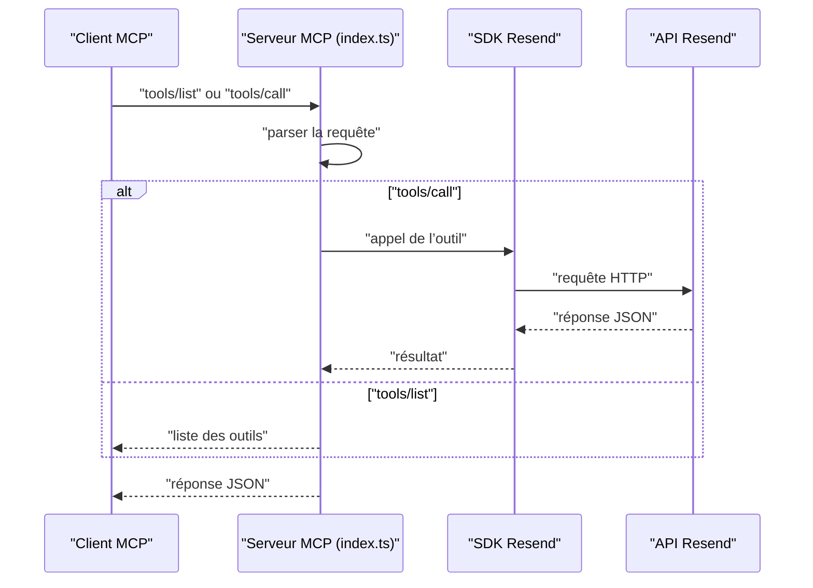
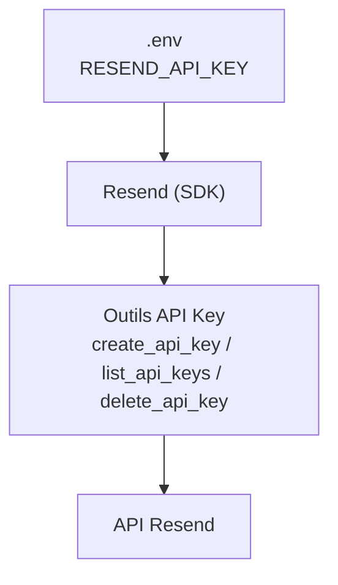

# API Clés API

<cite>
**Fichiers référencés dans ce document**
- [README.md](file://README.md)
- [package.json](file://package.json)
- [src/index.ts](file://src/index.ts)
</cite>

## Sommaire
1. [Introduction](#introduction)
2. [Structure du projet](#structure-du-projet)
3. [Composants principaux](#composants-principaux)
4. [Aperçu de l’architecture](#aperçu-de-larchitecture)
5. [Analyse détaillée des outils](#analyse-détaillée-des-outils)
6. [Analyse des dépendances](#analyse-des-dépendances)
7. [Considérations sur les performances](#considérations-sur-les-performances)
8. [Guide de résolution des problèmes](#guide-de-résolution-des-problèmes)
9. [Conclusion](#conclusion)

## Introduction
Ce document fournit une documentation complète des outils liés à la gestion des clés API (3 outils) exposés par le serveur MCP Resend. Il couvre la description de chaque outil, ses paramètres d’entrée, les schémas JSON attendus, les valeurs de retour, les codes d’erreur possibles, ainsi que des exemples de requêtes et de réponses. Des guides d’utilisation sont également inclus pour des scénarios courants tels que la création de nouvelles clés API, la gestion des permissions, et la suppression des clés obsolètes.

## Structure du projet
Le projet est un serveur MCP qui expose l’ensemble de l’API Resend sous forme d’outils invocables. La logique principale se trouve dans le fichier d’entrée TypeScript, qui définit les outils, leurs schémas d’entrée, et leur implémentation.

**Diagramme sources**
- [src/index.ts](file://src/index.ts#L319-L350)

**Section sources**
- [src/index.ts](file://src/index.ts#L1-L1002)
- [README.md](file://README.md#L39-L42)

## Composants principaux
Les outils liés aux clés API sont définis dans la liste des outils du serveur MCP. Ils permettent de créer, lister et supprimer des clés API associées au compte Resend.

- create_api_key : Crée une nouvelle clé API avec un nom et un niveau de permission.
- list_api_keys : Récupère toutes les clés API du compte.
- delete_api_key : Révoque une clé API spécifique.

**Section sources**
- [src/index.ts](file://src/index.ts#L319-L350)

## Aperçu de l’architecture
Le serveur MCP reçoit des appels via stdin, traite les méthodes tools/list et tools/call, puis renvoie des réponses via stdout. Les outils API Key utilisent l’SDK Resend pour interagir avec l’API Resend.

**Diagramme sources**
- [src/index.ts](file://src/index.ts#L1528-L1622)
- [src/index.ts](file://src/index.ts#L1008-L1522)

## Analyse détaillée des outils

### Outil : create_api_key
- Nom : create_api_key
- Description : Crée une nouvelle clé API pour votre compte.
- Paramètres d’entrée (JSON Schema)
  - name : chaîne de caractères, requis. Nom de la clé API.
  - permission : chaîne de caractères, optionnel. Niveau de permission. Valeurs autorisées : full_access, sending_access.
- Schéma JSON d’entrée
  - type : objet
  - propriétés : name, permission
  - champs requis : name
- Valeurs de retour
  - Retourne un objet représentant la clé API créée, incluant l’identifiant de la clé, le nom, le niveau de permission, et la date de création.
- Codes d’erreur possibles
  - 400 : Requête incorrecte (paramètres manquants ou invalides).
  - 401 : Non autorisé (clé API invalide ou manquante).
  - 403 : Interdit (permissions insuffisantes).
  - 422 : Entité non traitable (données valides mais invalides selon la logique métier).
  - 429 : Trop de requêtes (limite de fréquence atteinte).
  - 500 : Erreur interne du serveur.
  - 503 : Service indisponible temporairement.
- Exemple de requête (tools/call)
  - Méthode : tools/call
  - Nom de l’outil : create_api_key
  - Arguments :
    - name : "Mon application"
    - permission : "sending_access"
- Exemple de réponse (succès)
  - Contient l’objet de la clé API créée (identifiant, nom, permission, date de création).
- Exemple de réponse (erreur)
  - Contient un objet d’erreur avec le message d’erreur, le nom de l’outil et les arguments fournis.

**Section sources**
- [src/index.ts](file://src/index.ts#L319-L350)
- [src/index.ts](file://src/index.ts#L1128-L1129)
- [README.md](file://README.md#L528-L549)

### Outil : list_api_keys
- Nom : list_api_keys
- Description : Récupère toutes les clés API de votre compte.
- Paramètres d’entrée
  - Aucun paramètre requis.
- Schéma JSON d’entrée
  - type : objet
  - propriétés : aucun champ requis
- Valeurs de retour
  - Retourne une liste de clés API, chacune avec ses attributs (identifiant, nom, permission, date de création).
- Codes d’erreur possibles
  - 401 : Non autorisé (clé API invalide ou manquante).
  - 403 : Interdit (permissions insuffisantes).
  - 429 : Trop de requêtes (limite de fréquence atteinte).
  - 500 : Erreur interne du serveur.
  - 503 : Service indisponible temporairement.
- Exemple de requête (tools/call)
  - Méthode : tools/call
  - Nom de l’outil : list_api_keys
  - Arguments : aucun
- Exemple de réponse (succès)
  - Contient un tableau d’objets de clés API.
- Exemple de réponse (erreur)
  - Contient un objet d’erreur avec le message d’erreur, le nom de l’outil et les arguments fournis.

**Section sources**
- [src/index.ts](file://src/index.ts#L319-L350)
- [src/index.ts](file://src/index.ts#L1131-L1132)
- [README.md](file://README.md#L528-L549)

### Outil : delete_api_key
- Nom : delete_api_key
- Description : Révoque une clé API.
- Paramètres d’entrée (JSON Schema)
  - api_key_id : chaîne de caractères, requis. Identifiant de la clé API à supprimer.
- Schéma JSON d’entrée
  - type : objet
  - propriétés : api_key_id
  - champs requis : api_key_id
- Valeurs de retour
  - Retourne un objet indiquant la suppression réussie de la clé API (par exemple, un statut de suppression).
- Codes d’erreur possibles
  - 400 : Requête incorrecte (identifiant manquant).
  - 401 : Non autorisé (clé API invalide ou manquante).
  - 403 : Interdit (permissions insuffisantes).
  - 404 : Non trouvé (la clé API n’existe pas).
  - 429 : Trop de requêtes (limite de fréquence atteinte).
  - 500 : Erreur interne du serveur.
  - 503 : Service indisponible temporaire.
- Exemple de requête (tools/call)
  - Méthode : tools/call
  - Nom de l’outil : delete_api_key
  - Arguments :
    - api_key_id : "clé-api-id-à-supprimer"
- Exemple de réponse (succès)
  - Contient un objet de confirmation de suppression.
- Exemple de réponse (erreur)
  - Contient un objet d’erreur avec le message d’erreur, le nom de l’outil et les arguments fournis.

**Section sources**
- [src/index.ts](file://src/index.ts#L319-L350)
- [src/index.ts](file://src/index.ts#L1134-L1135)
- [README.md](file://README.md#L528-L549)

## Analyse des dépendances
Le serveur MCP repose sur le SDK Resend pour exécuter les outils. Le module principal charge la clé API depuis les variables d’environnement et appelle les méthodes correspondantes pour les outils API Key.

**Diagramme sources**
- [src/index.ts](file://src/index.ts#L1-L8)
- [src/index.ts](file://src/index.ts#L1128-L1135)
- [package.json](file://package.json#L32-L34)

**Section sources**
- [src/index.ts](file://src/index.ts#L1-L8)
- [package.json](file://package.json#L32-L34)

## Considérations sur les performances
- Le serveur MCP respecte les limites de fréquence de l’API Resend. En cas de dépassement, des erreurs 429 peuvent être retournées. Le serveur gère automatiquement les tentatives de relance si nécessaire.
- Pour éviter les surcharges, il est recommandé de limiter les appels fréquents à list_api_keys et delete_api_key, surtout en environnement de production.

[Pas de sources supplémentaires car cette section fournit des conseils généraux]

## Guide de résolution des problèmes
- Erreur : "RESEND_API_KEY environment variable is not set"
  - Cause : La clé API Resend n’est pas définie dans le fichier .env.
  - Solution : Créez un fichier .env avec la clé API Resend et redémarrez le serveur.
- Erreur : "Unknown tool"
  - Cause : Nom d’outil incorrect ou non disponible.
  - Solution : Utilisez tools/list pour obtenir la liste des outils disponibles.
- Erreur : "Tool execution failed"
  - Causes possibles : Paramètres invalides, clé API incorrecte, dépassement de limite de fréquence, erreurs réseau.
  - Solution : Vérifiez les paramètres, la clé API, et les logs pour plus de détails.

**Section sources**
- [src/index.ts](file://src/index.ts#L1571-L1577)
- [README.md](file://README.md#L551-L573)

## Conclusion
Les outils de gestion des clés API offrent une interface simple et sécurisée pour créer, lister et supprimer des clés API Resend. Leur utilisation est facilitée par le serveur MCP, qui gère l’authentification, la validation des paramètres et la gestion des erreurs. Pour des scénarios courants, privilégiez des permissions minimales (sending_access) lorsque cela est possible, gérez régulièrement les clés obsolètes, et utilisez des noms significatifs pour améliorer la traçabilité.