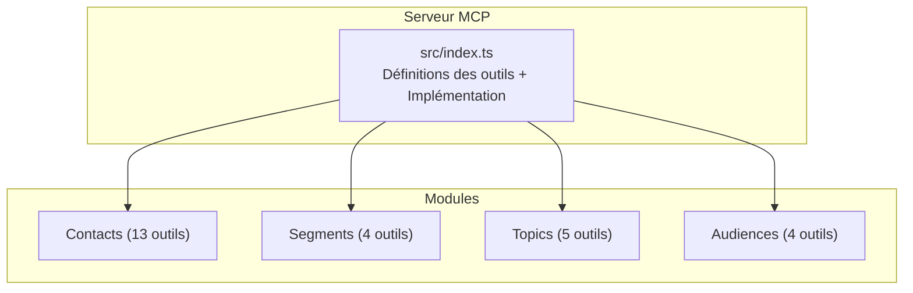
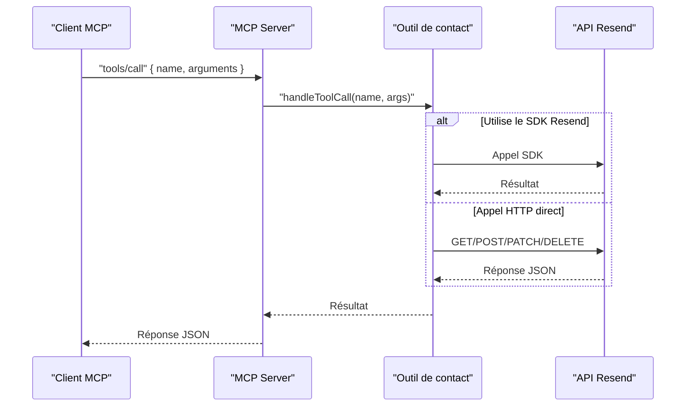
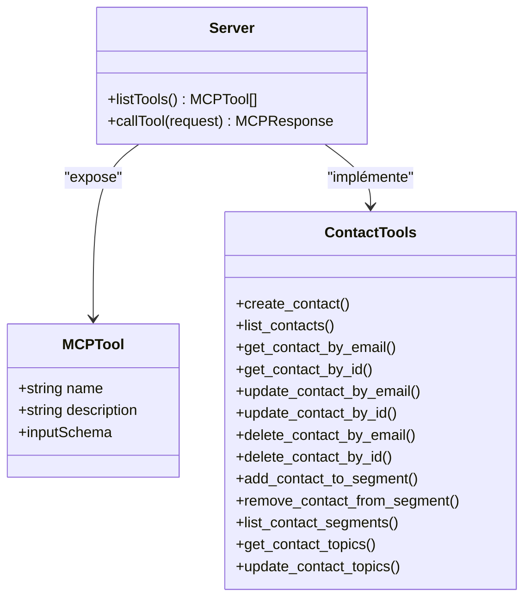

# API Contacts

<cite>
**Fichiers référencés dans ce document**
- [README.md](file://README.md)
- [src/index.ts](file://src/index.ts)
- [package.json](file://package.json)
</cite>

## Sommaire
1. [Introduction](#introduction)
2. [Structure du projet](#structure-du-projet)
3. [Composants principaux](#composants-principaux)
4. [Aperçu de l’architecture](#aperçu-de-larchitecture)
5. [Analyse détaillée des outils de contacts](#analyse-détaillée-des-outils-de-contacts)
6. [Analyse des dépendances](#analyse-des-dépendances)
7. [Considérations de performance](#considérations-de-performance)
8. [Guide de dépannage](#guide-de-dépannage)
9. [Conclusion](#conclusion)

## Introduction
Ce document fournit une documentation complète des 13 outils liés aux contacts exposés par le serveur MCP Resend. Il couvre leur nom, description, paramètres d’entrée, schémas JSON, valeurs de retour attendues, codes d’erreur possibles, ainsi que des exemples de requêtes et réponses. Des guides d’utilisation sont inclus pour des scénarios courants tels que la gestion complète des contacts, l’ajout à des segments, et la gestion des abonnements aux sujets.

## Structure du projet
Le projet est un serveur MCP qui expose l’ensemble de l’API Resend sous forme d’outils invocables. Le cœur de l’implémentation se trouve dans le fichier principal, où sont définis :
- La liste des outils (y compris les outils de contacts)
- Les schémas d’entrée pour chacun
- Les implémentations des appels outils (via le SDK Resend ou des appels HTTP directs)
- Le protocole MCP pour l’interaction client-serveur

**Diagramme sources**
- [src/index.ts](file://src/index.ts#L42-L1002)

**Section sources**
- [README.md](file://README.md#L472-L491)
- [src/index.ts](file://src/index.ts#L1-L100)

## Composants principaux
- Serveur MCP : lit les requêtes depuis stdin, exécute les outils, renvoie des réponses au format JSON.
- Outils de contacts : 13 outils pour gérer les contacts, leurs segments, et leurs abonnements aux sujets.
- Gestion des erreurs : centralisée dans le gestionnaire d’appel d’outil avec des messages d’erreur structurés.

**Section sources**
- [src/index.ts](file://src/index.ts#L1528-L1565)
- [src/index.ts](file://src/index.ts#L1008-L1522)

## Aperçu de l’architecture
Le serveur MCP implémente deux méthodes principales :
- tools/list : retourne la liste complète des outils avec leurs descriptions et schémas d’entrée.
- tools/call : exécute un outil spécifique avec ses arguments.

Les outils de contacts utilisent soit le SDK Resend (lorsque disponible), soit des appels HTTP directs à l’API Resend, selon la disponibilité de l’opération dans le SDK.

**Diagramme sources**
- [src/index.ts](file://src/index.ts#L1536-L1564)
- [src/index.ts](file://src/index.ts#L1008-L1522)

## Analyse détaillée des outils de contacts

### create_contact
- Nom : create_contact
- Description : Ajouter un nouveau contact à une audience.
- Paramètres d’entrée
  - audience_id : chaîne, requis
  - email : chaîne, requis
  - first_name : chaîne, optionnel
  - last_name : chaîne, optionnel
  - unsubscribed : booléen, optionnel
- Schéma JSON
  - type : objet
  - propriétés : audience_id, email, first_name, last_name, unsubscribed
  - requis : audience_id, email
- Valeurs de retour
  - Objet contact créé (structure conforme à l’API Resend)
- Codes d’erreur possibles
  - 400 : données invalides ou manquantes
  - 401 : non autorisé
  - 403 : accès interdit
  - 404 : audience non trouvée
  - 409 : conflit (contact déjà présent)
  - 422 : données non valides
  - 429 : trop de requêtes
  - 500 : erreur serveur
  - 503 : service indisponible
- Exemple de requête
  - tools/call { name: "create_contact", arguments: { audience_id: "...", email: "alice@example.com", first_name: "Alice", last_name: "Dupont", unsubscribed: false } }
- Exemple de réponse
  - { id: "...", email: "alice@example.com", firstName: "Alice", lastName: "Dupont", unsubscribed: false, createdAt: "..." }

**Section sources**
- [src/index.ts](file://src/index.ts#L397-L410)
- [README.md](file://README.md#L50-L63)

### list_contacts
- Nom : list_contacts
- Description : Lister tous les contacts d’une audience.
- Paramètres d’entrée
  - audience_id : chaîne, requis
- Schéma JSON
  - type : objet
  - propriétés : audience_id
  - requis : audience_id
- Valeurs de retour
  - Liste de contacts (tableau)
- Codes d’erreur possibles
  - 400, 401, 403, 404, 422, 429, 500, 503

**Section sources**
- [src/index.ts](file://src/index.ts#L412-L421)
- [README.md](file://README.md#L50-L63)

### get_contact_by_email
- Nom : get_contact_by_email
- Description : Récupérer un contact par son adresse email.
- Paramètres d’entrée
  - audience_id : chaîne, requis
  - email : chaîne, requis
- Schéma JSON
  - type : objet
  - propriétés : audience_id, email
  - requis : audience_id, email
- Valeurs de retour
  - Contact correspondant
- Codes d’erreur possibles
  - 404 : contact introuvable

**Section sources**
- [src/index.ts](file://src/index.ts#L423-L433)
- [README.md](file://README.md#L50-L63)

### get_contact_by_id
- Nom : get_contact_by_id
- Description : Récupérer un contact par son identifiant.
- Paramètres d’entrée
  - audience_id : chaîne, requis
  - contact_id : chaîne, requis
- Schéma JSON
  - type : objet
  - propriétés : audience_id, contact_id
  - requis : audience_id, contact_id
- Valeurs de retour
  - Contact correspondant
- Codes d’erreur possibles
  - 404 : contact introuvable

**Section sources**
- [src/index.ts](file://src/index.ts#L435-L445)
- [README.md](file://README.md#L50-L63)

### update_contact_by_email
- Nom : update_contact_by_email
- Description : Mettre à jour un contact par son email.
- Paramètres d’entrée
  - audience_id : chaîne, requis
  - email : chaîne, requis
  - first_name : chaîne, optionnel
  - last_name : chaîne, optionnel
  - unsubscribed : booléen, optionnel
- Schéma JSON
  - type : objet
  - propriétés : audience_id, email, first_name, last_name, unsubscribed
  - requis : audience_id, email
- Valeurs de retour
  - Contact mis à jour
- Codes d’erreur possibles
  - 404 : contact introuvable

**Section sources**
- [src/index.ts](file://src/index.ts#L447-L460)
- [README.md](file://README.md#L50-L63)

### update_contact_by_id
- Nom : update_contact_by_id
- Description : Mettre à jour un contact par son identifiant.
- Paramètres d’entrée
  - audience_id : chaîne, requis
  - contact_id : chaîne, requis
  - first_name : chaîne, optionnel
  - last_name : chaîne, optionnel
  - unsubscribed : booléen, optionnel
- Schéma JSON
  - type : objet
  - propriétés : audience_id, contact_id, first_name, last_name, unsubscribed
  - requis : audience_id, contact_id
- Valeurs de retour
  - Contact mis à jour
- Codes d’erreur possibles
  - 404 : contact introuvable

**Section sources**
- [src/index.ts](file://src/index.ts#L462-L475)
- [README.md](file://README.md#L50-L63)

### delete_contact_by_email
- Nom : delete_contact_by_email
- Description : Supprimer un contact par son email.
- Paramètres d’entrée
  - audience_id : chaîne, requis
  - email : chaîne, requis
- Schéma JSON
  - type : objet
  - propriétés : audience_id, email
  - requis : audience_id, email
- Valeurs de retour
  - Statut de suppression
- Codes d’erreur possibles
  - 404 : contact introuvable

**Section sources**
- [src/index.ts](file://src/index.ts#L477-L487)
- [README.md](file://README.md#L50-L63)

### delete_contact_by_id
- Nom : delete_contact_by_id
- Description : Supprimer un contact par son identifiant.
- Paramètres d’entrée
  - audience_id : chaîne, requis
  - contact_id : chaîne, requis
- Schéma JSON
  - type : objet
  - propriétés : audience_id, contact_id
  - requis : audience_id, contact_id
- Valeurs de retour
  - Statut de suppression
- Codes d’erreur possibles
  - 404 : contact introuvable

**Section sources**
- [src/index.ts](file://src/index.ts#L489-L500)
- [README.md](file://README.md#L50-L63)

### add_contact_to_segment
- Nom : add_contact_to_segment
- Description : Ajouter un contact à un segment.
- Paramètres d’entrée
  - audience_id : chaîne, requis
  - contact_id : chaîne, requis
  - segment_id : chaîne, requis
- Schéma JSON
  - type : objet
  - propriétés : audience_id, contact_id, segment_id
  - requis : audience_id, contact_id, segment_id
- Valeurs de retour
  - Résultat de l’ajout
- Codes d’erreur possibles
  - 404 : ressource introuvable
  - 409 : conflit (déjà dans le segment)

**Section sources**
- [src/index.ts](file://src/index.ts#L501-L512)
- [README.md](file://README.md#L50-L63)

### remove_contact_from_segment
- Nom : remove_contact_from_segment
- Description : Retirer un contact d’un segment.
- Paramètres d’entrée
  - audience_id : chaîne, requis
  - contact_id : chaîne, requis
  - segment_id : chaîne, requis
- Schéma JSON
  - type : objet
  - propriétés : audience_id, contact_id, segment_id
  - requis : audience_id, contact_id, segment_id
- Valeurs de retour
  - Résultat de la suppression
- Codes d’erreur possibles
  - 404 : ressource introuvable

**Section sources**
- [src/index.ts](file://src/index.ts#L514-L525)
- [README.md](file://README.md#L50-L63)

### list_contact_segments
- Nom : list_contact_segments
- Description : Lister tous les segments auxquels appartient un contact.
- Paramètres d’entrée
  - audience_id : chaîne, requis
  - contact_id : chaîne, requis
  - limit : nombre, optionnel
  - after : chaîne, optionnel
  - before : chaîne, optionnel
- Schéma JSON
  - type : objet
  - propriétés : audience_id, contact_id, limit, after, before
  - requis : audience_id, contact_id
- Valeurs de retour
  - Liste des segments
- Codes d’erreur possibles
  - 404 : contact introuvable

**Section sources**
- [src/index.ts](file://src/index.ts#L527-L540)
- [README.md](file://README.md#L50-L63)

### get_contact_topics
- Nom : get_contact_topics
- Description : Récupérer les abonnements aux sujets d’un contact.
- Paramètres d’entrée
  - audience_id : chaîne, requis
  - contact_id : chaîne, requis
  - limit : nombre, optionnel
  - after : chaîne, optionnel
  - before : chaîne, optionnel
- Schéma JSON
  - type : objet
  - propriétés : audience_id, contact_id, limit, after, before
  - requis : audience_id, contact_id
- Valeurs de retour
  - Liste des abonnements aux sujets
- Codes d’erreur possibles
  - 404 : contact introuvable

**Section sources**
- [src/index.ts](file://src/index.ts#L542-L555)
- [README.md](file://README.md#L50-L63)

### update_contact_topics
- Nom : update_contact_topics
- Description : Mettre à jour les abonnements aux sujets d’un contact.
- Paramètres d’entrée
  - audience_id : chaîne, requis
  - contact_id : chaîne, requis
  - topics : tableau d’objets, requis
    - id : chaîne
    - subscribed : booléen
- Schéma JSON
  - type : objet
  - propriétés : audience_id, contact_id, topics
  - requis : audience_id, contact_id, topics
- Valeurs de retour
  - Résultat de mise à jour
- Codes d’erreur possibles
  - 404 : contact introuvable
  - 422 : données invalides

**Section sources**
- [src/index.ts](file://src/index.ts#L557-L577)
- [README.md](file://README.md#L50-L63)

## Aperçu de l’architecture

**Diagramme sources**
- [src/index.ts](file://src/index.ts#L13-L36)
- [src/index.ts](file://src/index.ts#L42-L1002)
- [src/index.ts](file://src/index.ts#L1528-L1565)

## Guides d’utilisation

### Scénario 1 : Création et mise à jour d’un contact
- Étapes
  - Créer un contact : tools/call { name: "create_contact", arguments: { audience_id: "...", email: "alice@example.com", first_name: "Alice", last_name: "Dupont" } }
  - Mettre à jour le prénom : tools/call { name: "update_contact_by_email", arguments: { audience_id: "...", email: "alice@example.com", first_name: "AliceUpdated" } }
  - Vérifier la mise à jour : tools/call { name: "get_contact_by_email", arguments: { audience_id: "...", email: "alice@example.com" } }

### Scénario 2 : Gestion des segments
- Étapes
  - Ajouter à un segment : tools/call { name: "add_contact_to_segment", arguments: { audience_id: "...", contact_id: "...", segment_id: "..." } }
  - Lister les segments : tools/call { name: "list_contact_segments", arguments: { audience_id: "...", contact_id: "..." } }
  - Retirer d’un segment : tools/call { name: "remove_contact_from_segment", arguments: { audience_id: "...", contact_id: "...", segment_id: "..." } }

### Scénario 3 : Gestion des abonnements aux sujets
- Étapes
  - Obtenir les abonnements : tools/call { name: "get_contact_topics", arguments: { audience_id: "...", contact_id: "..." } }
  - Mettre à jour les abonnements : tools/call { name: "update_contact_topics", arguments: { audience_id: "...", contact_id: "...", topics: [ { id: "...", subscribed: true }, { id: "...", subscribed: false } ] } }

### Scénario 4 : Suppression d’un contact
- Étapes
  - Supprimer par email : tools/call { name: "delete_contact_by_email", arguments: { audience_id: "...", email: "alice@example.com" } }
  - Supprimer par ID : tools/call { name: "delete_contact_by_id", arguments: { audience_id: "...", contact_id: "..." } }

## Analyse des dépendances
- Dépendances
  - Resend SDK : utilisé pour les appels directs lorsque le SDK prend en charge l’opération.
  - dotenv : lecture des variables d’environnement.
  - Node.js : exécution serveur MCP.
- Configuration
  - RESEND_API_KEY : clé d’API Resend requise.
  - RESEND_API_BASE_URL : URL de base de l’API (optionnelle).
  - DEBUG et RATE_LIMIT : options de débogage et de limitation de taux.

**Section sources**
- [package.json](file://package.json#L32-L43)
- [README.md](file://README.md#L180-L207)

## Considérations de performance
- Taux de limitation : le serveur respecte les limites de l’API Resend (par défaut 2 requêtes/seconde, avec des pics jusqu’à 10).
- Gestion des erreurs : les appels sont encapsulés pour éviter les plantages et fournir des messages d’erreur structurés.
- Pagination : plusieurs outils prennent en charge limit, after, before pour gérer les grands volumes de données.

[Pas de sources supplémentaires car cette section fournit des conseils généraux]

## Guide de dépannage
- Erreur : clé API manquante
  - Message : "RESEND_API_KEY environment variable is not set"
  - Solution : créer un fichier .env contenant la clé API Resend.
- Erreur : outil inconnu
  - Message : "Unknown tool: ..."
  - Solution : utiliser tools/list pour obtenir la liste des outils disponibles.
- Erreurs fréquentes
  - 400 : paramètres invalides
  - 401 : clé API invalide
  - 403 : accès refusé
  - 404 : ressource introuvable
  - 409 : conflit
  - 422 : données non valides
  - 429 : dépassement de limite de taux
  - 500 : erreur serveur
  - 503 : service indisponible

**Section sources**
- [README.md](file://README.md#L528-L549)
- [src/index.ts](file://src/index.ts#L1571-L1577)
- [src/index.ts](file://src/index.ts#L1516-L1522)

## Conclusion
Le module de contacts offre un ensemble complet d’outils pour gérer les audiences, les contacts, les segments et les abonnements aux sujets. Grâce aux schémas d’entrée clairs, aux retours structurés et aux codes d’erreur standardisés, il est facile d’intégrer ces outils dans des flux automatisés ou des assistants IA. Pour des cas d’usage avancés, combinez les outils de contacts avec ceux des audiences, des segments et des sujets pour des campagnes ciblées et bien gérées.