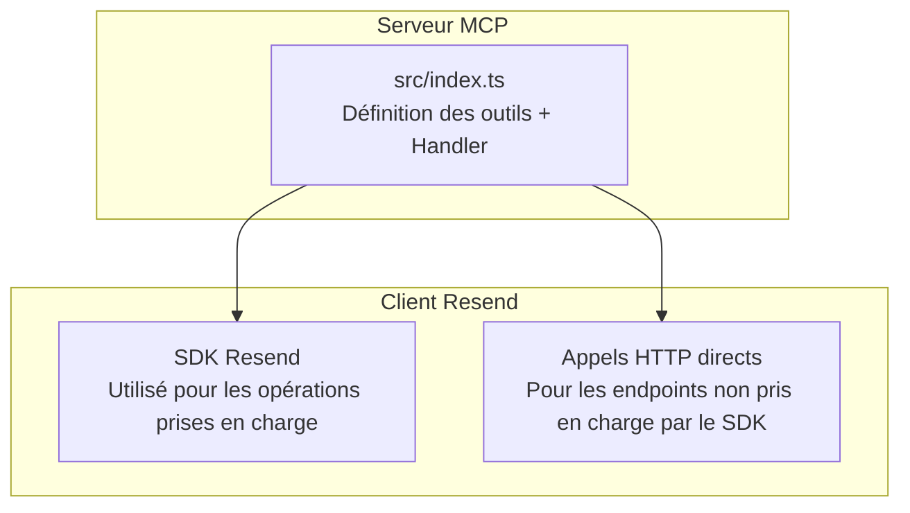
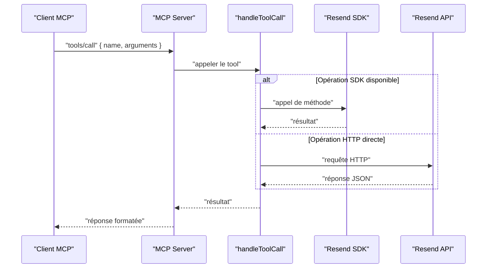

# API Domaines

<cite>
**Fichiers référencés dans ce document**
- [README.md](file://README.md)
- [package.json](file://package.json)
- [src/index.ts](file://src/index.ts)
</cite>

## Sommaire
1. [Introduction](#introduction)
2. [Structure du projet](#structure-du-projet)
3. [Outils de gestion des domaines](#outils-de-gestion-des-domaines)
4. [Architecture de l’API](#architecture-de-l-api)
5. [Analyse détaillée des outils](#analyse-détaillée-des-outils)
6. [Contraintes et règles](#contraintes-et-règles)
7. [Exemples d’utilisation](#exemples-dutilisation)
8. [Guide d’implémentation](#guide-dimplémentation)
9. [Gestion des erreurs](#gestion-des-erreurs)
10. [Conclusion](#conclusion)

## Introduction
Ce document fournit une documentation complète des outils liés aux domaines de l’API Resend exposés via le Model Context Protocol (MCP). Il couvre six outils : create_domain, list_domains, get_domain, update_domain, delete_domain, verify_domain. Pour chacun, vous trouverez le nom, la description, les paramètres d’entrée, les schémas JSON, les valeurs de retour attendues, les codes d’erreur possibles, ainsi que des exemples de requêtes et réponses détaillés.

## Structure du projet
Le serveur MCP est implémenté en TypeScript avec un client Resend pour appeler l’API. Les outils sont définis dans un tableau centralisé et gérés dynamiquement via un handler qui appelle soit le SDK Resend, soit des appels HTTP directs vers l’API REST de Resend.

**Diagramme sources**
- [src/index.ts](file://src/index.ts#L1008-L1522)

**Section sources**
- [src/index.ts](file://src/index.ts#L1-L1002)
- [package.json](file://package.json#L1-L49)

## Outils de gestion des domaines
Voici la liste complète des outils de gestion des domaines, avec leurs descriptions et leurs rôles respectifs dans le flux de travail de configuration et de vérification des domaines.

- create_domain : Ajouter un nouveau domaine à votre compte Resend.
- list_domains : Lister tous les domaines configurés.
- get_domain : Récupérer les détails d’un domaine spécifique.
- update_domain : Mettre à jour les paramètres de suivi (open_tracking, click_tracking).
- delete_domain : Supprimer un domaine de votre compte.
- verify_domain : Vérifier les enregistrements DNS pour l’authentification du domaine.

**Section sources**
- [README.md](file://README.md#L31-L37)
- [src/index.ts](file://src/index.ts#L251-L317)

## Architecture de l’API
Le serveur MCP expose les outils sous forme de méthodes invocables. Le handler effectue les appels au SDK Resend ou via des requêtes HTTP, selon la disponibilité de l’opération dans le SDK. Pour les domaines, la plupart des opérations sont gérées directement par le SDK Resend, tandis que certaines opérations (comme update_domain) utilisent des appels HTTP directs.

**Diagramme sources**
- [src/index.ts](file://src/index.ts#L1008-L1522)

## Analyse détaillée des outils

### create_domain
- Nom : create_domain
- Description : Ajoute un nouveau domaine à votre compte Resend.
- Paramètres d’entrée
  - name : chaîne de caractères (obligatoire)
  - region : chaîne de caractères (facultatif)
- Schéma JSON d’entrée
  - type : object
  - propriétés : name, region
  - requis : name
- Valeurs de retour
  - Objet contenant les détails du domaine créé (nom, région, statut, enregistrements DNS).
- Codes d’erreur possibles
  - 400 : Paramètre invalide ou manquant.
  - 401 : Accès non autorisé.
  - 403 : Accès interdit.
  - 409 : Conflit (domaine déjà existant).
  - 422 : Données non valides.
  - 429 : Trop de requêtes.
  - 500 : Erreur serveur.
  - 503 : Service indisponible.
- Exemple de requête
  - {
      "method": "tools/call",
      "params": {
        "name": "create_domain",
        "arguments": {
          "name": "example.com",
          "region": "us-east-1"
        }
      }
    }
- Exemple de réponse
  - {
      "id": "domain_id",
      "name": "example.com",
      "status": "pending",
      "region": "us-east-1",
      "dns_records": [
        {
          "type": "MX",
          "name": "@",
          "content": "mx.resend.com",
          "ttl": 3600
        },
        {
          "type": "TXT",
          "name": "@",
          "content": "\"v=spf1 include:spf.resend.com ~all\"",
          "ttl": 3600
        },
        {
          "type": "CNAME",
          "name": "email",
          "content": "cname.resend.com",
          "ttl": 3600
        }
      ]
    }

**Section sources**
- [src/index.ts](file://src/index.ts#L251-L263)
- [README.md](file://README.md#L331-L352)

### list_domains
- Nom : list_domains
- Description : Liste tous les domaines configurés dans votre compte.
- Paramètres d’entrée : aucun
- Schéma JSON d’entrée
  - type : object
  - propriétés : aucun
- Valeurs de retour
  - Tableau d’objets représentant les domaines (id, name, status, region).
- Codes d’erreur possibles
  - 401 : Accès non autorisé.
  - 403 : Accès interdit.
  - 429 : Trop de requêtes.
  - 500 : Erreur serveur.
  - 503 : Service indisponible.
- Exemple de requête
  - {
      "method": "tools/call",
      "params": {
        "name": "list_domains",
        "arguments": {}
      }
    }
- Exemple de réponse
  - [
      {
        "id": "domain_id_1",
        "name": "example.com",
        "status": "active",
        "region": "us-east-1"
      },
      {
        "id": "domain_id_2",
        "name": "test.org",
        "status": "pending",
        "region": "eu-west-1"
      }
    ]

**Section sources**
- [src/index.ts](file://src/index.ts#L264-L271)

### get_domain
- Nom : get_domain
- Description : Récupère les détails d’un domaine spécifique.
- Paramètres d’entrée
  - domain_id : chaîne de caractères (obligatoire)
- Schéma JSON d’entrée
  - type : object
  - propriétés : domain_id
  - requis : domain_id
- Valeurs de retour
  - Objet contenant les détails du domaine (id, name, status, region, dns_records).
- Codes d’erreur possibles
  - 401 : Accès non autorisé.
  - 403 : Accès interdit.
  - 404 : Domaine introuvable.
  - 429 : Trop de requêtes.
  - 500 : Erreur serveur.
  - 503 : Service indisponible.
- Exemple de requête
  - {
      "method": "tools/call",
      "params": {
        "name": "get_domain",
        "arguments": {
          "domain_id": "domain_id"
        }
      }
    }
- Exemple de réponse
  - {
      "id": "domain_id",
      "name": "example.com",
      "status": "active",
      "region": "us-east-1",
      "dns_records": [
        {
          "type": "MX",
          "name": "@",
          "content": "mx.resend.com",
          "ttl": 3600
        },
        {
          "type": "TXT",
          "name": "@",
          "content": "\"v=spf1 include:spf.resend.com ~all\"",
          "ttl": 3600
        },
        {
          "type": "CNAME",
          "name": "email",
          "content": "cname.resend.com",
          "ttl": 3600
        }
      ]
    }

**Section sources**
- [src/index.ts](file://src/index.ts#L272-L282)

### update_domain
- Nom : update_domain
- Description : Met à jour les paramètres de suivi d’un domaine (open_tracking, click_tracking).
- Paramètres d’entrée
  - domain_id : chaîne de caractères (obligatoire)
  - open_tracking : booléen (facultatif)
  - click_tracking : booléen (facultatif)
- Schéma JSON d’entrée
  - type : object
  - propriétés : domain_id, open_tracking, click_tracking
  - requis : domain_id
- Valeurs de retour
  - Objet contenant le statut mis à jour du domaine.
- Codes d’erreur possibles
  - 400 : Paramètre invalide.
  - 401 : Accès non autorisé.
  - 403 : Accès interdit.
  - 404 : Domaine introuvable.
  - 429 : Trop de requêtes.
  - 500 : Erreur serveur.
  - 503 : Service indisponible.
- Exemple de requête
  - {
      "method": "tools/call",
      "params": {
        "name": "update_domain",
        "arguments": {
          "domain_id": "domain_id",
          "open_tracking": true,
          "click_tracking": false
        }
      }
    }
- Exemple de réponse
  - {
      "id": "domain_id",
      "name": "example.com",
      "status": "active",
      "open_tracking": true,
      "click_tracking": false
    }

**Section sources**
- [src/index.ts](file://src/index.ts#L283-L295)

### delete_domain
- Nom : delete_domain
- Description : Supprime un domaine de votre compte.
- Paramètres d’entrée
  - domain_id : chaîne de caractères (obligatoire)
- Schéma JSON d’entrée
  - type : object
  - propriétés : domain_id
  - requis : domain_id
- Valeurs de retour
  - Objet indiquant la suppression réussie.
- Codes d’erreur possibles
  - 401 : Accès non autorisé.
  - 403 : Accès interdit.
  - 404 : Domaine introuvable.
  - 409 : Conflit (dépendances actives).
  - 429 : Trop de requêtes.
  - 500 : Erreur serveur.
  - 503 : Service indisponible.
- Exemple de requête
  - {
      "method": "tools/call",
      "params": {
        "name": "delete_domain",
        "arguments": {
          "domain_id": "domain_id"
        }
      }
    }
- Exemple de réponse
  - {
      "message": "Domain deleted successfully"
    }

**Section sources**
- [src/index.ts](file://src/index.ts#L296-L306)

### verify_domain
- Nom : verify_domain
- Description : Vérifie les enregistrements DNS pour l’authentification du domaine.
- Paramètres d’entrée
  - domain_id : chaîne de caractères (obligatoire)
- Schéma JSON d’entrée
  - type : object
  - propriétés : domain_id
  - requis : domain_id
- Valeurs de retour
  - Objet contenant le statut de vérification (par exemple, pending, verified).
- Codes d’erreur possibles
  - 401 : Accès non autorisé.
  - 403 : Accès interdit.
  - 404 : Domaine introuvable.
  - 429 : Trop de requêtes.
  - 500 : Erreur serveur.
  - 503 : Service indisponible.
- Exemple de requête
  - {
      "method": "tools/call",
      "params": {
        "name": "verify_domain",
        "arguments": {
          "domain_id": "domain_id"
        }
      }
    }
- Exemple de réponse
  - {
      "status": "verified"
    }

**Section sources**
- [src/index.ts](file://src/index.ts#L307-L317)

## Contraintes et règles
- Régions disponibles
  - us-east-1
  - eu-west-1
  - sa-east-1
- Paramètres de suivi
  - open_tracking : booléen
  - click_tracking : booléen
- Vérification DNS
  - Lors de la création d’un domaine, des enregistrements DNS (MX, TXT, CNAME) sont fournis pour l’authentification.
  - La vérification du domaine met à jour le statut en fonction de la présence de ces enregistrements.

**Section sources**
- [README.md](file://README.md#L331-L352)
- [src/index.ts](file://src/index.ts#L255-L259)
- [src/index.ts](file://src/index.ts#L310-L316)

## Exemples d’utilisation

### Scénario 1 : Ajouter un nouveau domaine
- Étapes
  - Appeler create_domain avec name et region.
  - Enregistrer les enregistrements DNS fournis.
  - Attendre la vérification DNS.
- Exemple de requête
  - {
      "method": "tools/call",
      "params": {
        "name": "create_domain",
        "arguments": {
          "name": "example.com",
          "region": "us-east-1"
        }
      }
    }
- Exemple de réponse
  - {
      "id": "domain_id",
      "name": "example.com",
      "status": "pending",
      "region": "us-east-1",
      "dns_records": [
        {
          "type": "MX",
          "name": "@",
          "content": "mx.resend.com",
          "ttl": 3600
        },
        {
          "type": "TXT",
          "name": "@",
          "content": "\"v=spf1 include:spf.resend.com ~all\"",
          "ttl": 3600
        },
        {
          "type": "CNAME",
          "name": "email",
          "content": "cname.resend.com",
          "ttl": 3600
        }
      ]
    }

**Section sources**
- [README.md](file://README.md#L331-L352)
- [src/index.ts](file://src/index.ts#L251-L263)

### Scénario 2 : Vérification des enregistrements DNS
- Étapes
  - Appeler verify_domain avec domain_id.
  - Vérifier le statut retourné (pending, verified).
- Exemple de requête
  - {
      "method": "tools/call",
      "params": {
        "name": "verify_domain",
        "arguments": {
          "domain_id": "domain_id"
        }
      }
    }
- Exemple de réponse
  - {
      "status": "verified"
    }

**Section sources**
- [src/index.ts](file://src/index.ts#L307-L317)

### Scénario 3 : Mise à jour des paramètres de suivi
- Étapes
  - Appeler update_domain avec domain_id, open_tracking, click_tracking.
  - Vérifier le statut mis à jour.
- Exemple de requête
  - {
      "method": "tools/call",
      "params": {
        "name": "update_domain",
        "arguments": {
          "domain_id": "domain_id",
          "open_tracking": true,
          "click_tracking": false
        }
      }
    }
- Exemple de réponse
  - {
      "id": "domain_id",
      "name": "example.com",
      "status": "active",
      "open_tracking": true,
      "click_tracking": false
    }

**Section sources**
- [src/index.ts](file://src/index.ts#L283-L295)

## Guide d’implémentation
- Configuration de l’environnement
  - Définir RESEND_API_KEY dans le fichier .env.
  - Utiliser le serveur MCP avec un client compatible (Claude Desktop, Continue, Cline, etc.).
- Sécurité
  - Ne jamais stocker d’informations sensibles dans le code.
  - Utiliser des clés API avec permissions minimales nécessaires.
- Gestion des erreurs
  - Implémenter des vérifications préalables (paramètres requis, format des identifiants).
  - Gérer les codes d’erreur spécifiques (401, 403, 404, 409, 422, 429, 500, 503).
- Performances
  - Respecter les limites de taux (2 requêtes/seconde par défaut).
  - Mettre en œuvre des stratégies de retry avec backoff exponentiel.

**Section sources**
- [README.md](file://README.md#L180-L210)
- [README.md](file://README.md#L518-L549)

## Gestion des erreurs
- Codes fréquents
  - 400 : Données d’entrée invalides.
  - 401 : Clé API manquante ou invalide.
  - 403 : Permissions insuffisantes.
  - 404 : Ressource introuvable.
  - 409 : Conflit (ressource existante).
  - 422 : Données valides mais logiquement incorrectes.
  - 429 : Limite de taux atteinte.
  - 500 : Erreur interne du service.
  - 503 : Service temporairement indisponible.
- Recommandations
  - Valider les paramètres avant l’appel.
  - Logger les erreurs avec contexte (tool, arguments).
  - Proposer des messages d’erreur clairs à l’utilisateur.

**Section sources**
- [README.md](file://README.md#L528-L549)

## Conclusion
Les outils de gestion des domaines offrent un ensemble complet de fonctionnalités pour ajouter, lister, récupérer, mettre à jour, supprimer et vérifier les domaines. Leur implémentation repose sur le SDK Resend pour la plupart des opérations, avec des appels HTTP directs pour celles non prises en charge. Suivez les contraintes de région, de suivi et de vérification DNS pour garantir un déploiement réussi et sécurisé.