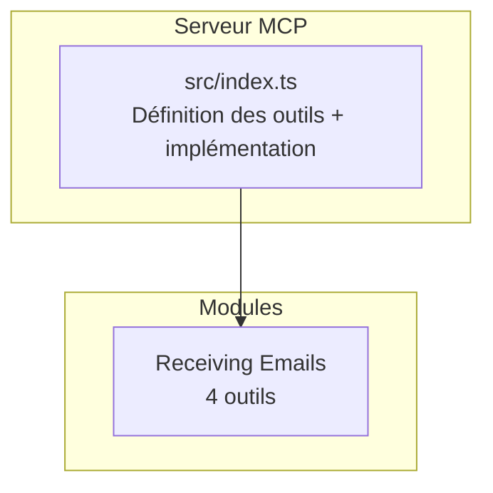
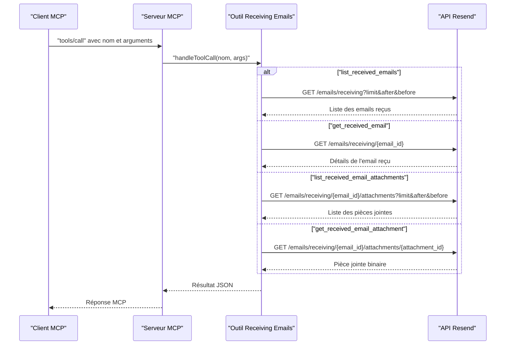

# API Emails Reçus

<cite>
**Fichiers référencés dans ce document**
- [README.md](file://README.md)
- [package.json](file://package.json)
- [src/index.ts](file://src/index.ts)
</cite>

## Sommaire
1. [Introduction](#introduction)
2. [Structure du projet](#structure-du-projet)
3. [Composants principaux](#composants-principaux)
4. [Aperçu de l’architecture](#aperçu-de-larchitecture)
5. [Analyse détaillée des outils](#analyse-détaillée-des-outils)
6. [Analyse des dépendances](#analyse-des-dépendances)
7. [Considérations de performance](#considérations-de-performance)
8. [Guide de dépannage](#guide-de-dépannage)
9. [Conclusion](#conclusion)

## Introduction
Ce document fournit une documentation complète des quatre outils liés aux emails reçus (inbound) exposés par le serveur MCP Resend. Il couvre leur nom, description, paramètres d’entrée, schémas JSON, valeurs de retour, codes d’erreur possibles, ainsi que des exemples de requêtes et réponses. Des guides d’utilisation sont également inclus pour des scénarios courants tels que la récupération de la liste des emails reçus, l’affichage des détails d’un email spécifique, et la gestion des pièces jointes reçues.

## Structure du projet
Le projet est un serveur MCP qui expose l’ensemble de l’API Resend sous forme d’outils invocables. Le cœur de l’implémentation se trouve dans le fichier principal, qui définit les outils, leurs schémas d’entrée, et leurs implémentations.

**Diagramme sources**
- [src/index.ts](file://src/index.ts#L200-L249)

**Section sources**
- [src/index.ts](file://src/index.ts#L1-L100)
- [README.md](file://README.md#L25-L29)

## Composants principaux
Les outils liés aux emails reçus sont définis dans le tableau des outils MCP. Chacun possède un nom, une description, et un schéma d’entrée JSON précis.

- list_received_emails
- get_received_email
- list_received_email_attachments
- get_received_email_attachment

Ces outils permettent de :
- Lister les emails reçus avec pagination
- Obtenir les détails d’un email reçu spécifique
- Répertorier les pièces jointes d’un email reçu
- Télécharger une pièce jointe spécifique d’un email reçu

**Section sources**
- [src/index.ts](file://src/index.ts#L200-L249)

## Aperçu de l’architecture
Le serveur MCP reçoit des appels via stdin, traite les méthodes tools/list et tools/call, puis exécute les outils correspondants. Pour les outils de type “receiving emails”, l’implémentation effectue des appels HTTP directs à l’API Resend.

**Diagramme sources**
- [src/index.ts](file://src/index.ts#L1070-L1097)

## Analyse détaillée des outils

### list_received_emails
- Nom : list_received_emails
- Description : Récupère une liste des emails reçus avec prise en charge de la pagination.
- Paramètres d’entrée
  - limit : nombre maximal d’éléments à retourner (entier)
  - after : curseur pour obtenir les éléments après cette valeur
  - before : curseur pour obtenir les éléments avant cette valeur
- Schéma JSON
  - type : object
  - propriétés : limit (number), after (string), before (string)
- Valeurs de retour
  - Tableau de emails reçus avec métadonnées (identifiants, dates, expéditeurs, sujets, etc.)
  - Pagination via curseurs (after/before)
- Codes d’erreur possibles
  - 401 Non autorisé (clé API invalide/absente)
  - 403 Interdit (permissions insuffisantes)
  - 400 Mauvaise requête (paramètres invalides)
  - 429 Trop de requêtes (limite de débit atteinte)
  - 500 Erreur interne (problème serveur Resend)
- Exemple de requête
  - Méthode : tools/call
  - Nom : list_received_emails
  - Arguments : { "limit": 20, "after": "cursor_valeur" }
- Exemple de réponse
  - Contient un tableau d’emails reçus et éventuellement des curseurs de pagination

**Section sources**
- [src/index.ts](file://src/index.ts#L200-L212)
- [src/index.ts](file://src/index.ts#L1071-L1078)
- [README.md](file://README.md#L528-L549)

### get_received_email
- Nom : get_received_email
- Description : Récupère les détails d’un email reçu spécifique.
- Paramètres d’entrée
  - email_id : identifiant de l’email reçu (chaîne)
- Schéma JSON
  - type : object
  - propriétés : email_id (string)
  - requis : email_id
- Valeurs de retour
  - Détails de l’email reçu (expéditeur, destinataire, sujet, corps, en-têtes, pièces jointes, etc.)
- Codes d’erreur possibles
  - 404 Non trouvé (email inexistant)
  - 401/403/400/429/500 (mêmes que ci-dessus)
- Exemple de requête
  - Méthode : tools/call
  - Nom : get_received_email
  - Arguments : { "email_id": "re_xxx" }
- Exemple de réponse
  - Objet contenant les détails de l’email reçu

**Section sources**
- [src/index.ts](file://src/index.ts#L213-L223)
- [src/index.ts](file://src/index.ts#L1080-L1083)
- [README.md](file://README.md#L528-L549)

### list_received_email_attachments
- Nom : list_received_email_attachments
- Description : Récupère la liste des pièces jointes d’un email reçu.
- Paramètres d’entrée
  - email_id : identifiant de l’email reçu (chaîne)
  - limit : nombre maximal de pièces jointes à retourner (entier)
  - after : curseur pour obtenir les éléments après cette valeur
  - before : curseur pour obtenir les éléments avant cette valeur
- Schéma JSON
  - type : object
  - propriétés : email_id (string), limit (number), after (string), before (string)
  - requis : email_id
- Valeurs de retour
  - Tableau de pièces jointes avec identifiants, noms, tailles, types MIME
  - Pagination via curseurs (after/before)
- Codes d’erreur possibles
  - 404 Non trouvé (email inexistant)
  - 401/403/400/429/500 (mêmes que ci-dessus)
- Exemple de requête
  - Méthode : tools/call
  - Nom : list_received_email_attachments
  - Arguments : { "email_id": "re_xxx", "limit": 10 }
- Exemple de réponse
  - Objet contenant la liste des pièces jointes

**Section sources**
- [src/index.ts](file://src/index.ts#L224-L237)
- [src/index.ts](file://src/index.ts#L1085-L1092)
- [README.md](file://README.md#L528-L549)

### get_received_email_attachment
- Nom : get_received_email_attachment
- Description : Récupère une pièce jointe spécifique d’un email reçu.
- Paramètres d’entrée
  - email_id : identifiant de l’email reçu (chaîne)
  - attachment_id : identifiant de la pièce jointe (chaîne)
- Schéma JSON
  - type : object
  - propriétés : email_id (string), attachment_id (string)
  - requis : email_id, attachment_id
- Valeurs de retour
  - Données binaires de la pièce jointe (format dépend de l’origine de l’email)
- Codes d’erreur possibles
  - 404 Non trouvé (email ou pièce jointe inexistant)
  - 401/403/400/429/500 (mêmes que ci-dessus)
- Exemple de requête
  - Méthode : tools/call
  - Nom : get_received_email_attachment
  - Arguments : { "email_id": "re_xxx", "attachment_id": "att_xxx" }
- Exemple de réponse
  - Flux binaire de la pièce jointe

**Section sources**
- [src/index.ts](file://src/index.ts#L238-L249)
- [src/index.ts](file://src/index.ts#L1094-L1097)
- [README.md](file://README.md#L528-L549)

## Analyse des dépendances
- Dépendance principale : bibliothèque Resend (SDK Node.js)
- Utilisée pour les opérations d’envoi d’emails et d’autres fonctionnalités, mais les outils de type “receiving” utilisent des appels HTTP directs à l’API Resend.
- Gestion de l’environnement : lecture de la clé API depuis les variables d’environnement.

**Section sources**
- [package.json](file://package.json#L32-L34)
- [src/index.ts](file://src/index.ts#L1-L7)

## Considérations de performance
- Limite de débit : le serveur respecte les limites de débit de l’API Resend (par défaut 2 requêtes/seconde).
- Pagination : utiliser les curseurs after/before pour gérer efficacement les grandes listes.
- Conserver les données sensibles en mémoire minimale : les pièces jointes sont renvoyées en binaire, il est recommandé de les traiter directement sans stockage inutile.

## Guide de dépannage
- Erreur d’authentification
  - Message : clé API manquante ou invalide
  - Solution : vérifier la variable d’environnement RESEND_API_KEY
- Erreur de validation
  - Message : paramètres manquants ou incorrects
  - Solution : s’assurer que email_id est fourni et valide pour les outils nécessitant cet identifiant
- Erreur de ressource introuvable
  - Message : email ou pièce jointe inexistant
  - Solution : vérifier l’identifiant fourni et l’état de l’email
- Erreur de taux limite
  - Message : dépassement de la limite de requêtes
  - Solution : attendre avant de relancer, ou réduire le volume de requêtes

**Section sources**
- [README.md](file://README.md#L528-L549)
- [src/index.ts](file://src/index.ts#L1519-L1522)

## Conclusion
Les quatre outils liés aux emails reçus offrent une interface complète pour interroger, afficher et télécharger les emails reçus ainsi que leurs pièces jointes. Leur implémentation suit les standards MCP et l’API Resend, avec une gestion robuste des erreurs et des paramètres de pagination. Pour une utilisation optimale, veillez à respecter les limites de débit, à fournir des identifiants valides, et à gérer les réponses binaires des pièces jointes de manière appropriée.