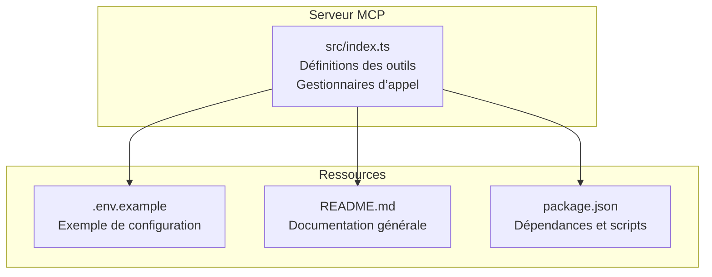
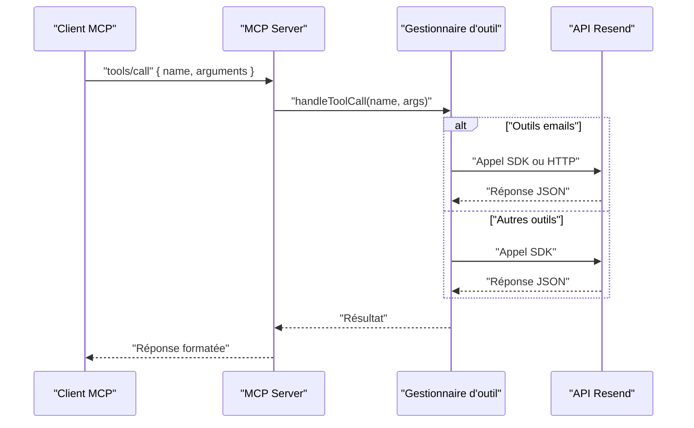
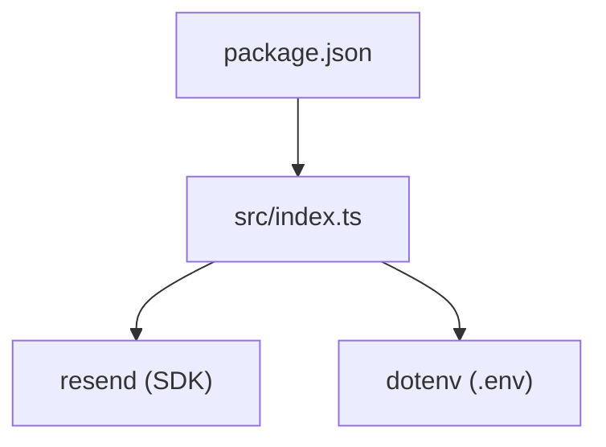

# API Emails

<cite>
**Fichiers référencés dans ce document**
- [README.md](file://README.md)
- [src/index.ts](file://src/index.ts)
- [.env.example](file://.env.example)
- [package.json](file://package.json)
</cite>

## Sommaire
1. [Introduction](#introduction)
2. [Structure du projet](#structure-du-projet)
3. [Composants principaux](#composants-principaux)
4. [Aperçu de l’architecture](#aperçu-de-larchitecture)
5. [Analyse détaillée des outils](#analyse-détaillée-des-outils)
6. [Analyse des dépendances](#analyse-des-dépendances)
7. [Considérations sur les performances](#considérations-sur-les-performances)
8. [Guide de dépannage](#guide-de-dépannage)
9. [Conclusion](#conclusion)
10. [Annexes](#annexes)

## Introduction
Ce document fournit une documentation complète des 8 outils liés aux emails exposés par le serveur MCP Resend. Il décrit pour chacun :
- Le nom de l’outil
- Sa description
- Ses paramètres d’entrée
- Ses schémas JSON
- Ses valeurs de retour
- Ses codes d’erreur possibles
- Des exemples de requêtes et de réponses
- Les contraintes spécifiques (par exemple, le nombre maximal de destinataires, les formats d’attachements, les horodatages planifiés, les balises)
- Des guides d’utilisation pour des scénarios courants (envoi simple, batch, gestion des pièces jointes, planification)

## Structure du projet
Le projet est un serveur MCP qui expose l’ensemble de l’API Resend sous forme d’outils invocables. La logique principale se trouve dans le fichier source principal, avec des définitions de tous les outils (y compris les 8 outils d’emails), ainsi que des gestionnaires de requêtes et de réponse.

**Diagramme sources**
- [src/index.ts](file://src/index.ts#L1-L1623)
- [.env.example](file://.env.example#L1-L6)
- [README.md](file://README.md#L1-L721)
- [package.json](file://package.json#L1-L49)

**Section sources**
- [README.md](file://README.md#L1-L721)
- [src/index.ts](file://src/index.ts#L1-L1623)
- [.env.example](file://.env.example#L1-L6)
- [package.json](file://package.json#L1-L49)

## Composants principaux
- Définitions des outils : tableau central contenant les 70+ outils, dont les 8 outils d’emails.
- Gestionnaires d’appel : fonction qui exécute l’outil demandé, appelle l’API Resend ou effectue des appels HTTP directs selon le cas.
- Serveur MCP : interface d’exposition des outils (liste et appel) et gestion de l’entrée/sortie via stdin/stdout.

**Section sources**
- [src/index.ts](file://src/index.ts#L42-L1002)
- [src/index.ts](file://src/index.ts#L1008-L1565)

## Aperçu de l’architecture
Le serveur MCP charge les définitions des outils, puis, lors d’un appel reçu, exécute la fonction correspondante. Pour les outils d’emails, il appelle soit le SDK Resend, soit effectue des appels HTTP directs vers l’API Resend.

**Diagramme sources**
- [src/index.ts](file://src/index.ts#L1008-L1565)

## Analyse détaillée des outils

### send_email
- Nom : send_email
- Description : Envoie un email unique. Supporte le contenu HTML/text, les pièces jointes, les modèles, la planification, et les en-têtes personnalisés.
- Paramètres d’entrée
  - from : chaîne, exigé
  - to : tableau de chaînes, exigé, max 50 destinataires
  - subject : chaîne, exigé
  - html : chaîne
  - text : chaîne
  - bcc : tableau de chaînes
  - cc : tableau de chaînes
  - reply_to : tableau de chaînes
  - scheduled_at : chaîne au format ISO 8601
  - attachments : tableau d’objets avec champs filename, content (base64), path, content_type
  - tags : tableau d’objets avec name et value
  - headers : objet
- Schéma JSON
  - type : object
  - propriétés : cf. ci-dessus
  - required : ["from","to","subject"]
- Valeurs de retour
  - Réponse de l’API Resend pour l’envoi d’un email (structure détaillée dans la documentation Resend).
- Codes d’erreur possibles
  - Erreurs d’authentification : 401, 403
  - Erreurs de validation : 400, 422
  - Ressource introuvable : 404
  - Conflit : 409
  - Limite de débit : 429
  - Erreur serveur : 500, 503
- Exemples de requête et réponse
  - Requête : voir [README.md](file://README.md#L280-L294)
  - Réponse : structure JSON renvoyée par l’API Resend (ex. identifiant de l’email, statut, etc.)
- Contraintes spécifiques
  - Nombre maximal de destinataires : 50
  - Formats d’attachements : base64 encodé ou chemin de fichier, avec type MIME optionnel
  - Horodatage planifié : format ISO 8601
  - Balises : tableau de paires name/value

**Section sources**
- [src/index.ts](file://src/index.ts#L44-L101)
- [README.md](file://README.md#L270-L294)

### send_batch_emails
- Nom : send_batch_emails
- Description : Envoie jusqu’à 100 emails en un seul appel.
- Paramètres d’entrée
  - emails : tableau d’objets, exigé
    - from : chaîne
    - to : tableau de chaînes
    - subject : chaîne
    - html : chaîne
    - text : chaîne
  - Chaque objet email nécessite : ["from","to","subject"]
- Schéma JSON
  - type : object
  - propriétés : emails (tableau)
  - required : ["emails"]
- Valeurs de retour
  - Réponse de l’API Resend pour l’envoi batch (tableau de résultats).
- Codes d’erreur possibles
  - Même que send_email
- Exemples de requête et réponse
  - Requête : voir [README.md](file://README.md#L305-L329)
  - Réponse : structure JSON renvoyée par l’API Resend
- Contraintes spécifiques
  - Taille maximale du batch : 100 emails

**Section sources**
- [src/index.ts](file://src/index.ts#L102-L126)
- [README.md](file://README.md#L296-L329)

### list_emails
- Nom : list_emails
- Description : Récupère la liste des emails envoyés avec support de pagination.
- Paramètres d’entrée
  - limit : nombre (1 à 100)
  - after : chaîne (curseur)
  - before : chaîne (curseur)
- Schéma JSON
  - type : object
  - propriétés : limit, after, before
- Valeurs de retour
  - Liste paginée d’emails (structure détaillée dans la documentation Resend).
- Codes d’erreur possibles
  - 400, 401, 403, 404, 422, 429, 500, 503
- Exemples de requête et réponse
  - Requête : voir [README.md](file://README.md#L437-L444)
  - Réponse : tableau d’emails
- Contraintes spécifiques
  - Plage de limit : 1 à 100

**Section sources**
- [src/index.ts](file://src/index.ts#L127-L138)
- [README.md](file://README.md#L435-L444)

### get_email
- Nom : get_email
- Description : Récupère les détails d’un email spécifique par son ID.
- Paramètres d’entrée
  - email_id : chaîne, exigé
- Schéma JSON
  - type : object
  - propriétés : email_id
  - required : ["email_id"]
- Valeurs de retour
  - Détails de l’email (structure détaillée dans la documentation Resend).
- Codes d’erreur possibles
  - 400, 401, 403, 404, 422, 429, 500, 503
- Exemples de requête et réponse
  - Requête : voir [README.md](file://README.md#L437-L444)
  - Réponse : objet représentant l’email
- Contraintes spécifiques
  - L’ID de l’email est requis

**Section sources**
- [src/index.ts](file://src/index.ts#L139-L149)
- [README.md](file://README.md#L435-L444)

### update_email
- Nom : update_email
- Description : Met à jour un email planifié (reprogrammation ou modification).
- Paramètres d’entrée
  - email_id : chaîne, exigé
  - scheduled_at : chaîne au format ISO 8601
- Schéma JSON
  - type : object
  - propriétés : email_id, scheduled_at
  - required : ["email_id"]
- Valeurs de retour
  - Réponse de mise à jour de l’email (structure détaillée dans la documentation Resend).
- Codes d’erreur possibles
  - 400, 401, 403, 404, 422, 429, 500, 503
- Exemples de requête et réponse
  - Requête : voir [README.md](file://README.md#L437-L444)
  - Réponse : objet mis à jour
- Contraintes spécifiques
  - Horodatage planifié : format ISO 8601

**Section sources**
- [src/index.ts](file://src/index.ts#L150-L161)
- [README.md](file://README.md#L435-L444)

### cancel_email
- Nom : cancel_email
- Description : Annule un email planifié avant son envoi.
- Paramètres d’entrée
  - email_id : chaîne, exigé
- Schéma JSON
  - type : object
  - propriétés : email_id
  - required : ["email_id"]
- Valeurs de retour
  - Réponse d’annulation de l’email (structure détaillée dans la documentation Resend).
- Codes d’erreur possibles
  - 400, 401, 403, 404, 422, 429, 500, 503
- Exemples de requête et réponse
  - Requête : voir [README.md](file://README.md#L437-L444)
  - Réponse : objet annulé
- Contraintes spécifiques
  - L’ID de l’email est requis

**Section sources**
- [src/index.ts](file://src/index.ts#L162-L172)
- [README.md](file://README.md#L435-L444)

### list_email_attachments
- Nom : list_email_attachments
- Description : Récupère la liste des pièces jointes d’un email envoyé.
- Paramètres d’entrée
  - email_id : chaîne, exigé
  - limit : nombre
  - after : chaîne (curseur)
  - before : chaîne (curseur)
- Schéma JSON
  - type : object
  - propriétés : email_id, limit, after, before
  - required : ["email_id"]
- Valeurs de retour
  - Liste paginée des pièces jointes (structure détaillée dans la documentation Resend).
- Codes d’erreur possibles
  - 400, 401, 403, 404, 422, 429, 500, 503
- Exemples de requête et réponse
  - Requête : voir [README.md](file://README.md#L437-L444)
  - Réponse : tableau de pièces jointes
- Contraintes spécifiques
  - L’ID de l’email est requis

**Section sources**
- [src/index.ts](file://src/index.ts#L173-L186)
- [README.md](file://README.md#L435-L444)

### get_email_attachment
- Nom : get_email_attachment
- Description : Récupère une pièce jointe spécifique d’un email envoyé.
- Paramètres d’entrée
  - email_id : chaîne, exigé
  - attachment_id : chaîne, exigé
- Schéma JSON
  - type : object
  - propriétés : email_id, attachment_id
  - required : ["email_id","attachment_id"]
- Valeurs de retour
  - Détails de la pièce jointe (structure détaillée dans la documentation Resend).
- Codes d’erreur possibles
  - 400, 401, 403, 404, 422, 429, 500, 503
- Exemples de requête et réponse
  - Requête : voir [README.md](file://README.md#L437-L444)
  - Réponse : objet pièce jointe
- Contraintes spécifiques
  - Les deux IDs sont requis

**Section sources**
- [src/index.ts](file://src/index.ts#L187-L198)
- [README.md](file://README.md#L435-L444)

## Analyse des dépendances
- Dépendance principale : SDK Resend pour les appels directs aux endpoints non couverts par le SDK.
- Gestion des environnements : lecture de la clé API depuis le fichier .env.
- Scripts de développement et exécution : TypeScript, Node.js, dotenv.

**Diagramme sources**
- [src/index.ts](file://src/index.ts#L1-L10)
- [package.json](file://package.json#L32-L35)

**Section sources**
- [src/index.ts](file://src/index.ts#L1-L10)
- [package.json](file://package.json#L1-L49)
- [.env.example](file://.env.example#L1-L6)

## Considérations sur les performances
- Limite de débit : 2 requêtes/seconde par défaut, avec des tentatives de reprise automatique.
- Utilisation optimale : regrouper les envois multiples via send_batch_emails pour atteindre jusqu’à 100 emails par appel.
- Pagination : utiliser limit, after, before pour limiter la charge sur les listes.

**Section sources**
- [README.md](file://README.md#L518-L527)
- [src/index.ts](file://src/index.ts#L1022-L1023)

## Guide de dépannage
- Erreur : clé API manquante
  - Cause : variable d’environnement non définie
  - Solution : créer un fichier .env avec la clé API
- Erreur : outil inconnu
  - Cause : nom d’outil incorrect
  - Solution : utiliser tools/list pour obtenir la liste des outils disponibles
- Erreurs fréquentes
  - 401/403 : problème d’authentification
  - 400/422 : paramètres invalides
  - 404 : ressource inexistante
  - 429 : dépassement de la limite de débit
  - 500/503 : erreur serveur Resend

**Section sources**
- [README.md](file://README.md#L528-L569)
- [src/index.ts](file://src/index.ts#L1516-L1522)

## Conclusion
Le serveur MCP Resend offre une couverture complète des outils d’emails, avec des schémas bien définis, des contraintes claires (destinataires, attachements, planification, balises) et des codes d’erreur standardisés. Grâce à des outils comme send_batch_emails, il permet d’optimiser les envois massifs, tandis que list_emails, get_email, update_email, cancel_email, list_email_attachments, et get_email_attachment facilitent la gestion et le suivi des emails envoyés.

## Annexes
- Configuration de base : clé API requise, variables optionnelles (base URL, debug, limite de débit)
- Exemples d’utilisation : envoi simple, batch, domaines, webhooks, audiences, contacts, modèles, diffusions, segments, topics, propriétés de contact

**Section sources**
- [.env.example](file://.env.example#L1-L6)
- [README.md](file://README.md#L180-L210)
- [README.md](file://README.md#L266-L444)