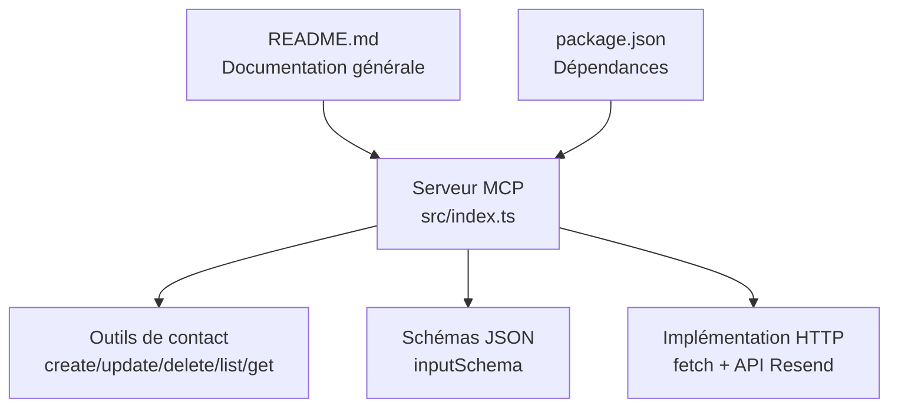
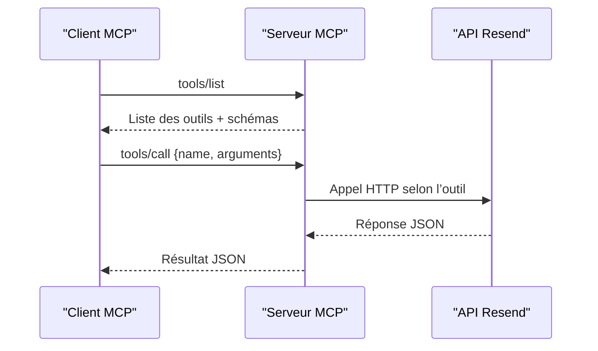

# API Propriétés de Contact

<cite>
**Fichiers référencés dans ce document**
- [README.md](file://README.md)
- [package.json](file://package.json)
- [src/index.ts](file://src/index.ts)
</cite>

## Sommaire
1. [Introduction](#introduction)
2. [Structure du projet](#structure-du-projet)
3. [Outils de gestion des propriétés de contact](#outils-de-gestion-des-propriétés-de-contact)
4. [Architecture de l’API](#architecture-de-lapi)
5. [Analyse détaillée des outils](#analyse-détaillée-des-outils)
6. [Contraintes et règles de gestion](#contraintes-et-règles-de-gestion)
7. [Exemples d’utilisation](#exemples-dutilisation)
8. [Guides d’utilisation](#guides-dutilisation)
9. [Gestion des erreurs](#gestion-des-erreurs)
10. [Conclusion](#conclusion)

## Introduction
Ce document fournit une documentation complète des outils liés aux propriétés de contact de l’API Resend exposés via le serveur Model Context Protocol (MCP). Il couvre les cinq outils de gestion des propriétés de contact : création, listing, consultation, mise à jour et suppression. Pour chaque outil, vous trouverez le nom, la description, les paramètres d’entrée, les schémas JSON, les valeurs de retour attendues ainsi que les codes d’erreur possibles. Des exemples de requêtes et de réponses sont inclus pour illustrer l’utilisation pratique. Enfin, des guides d’utilisation sont proposés pour des scénarios courants tels que la création de propriétés personnalisées, la gestion des données de contact et l’optimisation des campagnes basées sur les données.

## Structure du projet
Le projet est un serveur MCP qui expose l’ensemble de l’API Resend sous forme d’outils invocables. Le point d’entrée principal est le fichier TypeScript qui définit l’ensemble des outils, leurs schémas d’entrée et leur implémentation.

**Diagramme sources**
- [src/index.ts](file://src/index.ts#L1008-L1522)
- [README.md](file://README.md#L1-L721)
- [package.json](file://package.json#L1-L49)

**Section sources**
- [README.md](file://README.md#L1-L721)
- [package.json](file://package.json#L1-L49)
- [src/index.ts](file://src/index.ts#L1-L1623)

## Outils de gestion des propriétés de contact
Voici la liste complète des outils liés aux propriétés de contact :

- create_contact_property
- list_contact_properties
- get_contact_property
- update_contact_property
- delete_contact_property

Chacun de ces outils est décrit en détail dans la section suivante.

**Section sources**
- [README.md](file://README.md#L112-L117)
- [src/index.ts](file://src/index.ts#L941-L1002)

## Architecture de l’API
Le serveur MCP expose les outils via deux méthodes principales :
- tools/list : retourne la liste complète des outils avec leurs descriptions et schémas
- tools/call : exécute un outil spécifique avec ses arguments

L’implémentation interne effectue des appels HTTP directs à l’API Resend pour les opérations non couvertes par le SDK, y compris les outils de gestion des propriétés de contact.

**Diagramme sources**
- [src/index.ts](file://src/index.ts#L1532-L1564)
- [src/index.ts](file://src/index.ts#L1008-L1522)

**Section sources**
- [src/index.ts](file://src/index.ts#L1532-L1564)
- [src/index.ts](file://src/index.ts#L1008-L1522)

## Analyse détaillée des outils

### create_contact_property
- Nom : create_contact_property
- Description : Crée une nouvelle propriété de contact personnalisée
- Paramètres d’entrée (JSON Schema)
  - name : chaîne de caractères (obligatoire)
  - type : chaîne de caractères (obligatoire) parmi : string, number, boolean, date
  - description : chaîne de caractères (optionnel)
- Schéma JSON
  - type : object
  - properties : name, type, description
  - required : name, type
- Valeurs de retour
  - Objet représentant la propriété créée (structure conforme à l’API Resend)
- Codes d’erreur possibles
  - 400 : Données invalides ou champs manquants
  - 401 : Non autorisé (clé API invalide)
  - 403 : Interdit (permissions insuffisantes)
  - 409 : Conflit (propriété déjà existante)
  - 422 : Entité non traitable (données valides mais invalides)
  - 429 : Trop de requêtes
  - 500 : Erreur interne du serveur
  - 503 : Service indisponible

Exemple de requête (tools/call)
- name : "Niveau de priorité"
- type : "string"
- description : "Priorité du contact (bas, moyen, élevé)"

Exemple de réponse
- Identifiant de la propriété
- Nom, type, description
- Date de création

**Section sources**
- [src/index.ts](file://src/index.ts#L941-L954)
- [src/index.ts](file://src/index.ts#L1475-L1482)
- [README.md](file://README.md#L528-L549)

### list_contact_properties
- Nom : list_contact_properties
- Description : Liste toutes les propriétés de contact personnalisées
- Paramètres d’entrée (JSON Schema)
  - limit : nombre (optionnel)
  - after : chaîne de caractères (optionnel)
  - before : chaîne de caractères (optionnel)
- Schéma JSON
  - type : object
  - properties : limit, after, before
- Valeurs de retour
  - Tableau d’objets représentant les propriétés de contact
- Codes d’erreur possibles
  - 401 : Non autorisé
  - 429 : Trop de requêtes
  - 500 : Erreur interne
  - 503 : Service indisponible

Exemple de requête (tools/call)
- limit : 20
- after : "cursor_vers_la_suite"

Exemple de réponse
- Tableau de propriétés
- Pagination (limit, after, before)

**Section sources**
- [src/index.ts](file://src/index.ts#L955-L966)
- [src/index.ts](file://src/index.ts#L1484-L1491)
- [README.md](file://README.md#L528-L549)

### get_contact_property
- Nom : get_contact_property
- Description : Récupère les détails d’une propriété de contact spécifique
- Paramètres d’entrée (JSON Schema)
  - property_id : chaîne de caractères (obligatoire)
- Schéma JSON
  - type : object
  - properties : property_id
  - required : property_id
- Valeurs de retour
  - Objet représentant la propriété demandée
- Codes d’erreur possibles
  - 404 : Propriété introuvable
  - 401 : Non autorisé
  - 429 : Trop de requêtes
  - 500 : Erreur interne
  - 503 : Service indisponible

Exemple de requête (tools/call)
- property_id : "id_de_la_propriété"

Exemple de réponse
- Détails complets de la propriété

**Section sources**
- [src/index.ts](file://src/index.ts#L967-L977)
- [src/index.ts](file://src/index.ts#L1493-L1496)
- [README.md](file://README.md#L528-L549)

### update_contact_property
- Nom : update_contact_property
- Description : Met à jour le nom et/ou la description d’une propriété de contact
- Paramètres d’entrée (JSON Schema)
  - property_id : chaîne de caractères (obligatoire)
  - name : chaîne de caractères (optionnel)
  - description : chaîne de caractères (optionnel)
- Schéma JSON
  - type : object
  - properties : property_id, name, description
  - required : property_id
- Valeurs de retour
  - Objet représentant la propriété mise à jour
- Codes d’erreur possibles
  - 400 : Données invalides
  - 404 : Propriété introuvable
  - 401 : Non autorisé
  - 409 : Conflit (nom déjà utilisé)
  - 422 : Entité non traitable
  - 429 : Trop de requêtes
  - 500 : Erreur interne
  - 503 : Service indisponible

Exemple de requête (tools/call)
- property_id : "id_de_la_propriété"
- name : "Niveau de priorité mis à jour"
- description : "Niveau de priorité du contact"

Exemple de réponse
- Détails mis à jour de la propriété

**Section sources**
- [src/index.ts](file://src/index.ts#L978-L990)
- [src/index.ts](file://src/index.ts#L1498-L1506)
- [README.md](file://README.md#L528-L549)

### delete_contact_property
- Nom : delete_contact_property
- Description : Supprime une propriété de contact personnalisée
- Paramètres d’entrée (JSON Schema)
  - property_id : chaîne de caractères (obligatoire)
- Schéma JSON
  - type : object
  - properties : property_id
  - required : property_id
- Valeurs de retour
  - Objet de suppression (parfois un message de succès)
- Codes d’erreur possibles
  - 404 : Propriété introuvable
  - 401 : Non autorisé
  - 429 : Trop de requêtes
  - 500 : Erreur interne
  - 503 : Service indisponible

Exemple de requête (tools/call)
- property_id : "id_de_la_propriété"

Exemple de réponse
- Confirmation de suppression

**Section sources**
- [src/index.ts](file://src/index.ts#L991-L1001)
- [src/index.ts](file://src/index.ts#L1508-L1514)
- [README.md](file://README.md#L528-L549)

## Contraintes et règles de gestion
- Types de données autorisés pour les propriétés de contact : string, number, boolean, date
- Le champ name est obligatoire lors de la création
- Le champ type est obligatoire lors de la création et doit être l’un des types autorisés
- La mise à jour ne peut porter que sur name et description
- Les opérations de suppression peuvent échouer si la propriété n’existe pas
- Gestion des erreurs HTTP standardisée par le serveur MCP

**Section sources**
- [src/index.ts](file://src/index.ts#L941-L1002)
- [README.md](file://README.md#L528-L549)

## Exemples d’utilisation
Voici des exemples de requêtes et réponses pour chaque outil, au format JSON, conformément aux spécifications de l’API MCP.

- Création d’une propriété de contact
  - Requête : { "method": "tools/call", "params": { "name": "create_contact_property", "arguments": { "name": "Niveau de priorité", "type": "string", "description": "Priorité du contact (bas, moyen, élevé)" } } }
  - Réponse : { "id": "id_de_la_propriété", "name": "Niveau de priorité", "type": "string", "description": "Priorité du contact (bas, moyen, élevé)", "created_at": "YYYY-MM-DDTHH:mm:ssZ" }

- Listing des propriétés de contact
  - Requête : { "method": "tools/call", "params": { "name": "list_contact_properties", "arguments": { "limit": 20, "after": "cursor_vers_la_suite" } } }
  - Réponse : { "data": [ { "id": "id1", "name": "Propriété1", "type": "string", "description": "", "created_at": "YYYY-MM-DDTHH:mm:ssZ" }, ... ], "has_more": true, "next_cursor": "..." }

- Consultation d’une propriété de contact
  - Requête : { "method": "tools/call", "params": { "name": "get_contact_property", "arguments": { "property_id": "id_de_la_propriété" } } }
  - Réponse : { "id": "id_de_la_propriété", "name": "Niveau de priorité", "type": "string", "description": "Priorité du contact (bas, moyen, élevé)", "created_at": "YYYY-MM-DDTHH:mm:ssZ" }

- Mise à jour d’une propriété de contact
  - Requête : { "method": "tools/call", "params": { "name": "update_contact_property", "arguments": { "property_id": "id_de_la_propriété", "name": "Niveau de priorité mis à jour", "description": "Niveau de priorité du contact" } } }
  - Réponse : { "id": "id_de_la_propriété", "name": "Niveau de priorité mis à jour", "type": "string", "description": "Niveau de priorité du contact", "created_at": "YYYY-MM-DDTHH:mm:ssZ" }

- Suppression d’une propriété de contact
  - Requête : { "method": "tools/call", "params": { "name": "delete_contact_property", "arguments": { "property_id": "id_de_la_propriété" } } }
  - Réponse : { "message": "Supprimé avec succès" }

**Section sources**
- [src/index.ts](file://src/index.ts#L1475-L1514)

## Guides d’utilisation
- Création de propriétés personnalisées
  - Utilisez create_contact_property pour ajouter de nouvelles propriétés de contact personnalisées. Choisissez un nom unique et un type adapté aux données que vous souhaitez stocker (chaîne, nombre, booléen, date).
  - Exemple : créer une propriété "Date de naissance" de type date pour gérer des anniversaires.

- Gestion des données de contact
  - Une fois les propriétés créées, vous pouvez les utiliser pour enrichir vos données de contact. Par exemple, ajoutez des attributs comme "Ville", "Catégorie", "Score de fidélité".
  - Utilisez update_contact_property pour modifier le nom ou la description des propriétés existantes.

- Optimisation des campagnes basées sur les données
  - Créez des segments dynamiques en fonction des valeurs des propriétés de contact. Par exemple, segmentez les contacts dont le niveau de priorité est "élevé" pour des campagnes ciblées.
  - Combinez les propriétés de contact avec les sujets (topics) pour personnaliser les abonnements et améliorer le taux d’ouverture.

- Bonnes pratiques
  - Utilisez des noms de propriétés clairs et uniques.
  - Limitez le nombre de propriétés personnalisées pour maintenir la performance.
  - Évitez de supprimer des propriétés utilisées dans des segments ou des campagnes actives.

**Section sources**
- [README.md](file://README.md#L446-L471)
- [src/index.ts](file://src/index.ts#L941-L1002)

## Gestion des erreurs
Le serveur MCP renvoie des messages d’erreur structurés avec le nom de l’outil, les arguments fournis et le message d’erreur. Les codes d’erreur standards de l’API Resend sont également pris en compte :
- 401 Unauthorized : Clé API invalide ou manquante
- 403 Forbidden : Permissions insuffisantes
- 400 Bad Request : Paramètres invalides
- 404 Not Found : Ressource non trouvée
- 409 Conflict : Conflit (par exemple propriété déjà existante)
- 422 Unprocessable Entity : Données valides mais invalides
- 429 Too Many Requests : Trop de requêtes
- 500 Internal Server Error : Erreur interne du service
- 503 Service Unavailable : Service temporairement indisponible

**Section sources**
- [README.md](file://README.md#L528-L549)
- [src/index.ts](file://src/index.ts#L1552-L1563)

## Conclusion
Les outils de gestion des propriétés de contact permettent de créer, lister, consulter, mettre à jour et supprimer des attributs personnalisés pour les contacts. Grâce à leur interface standardisée via MCP, ils s’intègrent facilement dans des flux de travail automatisés et des applications IA. En adoptant des bonnes pratiques de modélisation des données et en les combinant à d’autres outils (segments, sujets, campagnes), vous pouvez optimiser significativement la personnalisation et l’efficacité de vos communications par email.