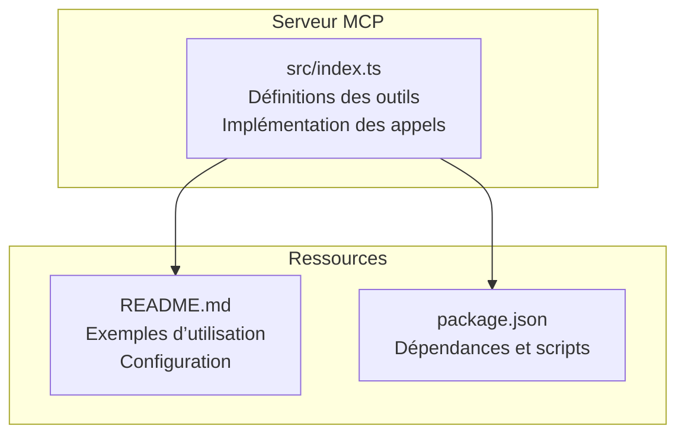
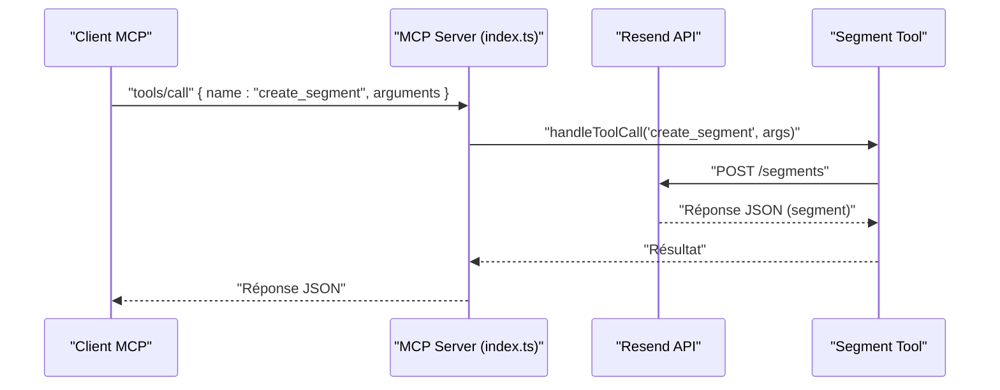
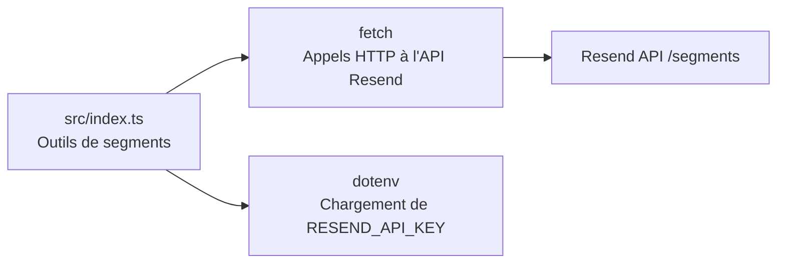

# API Segments

<cite>
**Fichiers référencés dans ce document**
- [README.md](file://README.md)
- [package.json](file://package.json)
- [src/index.ts](file://src/index.ts)
</cite>

## Sommaire
1. [Introduction](#introduction)
2. [Structure du projet](#structure-du-projet)
3. [Composants principaux](#composants-principaux)
4. [Aperçu de l’architecture](#aperçu-de-larchitecture)
5. [Analyse détaillée des outils](#analyse-détaillée-des-outils)
6. [Analyse des dépendances](#analyse-des-dépendances)
7. [Considérations sur les performances](#considérations-sur-les-performances)
8. [Guide de dépannage](#guide-de-dépannage)
9. [Conclusion](#conclusion)
10. [Annexes](#annexes)

## Introduction
Ce document fournit une documentation complète des quatre outils liés aux segments (segments) de l’API Resend exposés via le Model Context Protocol (MCP). Il couvre leur nom, description, paramètres d’entrée, schémas JSON, valeurs de retour attendues, codes d’erreur possibles, ainsi que des exemples de requêtes et réponses. Des guides d’utilisation sont également inclus pour des scénarios courants tels que la création de segments complexes, la gestion des filtres, et l’optimisation des campagnes ciblées.

## Structure du projet
Le serveur MCP est implémenté dans un seul fichier principal qui expose 70+ outils, dont les outils de gestion des segments. Le projet inclut aussi un README complet avec des exemples d’utilisation, des informations de configuration, et des précisions sur les erreurs.

**Diagramme sources**
- [src/index.ts](file://src/index.ts#L1-L1623)
- [README.md](file://README.md#L1-L721)
- [package.json](file://package.json#L1-L49)

**Section sources**
- [README.md](file://README.md#L1-L721)
- [package.json](file://package.json#L1-L49)
- [src/index.ts](file://src/index.ts#L1-L1623)

## Composants principaux
Les outils liés aux segments sont définis dans le tableau central des outils et implémentés dans la fonction de gestion des appels. Ils permettent de créer, lister, récupérer et supprimer des segments, ainsi que de gérer les relations entre contacts et segments.

- Outils de segments (4 outils)
  - create_segment : Créer un segment
  - list_segments : Lister les segments
  - get_segment : Obtenir les détails d’un segment
  - delete_segment : Supprimer un segment

Ces outils utilisent l’API Resend via des appels HTTP directs pour les opérations non couvertes par le SDK.

**Section sources**
- [src/index.ts](file://src/index.ts#L832-L879)
- [src/index.ts](file://src/index.ts#L1400-L1430)

## Aperçu de l’architecture
Le serveur MCP reçoit des requêtes via stdin, identifie la méthode (tools/list ou tools/call), exécute l’outil correspondant, puis renvoie une réponse au format JSON. Pour les outils de segments, l’implémentation effectue des appels HTTP à l’API Resend.

**Diagramme sources**
- [src/index.ts](file://src/index.ts#L1536-L1565)
- [src/index.ts](file://src/index.ts#L1400-L1430)

## Analyse détaillée des outils

### create_segment
- Nom : create_segment
- Description : Créer un nouveau segment d’une audience.
- Paramètres d’entrée (JSON Schema)
  - name : chaîne, requis
  - audience_id : chaîne, requis
  - filter : objet, optionnel (conditions de filtrage)
- Schéma JSON attendu
  - type : object
  - propriétés : name, audience_id, filter
  - champs requis : name, audience_id
- Valeurs de retour
  - Réponse JSON contenant les détails du segment créé (identifiant, nom, audience_id, filtre, date de création, etc.)
- Codes d’erreur possibles
  - 400 : Données invalides ou manquantes
  - 401 : Non autorisé (clé API invalide)
  - 403 : Accès interdit (permissions insuffisantes)
  - 404 : Audience introuvable
  - 409 : Conflit (nom de segment déjà utilisé)
  - 422 : Données valides mais invalides selon la logique métier
  - 429 : Trop de requêtes (limite de débit)
  - 500 : Erreur interne du serveur
  - 503 : Service indisponible
- Exemple de requête
  - Méthode : tools/call
  - Nom : create_segment
  - Arguments :
    - name : "Abonnés Premium"
    - audience_id : "aud_XXXXXXXXXXXX"
    - filter : { "field": "status", "operator": "eq", "value": "premium" }
- Exemple de réponse
  - Contient l’identifiant du segment créé, le nom, l’audience_id, le filtre, et les métadonnées de création.

**Section sources**
- [src/index.ts](file://src/index.ts#L832-L845)
- [src/index.ts](file://src/index.ts#L1400-L1408)
- [README.md](file://README.md#L528-L549)

### list_segments
- Nom : list_segments
- Description : Récupérer tous les segments.
- Paramètres d’entrée (JSON Schema)
  - limit : nombre, optionnel
  - after : chaîne, optionnel (curseur de pagination)
  - before : chaîne, optionnel (curseur de pagination)
- Schéma JSON attendu
  - type : object
  - propriétés : limit, after, before
- Valeurs de retour
  - Réponse JSON contenant une liste de segments avec pagination (éléments, curseurs).
- Codes d’erreur possibles
  - 400 : Paramètres invalides
  - 401 : Non autorisé
  - 429 : Trop de requêtes
  - 500 : Erreur interne
  - 503 : Service indisponible
- Exemple de requête
  - Méthode : tools/call
  - Nom : list_segments
  - Arguments : { "limit": 20, "after": "cursor123" }
- Exemple de réponse
  - Liste de segments avec curseurs pour la pagination.

**Section sources**
- [src/index.ts](file://src/index.ts#L846-L857)
- [src/index.ts](file://src/index.ts#L1410-L1417)
- [README.md](file://README.md#L528-L549)

### get_segment
- Nom : get_segment
- Description : Récupérer les détails d’un segment spécifique.
- Paramètres d’entrée (JSON Schema)
  - segment_id : chaîne, requis
- Schéma JSON attendu
  - type : object
  - propriétés : segment_id
  - champs requis : segment_id
- Valeurs de retour
  - Réponse JSON contenant les détails du segment (identifiant, nom, audience_id, filtre, statistiques si disponibles).
- Codes d’erreur possibles
  - 400 : Identifiant invalide
  - 401 : Non autorisé
  - 404 : Segment introuvable
  - 429 : Trop de requêtes
  - 500 : Erreur interne
  - 503 : Service indisponible
- Exemple de requête
  - Méthode : tools/call
  - Nom : get_segment
  - Arguments : { "segment_id": "seg_XXXXXXXXXXXX" }
- Exemple de réponse
  - Détails complets du segment demandé.

**Section sources**
- [src/index.ts](file://src/index.ts#L858-L868)
- [src/index.ts](file://src/index.ts#L1419-L1422)
- [README.md](file://README.md#L528-L549)

### delete_segment
- Nom : delete_segment
- Description : Supprimer un segment.
- Paramètres d’entrée (JSON Schema)
  - segment_id : chaîne, requis
- Schéma JSON attendu
  - type : object
  - propriétés : segment_id
  - champs requis : segment_id
- Valeurs de retour
  - Réponse JSON indiquant la suppression réussie (parfois un objet vide ou un statut).
- Codes d’erreur possibles
  - 400 : Identifiant invalide
  - 401 : Non autorisé
  - 404 : Segment introuvable
  - 409 : Conflit (dépendance existante)
  - 429 : Trop de requêtes
  - 500 : Erreur interne
  - 503 : Service indisponible
- Exemple de requête
  - Méthode : tools/call
  - Nom : delete_segment
  - Arguments : { "segment_id": "seg_XXXXXXXXXXXX" }
- Exemple de réponse
  - Confirmation de suppression.

**Section sources**
- [src/index.ts](file://src/index.ts#L869-L879)
- [src/index.ts](file://src/index.ts#L1424-L1430)
- [README.md](file://README.md#L528-L549)

## Analyse des dépendances
- Dépendances externes
  - ressource : Utilisée pour les appels directs à l’API Resend (via fetch) pour les outils non couverts par le SDK.
  - dotenv : Chargement de la clé API depuis le fichier .env.
- Implémentation des outils de segments
  - Les outils de segments utilisent des appels HTTP directs à l’API Resend (/segments).
  - La gestion des erreurs est centralisée dans la fonction de gestion des appels.

**Diagramme sources**
- [src/index.ts](file://src/index.ts#L1008-L1522)
- [src/index.ts](file://src/index.ts#L1400-L1430)

**Section sources**
- [package.json](file://package.json#L32-L34)
- [src/index.ts](file://src/index.ts#L1-L10)
- [src/index.ts](file://src/index.ts#L1008-L1522)

## Considérations sur les performances
- Limite de débit
  - Le serveur respecte les limites de l’API Resend (par défaut 2 requêtes/seconde, avec des pics jusqu’à 10).
  - Le serveur gère automatiquement les retours en cas de dépassement de limite.
- Pagination
  - Les listes de segments peuvent être paginées via limit, after, before.
- Optimisation des campagnes ciblées
  - Utiliser des filtres précis lors de la création de segments pour limiter le volume de destinataires.
  - Éviter les filtres trop coûteux (ex: recherches textuelles sur de grandes bases) pour maintenir des temps de réponse optimaux.

**Section sources**
- [README.md](file://README.md#L518-L527)
- [src/index.ts](file://src/index.ts#L846-L857)

## Guide de dépannage
- Erreurs fréquentes
  - 401 Unauthorized : Clé API manquante ou invalide. Vérifier le fichier .env.
  - 400 Bad Request : Paramètres manquants ou incorrects (ex: segment_id, audience_id).
  - 404 Not Found : Ressource introuvable (segment, audience).
  - 429 Too Many Requests : Limite de débit atteinte. Attendre avant de relancer.
  - 500/503 : Problèmes temporaires du service Resend.
- Vérifications à effectuer
  - S’assurer que l’environnement RESEND_API_KEY est bien défini.
  - Valider les identifiants fournis (audience_id, segment_id).
  - Utiliser tools/list pour vérifier la disponibilité des outils.

**Section sources**
- [README.md](file://README.md#L528-L549)
- [README.md](file://README.md#L551-L568)

## Conclusion
Les outils de gestion des segments offrent une interface complète pour créer, lister, récupérer et supprimer des segments, tout en intégrant des mécanismes de pagination, de filtrage et de gestion des erreurs. En adoptant des bonnes pratiques de conception de segments et en respectant les limites de débit, vous pouvez optimiser vos campagnes ciblées et améliorer la performance globale de votre flux de travail.

## Annexes

### Guides d’utilisation

- Création de segments complexes
  - Utilisez le champ filter pour définir des règles avancées basées sur des attributs de contact (ex: statut, date d’inscription, propriété personnalisée).
  - Combine plusieurs opérateurs (eq, ne, gt, lt, in, not_in, contains, not_contains) pour affiner le ciblage.
  - Exemple de requête : créer un segment "Clients actifs de plus de 30 ans" en combinant des filtres sur le statut et l’âge.

- Gestion des filtres
  - Pour éviter les erreurs 400, assurez-vous que les champs de filtre correspondent aux propriétés disponibles (nom, email, statut, etc.).
  - Pour les recherches textuelles, privilégiez des filtres exacts (eq) plutôt que des recherches floues (contains) sur de grandes bases.

- Optimisation des campagnes ciblées
  - Créez des segments stables et réutilisables (ex: "Abonnés Premium", "Anciens clients").
  - Mettez à jour régulièrement les segments pour refléter les changements de comportement des contacts.
  - Utilisez des segments pour limiter le volume de diffusion et améliorer les taux d’ouverture et de clics.

- Ajout/suppression de contacts dans un segment
  - Utilisez les outils associés aux contacts (ex: add_contact_to_segment, remove_contact_from_segment) pour gérer dynamiquement les membres des segments.
  - Ces outils sont utiles pour synchroniser les segments avec des événements métier (ex: changement de statut, achat, abonnement).

**Section sources**
- [src/index.ts](file://src/index.ts#L500-L577)
- [src/index.ts](file://src/index.ts#L1209-L1224)