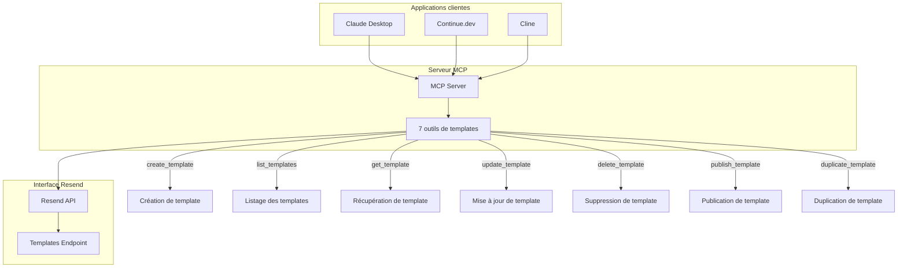
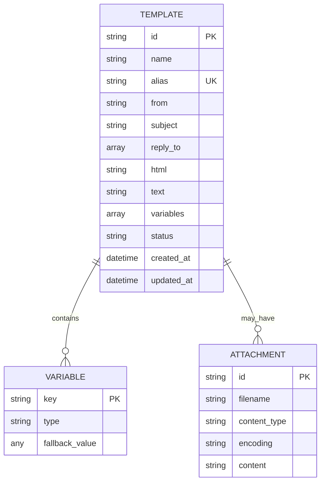

# API Templates

<cite>
**Fichiers référencés dans ce document**
- [README.md](file://README.md)
- [package.json](file://package.json)
- [src/index.ts](file://src/index.ts)
</cite>

## Table des matières
1. [Introduction](#introduction)
2. [Vue d'ensemble de l'architecture](#vue-densemble-de-larchitecture)
3. [Outils de gestion des templates](#outils-de-gestion-des-templates)
4. [Schémas JSON détaillés](#schemas-json-detaillés)
5. [Exemples de requêtes et réponses](#exemples-de-requetes-et-reponses)
6. [Contraintes et règles spécifiques](#contraintes-et-regles-specifiques)
7. [Guides d'utilisation](#guides-dutilisation)
8. [Gestion des erreurs](#gestion-des-erreurs)
9. [Conclusion](#conclusion)

## Introduction

Le module de gestion des templates de l'API Resend permet de créer, gérer et publier des modèles d'e-mails réutilisables. Ce module comprend 7 outils complets qui couvrent l'ensemble du cycle de vie des templates, de leur création à leur publication définitive.

Les templates sont des éléments fondamentaux pour automatiser l'envoi d'e-mails avec un contenu structuré et personnalisable. Ils permettent de définir des modèles HTML/Text avec des variables dynamiques, de les organiser par alias, et de les publier pour une utilisation dans des campagnes d'envoi.

## Vue d'ensemble de l'architecture

L'implémentation des outils de templates repose sur une architecture basée sur le protocole Model Context Protocol (MCP). Le serveur expose 7 outils spécifiques pour la gestion des templates, chacun avec ses propres schémas d'entrée et de sortie.



**Diagramme sources**
- [src/index.ts](file://src/index.ts#L579-L681)
- [src/index.ts](file://src/index.ts#L1253-L1310)

**Section sources**
- [src/index.ts](file://src/index.ts#L579-L681)
- [README.md](file://README.md#L65-L72)

## Outils de gestion des templates

### 1. create_template - Création de template

**Description**: Crée un nouveau template d'e-mail avec tous ses attributs de base.

**Paramètres d'entrée**:
- `name` (chaîne, requis) - Nom du template
- `alias` (chaîne, optionnel) - Alias unique pour le template
- `from` (chaîne, optionnel) - Adresse expéditrice par défaut
- `subject` (chaîne, optionnel) - Sujet de l'e-mail
- `reply_to` (tableau de chaînes, optionnel) - Adresses de réponse
- `html` (chaîne, requis) - Contenu HTML du template
- `text` (chaîne, optionnel) - Contenu texte brut
- `variables` (tableau, optionnel) - Définition des variables

**Contraintes spécifiques**:
- Le champ `html` est requis pour la création
- L'alias doit être unique dans le compte
- Les variables doivent respecter le format défini

**Section sources**
- [src/index.ts](file://src/index.ts#L581-L606)

### 2. list_templates - Liste des templates

**Description**: Récupère la liste complète des templates disponibles.

**Paramètres d'entrée**:
- `limit` (nombre, optionnel) - Nombre maximum d'éléments à retourner
- `after` (chaîne, optionnel) - Curseur pour la pagination
- `before` (chaîne, optionnel) - Curseur pour la pagination

**Valeur de retour**:
- Tableau de templates avec leurs propriétés de base

**Section sources**
- [src/index.ts](file://src/index.ts#L609-L618)

### 3. get_template - Détails d'un template

**Description**: Récupère les détails complets d'un template spécifique.

**Paramètres d'entrée**:
- `template_id` (chaîne, requis) - Identifiant ou alias du template

**Valeur de retour**:
- Objet complet contenant toutes les propriétés du template

**Section sources**
- [src/index.ts](file://src/index.ts#L621-L629)

### 4. update_template - Mise à jour de template

**Description**: Met à jour les propriétés d'un template existant.

**Paramètres d'entrée**:
- `template_id` (chaîne, requis) - Identifiant ou alias du template
- `name` (chaîne, optionnel) - Nouveau nom
- `alias` (chaîne, optionnel) - Nouvel alias
- `from` (chaîne, optionnel) - Nouvelle adresse expéditrice
- `subject` (chaîne, optionnel) - Nouveau sujet
- `reply_to` (tableau de chaînes, optionnel) - Nouvelles adresses de réponse
- `html` (chaîne, optionnel) - Nouveau contenu HTML
- `text` (chaîne, optionnel) - Nouveau contenu texte

**Section sources**
- [src/index.ts](file://src/index.ts#L632-L647)

### 5. delete_template - Suppression de template

**Description**: Supprime définitivement un template.

**Paramètres d'entrée**:
- `template_id` (chaîne, requis) - Identifiant ou alias du template à supprimer

**Section sources**
- [src/index.ts](file://src/index.ts#L650-L658)

### 6. publish_template - Publication de template

**Description**: Publie un template au statut "draft" pour le rendre utilisable.

**Paramètres d'entrée**:
- `template_id` (chaîne, requis) - Identifiant ou alias du template à publier

**Valeur de retour**:
- Statut de publication mis à jour

**Section sources**
- [src/index.ts](file://src/index.ts#L661-L669)

### 7. duplicate_template - Duplication de template

**Description**: Crée une copie d'un template existant.

**Paramètres d'entrée**:
- `template_id` (chaîne, requis) - Identifiant ou alias du template à dupliquer

**Valeur de retour**:
- Nouvel objet template dupliqué

**Section sources**
- [src/index.ts](file://src/index.ts#L672-L680)

## Schémas JSON détaillés

### Schéma de base pour les templates



**Diagramme sources**
- [src/index.ts](file://src/index.ts#L583-L603)

### Structure des variables de template

Chaque variable de template suit un format spécifique :

| Champ | Type | Description |
|-------|------|-------------|
| `key` | Chaîne | Identifiant unique de la variable |
| `type` | Chaîne | Type de données (string, number, boolean) |
| `fallback_value` | Variable | Valeur par défaut si non fournie |

**Section sources**
- [src/index.ts](file://src/index.ts#L593-L602)

## Exemples de requêtes et réponses

### Exemple 1 : Création d'un template de bienvenue

**Requête**:
```json
{
  "method": "tools/call",
  "params": {
    "name": "create_template",
    "arguments": {
      "name": "Bienvenue",
      "alias": "welcome-email",
      "from": "noreply@entreprise.com",
      "subject": "Bienvenue chez {{company}}",
      "html": "<h1>Bienvenue {{firstName}} !</h1><p>Nous sommes ravis de vous compter parmi nos clients.</p>",
      "text": "Bienvenue {{firstName}} ! Nous sommes ravis de vous compter parmi nos clients.",
      "variables": [
        {
          "key": "firstName",
          "type": "string",
          "fallback_value": "Client"
        },
        {
          "key": "company",
          "type": "string",
          "fallback_value": "Notre Entreprise"
        }
      ]
    }
  }
}
```

**Réponse**:
```json
{
  "id": "tmpl_abc123",
  "name": "Bienvenue",
  "alias": "welcome-email",
  "status": "draft",
  "from": "noreply@entreprise.com",
  "subject": "Bienvenue chez {{company}}",
  "variables": [
    {
      "key": "firstName",
      "type": "string",
      "fallback_value": "Client"
    },
    {
      "key": "company",
      "type": "string",
      "fallback_value": "Notre Entreprise"
    }
  ]
}
```

### Exemple 2 : Publication d'un template

**Requête**:
```json
{
  "method": "tools/call",
  "params": {
    "name": "publish_template",
    "arguments": {
      "template_id": "welcome-email"
    }
  }
}
```

**Réponse**:
```json
{
  "id": "tmpl_abc123",
  "status": "published",
  "message": "Template publié avec succès"
}
```

### Exemple 3 : Duplication d'un template

**Requête**:
```json
{
  "method": "tools/call",
  "params": {
    "name": "duplicate_template",
    "arguments": {
      "template_id": "welcome-email"
    }
  }
}
```

**Réponse**:
```json
{
  "id": "tmpl_def456",
  "name": "Bienvenue (copie)",
  "alias": "welcome-email-copy",
  "status": "draft",
  "original_id": "tmpl_abc123"
}
```

## Contraintes et règles spécifiques

### Contraintes de validation

1. **Champs obligatoires**:
   - `name`: Doit être unique
   - `html`: Obligatoire lors de la création
   - `template_id`: Obligatoire pour toutes les opérations sauf création

2. **Contraintes de format**:
   - `alias`: Caractères alphanumériques et tirets uniquement
   - `variables`: Format JSON valide
   - `reply_to`: Adresses email valides

3. **Limites système**:
   - Taille maximale du contenu HTML : 1 Mo
   - Nombre maximum de variables : 50
   - Longueur maximale des noms : 255 caractères

### Règles de publication

- Seuls les templates au statut "draft" peuvent être publiés
- La publication rend le template immuable
- Les alias publiés ne peuvent plus être modifiés
- Les templates publiés peuvent être utilisés dans les envois

### Gestion des versions

- Chaque duplication crée une nouvelle version indépendante
- Les modifications apportées à un template publié créent automatiquement une version brouillon
- Le système conserve l'historique des versions

**Section sources**
- [src/index.ts](file://src/index.ts#L583-L603)
- [src/index.ts](file://src/index.ts#L661-L669)

## Guides d'utilisation

### Scénario 1 : Création d'un template de newsletter

**Étapes**:
1. Identifier le contenu HTML et texte
2. Définir les variables nécessaires
3. Créer le template avec un alias unique
4. Publier le template pour l'utiliser

**Bonnes pratiques**:
- Utiliser des alias descriptifs
- Bien structurer le HTML pour la compatibilité
- Valider les variables avec des fallbacks appropriés

### Scénario 2 : Gestion des versions de template

**Étapes**:
1. Dupliquer le template existant
2. Apporter les modifications nécessaires
3. Tester le nouveau template
4. Publier la version mise à jour
5. Mettre à jour les envois pour utiliser la nouvelle version

**Section sources**
- [src/index.ts](file://src/index.ts#L672-L680)

### Scénario 3 : Personnalisation avancée

**Techniques**:
- Utiliser des variables conditionnelles
- Implémenter des fallbacks intelligents
- Optimiser le contenu pour différents supports
- Valider le HTML avec des outils de vérification

## Gestion des erreurs

### Codes d'erreur standards

| Code | Erreur | Description |
|------|--------|-------------|
| 400 | Bad Request | Paramètres invalides ou manquants |
| 401 | Unauthorized | Clé API invalide ou manquante |
| 404 | Not Found | Template non trouvé |
| 409 | Conflict | Conflit d'alias ou de ressource |
| 422 | Unprocessable Entity | Données valides mais invalides |
| 429 | Too Many Requests | Limite de taux atteinte |
| 500 | Internal Server Error | Erreur serveur Resend |

### Messages d'erreur spécifiques aux templates

- **Alias déjà utilisé** : Impossible de créer deux templates avec le même alias
- **Template non publié** : Tentative d'utilisation d'un template draft
- **Variables invalides** : Format JSON incorrect pour les variables
- **Contenu trop volumineux** : Taille maximale dépassée

**Section sources**
- [README.md](file://README.md#L528-L549)

## Conclusion

Le module de gestion des templates offre une solution complète pour automatiser et optimiser l'envoi d'e-mails. Grâce à son ensemble de 7 outils, il permet de créer, gérer, publier et dupliquer des templates de manière efficace.

Les principales forces de cette implémentation incluent :
- Une interface cohérente et intuitive
- Des contraintes de validation rigoureuses
- Un système de versioning intégré
- Des alias uniques pour une meilleure organisation
- Des variables dynamiques puissantes

Pour tirer pleinement parti de ce module, il est recommandé de bien structurer ses templates, de gérer soigneusement les versions, et de valider régulièrement les contenus avant publication.