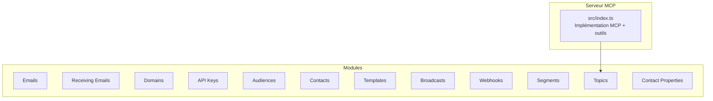
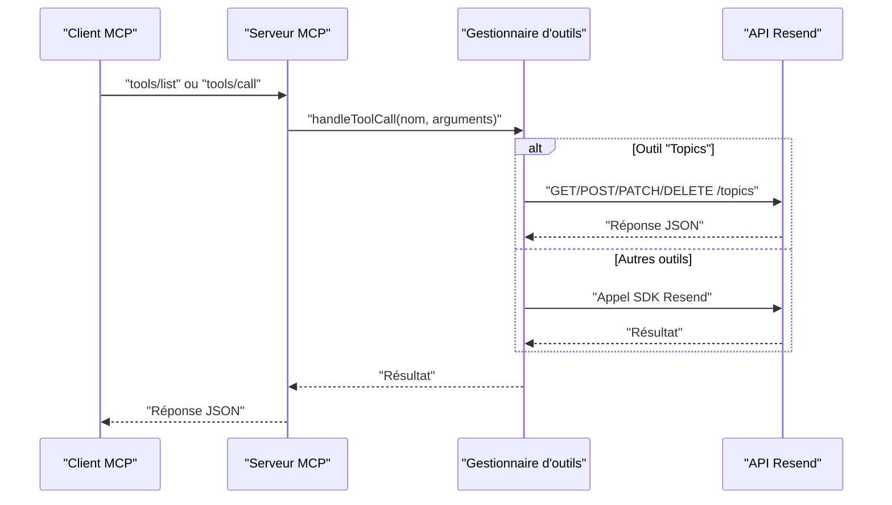
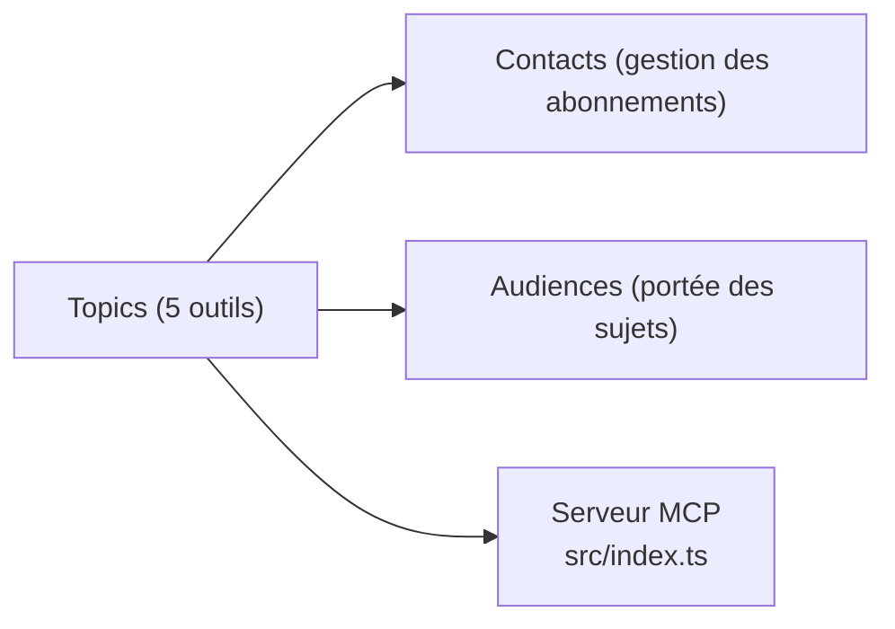

# API Topics

<cite>
**Fichiers référencés dans ce document**
- [README.md](file://README.md)
- [package.json](file://package.json)
- [src/index.ts](file://src/index.ts)
</cite>

## Sommaire
1. [Introduction](#introduction)
2. [Structure du projet](#structure-du-projet)
3. [Composants principaux](#composants-principaux)
4. [Aperçu de l’architecture](#aperçu-de-l’architecture)
5. [Analyse détaillée des outils](#analyse-détaillée-des-outils)
6. [Analyse des dépendances](#analyse-des-dépendances)
7. [Considérations sur les performances](#considérations-sur-les-performances)
8. [Guide de dépannage](#guide-de-dépannage)
9. [Conclusion](#conclusion)

## Introduction
Ce document fournit une documentation complète des outils liés aux topics (5 outils) exposés par le serveur MCP Resend. Il décrit pour chacun d’eux le nom, la description, les paramètres d’entrée, les schémas JSON, les valeurs de retour attendues, ainsi que les codes d’erreur possibles. Des exemples de requêtes et de réponses sont inclus pour illustrer l’utilisation courante. Le document traite également des contraintes spécifiques liées aux abonnements, aux mises à jour de statut, et à la gestion des sujets de subscription, avec des conseils pratiques pour optimiser les communications ciblées.

## Structure du projet
Le projet est un serveur MCP qui expose l’ensemble de l’API Resend sous forme d’outils invocables. La structure principale se compose de :
- Un fichier d’entrée principal qui implémente le protocole MCP et gère les appels d’outils
- Une liste de définitions d’outils structurée par modules (dont “Topics”)

**Diagramme sources**
- [src/index.ts](file://src/index.ts#L42-L1002)

**Section sources**
- [README.md](file://README.md#L472-L491)
- [package.json](file://package.json#L1-L49)
- [src/index.ts](file://src/index.ts#L42-L1002)

## Composants principaux
- Serveur MCP : implémente les méthodes standards pour lister les outils et appeler un outil spécifique.
- Définitions des outils : chacun est décrit par un objet contenant le nom, la description, et le schéma d’entrée JSON.
- Gestion des appels : la fonction de traitement transforme les appels d’outils en appels directs à l’API Resend ou via des requêtes HTTP personnalisées selon le module.

**Section sources**
- [src/index.ts](file://src/index.ts#L1008-L1522)

## Aperçu de l’architecture
Le serveur MCP reçoit des requêtes via stdin, identifie la méthode (tools/list ou tools/call), exécute l’outil correspondant, puis renvoie une réponse via stdout. Les outils “Topics” sont implémentés comme des appels HTTP à l’API Resend.

**Diagramme sources**
- [src/index.ts](file://src/index.ts#L1008-L1522)

## Analyse détaillée des outils

### create_topic
- Nom : create_topic
- Description : Crée un nouveau sujet d’abonnement.
- Paramètres d’entrée (JSON) :
  - name : chaîne, requis
  - audience_id : chaîne, requis
- Schéma JSON attendu :
  - type : object
  - properties : name, audience_id
  - required : name, audience_id
- Valeurs de retour : objet représentant le sujet créé (structure conforme à l’API Resend).
- Codes d’erreur possibles : 400, 401, 403, 404, 409, 422, 429, 500, 503.
- Exemple de requête (tools/call) :
  - name : "create_topic"
  - arguments : { "name": "Nouvelles", "audience_id": "aud_xxxxx" }
- Exemple de réponse (réussite) : objet contenant les propriétés du sujet créé (id, name, audience_id, etc.).
- Contraintes spécifiques :
  - Le nom doit être unique au sein de l’audience concernée.
  - audience_id doit correspondre à une audience existante.
- Guide d’utilisation :
  - Utilisez ce flux pour créer des sujets de communication ciblée (ex. : actualités, offres, alertes).
  - Après création, vous pouvez gérer les abonnements via les outils associés (par exemple, mise à jour des abonnements pour des contacts).

**Section sources**
- [src/index.ts](file://src/index.ts#L881-L939)

### list_topics
- Nom : list_topics
- Description : Liste tous les sujets disponibles.
- Paramètres d’entrée (JSON) :
  - limit : nombre (optionnel)
  - after : chaîne (optionnel)
  - before : chaîne (optionnel)
- Schéma JSON attendu :
  - type : object
  - properties : limit, after, before
- Valeurs de retour : tableau de sujets (structure conforme à l’API Resend).
- Codes d’erreur possibles : 400, 401, 403, 404, 429, 500, 503.
- Exemple de requête (tools/call) :
  - name : "list_topics"
  - arguments : { "limit": 20 }
- Exemple de réponse (réussite) : tableau contenant les sujets (id, name, audience_id, etc.).
- Guide d’utilisation :
  - Utile pour afficher la liste des sujets disponibles à un utilisateur ou pour alimenter des interfaces de sélection.

**Section sources**
- [src/index.ts](file://src/index.ts#L881-L939)

### get_topic
- Nom : get_topic
- Description : Récupère les détails d’un sujet spécifique.
- Paramètres d’entrée (JSON) :
  - topic_id : chaîne, requis
- Schéma JSON attendu :
  - type : object
  - properties : topic_id
  - required : topic_id
- Valeurs de retour : objet représentant le sujet demandé.
- Codes d’erreur possibles : 400, 401, 403, 404, 429, 500, 503.
- Exemple de requête (tools/call) :
  - name : "get_topic"
  - arguments : { "topic_id": "topic_xxxxx" }
- Exemple de réponse (réussite) : objet contenant les détails du sujet.
- Guide d’utilisation :
  - Permet de valider l’existence d’un sujet et d’en afficher les informations.

**Section sources**
- [src/index.ts](file://src/index.ts#L881-L939)

### update_topic
- Nom : update_topic
- Description : Met à jour le nom d’un sujet.
- Paramètres d’entrée (JSON) :
  - topic_id : chaîne, requis
  - name : chaîne, requis
- Schéma JSON attendu :
  - type : object
  - properties : topic_id, name
  - required : topic_id, name
- Valeurs de retour : objet représentant le sujet mis à jour.
- Codes d’erreur possibles : 400, 401, 403, 404, 409, 422, 429, 500, 503.
- Exemple de requête (tools/call) :
  - name : "update_topic"
  - arguments : { "topic_id": "topic_xxxxx", "name": "Nouveau nom" }
- Exemple de réponse (réussite) : objet contenant le nom mis à jour.
- Contraintes spécifiques :
  - Le nom doit rester unique au sein de l’audience.
- Guide d’utilisation :
  - Utile pour corriger des erreurs de frappe ou pour renommer des sujets selon les besoins métiers.

**Section sources**
- [src/index.ts](file://src/index.ts#L881-L939)

### delete_topic
- Nom : delete_topic
- Description : Supprime un sujet.
- Paramètres d’entrée (JSON) :
  - topic_id : chaîne, requis
- Schéma JSON attendu :
  - type : object
  - properties : topic_id
  - required : topic_id
- Valeurs de retour : objet indiquant la suppression réussie (structure conforme à l’API Resend).
- Codes d’erreur possibles : 400, 401, 403, 404, 429, 500, 503.
- Exemple de requête (tools/call) :
  - name : "delete_topic"
  - arguments : { "topic_id": "topic_xxxxx" }
- Exemple de réponse (réussite) : objet de confirmation de suppression.
- Contraintes spécifiques :
  - La suppression ne retire pas automatiquement les abonnements ; elle supprime le sujet lui-même.
- Guide d’utilisation :
  - À utiliser avec précaution, surtout si des contacts sont encore abonnés. Pensez à mettre à jour les abonnements avant de supprimer.

**Section sources**
- [src/index.ts](file://src/index.ts#L881-L939)

## Analyse des dépendances
- Modules liés aux topics :
  - Contacts : outils liés aux abonnements (get_contact_topics, update_contact_topics) permettent de gérer les inscriptions/désinscriptions.
  - Audiences : les sujets sont rattachés à des audiences, donc les outils de gestion des audiences influencent la portée des sujets.
- Implémentation technique :
  - Les outils “Topics” utilisent des appels HTTP directs à l’API Resend (/topics).
  - Le schéma d’entrée est défini dans la liste des outils et utilisé pour valider les arguments.

**Diagramme sources**
- [src/index.ts](file://src/index.ts#L881-L939)
- [src/index.ts](file://src/index.ts#L541-L577)

**Section sources**
- [src/index.ts](file://src/index.ts#L541-L577)
- [src/index.ts](file://src/index.ts#L881-L939)

## Considérations sur les performances
- Taux de limitation : Le serveur respecte les limites de l’API Resend (par défaut 2 requêtes/seconde). Lors de l’utilisation intensive de list_topics, limitez le nombre de résultats avec le paramètre limit.
- Pagination : Utilisez les curseurs after/before pour naviguer efficacement dans les listes importantes.
- Optimisation des communications ciblées : Limitez le nombre de sujets par audience pour améliorer la lisibilité et la performance des opérations d’abonnement.

[Pas de sources supplémentaires car cette section fournit des conseils généraux]

## Guide de dépannage
- Erreur d’authentification : 401 Unauthorized ou 403 Forbidden. Vérifiez que la variable d’environnement RESEND_API_KEY est correctement définie.
- Erreurs de validation : 400 Bad Request ou 422 Unprocessable Entity. Corrigez les champs requis ou mal formés (ex. : topic_id manquant, audience_id incorrect).
- Ressource introuvable : 404 Not Found. Vérifiez que topic_id ou audience_id sont valides.
- Conflits : 409 Conflict. Par exemple, nom de sujet déjà utilisé dans l’audience.
- Trop de requêtes : 429 Too Many Requests. Attendez avant de relancer des appels.
- Erreurs serveur : 500 Internal Server Error ou 503 Service Unavailable. Réessayez plus tard.

**Section sources**
- [README.md](file://README.md#L528-L549)

## Conclusion
Les outils “Topics” permettent de gérer de manière centralisée les sujets de subscription au sein d’une audience. En combinant ces outils avec ceux de gestion des contacts et des audiences, vous pouvez structurer des campagnes ciblées, optimiser les communications et maintenir un bon niveau de conformité en matière d’abonnements. Respectez les contraintes de validation et de pagination pour garantir des performances optimales.