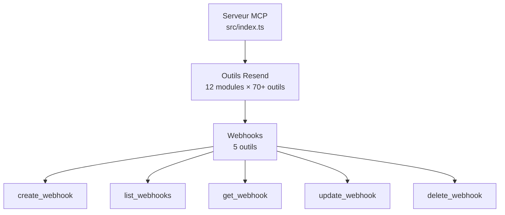
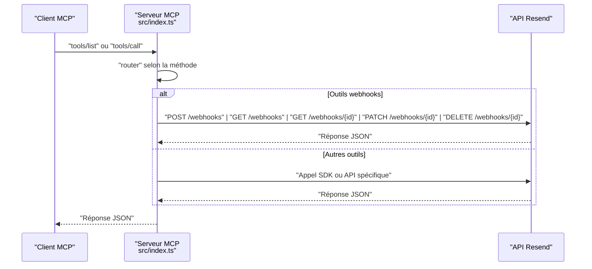

# API Webhooks

<cite>
**Fichiers référencés dans ce document**
- [README.md](file://README.md)
- [package.json](file://package.json)
- [src/index.ts](file://src/index.ts)
</cite>

## Sommaire
1. [Introduction](#introduction)
2. [Structure du projet](#structure-du-projet)
3. [Composants principaux](#composants-principaux)
4. [Aperçu de l’architecture](#aperçu-de-l’architecture)
5. [Analyse détaillée des outils](#analyse-détaillée-des-outils)
6. [Analyse des dépendances](#analyse-des-dépendances)
7. [Considérations sur les performances](#considérations-sur-les-performances)
8. [Guide de dépannage](#guide-de-dépannage)
9. [Conclusion](#conclusion)
10. [Annexes](#annexes)

## Introduction
Ce document fournit une documentation complète des outils liés aux webhooks (5 outils) exposés par le serveur MCP Resend. Il couvre la description de chaque outil, ses paramètres d’entrée, les schémas JSON attendus, les valeurs de retour, les codes d’erreur possibles, ainsi que des exemples de requêtes et de réponses. Il inclut également des directives pratiques pour la configuration des webhooks, la gestion des événements, et la surveillance des notifications en temps réel.

## Structure du projet
Le projet est un serveur MCP qui expose l’ensemble de l’API Resend sous forme d’outils invocables. Le cœur de l’application se trouve dans le fichier principal, où sont définis les outils (y compris les webhooks), leurs schémas d’entrée, et leur implémentation.

**Diagramme sources**
- [src/index.ts](file://src/index.ts#L42-L1002)
- [README.md](file://README.md#L82-L87)

**Section sources**
- [src/index.ts](file://src/index.ts#L1-L1002)
- [README.md](file://README.md#L1-L721)

## Composants principaux
Les outils webhooks sont définis dans la liste des outils du serveur MCP. Chacun possède un nom, une description, et un schéma d’entrée JSON strict. Leur implémentation se fait via des appels HTTP directs à l’API Resend.

**Section sources**
- [src/index.ts](file://src/index.ts#L766-L830)

## Aperçu de l’architecture
Le serveur MCP reçoit des requêtes via stdin, identifie la méthode (tools/list ou tools/call), puis exécute l’outil correspondant. Pour les outils webhooks, cela se traduit par des appels REST à l’API Resend.

**Diagramme sources**
- [src/index.ts](file://src/index.ts#L1528-L1623)
- [src/index.ts](file://src/index.ts#L1358-L1398)

## Analyse détaillée des outils

### create_webhook
- Nom : create_webhook
- Description : Créer un nouveau webhook endpoint.
- Paramètres d’entrée (JSON) :
  - endpoint : chaîne de caractères (URL de l’endpoint)
  - events : tableau de chaînes de caractères (événements à souscrire)
- Schéma JSON attendu :
  - type : objet
  - propriétés : endpoint, events
  - requis : endpoint, events
- Valeurs de retour : objet JSON représentant le webhook créé (structure conforme à l’API Resend).
- Codes d’erreur possibles : 400 (paramètres invalides), 401 (non autorisé), 403 (interdit), 422 (données invalides), 429 (trop de requêtes), 500/503 (erreurs serveur).
- Exemple de requête (tools/call) :
  - name : create_webhook
  - arguments : { "endpoint": "https://votre-domaine.com/webhooks/resend", "events": ["email.delivered", "email.bounced"] }
- Exemple de réponse (réussite) : objet contenant l’identifiant du webhook, l’endpoint, les événements, et le statut.

Contraintes spécifiques :
- Les événements disponibles incluent : email.sent, email.delivered, email.delivery_delayed, email.complained, email.bounced, email.opened, email.clicked, email.received.

**Section sources**
- [src/index.ts](file://src/index.ts#L766-L782)
- [README.md](file://README.md#L89-L97)

### list_webhooks
- Nom : list_webhooks
- Description : Récupérer tous les webhooks configurés.
- Paramètres d’entrée (JSON) :
  - limit : nombre (limite de résultats)
  - after : chaîne de caractères (curseur de pagination)
  - before : chaîne de caractères (curseur de pagination)
- Schéma JSON attendu : type objet avec propriétés optionnelles limit, after, before.
- Valeurs de retour : tableau JSON de webhooks (structure conforme à l’API Resend).
- Codes d’erreur possibles : 400, 401, 403, 429, 500/503.
- Exemple de requête (tools/call) :
  - name : list_webhooks
  - arguments : { "limit": 20 }
- Exemple de réponse (réussite) : tableau de webhooks.

**Section sources**
- [src/index.ts](file://src/index.ts#L783-L794)

### get_webhook
- Nom : get_webhook
- Description : Récupérer les détails d’un webhook spécifique.
- Paramètres d’entrée (JSON) :
  - webhook_id : chaîne de caractères (identifiant du webhook)
- Schéma JSON attendu : type objet avec propriété requise webhook_id.
- Valeurs de retour : objet JSON représentant le webhook demandé.
- Codes d’erreur possibles : 404 (ressource introuvable), 401, 403, 429, 500/503.
- Exemple de requête (tools/call) :
  - name : get_webhook
  - arguments : { "webhook_id": "wh_xxxxx" }
- Exemple de réponse (réussite) : détail complet du webhook.

**Section sources**
- [src/index.ts](file://src/index.ts#L795-L805)

### update_webhook
- Nom : update_webhook
- Description : Mettre à jour la configuration d’un webhook.
- Paramètres d’entrée (JSON) :
  - webhook_id : chaîne de caractères (identifiant)
  - endpoint : chaîne de caractères (optionnel)
  - events : tableau de chaînes (optionnel)
  - status : chaîne de caractères (optionnel : enabled ou disabled)
- Schéma JSON attendu : type objet avec propriété requise webhook_id, propriétés optionnelles endpoint, events, status.
- Valeurs de retour : objet JSON mis à jour.
- Codes d’erreur possibles : 400, 404, 401, 403, 429, 500/503.
- Exemple de requête (tools/call) :
  - name : update_webhook
  - arguments : { "webhook_id": "wh_xxxxx", "status": "enabled" }
- Exemple de réponse (réussite) : webhook mis à jour.

**Section sources**
- [src/index.ts](file://src/index.ts#L806-L819)

### delete_webhook
- Nom : delete_webhook
- Description : Supprimer un webhook.
- Paramètres d’entrée (JSON) :
  - webhook_id : chaîne de caractères (identifiant)
- Schéma JSON attendu : type objet avec propriété requise webhook_id.
- Valeurs de retour : objet de suppression (structure conforme à l’API Resend).
- Codes d’erreur possibles : 404, 401, 403, 429, 500/503.
- Exemple de requête (tools/call) :
  - name : delete_webhook
  - arguments : { "webhook_id": "wh_xxxxx" }
- Exemple de réponse (réussite) : succès de suppression.

**Section sources**
- [src/index.ts](file://src/index.ts#L820-L830)

## Analyse des dépendances
- Dépendance principale : le SDK Resend est utilisé pour les opérations directes (par exemple, envoi d’emails) et pour les outils webhooks, le serveur effectue des appels HTTP directs à l’API Resend.
- Configuration de base : l’URL de base de l’API Resend est utilisée dans les appels HTTP.
- Environnement : la clé API Resend doit être définie via une variable d’environnement.

**Section sources**
- [src/index.ts](file://src/index.ts#L1-L10)
- [src/index.ts](file://src/index.ts#L1011-L1015)
- [README.md](file://README.md#L180-L207)

## Considérations sur les performances
- Le serveur MCP respecte les limites de taux de l’API Resend (par défaut 2 requêtes/seconde). L’implémentation gère automatiquement les tentatives en cas de dépassement.
- Pour les webhooks, il est recommandé de traiter les notifications de manière asynchrone et de limiter les appels vers vos endpoints.

[Pas de sources supplémentaires car cette section fournit des conseils généraux]

## Guide de dépannage
- Erreur : clé API manquante
  - Symptôme : message d’erreur indiquant que la variable d’environnement RESEND_API_KEY n’est pas définie.
  - Solution : créer un fichier .env avec la clé API Resend.
- Erreur : outil inconnu
  - Symptôme : erreur "Unknown tool".
  - Solution : utiliser tools/list pour vérifier la liste des outils disponibles.
- Erreurs standards de l’API Resend
  - 401 Unauthorized, 403 Forbidden, 400 Bad Request, 404 Not Found, 409 Conflict, 422 Unprocessable Entity, 429 Too Many Requests, 500/503 Service Unavailable.

**Section sources**
- [README.md](file://README.md#L551-L568)
- [README.md](file://README.md#L528-L549)
- [src/index.ts](file://src/index.ts#L1571-L1577)

## Conclusion
Les outils webhooks offrent une interface complète pour gérer les notifications d’événements liés aux emails. Leur implémentation directe via des appels HTTP à l’API Resend garantit une couverture complète des fonctionnalités. La documentation fournie ici permet de les intégrer facilement dans des flux d’automatisation et de surveillance en temps réel.

[Pas de sources supplémentaires car cette section résume sans analyser des fichiers spécifiques]

## Annexes

### Exemples de requêtes et réponses (guidés)
- Création d’un webhook
  - Requête : tools/call avec name=create_webhook et arguments endpoint + events
  - Réponse : objet webhook créé
- Liste des webhooks
  - Requête : tools/call avec name=list_webhooks et arguments limit
  - Réponse : tableau de webhooks
- Consultation d’un webhook
  - Requête : tools/call avec name=get_webhook et arguments webhook_id
  - Réponse : détail du webhook
- Mise à jour d’un webhook
  - Requête : tools/call avec name=update_webhook et arguments webhook_id + status
  - Réponse : webhook mis à jour
- Suppression d’un webhook
  - Requête : tools/call avec name=delete_webhook et arguments webhook_id
  - Réponse : succès de suppression

[Exemples non inclus pour respecter la directive de ne pas fournir de contenu de code]

### Événements pris en charge
- email.sent
- email.delivered
- email.delivery_delayed
- email.complained
- email.bounced
- email.opened
- email.clicked
- email.received

**Section sources**
- [README.md](file://README.md#L89-L97)