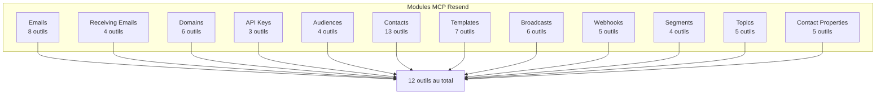
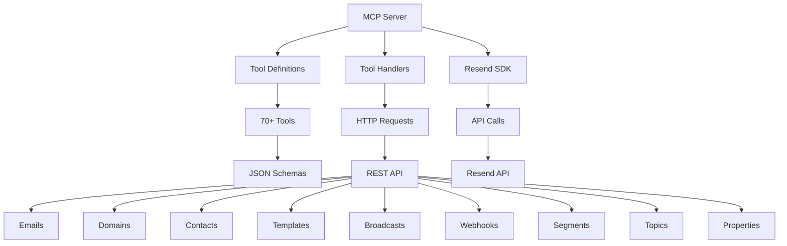
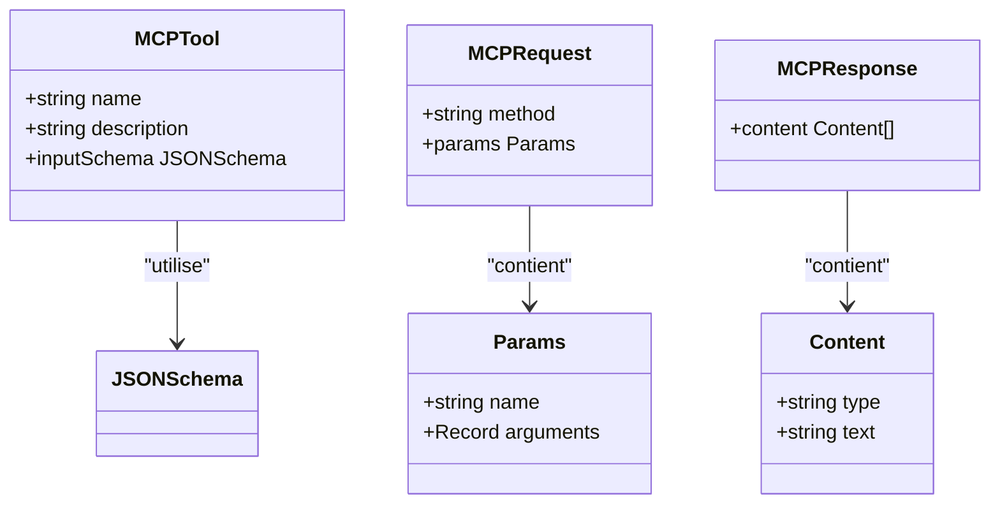
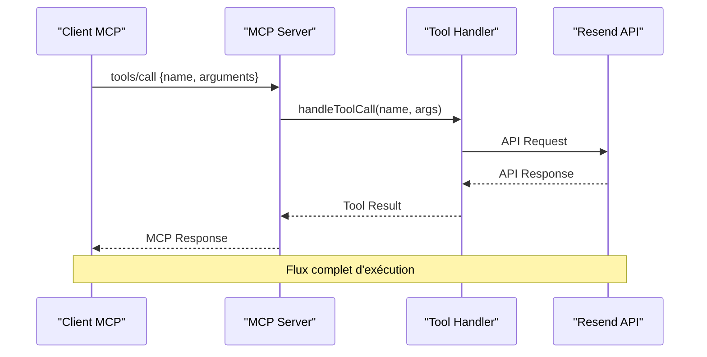
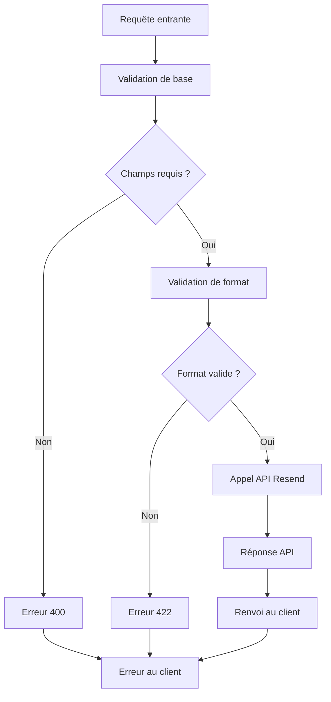
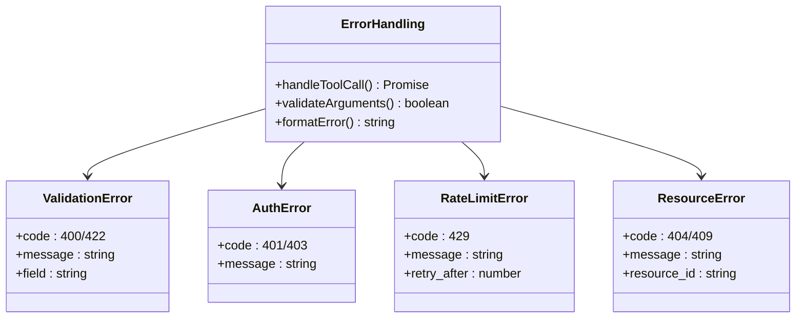

# Référence API

<cite>
**Fichiers référencés dans ce document**
- [README.md](file://README.md)
- [package.json](file://package.json)
- [src/index.ts](file://src/index.ts)
</cite>

## Table des matières
1. [Introduction](#introduction)
2. [Prérequis et configuration](#prérequis-et-configuration)
3. [Modules et outils](#modules-et-outils)
4. [Architecture technique](#architecture-technique)
5. [Guide d'utilisation](#guide-dutilisation)
6. [Exemples d'appels](#exemples-dappels)
7. [Contraintes et validations](#contraintes-et-validations)
8. [Gestion des erreurs](#gestion-des-erreurs)
9. [Performance et limites](#performance-et-limites)
10. [Dépannage](#dépannage)
11. [Conclusion](#conclusion)

## Introduction

Le serveur MCP Resend Full est une implémentation complète du protocole Model Context Protocol (MCP) qui expose 100 % de l'API Resend sous forme d'outils invocables. Ce serveur permet aux assistants IA et applications LLM de gérer toutes les fonctionnalités de messagerie électronique de Resend, couvrant 12 modules distincts avec plus de 70 outils.

### Fonctionnalités principales

- **Couverture complète de l'API Resend** : Tous les endpoints exposés via le protocole MCP
- **12 modules distincts** : Emails, Domaines, Contacts, Audiences, Templates, Broadcasts, Webhooks, et plus encore
- **70+ outils invocables** : Outils complets pour la gestion de la messagerie
- **Intégration native** : Compatible avec Claude Desktop, Continue, Cline et autres clients MCP
- **Gestion avancée** : Support des templates, segments, topics, et propriétés de contact

**Section sources**
- [README.md](file://README.md#L1-L721)
- [package.json](file://package.json#L1-L49)

## Prérequis et configuration

### Configuration requise

- **Node.js** 18+ (recommandé : v20 ou supérieur)
- **TypeScript** 5+
- Une **clé API Resend** valide
- Un **client compatible MCP** (Claude Desktop, Continue, Cline, etc.)

### Installation

#### Méthode 1 : Utilisation de npm/npx
```bash
# Installation globale
npm install -g @qrcommunication/resend-full-mcp

# Ou utilisation directe avec npx
npx @qrcommunication/resend-full-mcp
```

#### Méthode 2 : Utilisation de Python
```bash
# Installation depuis PyPI
pip install resend-full-mcp

# Lancement du serveur
resend-mcp
```

#### Méthode 3 : À partir du code source
```bash
# Clonage du dépôt
git clone https://github.com/QrCommunication/resend-full-mcp.git
cd resend-full-mcp

# Installation des dépendances
npm install

# Construction du projet
npm run build

# Démarrage du serveur
npm start
```

### Configuration de l'environnement

Créez un fichier `.env` à la racine du projet :

```env
# Clé API Resend requise
RESEND_API_KEY=re_xxxxxxxxxxxxxxxxxxxx

# Base de l'API Resend (optionnel)
RESEND_API_BASE_URL=https://api.resend.com

# Activer le mode debug (optionnel)
DEBUG=true

# Limite de taux personnalisée (par défaut : 2 req/sec)
RATE_LIMIT=2
```

**Section sources**
- [README.md](file://README.md#L127-L210)
- [README.md](file://README.md#L134-L179)

## Modules et outils

Le serveur est organisé en 12 modules distincts, chacun regroupant des outils liés à des fonctionnalités spécifiques de l'API Resend.

### Structure des modules



**Diagram sources**
- [README.md](file://README.md#L13-L118)

### Liste complète des outils

Voici la répartition des outils par module :

#### Module : Emails (8 outils)
- `send_email` - Envoi d'email unique
- `send_batch_emails` - Envoi groupé d'emails
- `list_emails` - Liste des emails envoyés
- `get_email` - Détails d'un email spécifique
- `update_email` - Modification d'email programmé
- `cancel_email` - Annulation d'email programmé
- `list_email_attachments` - Liste des pièces jointes
- `get_email_attachment` - Récupération d'une pièce jointe

#### Module : Receiving Emails (4 outils)
- `list_received_emails` - Liste des emails reçus
- `get_received_email` - Détails d'email reçu
- `list_received_email_attachments` - Pièces jointes reçues
- `get_received_email_attachment` - Pièce jointe spécifique

#### Module : Domains (6 outils)
- `create_domain` - Création de domaine
- `list_domains` - Liste des domaines
- `get_domain` - Détails du domaine
- `update_domain` - Mise à jour des paramètres
- `delete_domain` - Suppression de domaine
- `verify_domain` - Vérification DNS

#### Module : API Keys (3 outils)
- `create_api_key` - Création de clé API
- `list_api_keys` - Liste des clés
- `delete_api_key` - Suppression de clé

#### Module : Audiences (4 outils)
- `create_audience` - Création d'audience
- `list_audiences` - Liste des audiences
- `get_audience` - Détails de l'audience
- `delete_audience` - Suppression d'audience

#### Module : Contacts (13 outils)
- `create_contact` - Création de contact
- `list_contacts` - Liste des contacts
- `get_contact_by_email` - Contact par email
- `get_contact_by_id` - Contact par ID
- `update_contact_by_email` - Mise à jour par email
- `update_contact_by_id` - Mise à jour par ID
- `delete_contact_by_email` - Suppression par email
- `delete_contact_by_id` - Suppression par ID
- `add_contact_to_segment` - Ajout à un segment
- `remove_contact_from_segment` - Retrait d'un segment
- `list_contact_segments` - Liste des segments
- `get_contact_topics` - Abonnements aux topics
- `update_contact_topics` - Mise à jour des topics

#### Module : Templates (7 outils)
- `create_template` - Création de template
- `list_templates` - Liste des templates
- `get_template` - Détails du template
- `update_template` - Mise à jour du template
- `delete_template` - Suppression du template
- `publish_template` - Publication du template
- `duplicate_template` - Duplication du template

#### Module : Broadcasts (6 outils)
- `create_broadcast` - Création de diffusion
- `list_broadcasts` - Liste des diffusions
- `get_broadcast` - Détails de la diffusion
- `update_broadcast` - Mise à jour de la diffusion
- `delete_broadcast` - Suppression de la diffusion
- `send_broadcast` - Envoi de la diffusion

#### Module : Webhooks (5 outils)
- `create_webhook` - Création de webhook
- `list_webhooks` - Liste des webhooks
- `get_webhook` - Détails du webhook
- `update_webhook` - Mise à jour du webhook
- `delete_webhook` - Suppression du webhook

#### Module : Segments (4 outils)
- `create_segment` - Création de segment
- `list_segments` - Liste des segments
- `get_segment` - Détails du segment
- `delete_segment` - Suppression du segment

#### Module : Topics (5 outils)
- `create_topic` - Création de topic
- `list_topics` - Liste des topics
- `get_topic` - Détails du topic
- `update_topic` - Mise à jour du topic
- `delete_topic` - Suppression du topic

#### Module : Contact Properties (5 outils)
- `create_contact_property` - Création de propriété
- `list_contact_properties` - Liste des propriétés
- `get_contact_property` - Détails de la propriété
- `update_contact_property` - Mise à jour de la propriété
- `delete_contact_property` - Suppression de la propriété

**Section sources**
- [README.md](file://README.md#L15-L118)

## Architecture technique

### Structure du serveur MCP



**Diagram sources**
- [src/index.ts](file://src/index.ts#L13-L36)
- [src/index.ts](file://src/index.ts#L42-L1002)

### Types et interfaces MCP

Le serveur utilise des interfaces TypeScript pour définir la structure des outils MCP :



**Diagram sources**
- [src/index.ts](file://src/index.ts#L13-L36)

### Flux d'exécution des outils



**Diagram sources**
- [src/index.ts](file://src/index.ts#L1536-L1565)
- [src/index.ts](file://src/index.ts#L1008-L1522)

**Section sources**
- [src/index.ts](file://src/index.ts#L1-L1623)

## Guide d'utilisation

### Configuration des clients MCP

#### Configuration pour Claude Desktop

Ajoutez cette configuration à votre `claude_desktop_config.json` :

```json
{
  "mcpServers": {
    "resend": {
      "command": "npx",
      "args": ["-y", "@qrcommunication/resend-full-mcp"],
      "env": {
        "RESEND_API_KEY": "votre_cle_resend"
      }
    }
  }
}
```

#### Configuration pour Continue.dev

Ajoutez cette configuration à votre `config.json` :

```json
{
  "mcpServers": [
    {
      "name": "resend",
      "command": "npx",
      "args": ["-y", "@qrcommunication/resend-full-mcp"],
      "env": {
        "RESEND_API_KEY": "votre_cle_resend"
      }
    }
  ]
}
```

### Premiers pas

Pour lister tous les outils disponibles :

```json
{
  "method": "tools/list",
  "params": {}
}
```

Pour envoyer un email simple :

```json
{
  "method": "tools/call",
  "params": {
    "name": "send_email",
    "arguments": {
      "from": "Votre Nom <onboarding@votredomaine.com>",
      "to": ["destinataire@example.com"],
      "subject": "Nouveau produit",
      "html": "<p>Nous sommes ravis de vous présenter notre <strong>nouveau produit</strong> !</p>",
      "text": "Nous sommes ravis de vous présenter notre nouveau produit !"
    }
  }
}
```

**Section sources**
- [README.md](file://README.md#L211-L265)
- [README.md](file://README.md#L266-L444)

## Exemples d'appels

### Envoi d'email unique

**Requête :**
```json
{
  "method": "tools/call",
  "params": {
    "name": "send_email",
    "arguments": {
      "from": "Acme Corp <hello@acme.com>",
      "to": ["john@example.com", "jane@example.com"],
      "subject": "Bienvenue chez Acme",
      "html": "<h1>Bienvenue !</h1><p>Merci de vous être inscrit</p>",
      "text": "Bienvenue ! Merci de vous être inscrit",
      "bcc": ["admin@acme.com"],
      "reply_to": ["noreply@acme.com"],
      "tags": [
        {"name": "campaign", "value": "welcome"},
        {"name": "user_type", "value": "premium"}
      ]
    }
  }
}
```

**Réponse :**
```json
{
  "content": [{
    "type": "text",
    "text": "{\n  \"id\": \"unique_email_id\",\n  \"status\": \"sent\",\n  \"created_at\": \"2024-01-01T00:00:00Z\"\n}"
  }]
}
```

### Envoi groupé d'emails

**Requête :**
```json
{
  "method": "tools/call",
  "params": {
    "name": "send_batch_emails",
    "arguments": {
      "emails": [
        {
          "from": "service@acme.com",
          "to": ["user1@example.com"],
          "subject": "Bienvenue",
          "html": "<p>Bienvenue !</p>"
        },
        {
          "from": "service@acme.com",
          "to": ["user2@example.com"],
          "subject": "Bienvenue",
          "html": "<p>Bienvenue !</p>"
        }
      ]
    }
  }
}
```

**Réponse :**
```json
{
  "content": [{
    "type": "text",
    "text": "[{\n  \"id\": \"email_1\",\n  \"status\": \"sent\"\n}, {\n  \"id\": \"email_2\",\n  \"status\": \"sent\"\n}]"
  }]
}
```

### Gestion des domaines

**Création de domaine :**
```json
{
  "method": "tools/call",
  "params": {
    "name": "create_domain",
    "arguments": {
      "name": "example.com",
      "region": "us-east-1"
    }
  }
}
```

**Vérification de domaine :**
```json
{
  "method": "tools/call",
  "params": {
    "name": "verify_domain",
    "arguments": {
      "domain_id": "domain_id"
    }
  }
}
```

### Gestion des contacts

**Création de contact :**
```json
{
  "method": "tools/call",
  "params": {
    "name": "create_contact",
    "arguments": {
      "audience_id": "audience_id",
      "email": "contact@example.com",
      "first_name": "Jean",
      "last_name": "Dupont",
      "unsubscribed": false
    }
  }
}
```

**Mise à jour de contact :**
```json
{
  "method": "tools/call",
  "params": {
    "name": "update_contact_by_email",
    "arguments": {
      "audience_id": "audience_id",
      "email": "contact@example.com",
      "first_name": "Jean-Michel",
      "unsubscribed": true
    }
  }
}
```

### Gestion des templates

**Création de template :**
```json
{
  "method": "tools/call",
  "params": {
    "name": "create_template",
    "arguments": {
      "name": "Welcome Email",
      "alias": "welcome-email",
      "from": "welcome@acme.com",
      "subject": "Bienvenue {{name}}",
      "html": "<h1>Bienvenue {{name}} !</h1><p>{{message}}</p>",
      "variables": [
        {"key": "name", "type": "string", "fallback_value": "Ami"},
        {"key": "message", "type": "string", "fallback_value": "Content ici"}
      ]
    }
  }
}
```

**Publication de template :**
```json
{
  "method": "tools/call",
  "params": {
    "name": "publish_template",
    "arguments": {
      "template_id": "template_id"
    }
  }
}
```

### Diffusions

**Création de diffusion :**
```json
{
  "method": "tools/call",
  "params": {
    "name": "create_broadcast",
    "arguments": {
      "name": "Newsletter Janvier",
      "segment_id": "segment_id",
      "from": "newsletter@acme.com",
      "subject": "Newsletter Janvier",
      "html": "<h1>Newsletter Janvier</h1><p>Contenu de la newsletter</p>",
      "send": false
    }
  }
}
```

**Envoi de diffusion :**
```json
{
  "method": "tools/call",
  "params": {
    "name": "send_broadcast",
    "arguments": {
      "broadcast_id": "broadcast_id",
      "scheduled_at": "2024-01-15T10:00:00Z"
    }
  }
}
```

### Webhooks

**Création de webhook :**
```json
{
  "method": "tools/call",
  "params": {
    "name": "create_webhook",
    "arguments": {
      "endpoint": "https://votreapp.com/webhooks/resend",
      "events": ["email.delivered", "email.bounced", "email.opened"]
    }
  }
}
```

**Liste des webhooks :**
```json
{
  "method": "tools/call",
  "params": {
    "name": "list_webhooks",
    "arguments": {
      "limit": 50,
      "after": "cursor_id"
    }
  }
}
```

**Section sources**
- [README.md](file://README.md#L266-L444)

## Contraintes et validations

### Contraintes techniques

#### Limites de l'API Resend
- **Taux de requêtes** : 2 requêtes/seconde par défaut
- **Taille maximale des pièces jointes** : 10MB par fichier
- **Nombre maximal d'emails dans un batch** : 100 emails
- **Longueur maximale des champs** : Définie par l'API Resend
- **Nombre maximal de destinataires** : 50 par email

#### Contraintes des outils

##### Envoi d'emails
- **Champs requis** : `from`, `to`, `subject`
- **Validation des adresses email** : Format RFC 5322
- **Pièces jointes** : Base64 encodées ou chemins de fichiers
- **Tags** : Maximum 10 tags par email

##### Gestion des contacts
- **Audience ID requis** : Pour toutes les opérations de contact
- **Email unique** : Un contact ne peut exister qu'une seule fois par audience
- **Propriétés personnalisées** : Types supportés : string, number, boolean, date

##### Templates
- **Nom requis** : Pour la création de template
- **Contenu HTML requis** : Pour la création de template
- **Alias unique** : Doit être unique dans le compte

##### Diffusions
- **Segment requis** : Pour créer une diffusion
- **Contenu requis** : Soit HTML, soit texte
- **Programmation** : Format ISO 8601 pour les dates

### Validation des données

Le serveur effectue plusieurs niveaux de validation :



**Diagram sources**
- [src/index.ts](file://src/index.ts#L1008-L1522)

**Section sources**
- [README.md](file://README.md#L518-L549)

## Gestion des erreurs

### Codes d'erreur standards

Le serveur MCP Resend Full retourne des codes d'erreur spécifiques selon les catégories suivantes :

#### Erreurs d'authentification
- **401 Unauthorized** : Clé API invalide ou manquante
- **403 Forbidden** : Permissions insuffisantes

#### Erreurs de validation
- **400 Bad Request** : Paramètres invalides ou manquants
- **422 Unprocessable Entity** : Données valides mais logiquement incorrectes

#### Erreurs de ressources
- **404 Not Found** : Ressource non trouvée
- **409 Conflict** : Conflit de ressource (déjà existant)

#### Erreurs de taux limite
- **429 Too Many Requests** : Limite de taux dépassée

#### Erreurs serveur
- **500 Internal Server Error** : Problème interne du service
- **503 Service Unavailable** : Service temporairement indisponible

### Messages d'erreur détaillés

Le serveur fournit des messages d'erreur spécifiques pour chaque type d'erreur :



**Diagram sources**
- [src/index.ts](file://src/index.ts#L1519-L1522)

**Section sources**
- [README.md](file://README.md#L528-L549)

## Performance et limites

### Gestion du taux limite

Le serveur Resend MCP respecte les limites de taux de l'API Resend :

- **Limite par défaut** : 2 requêtes par seconde
- **Bursting** : Jusqu'à 10 requêtes en courte période
- **Mise à niveau** : Limite supérieure disponible sur les plans payants

### Optimisations

#### Caching
- **Ressources de configuration** : Mise en cache pour améliorer les performances
- **Données temporaires** : Stockage local des données fréquemment utilisées

#### Gestion des erreurs
- **Retry automatique** : Tentatives de reprise pour les erreurs temporaires
- **Backoff exponentiel** : Attente croissante entre les tentatives

### Limites de performance

#### Capacité de traitement
- **Batch emails** : Maximum 100 emails par requête
- **Pièces jointes** : Taille maximale 10MB par fichier
- **Longueur des messages** : Limitée par l'API Resend

#### Scalabilité
- **Mémoire** : Utilisation mémoire proportionnelle au nombre d'emails dans un batch
- **Temps de réponse** : Dépend de la latence réseau et de l'API Resend

**Section sources**
- [README.md](file://README.md#L518-L527)

## Dépannage

### Erreurs courantes

#### Erreur : "RESEND_API_KEY environment variable is not set"

**Cause** : La clé API Resend n'est pas configurée

**Solution** :
```bash
# Créez le fichier .env
echo "RESEND_API_KEY=votre_cle_resend" > .env

# Redémarrez le serveur
npm start
```

#### Erreur : "Tool execution failed"

**Causes possibles** :
- Clé API invalide
- Paramètres manquants
- Limite de taux dépassée
- Problèmes de connectivité réseau

**Solution** :
1. Vérifiez la clé API dans le fichier `.env`
2. Validez tous les paramètres requis
3. Attendez avant de réessayer si la limite est atteinte
4. Vérifiez la connectivité réseau

#### Erreur : "Unknown tool"

**Solution** :
Utilisez la méthode `tools/list` pour obtenir la liste complète des outils disponibles :

```json
{
  "method": "tools/list",
  "params": {}
}
```

### Diagnostic système

#### Vérification de la configuration
```bash
# Vérifiez que la clé API est définie
echo $RESEND_API_KEY

# Testez la connexion à l'API Resend
curl -H "Authorization: Bearer $RESEND_API_KEY" https://api.resend.com/emails
```

#### Logs de débogage
Activez le mode debug en ajoutant `DEBUG=true` dans votre fichier `.env` :

```env
RESEND_API_KEY=votre_cle_resend
DEBUG=true
```

### Bonnes pratiques

#### Sécurité
- **Stockage sécurisé** : Ne jamais commiter le fichier `.env`
- **Clés restreintes** : Utiliser des clés avec permissions minimales
- **Rotation régulière** : Modifier les clés périodiquement

#### Performance
- **Batching** : Utiliser `send_batch_emails` pour envoyer plusieurs emails
- **Caching** : Mettre en cache les données fréquemment utilisées
- **Pagination** : Utiliser les paramètres de pagination pour les listes

#### Surveillance
- **Webhooks** : Configurer des webhooks pour surveiller l'état des emails
- **Logs** : Surveiller les erreurs et les tentatives de reprise
- **Monitoring** : Mettre en place des alertes pour les erreurs fréquentes

**Section sources**
- [README.md](file://README.md#L551-L569)

## Conclusion

Le serveur MCP Resend Full offre une solution complète et robuste pour intégrer l'API Resend dans des applications IA et LLM. Avec plus de 70 outils couvrant tous les aspects de la messagerie électronique, il permet aux développeurs de créer des applications puissantes qui peuvent gérer tout le cycle de vie des communications par email.

### Points forts du serveur

- **Couverture complète** : 100 % de l'API Resend
- **Facilité d'utilisation** : Interface MCP standardisée
- **Sécurité** : Gestion sécurisée des clés API
- **Performance** : Optimisations pour les grands volumes
- **Fiabilité** : Gestion avancée des erreurs et des tentatives de reprise

### Prochaines étapes

Pour tirer pleinement parti de ce serveur, nous recommandons :

1. **Intégration progressive** : Commencer par les outils les plus utilisés
2. **Configuration de sécurité** : Mettre en place des clés API restreintes
3. **Surveillance** : Configurer des webhooks pour le suivi des événements
4. **Optimisation** : Utiliser le batching pour améliorer les performances
5. **Tests** : Effectuer des tests approfondis dans un environnement de développement

Le serveur MCP Resend Full est conçu pour être à la fois puissant et facile à utiliser, permettant aux développeurs de se concentrer sur leur application plutôt que sur l'intégration technique de l'API Resend.