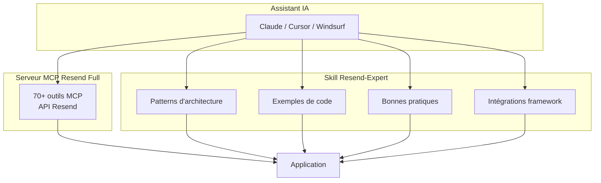

# Skill Resend-Expert

<cite>
**Fichiers référencés dans ce document**
- [skills/resend-expert/SKILL.md](file://skills/resend-expert/SKILL.md)
- [scripts/postinstall.js](file://scripts/postinstall.js)
- [package.json](file://package.json)
- [README.md](file://README.md)
</cite>

## Sommaire
1. [Introduction](#introduction)
2. [Qu'est-ce que le Skill Resend-Expert ?](#quest-ce-que-le-skill-resend-expert)
3. [Installation automatique](#installation-automatique)
4. [Contenu du skill](#contenu-du-skill)
5. [Fondamentaux Resend](#fondamentaux-resend)
6. [Architecture recommandée](#architecture-recommandée)
7. [Implémentations par cas d'usage](#implémentations-par-cas-dusage)
8. [Gestion des webhooks](#gestion-des-webhooks)
9. [Audiences et contacts](#audiences-et-contacts)
10. [Broadcasts (campagnes marketing)](#broadcasts-campagnes-marketing)
11. [Intégrations framework](#intégrations-framework)
12. [Bonnes pratiques](#bonnes-pratiques)
13. [Installation manuelle](#installation-manuelle)
14. [Utilisation avec les clients MCP](#utilisation-avec-les-clients-mcp)

## Introduction
Le Skill Resend-Expert est un guide complet de 1644 lignes qui accompagne le serveur MCP Resend Full. Tandis que le serveur MCP expose les outils de l'API Resend, le skill fournit l'expertise nécessaire pour implémenter Resend correctement dans vos applications web, mobile et backend.

Ce skill est **automatiquement installé** lors de l'installation du package npm `resend-full-mcp` et devient disponible dans les assistants IA compatibles (Claude Desktop, Cursor, Windsurf, etc.).

## Qu'est-ce que le Skill Resend-Expert ?
Le Skill Resend-Expert est un fichier markdown structuré qui contient :

- **Patterns d'architecture** pour applications web, mobile et backend
- **Exemples de code complets** pour tous les cas d'usage courants
- **Guides d'implémentation** pour React Email, webhooks, audiences, broadcasts
- **Bonnes pratiques** de sécurité, délivrabilité et performance
- **Intégrations framework** (Next.js, Express, NestJS, React Native)
- **Stratégies de retry** et gestion d'erreurs
- **Configuration DNS** (SPF, DKIM, DMARC)
- **Patterns de queue** pour envois asynchrones

**Section sources**
- [skills/resend-expert/SKILL.md](file://skills/resend-expert/SKILL.md#L1-L13)
- [README.md](file://README.md#L505-L532)

## Installation automatique
Le skill est automatiquement installé dans plusieurs répertoires lors de l'exécution du script `postinstall.js` :

### Répertoires cibles
Le script tente d'installer le skill dans tous les répertoires détectés :

1. **`~/.claude/skills/`** - Pour Claude Code et Claude CLI
2. **`~/.agents/skills/`** - Pour Cursor, Windsurf et autres agents IA
3. **`~/.config/ai/skills/`** - Configuration IA générique

Cette approche multi-répertoires garantit la compatibilité avec différents clients MCP et environnements de développement IA.

### Processus d'installation
```javascript
// Le script postinstall.js copie récursivement
const skillSource = './skills/resend-expert';
const targetDirs = [
  path.join(os.homedir(), '.claude', 'skills'),
  path.join(os.homedir(), '.agents', 'skills'),
  path.join(os.homedir(), '.config', 'ai', 'skills')
];
```

Le skill est copié dans chaque répertoire détecté, permettant son utilisation immédiate par les assistants IA.

**Section sources**
- [scripts/postinstall.js](file://scripts/postinstall.js)
- [package.json](file://package.json#L14)
- [README.md](file://README.md#L509-L518)

## Contenu du skill
Le skill Resend-Expert est organisé en 13 sections principales couvrant tous les aspects de l'implémentation Resend :

### Structure du contenu
1. **Fondamentaux Resend** - Concepts clés, API RESTful, SDKs, délivrabilité
2. **Configuration initiale** - API Keys, domaines, DNS, variables d'environnement
3. **Architecture recommandée** - Patterns de service email, singleton client
4. **Implémentation par cas d'usage** - Emails transactionnels, React Email, pièces jointes, batch, scheduled
5. **Webhooks** - Configuration, handlers, vérification de signature
6. **Audiences et contacts** - Création, gestion, import bulk
7. **Broadcasts** - Campagnes marketing, création, envoi
8. **Intégration framework** - Next.js, Express, NestJS, React Native
9. **Intégration mobile** - React Native, backend pour mobile
10. **Bonnes pratiques** - Sécurité, délivrabilité, performance, monitoring
11. **Erreurs courantes** - Debugging, solutions
12. **Checklist de production** - Pré-déploiement, monitoring, conformité
13. **Resources** - Documentation, liens utiles

**Section sources**
- [skills/resend-expert/SKILL.md](file://skills/resend-expert/SKILL.md#L1-L1644)

## Fondamentaux Resend
Le skill commence par expliquer les concepts fondamentaux de Resend :

### Qu'est-ce que Resend ?
- **API RESTful** simple et intuitive
- **SDKs** pour Node.js, Python, Go, Ruby, PHP, Elixir, Java
- **Délivrabilité** optimisée avec infrastructure dédiée
- **Analytics** en temps réel (opens, clicks, bounces)
- **React Email** intégration native pour templates

### Concepts clés
| Concept | Description |
|---------|-------------|
| **Transactional Email** | Emails déclenchés par actions utilisateur (confirmation, reset password) |
| **Marketing Email** | Emails de masse (newsletters, promotions) via Broadcasts |
| **Audience** | Liste de contacts pour envois marketing |
| **Segment** | Sous-ensemble filtré d'une audience |
| **Topic** | Catégorie d'abonnement pour preference center |
| **Domain** | Domaine vérifié pour envoi authentifié |
| **Webhook** | Notification temps réel des événements email |

**Section sources**
- [skills/resend-expert/SKILL.md](file://skills/resend-expert/SKILL.md#L14-L37)

## Architecture recommandée
Le skill propose un pattern d'architecture éprouvé pour structurer le code email :

### Pattern Service Email
```
src/
├── services/
│   └── email/
│       ├── index.ts           # Export principal
│       ├── client.ts          # Instance Resend
│       ├── templates/         # Templates email
│       │   ├── welcome.tsx
│       │   ├── reset-password.tsx
│       │   └── invoice.tsx
│       ├── types.ts           # Types TypeScript
│       └── utils.ts           # Helpers
├── jobs/
│   └── email-queue.ts         # Queue pour envois async
└── webhooks/
    └── resend.ts              # Handler webhooks
```

### Client Singleton
Le skill recommande l'utilisation d'un pattern Singleton pour le client Resend :

```typescript
class EmailClient {
  private static instance: Resend;
  
  static getInstance(): Resend {
    if (!EmailClient.instance) {
      const apiKey = process.env.RESEND_API_KEY;
      if (!apiKey) {
        throw new Error('RESEND_API_KEY is required');
      }
      EmailClient.instance = new Resend(apiKey);
    }
    return EmailClient.instance;
  }
}

export const resend = EmailClient.getInstance();
```

### Types TypeScript
Le skill fournit des définitions de types complètes pour garantir la sécurité du code :

```typescript
export interface EmailConfig {
  from: string;
  to: string | string[];
  subject: string;
  html?: string;
  text?: string;
  replyTo?: string | string[];
  cc?: string | string[];
  bcc?: string | string[];
  scheduledAt?: string;
  tags?: Array<{ name: string; value: string }>;
  headers?: Record<string, string>;
  attachments?: Array<{
    filename: string;
    content: Buffer | string;
    contentType?: string;
  }>;
}
```

**Section sources**
- [skills/resend-expert/SKILL.md](file://skills/resend-expert/SKILL.md#L96-L191)

## Implémentations par cas d'usage
Le skill fournit des implémentations complètes pour chaque cas d'usage courant :

### Email transactionnel simple
```typescript
export async function sendEmail(config: EmailConfig): Promise<EmailResult> {
  try {
    const { data, error } = await resend.emails.send({
      from: config.from || process.env.RESEND_FROM_EMAIL!,
      to: Array.isArray(config.to) ? config.to : [config.to],
      subject: config.subject,
      html: config.html,
      text: config.text,
      reply_to: config.replyTo,
      tags: config.tags
    });
    
    if (error) {
      return { id: '', success: false, error: error.message };
    }
    
    return { id: data!.id, success: true };
  } catch (err) {
    return { id: '', success: false, error: err.message };
  }
}
```

### Email de bienvenue avec React Email
Le skill montre comment créer des templates React Email professionnels avec styles inline pour compatibilité email :

```tsx
export function WelcomeEmail({ username, loginUrl, unsubscribeUrl }: WelcomeEmailProps) {
  return (
    <Html>
      <Head />
      <Preview>Bienvenue sur notre plateforme, {username}!</Preview>
      <Body style={main}>
        <Container style={container}>
          
          <Heading style={heading}>Bienvenue, {username}!</Heading>
          <Text style={paragraph}>
            Nous sommes ravis de vous compter parmi nous.
          </Text>
          <Button style={button} href={loginUrl}>
            Commencer maintenant
          </Button>
          <Text style={unsubscribe}>
            <Link href={unsubscribeUrl}>Se désabonner</Link>
          </Text>
        </Container>
      </Body>
    </Html>
  );
}
```

### Reset password
Implementation complète avec lien temporisé et priorité haute :

```typescript
export async function sendResetPasswordEmail({ email, resetToken, expiresIn }: SendResetPasswordParams) {
  const resetUrl = `${process.env.APP_URL}/reset-password?token=${resetToken}`;
  
  const { data, error } = await resend.emails.send({
    from: `Security <security@${process.env.EMAIL_DOMAIN}>`,
    to: email,
    subject: 'Réinitialisation de votre mot de passe',
    html: `...`,
    tags: [
      { name: 'type', value: 'password_reset' },
      { name: 'priority', value: 'high' }
    ],
    headers: {
      'X-Priority': '1',
      'X-MSMail-Priority': 'High'
    }
  });
}
```

### Email avec pièces jointes
```typescript
export async function sendInvoiceEmail({ email, customerName, invoiceNumber, pdfPath }: SendInvoiceParams) {
  const pdfBuffer = await readFile(pdfPath);
  
  const { data, error } = await resend.emails.send({
    from: `Facturation <billing@${process.env.EMAIL_DOMAIN}>`,
    to: email,
    subject: `Facture ${invoiceNumber}`,
    html: `...`,
    attachments: [
      {
        filename: `facture-${invoiceNumber}.pdf`,
        content: pdfBuffer,
        contentType: 'application/pdf'
      }
    ]
  });
}
```

### Envoi en batch (jusqu'à 100 emails)
```typescript
export async function sendBatchEmails(emails: BatchEmail[], fromEmail: string) {
  const BATCH_SIZE = 100;
  const results = [];

  for (let i = 0; i < emails.length; i += BATCH_SIZE) {
    const batch = emails.slice(i, i + BATCH_SIZE);
    const batchPayload = batch.map(email => ({
      from: fromEmail,
      to: email.to,
      subject: email.subject,
      html: email.html,
      tags: email.tags
    }));

    const { data, error } = await resend.batch.send(batchPayload);
    results.push({ batch: i / BATCH_SIZE + 1, data, error });
    
    // Respecter le rate limiting (2 req/s par défaut)
    if (i + BATCH_SIZE < emails.length) {
      await new Promise(resolve => setTimeout(resolve, 500));
    }
  }

  return results;
}
```

### Email programmé (scheduled)
```typescript
export async function scheduleEmail({ to, subject, html, scheduledAt }: ScheduleEmailParams) {
  // Vérifier que la date est dans le futur
  if (scheduledAt <= new Date()) {
    throw new Error('Scheduled time must be in the future');
  }
  
  // Vérifier limite de 72h
  const maxScheduleTime = new Date();
  maxScheduleTime.setHours(maxScheduleTime.getHours() + 72);
  
  if (scheduledAt > maxScheduleTime) {
    throw new Error('Cannot schedule more than 72 hours in advance');
  }

  const { data, error } = await resend.emails.send({
    from: process.env.RESEND_FROM_EMAIL!,
    to,
    subject,
    html,
    scheduled_at: scheduledAt.toISOString(),
    tags: [
      { name: 'type', value: 'scheduled' },
      { name: 'scheduled_for', value: scheduledAt.toISOString() }
    ]
  });
}
```

**Section sources**
- [skills/resend-expert/SKILL.md](file://skills/resend-expert/SKILL.md#L194-L673)

## Gestion des webhooks
Le skill fournit un guide complet pour implémenter et sécuriser les webhooks :

### Configuration des webhooks
```typescript
export async function setupWebhooks() {
  const webhookUrl = `${process.env.APP_URL}/api/webhooks/resend`;
  
  const { data, error } = await resend.webhooks.create({
    url: webhookUrl,
    events: [
      'email.sent',
      'email.delivered',
      'email.delivery_delayed',
      'email.complained',
      'email.bounced',
      'email.opened',
      'email.clicked'
    ]
  });
}
```

### Vérification de signature (CRITIQUE pour la sécurité)
```typescript
function verifySignature(payload: string, signature: string, secret: string): boolean {
  const expected = crypto
    .createHmac('sha256', secret)
    .update(payload)
    .digest('hex');
  return crypto.timingSafeEqual(
    Buffer.from(signature),
    Buffer.from(expected)
  );
}
```

### Handler Express avec gestion des événements
```typescript
router.post('/api/webhooks/resend', async (req, res) => {
  const signature = req.headers['resend-signature'] as string;
  const webhookSecret = process.env.RESEND_WEBHOOK_SECRET!;
  
  // CRITIQUE : Vérifier la signature
  const rawBody = JSON.stringify(req.body);
  if (!verifySignature(rawBody, signature, webhookSecret)) {
    return res.status(401).json({ error: 'Invalid signature' });
  }

  const event: WebhookPayload = req.body;
  
  switch (event.type) {
    case 'email.bounced':
      await handleEmailBounced(event.data);
      break;
    case 'email.complained':
      await handleEmailComplained(event.data);
      break;
    // ... autres cas
  }
  
  res.status(200).json({ received: true });
});
```

### Handlers spécifiques par événement
```typescript
async function handleEmailBounced(data: any) {
  // IMPORTANT : Marquer l'email comme invalide
  // Éviter les futurs envois à cette adresse
  await markEmailAsBounced(data.to[0], data.bounce);
}

async function handleEmailComplained(data: any) {
  // CRITIQUE : Désabonner immédiatement le contact
  await unsubscribeContact(data.to[0]);
}

async function handleEmailOpened(data: any) {
  // Analytics : Enregistrer l'ouverture
}
```

**Section sources**
- [skills/resend-expert/SKILL.md](file://skills/resend-expert/SKILL.md#L677-L886)

## Audiences et contacts
Le skill explique la gestion complète des audiences et contacts :

### Créer et gérer une audience
```typescript
export async function createAudience(name: string) {
  const { data, error } = await resend.audiences.create({ name });
  return data;
}

export async function listAudiences() {
  const { data, error } = await resend.audiences.list();
  return data?.data || [];
}
```

### Gestion des contacts
```typescript
export async function addContact({ audienceId, email, firstName, lastName }: CreateContactParams) {
  const { data, error } = await resend.contacts.create({
    audienceId,
    email,
    firstName,
    lastName,
    unsubscribed: false
  });
  return data;
}

export async function unsubscribeContact(audienceId: string, email: string) {
  const response = await fetch(
    `https://api.resend.com/audiences/${audienceId}/contacts/${email}`,
    {
      method: 'PATCH',
      headers: {
        Authorization: `Bearer ${process.env.RESEND_API_KEY}`,
        'Content-Type': 'application/json'
      },
      body: JSON.stringify({ unsubscribed: true })
    }
  );
}
```

### Import bulk de contacts
```typescript
export async function bulkImportContacts(audienceId: string, contacts: Contact[]) {
  const results = { success: 0, failed: 0, errors: [] };
  const BATCH_SIZE = 50;

  for (let i = 0; i < contacts.length; i += BATCH_SIZE) {
    const batch = contacts.slice(i, i + BATCH_SIZE);
    
    const promises = batch.map(async (contact) => {
      try {
        await resend.contacts.create({
          audienceId,
          email: contact.email,
          firstName: contact.firstName,
          lastName: contact.lastName
        });
        results.success++;
      } catch (error) {
        results.failed++;
        results.errors.push({ email: contact.email, error: error.message });
      }
    });

    await Promise.all(promises);
    
    // Rate limiting
    if (i + BATCH_SIZE < contacts.length) {
      await new Promise(resolve => setTimeout(resolve, 1000));
    }
  }

  return results;
}
```

**Section sources**
- [skills/resend-expert/SKILL.md](file://skills/resend-expert/SKILL.md#L889-L1075)

## Broadcasts (campagnes marketing)
Le skill couvre la création et l'envoi de campagnes marketing :

### Créer un broadcast
```typescript
export async function createBroadcast({
  name,
  segmentId,
  from,
  subject,
  html,
  text,
  previewText,
  replyTo
}: CreateBroadcastParams) {
  const payload: any = {
    name,
    segment_id: segmentId,
    from,
    subject,
    html,
    send: false // Créer comme brouillon
  };

  if (text) payload.text = text;
  if (previewText) payload.preview_text = previewText;
  if (replyTo) payload.reply_to = replyTo;

  const response = await fetch('https://api.resend.com/broadcasts', {
    method: 'POST',
    headers: {
      Authorization: `Bearer ${process.env.RESEND_API_KEY}`,
      'Content-Type': 'application/json'
    },
    body: JSON.stringify(payload)
  });

  return response.json();
}
```

### Envoyer un broadcast
```typescript
export async function sendBroadcast(broadcastId: string, scheduledAt?: Date) {
  const payload: any = {};
  
  if (scheduledAt) {
    payload.scheduled_at = scheduledAt.toISOString();
  }

  const response = await fetch(
    `https://api.resend.com/broadcasts/${broadcastId}/send`,
    {
      method: 'POST',
      headers: {
        Authorization: `Bearer ${process.env.RESEND_API_KEY}`,
        'Content-Type': 'application/json'
      },
      body: JSON.stringify(payload)
    }
  );

  return response.json();
}
```

**Section sources**
- [skills/resend-expert/SKILL.md](file://skills/resend-expert/SKILL.md#L1078-L1169)

## Intégrations framework
Le skill fournit des exemples d'intégration pour les frameworks populaires :

### Next.js (Server Actions)
```typescript
'use server';

import { resend } from '@/lib/email/client';
import { z } from 'zod';

const ContactFormSchema = z.object({
  name: z.string().min(2),
  email: z.string().email(),
  message: z.string().min(10)
});

export async function submitContactForm(formData: FormData) {
  const validatedFields = ContactFormSchema.safeParse({
    name: formData.get('name'),
    email: formData.get('email'),
    message: formData.get('message')
  });

  if (!validatedFields.success) {
    return { error: 'Invalid form data' };
  }

  const { name, email, message } = validatedFields.data;

  try {
    // Email à l'équipe
    await resend.emails.send({
      from: 'Contact Form <contact@votreapp.com>',
      to: ['team@votreapp.com'],
      replyTo: email,
      subject: `Nouveau message de ${name}`,
      html: `
        <h2>Nouveau message de contact</h2>
        <p><strong>Nom:</strong> ${name}</p>
        <p><strong>Email:</strong> ${email}</p>
        <p><strong>Message:</strong></p>
        <p>${message.replace(/\n/g, '<br>')}</p>
      `
    });

    // Email de confirmation à l'utilisateur
    await resend.emails.send({
      from: 'VotreApp <noreply@votreapp.com>',
      to: email,
      subject: 'Nous avons bien reçu votre message',
      html: `<h2>Merci ${name}!</h2>
             <p>Nous avons bien reçu votre message et vous répondrons dans les plus brefs délais.</p>`
    });

    return { success: true };
  } catch (error) {
    return { error: 'Failed to send message' };
  }
}
```

### Express.js avec BullMQ (Queue asynchrone)
```typescript
import { Queue, Worker } from 'bullmq';
import { resend } from '../services/email/client';

const emailQueue = new Queue('emails', {
  connection: {
    host: process.env.REDIS_HOST || 'localhost',
    port: parseInt(process.env.REDIS_PORT || '6379')
  }
});

const emailWorker = new Worker(
  'emails',
  async (job) => {
    const { to, subject, html, text, from } = job.data;
    
    const { data, error } = await resend.emails.send({
      from: from || process.env.RESEND_FROM_EMAIL!,
      to,
      subject,
      html,
      text
    });

    if (error) {
      throw new Error(error.message);
    }

    return data;
  },
  {
    connection: {
      host: process.env.REDIS_HOST || 'localhost',
      port: parseInt(process.env.REDIS_PORT || '6379')
    },
    limiter: {
      max: 2, // 2 emails par seconde (rate limit Resend)
      duration: 1000
    }
  }
);

export async function queueEmail(data: {
  to: string | string[];
  subject: string;
  html: string;
  text?: string;
  from?: string;
  priority?: number;
}) {
  return emailQueue.add('send', data, {
    priority: data.priority || 5,
    attempts: 3,
    backoff: {
      type: 'exponential',
      delay: 1000
    }
  });
}
```

### NestJS Service
```typescript
@Injectable()
export class EmailService implements OnModuleInit {
  private readonly logger = new Logger(EmailService.name);
  private resend: Resend;

  constructor(private configService: ConfigService) {}

  onModuleInit() {
    const apiKey = this.configService.get<string>('RESEND_API_KEY');
    if (!apiKey) {
      throw new Error('RESEND_API_KEY is not configured');
    }
    this.resend = new Resend(apiKey);
    this.logger.log('Email service initialized');
  }

  async sendEmail(options: {
    to: string | string[];
    subject: string;
    html: string;
    text?: string;
    from?: string;
  }) {
    const fromEmail = options.from || 
      this.configService.get<string>('RESEND_FROM_EMAIL');

    const { data, error } = await this.resend.emails.send({
      from: fromEmail!,
      to: options.to,
      subject: options.subject,
      html: options.html,
      text: options.text
    });

    if (error) {
      this.logger.error(`Failed to send email: ${error.message}`);
      throw new Error(error.message);
    }

    this.logger.log(`Email sent: ${data.id}`);
    return data;
  }
}
```

### React Native (via API Backend)
```typescript
const API_URL = process.env.EXPO_PUBLIC_API_URL;

export async function requestPasswordReset(email: string) {
  const response = await fetch(`${API_URL}/auth/reset-password`, {
    method: 'POST',
    headers: {
      'Content-Type': 'application/json'
    },
    body: JSON.stringify({ email })
  });

  if (!response.ok) {
    throw new Error('Failed to request password reset');
  }

  return response.json();
}
```

**Section sources**
- [skills/resend-expert/SKILL.md](file://skills/resend-expert/SKILL.md#L1172-L1470)

## Bonnes pratiques
Le skill fournit des recommandations détaillées sur la sécurité, la délivrabilité et la performance :

### Sécurité
| Pratique | Description |
|----------|-------------|
| **Variables d'environnement** | JAMAIS stocker les clés API dans le code |
| **Vérification webhook** | TOUJOURS vérifier la signature des webhooks |
| **Rate limiting** | Implémenter côté serveur pour éviter les abus |
| **Permissions minimales** | Utiliser `sending_access` si pas besoin de full_access |
| **Rotation des clés** | Changer les API keys régulièrement |

### Délivrabilité
| Pratique | Description |
|----------|-------------|
| **SPF/DKIM/DMARC** | Configurer les 3 pour authentification complète |
| **Double opt-in** | Pour listes marketing, confirmer l'inscription |
| **List-Unsubscribe** | Inclure header pour faciliter désabonnement |
| **Bounce handling** | Retirer les emails bounces de la liste |
| **Complaint handling** | Désabonner immédiatement sur plainte spam |

### Performance - Pattern de retry avec backoff exponentiel
```typescript
async function sendWithRetry(emailConfig: EmailConfig, maxRetries = 3) {
  let lastError: Error | null = null;
  
  for (let attempt = 1; attempt <= maxRetries; attempt++) {
    try {
      return await sendEmail(emailConfig);
    } catch (error) {
      lastError = error instanceof Error ? error : new Error('Unknown');
      
      // Ne pas retry sur erreurs client (4xx)
      if (lastError.message.includes('400') || 
          lastError.message.includes('401') ||
          lastError.message.includes('403')) {
        throw lastError;
      }
      
      // Backoff exponentiel
      const delay = Math.pow(2, attempt) * 1000;
      await new Promise(resolve => setTimeout(resolve, delay));
    }
  }
  
  throw lastError;
}
```

### Monitoring - Métriques et alertes
```typescript
interface EmailMetrics {
  sent: number;
  delivered: number;
  opened: number;
  clicked: number;
  bounced: number;
  complained: number;
}

const ALERT_THRESHOLDS = {
  bounceRate: 0.05,    // > 5% = alerte
  complaintRate: 0.001, // > 0.1% = alerte critique
  deliveryRate: 0.95,  // < 95% = alerte
};
```

### Configuration DNS obligatoire pour production
```dns
# SPF (TXT record)
@ TXT "v=spf1 include:_spf.resend.com ~all"

# DKIM (CNAME records - fournis par Resend)
resend._domainkey CNAME [valeur fournie]

# DMARC (recommandé)
_dmarc TXT "v=DMARC1; p=quarantine; rua=mailto:dmarc@votredomaine.com"
```

**Section sources**
- [skills/resend-expert/SKILL.md](file://skills/resend-expert/SKILL.md#L1474-L1598)

## Installation manuelle
Si l'installation automatique ne fonctionne pas, vous pouvez installer le skill manuellement :

### Pour Claude Code
```bash
cp -r node_modules/resend-full-mcp/skills/resend-expert ~/.claude/skills/
```

### Pour Cursor/Windsurf/autres agents
```bash
cp -r node_modules/resend-full-mcp/skills/resend-expert ~/.agents/skills/
```

### Pour configuration IA générique
```bash
mkdir -p ~/.config/ai/skills
cp -r node_modules/resend-full-mcp/skills/resend-expert ~/.config/ai/skills/
```

**Section sources**
- [README.md](file://README.md#L535-L547)

## Utilisation avec les clients MCP
Une fois le skill installé, il devient automatiquement disponible dans les assistants IA compatibles. Les assistants peuvent alors :

1. **Accéder aux patterns d'architecture** pour structurer le code email
2. **Consulter les exemples de code** pour chaque cas d'usage
3. **Appliquer les bonnes pratiques** de sécurité et délivrabilité
4. **Intégrer les frameworks** (Next.js, Express, NestJS, React Native)
5. **Implémenter les webhooks** avec vérification de signature
6. **Gérer les audiences et contacts** pour le marketing
7. **Créer des campagnes broadcast** professionnelles

Le skill complète le serveur MCP en fournissant l'expertise nécessaire pour utiliser correctement les 70+ outils exposés par le serveur.



**Diagram sources**
- [skills/resend-expert/SKILL.md](file://skills/resend-expert/SKILL.md#L1-L1644)
- [README.md](file://README.md#L505-L532)

## Conclusion
Le Skill Resend-Expert est un composant essentiel du package resend-full-mcp. Avec 1644 lignes de documentation, d'exemples de code et de bonnes pratiques, il transforme les assistants IA en experts Resend capables d'implémenter professionnellement tous les aspects de l'envoi d'emails :

- ✅ Architecture correcte avec patterns éprouvés
- ✅ Sécurité renforcée (SPF/DKIM/DMARC, webhooks signés)
- ✅ Délivrabilité optimisée (bounce/complaint handling)
- ✅ Performance maximale (queues, batch, retry)
- ✅ Intégrations framework complètes
- ✅ Marketing avancé (audiences, broadcasts, segments)

L'installation automatique garantit que le skill est immédiatement disponible dans tous les environnements IA compatibles, permettant aux développeurs de bénéficier instantanément de cette expertise lors de l'utilisation du serveur MCP Resend Full.
